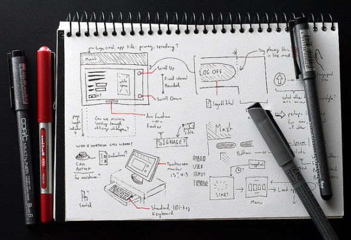

# [As 4 camadas práticas do design de interação](http://arquiteturadeinformacao.com/design-de-interacao/as-4-camadas-praticas-do-designer-de-interacao/)

por Fabricio Teixeira

*Texto escrito por Rogério Pereira.*

As 4 camadas práticas do [Design de Interação](http://arquiteturadeinformacao.com/design-de-interacao/as-4-camadas-praticas-do-designer-de-interacao/arquiteturadeinformacao.com/design-de-interacao-2/ "Posts sobre Design de Interação") que vou falar neste texto vem da forma como aprendi a trabalhar ao longo dos últimos anos e um pouco da visão de como algumas agências digitais estruturam uma das etapas de [User Experience](http://arquiteturadeinformacao.com/user-experience/ "Posts sobre User Experience") Design.

Dividi a parte prática (mão na massa) do designer de interação nas seguintes camadas: framework de navegação, arquitetura de informação detalhada, mapeamento do conteúdo e comportamentos dos elementos de navegação. Abaixo, falo um pouco mais detalhamente de cada momento. Claro que essa lista não é uma regra e pode sofrer adaptações de acordo com o tamanho e características do time.

**Framework de navegação**

Sempre começamos um projeto pensando em como a experiência do usuário vai acontecer. Neste momento definimos como as pessoas vão navegar pelo site ou aplicativo. Essa etapa é um dos momentos mais importantes de um projeto, pois estamos trabalhando em como o produto final vai se comportar de forma geral. É hora de saber qual será a navegação global e secundária. Todos os itens criados devem ser questionados se fazem sentido na primeira camada de navegação. O framework será a base para o desenho de todas as telas restantes.

**Arquitetura de informação detalhada**

Depois do framework finalizado, mapeamos a arquitetura de informação final. É ideal que a estrutura seja a mais plana possível e o usuário tenha acesso as informações através de camadas. Os itens de primeiro nível precisam ser fáceis de entender, de acordo com a linguagem do público que utilizará o produto.

**Mapeamento do conteúdo**

Além de focar na arquitetura global de todo o site, temos que fazer o mapeamento do conteúdo. Não é o momento de definir o layout, mas o conteúdo que vai em cada tela. Com este trabalho feito, conseguimos enxergar as funcionalidades finais que terão no projeto e assim deixamos claro para todos os envolvidos o que precisa ser feito em termos de produção e viabilidade tecnológica.

**Comportamentos dos elementos de navegação**

O site será responsivo? O menu ficará fixo no topo ao rolar a página? Os links abrem no clique ou no mouse over? Essas perguntas vão surgir lá na frente se você não pensar em cada detalhe no momento ideal. E são esses detalhes que vão fazer o seu projeto chamar atenção dos usuários e tornar a experiência marcante. É importante documentar todas as soluções no momento de produção dos wireframes.

Cuidar bem de cada uma das etapas citadas acima é importante para que o seu projeto saia redondo e não gere dúvidas no decorrer do processo. Claro que tudo que for definido precisa ser discutido exaustivamente e alterado no futuro caso os envolvidos no trabalho estejam de acordo. Gosto sempre de lembrar que o que é feito pelo designer não se trata de uma lápide que pode evoluir a cada dia.

*[Por Rogério Pereira](http://br.linkedin.com/pub/rog%C3%A9rio-pereira/10/287/b61). Designer de Interação Sênior na Huge. Começou sua trajetória trabalhando em agências de Brasília e mais recentemente foi morar no Rio de Janeiro junto com sua esposa e seu filho.*

#### [Fabricio Teixeira](http://www.linkedin.com/in/fabricioteixeira)

Curador @ Blog de AI, Diretor de UX @ R/GA NY, Updater @ Update or Die, UX Professor @ Miami Ad School. No meio de tantas siglas, de vez em quando acha tempo para compartilhar palavras inteiras por aqui.

### Gostou?
