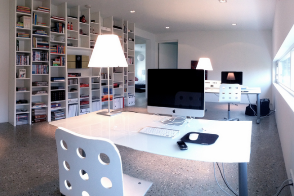

# [O que avaliar em uma entrevista de emprego para UX Design](http://arquiteturadeinformacao.com/mercado-e-carreira/o-que-avaliar-em-uma-entrevista-de-emprego-para-ux-design/)

por Fabricio Teixeira

Já falei por aqui há alguns anos sobre [as 5 coisas que os recrutadores buscam em profissionais de UX](http://arquiteturadeinformacao.com/user-experience/quais-as-5-coisas-que-voce-busca-em-um-profissional-de-ux/). Na ocasião citei alguns pontos mais gerais sobre o que eles buscam na hora de contratar um UX Designer, mas acredito que esses critérios mudam muito dependendo do nível da vaga (Junior, Pleno, Senior), da empresa (agência, portal, cliente), do local (Brasil ou EUA) e até do tipo de especialização para determinada vaga.

Penso que um erro comum dos contratadores/entrevistadores é **pensar que vai encontrar** **um único profissional** para resolver todos os problemas de UX da empresa. [User Experience](http://arquiteturadeinformacao.com/user-experience/ "Posts sobre User Experience") é uma área um tanto ampla, e é importante que a empresa defina qual perfil de profissional está procurando.

- Alguém que faça **arquitetura de informação** com facilidade?
- Alguém que manja muito de **entrevistas e testes com usuários**?
- Alguém que seja criativo na hora de **desenhar interações**?
- Alguém que tenha um bom pensamento sistemático para **desenhar a estratégia digital** da marca junto com um planejador?

Costumo pensar nessas quatro grandes áreas na hora de recrutar, e já direcionar a entrevista tendo em mente qual desses quatro papéis eu espero que a pessoa cumpra. O erro é pasteurizar demais as habilidades de um UX Designer e esperar encontrar quatro profissionais diferentes em uma pessoa só. É claro que isso não se aplica para empresas que possuem apenas um único profissional de UX, mas a partir de 2 ou 3 profissionais, já é possível montar um time que equilibre essas habilidades – e então alocar as pessoas adequadamente dependendo do tipo de projeto que vem pela frente.

Abaixo listei alguns pontos que costumo levar em conta na hora da entrevista:

### Boa apresentação dos entregáveis

Muita gente confunde boa apresentação dos entregáveis com bom design visual dos mesmos – o que a meu ver não é necessariamente verdade. Claro que o visual conta bastante, mas o mais importante é que o entregável cumpra um determinado objetivo e que ela seja digerível por pessoas que não conhecem todos os detalhes do projeto. A simplicidade dos entregáveis é, certamente, um reflexo da simplicidade das interfaces que serão desenhadas – e se o designer se preocupou em deixar o documento fácil de entender para os outros membros do time, provavelmente vai se preocupar em deixar a interface fácil de entender para o usuário final.

*Leia também: [A relação entre os entregáveis de UX e a habilidade de apresentação de trabalhos](http://arquiteturadeinformacao.com/user-experience/apresentacoes/)*

### Conhecimento em tecnologia

Infelizmente, um mal necessário, especialmente em agências digitais onde o trabalho do designer está diretamente relacionado ao trabalho do time de Tecnologia. Dependendo do tipo de projeto, costumo investigar mais a fundo as tecnologias utilizadas, as restrições que existiam, o funcionamento do sistema legado, e até como foi a relação entre o designer e os desenvolvedores que participaram do projeto com ele. Normalmente dá para colher vários insights sobre os conhecimentos técnicos do designer e como ele dribla as limitações na hora de criar soluções de design.

### Tipos de projeto que mais gosta

Dependendo do tipo de projeto, o profissional de UX tem um tipo de envolvimento diferente. Costumo dizer que existe um espectro que varia de **storytelling** até **pensamento sistemático** – e um dos aspectos que tento capturar em entrevistas é justamente em que lado desse espectro aquela pessoa se encaixa. Alguns profissionais têm mais facilidade em contar histórias (seja através de campanhas, ações em redes sociais, hotsites) e conseguem traduzir muito bem as histórias em interfaces simples de usar e narrativas lineares. Outros preferem os sistemas complexos (internet banking, intranet, ecommerce, áreas logadas), e usam sua capacidade de pensamento sistemático para arquitetar a interface. É importante conhecer o interesse do candidato e verificar se ele se encaixa na vaga que está sendo proposta. Esse é o fator que mais pesa na hora de encaixar o profissional em um dos quatro grupos que citei no início do post.

### Capacidade de apresentação e argumentação

Esse é o fator que mais pesa na hora de definir o nível de senioridade da pessoa. Às vezes a solução de design é muito boa e simples, mas o profissional patina um pouco na hora de comunicar a solução para outras pessoas. Ter clareza e organização na hora de contar a ideia, dar motivos sensatos para as decisões feitas no meio do caminho, entender as implicações do projeto para o business do cliente e ter boa capacidade de adaptação a mudanças estão entre os fatores que mais procuro observar durante a conversa.

### Vontade

Esse fator é um pouco subjetivo e difícil de julgar, mas ainda assim um dos mais importantes. É comum em algumas entrevistas o profissional ficar esperando o entrevistador ditar as regras do que falar ou da hora certa de falar cada coisa. Mas **as melhores entrevistas são aquelas que fluem naturalmente**: o designer está tão interessado na vaga que é ele quem dita a entrevista. Penso que ainda existe muita formalidade na hora de entrevistar pessoas e que não precisa ser assim. Uma entrevista é uma conversa entre duas pessoas (que poderia acontecer em qualquer ocasião, inclusive em um bar), e como toda conversa você precisa sentir que a outra pessoa está interessada em conversar com você tanto quanto você está interessado em conversar com ela. Afinal, depois que a pessoa for contratada você vai passar longas horas do dia ao lado dela.

**Aproveitando a ocasião: tem uma [vaga de Junior Experience Designer aberta](https://www.linkedin.com/jobs2/cap/view/13166709?pathWildcard=13166709&trk=job_capjs) para trabalhar na R/GA. Divulgue para quem você acha que possa se interessar :)**

#### [Fabricio Teixeira](http://www.linkedin.com/in/fabricioteixeira)

Curador @ Blog de AI, Diretor de UX @ R/GA NY, Updater @ Update or Die, UX Professor @ Miami Ad School. No meio de tantas siglas, de vez em quando acha tempo para compartilhar palavras inteiras por aqui.

### Gostou?
