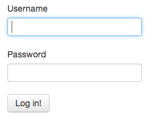

# [How to write a login form that doesn't suck, using Ember.js](http://blog.sensible.io/2013/05/23/how-to-write-a-login-form.html)Published on May 23, 2013

When using frameworks such as Ember.js, we often find ourselves forgetting the main reason why we chose to use the framework. We don't do it because it's cool, or at least we shouldn't. We don't do it because somone told us we have to use Ember (*unless your boss doesn't have much brains*). **We do it because want to make the user experience better.** I won't go into details about server side implementation, this is purely about UX.

Ember allows us to do a lot of things quite easily, which leads to the *turbo mode of development*. This most often happens after watching some cool screencast where they did this cool thing in about 5 minutes, and you start thinking *wow I can write my whole app in one day using this technique/framework/library*. But the cold truth is, you can't.

Here's probably the most common UI element on any website, a login form



How long do you think it would take you to write this from scratch with Ember, 15 minutes? It's just as simple as

```
<form class="form-horizontal" {{action "login" on="submit"}}>
  <div class="control-group">
    <div class="control-label">
      <label>Username</label>
    </div>

    <div class="controls">
      {{input value=username type="text"}}
    </div>
  </div>

  <div class="control-group">
    <div class="control-label">
      <label>Password</label>
    </div>

    <div class="controls">
      {{input value=password type="password"}}
    </div>
  </div>

  <button type="submit" class="btn">Log in!</button>
</form>
```

Now we need a login action handler and we're done. Oh wait a minute, what if the username/password was incorrect? How do we display the error message?

The lazy solution is to just display a flash message:

```
{{#if loginFailed}}
  <div class="alert alert-danger">Invalid username or password.</div>
{{/if}}
```

With a respective action handler:

```
App.LoginController = Ember.Controller.extend({
  login: function() {
    $.post("/login", {
      username: this.get("username"),
      password: this.get("password")
    }).then(function() {
      document.location = "/welcome";
    }, function() {
      this.set("loginFailed", true);
    }.bind(this));
  }
});
```

But this still isn't good enough. What if the login fails and the user tries to log in again? We need to hide the alert first, so that he knows the new request is being processed. We also want to prevent him from clicking the *log in* button while the request is being processed.

```
App.LoginController = Ember.Controller.extend({
  loginFailed: false,
  isProcessing: false,

  login: function() {
    this.setProperties({
      loginFailed: false,
      isProcessing: true
    });

    $.post("/login", {
      username: this.get("username"),
      password: this.get("password")
    }).then(function() {
      this.set("isProcessing", false);
      document.location = "/welcome";
    }.bind(this), function() {
      this.set("isProcessing", false);
      this.set("loginFailed", true);
    }.bind(this));
  }

});
```

and the respective template

```
<form class="form-horizontal" {{action "login" on="submit"}}>
  {{#if loginFailed}}
    <div class="alert">Invalid username or password.</div>
  {{/if}}

  <div class="control-group">
    <div class="control-label">
      <label>Username</label>
    </div>

    <div class="controls">
      {{input value=username type="text"}}
    </div>
  </div>

  <div class="control-group">
    <div class="control-label">
      <label>Password</label>
    </div>

    <div class="controls">
      {{input value=password type="password"}}
    </div>
  </div>

  <button type="submit" class="btn" {{bindAttr disabled="isProcessing"}}>Log in!</button>
</form>
```

Now we're finally getting somewhere, our login form is already better than most sites, just by letting the user know that we're processing the login. But we can take this a step further.

Have you ever used a slow 3G or even a 2G network? It is pain in the ass just because of the fact that most sites don't optimize for this, they don't optimize for latency and expect everyone to have 100Mbit 20ms optic fiber connection, but that just isn't real world. Let's see how we can show our users a message when the request is taking more than 5 seconds. We'll also refactor our code a bit so that it's not all in one function

```
App = Ember.Application.create();

App.IndexController = Ember.Controller.extend({
  loginFailed: false,
  isProcessing: false,
  isSlowConnection: false,
  timeout: null,

  login: function() {
    this.setProperties({
      loginFailed: false,
      isProcessing: true
    });

    this.set("timeout", setTimeout(this.slowConnection.bind(this), 5000));

    var request = $.post("/login", this.getProperties("username", "password"));
    request.then(this.success.bind(this), this.failure.bind(this));
  },

  success: function() {
    this.reset();
    document.location = "/welcome";
  },

  failure: function() {
    this.reset();
    this.set("loginFailed", true);
  },

  slowConnection: function() {
    this.set("isSlowConnection", true);
  },

  reset: function() {
    clearTimeout(this.get("timeout"));
    this.setProperties({
      isProcessing: false,
      isSlowConnection: false
    });
  }

});
```

and the template code

```
<form class="form-horizontal" {{action "login" on="submit"}}>
  {{#if loginFailed}}
    <div class="alert">Invalid username or password.</div>
  {{/if}}

  {{#if isSlowConnection}}
    <div class="alert alert-info">The request seems to be taking more time than usual, please wait.</div>
  {{/if}}

  <div class="control-group">
    <div class="control-label">
      <label>Username</label>
    </div>

    <div class="controls">
      {{input value=username type="text"}}
    </div>
  </div>

  <div class="control-group">
    <div class="control-label">
      <label>Password</label>
    </div>

    <div class="controls">
      {{input value=password type="password"}}
    </div>
  </div>

  <button type="submit" class="btn" {{bindAttr disabled="isProcessing"}}>
    Log in!
  </button>
</form>
```

[Here's a JSBin](http://jsbin.com/izijal/9/edit) of the complete application (note that it has only 1ms timeout to make the `isSlowConnection` flag visible.

Let's stop here and think about why we did what we did. The main reason for the disabled button and slow connection indicator is that there is no other *progress* indicator for the user. If this was a regular Rails app, he could see the page being submitted and wait, but with background AJAX there is nothing.

Some applications chose to display a loading indicator any time there's a request going on, but most of the time that's just too distracting. We want to be writing single page applications to make the site more responsive, not to block the UI with a modal loader on every chance we get. “

*Written by [Jakub Arnold](https://twitter.com/darthdeus) of [sensible.io](http://sensible.io/).*
