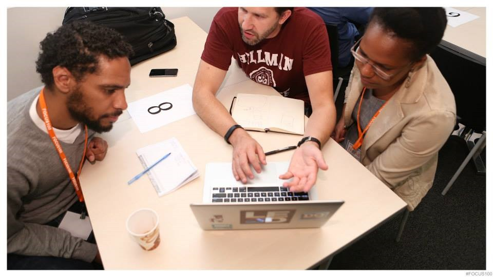

# [Analysis Paralysis: Over-thinking and Knowing Too Much to Just CODE](http://www.hanselman.com/blog/AnalysisParalysisOverthinkingAndKnowingTooMuchToJustCODE.aspx)

Sponsored By

I read a post on ArsTechnica today called "[I know too much to program quickly. What can I do](http://arstechnica.com/information-technology/2014/03/information-overload-i-know-too-much-to-program-quickly-what-can-i-do/)?" that is [summary of a StackOverflow question](http://programmers.stackexchange.com/questions/213708/overcoming-slow-problem-solving-due-to-increased-knowledge-of-what-might-go-wron) by [Zilk](http://programmers.stackexchange.com/users/104238/zilk), who says:

> Lately, I've been noticing that the more experience I gain, the longer it takes me to complete projects, or certain tasks in a project. I'm not going senile yet. It's just that I've seen so many different ways in which things can go wrong. And the potential pitfalls and gotchas that I know about and remember are just getting more and more.
>
> Trivial example: it used to be just "okay, write a file here". Now I'm worrying about permissions, locking, concurrency, atomic operations, indirection/frameworks, different file systems, number of files in a directory, predictable temp file names, the quality of randomness in my PRNG, power shortages in the middle of any operation, an understandable API for what I'm doing, proper documentation, etc etc etc.

This really hit me because **THIS IS ME**. I was wondering recently if it was age-related, but I'm just not that old to be senile. It's too much experience combined with overthinking. I have more experience than many, but clearly not enough to keep me from suffering from **Analysis Paralysis**.

I have two side projects I'm doing on vacations and in the evenings when the house is asleep. One is a port of popular iOS application to Windows Phone, the other is a iOS app with a cloud service startup with my buddy Greg. Both projects have had awesome beginnings and then stalled when things just got overwhelming.

I kept starting features, the stalling. I felt like I was thrashing to disk, spending more time swapping ideas around in my head rather than just doing them. I'm still [getting lots of things done](http://www.hanselman.com/blog/ScottHanselmansCompleteListOfProductivityTips.aspx), in *general*, I'm productive, but when I code I just thrash.

**I'm overthinking stuff.** "Write settings to a file" turns into a mess of paranoia around concurrency situations, upgrading settings from previous versions of the app (that don't exist, mind you), and it just snowballs from there. It's not exactly scope creep, but it's a kind of architectural paranoia. I see so many issues and possible bugs that I've learned over the years that could derail a feature that I end up derailing the feature.

### YAGNI

The answer, they say, is You're Not Gonna Need It. "Perfect is the enemy of the good" reminds user [Telastyn](http://programmers.stackexchange.com/users/51654/telastyn).  These are easy to intellectualize but hard to internalize. User [Mouviciel](http://programmers.stackexchange.com/users/1033/mouviciel) says:

> Looks like you are not experienced enough :). The next lesson is: *stick to requirements, not more*.

I get that, but me, I often need another brain to complement my own.

### How I Solve Overthinking

I learned about [Agile from James Shore](http://www.jamesshore.com/) while I was working at Corillian some years ago, but it's Pairing that resonates with me the most. With a good pair, you'll get 3 times the work, not double.

I worked my way through both these startup issues by *bringing in another brain*. I'm not the best programmer, but I do OK. But somehow we are both better when we pair. I paired with [Greg](http://www.gregshackles.com/) on the iOS and my new friend [Jan Hanneman](http://janhannemann.wordpress.com/) on the other. They are both clearly better coders than I, which is intimidating, but I'm still sure I provide value. What *they* gave me was a fresh perspective and a focus to say "YAGNI" and just get features done. The ironic part is, if I'm brought in on a project to pair, that's what I bring also.

> My wife thinks this is hilarious. It's the old relationship joke where your partner says something for years and years, then one day you rush home from work to share this amazing new "insight" from a stranger...the same insight your partner has been sharing all this time.

Since I work remotely, all my Pair Programming has to happen over video chat and screen sharing. I use Skype, Lync, Join.me, and whatever else works. We take turns working through features in [Trello boards](https://trello.com/shanselman/recommend), sharing one person's screen, talking and coding, designing and brainstorming, then commiting to Git, syncing, and switching the share.

This seems to work well for sessions as long as 3 hours, but after that, we get pretty wasted. However the feeling of accomplishment when you work through a problem with a partner is also magnified.

Does your coding life get paralyzed? How do YOU work through it?

*\** [*Photo courtesy of FOCUS100*](http://www.digitalundivided.com/events/focus100/)

#### About Scott

Scott Hanselman is a former professor, former Chief Architect in finance, now speaker, consultant, father, diabetic, and Microsoft employee. I am a failed stand-up comic, a cornrower, and a book author.

[About](http://hanselman.com/about)   [Newsletter](http://www.hanselman.com/newsletter)

Sunday, March 30, 2014 1:49:19 AM UTC

Yeah man, this is a massive problem for me. There are so many projects I just don't get started because I completely over analyse the most basic things such a whether I should implement a repository pattern or just work directly with the DbContext. I really need to learn to just go with whatever works and maybe one day if the project is successful and these early mistakes come back to bite you you can go back and fix them.   
  
On a previous project I switched MVVM libraries 3 times because ultimately I wanted something which allowed me to get the app eventually working on iOS and Android using Xamarin. In the end the app was only launched on Windows 8 and Windows Phone 8 and all that time spent on porting to a new MVVM framework was wasted.

[Jerrie Pelser](http://blog.beabigrockstar.com)

Sunday, March 30, 2014 1:50:26 AM UTC

YAGNI and code reviews (from others) works for me.   
  
Also, as a single developer it's just minimum viable feature for me, improving as necessary, and writing tests for the requirements. With tools like resharper if you make a big architectural mistake, it's almost not a problem.

Dan Waters

Sunday, March 30, 2014 1:55:40 AM UTC

Pairing is so damn productive! I still feel like we need some metrics to sell it to management (and even other developers) though. I've known in my gut for years that the boost is over 2x, but it's so hard to quantify. I, too, am not senile :), but whenever I feel like I'm bogging down, I never hesitate to reach out to another brain.

[Bob Baker](http://www.agilethought.com)

Sunday, March 30, 2014 2:24:10 AM UTC

I'm a relatively young programmer at ~5 years and I already seem to struggle with this issue. Particularly these days w/ JavaScript. I worked at appendTo doing nothing but JavaScript for about 2 years, and I learned MANY ways to accomplish the same outcome with JavaScript. You can read something like Addy Osmani's guide of JavaScript patterns, or what not and wind up getting overwhelmed deciding on how to implement something. Great idea to pair up! It's definitely something that can help you focus and make sure you're not going completely crazy. It's something I need to do more of.

[Jonathan Creamer](http://tech.pro/jonathancreamer)

Sunday, March 30, 2014 3:11:27 AM UTC

Having help to get things done quicker gives you more energy to face the next task. A mountain of work suddenly feels smaller with just a little bit of help, and you can maintain your productivity longer.  
  
I just saw this by helping the Wife with some chores: what sounded like half an afternoon of work for her alone was suddenly done in half an hour. It may have seemed less efficient - stepping around each other in the kitchen - but the rapid completion of jobs, the extra help with distractions (ie. the Kids), and a dialogue that focused on goals, all helped achieve a better overall result.  
  
It didn't just seem quicker. It WAS quicker. And now we're both free to do other things.  
  
As to the analysis paralysis, I just decided there were more things in the world that I don't know than I do know. No matter what you do you're not going to please everyone, but doing nothing will definitely please no one. Organise, prioritise, execute. Do the best you can, and keep learning so your results keep improving.

David Russell

Sunday, March 30, 2014 3:16:33 AM UTC

Scott..this article sums up my life! It reminds of the old NBC public service/educ announcements on TV, you know the one, where it says at the end "The more you know." It should then say, "The more you wish you didn't".   
  
It really does seem that experience and the knowledge gained from it, can sometimes come with a negative side-effect...ANALYSIS PARALYSIS.   
  
Thanks again for the very close-to-home post.  
  
-b

[Bob Lautenbach](http://braneworks.com)

Sunday, March 30, 2014 3:33:30 AM UTC

This is a clutch a-ha! moment, is it not? I know it was a distinct growth point for me, the time when I grappled with the realization that there were too many elements that were "ESSENTIAL!" in the perfect code; after all isn't that what we all dream of writing? I realized my knowledge of any particular language simply was never going to be adequate; I also needed to understand the external business variables as well...to stay sane. Now, I start with identifying what I have been asked to deliver, and focus on those as the essential wireframe. Then I add in the parts that are my responsibility as a SME to include (known high-risk variables, essential performance); finally there is the icing on the cake, the additional elements that make me want to sing when I look at the code. Perfection, however, cannot be the focus! The deliverable, measurable targets have to be. What finally gave my OCD-tendencies peace? Realizing that once I got good enough, I could include all three parts because I was able to prioritize the essential.

Melanie Sumner

Sunday, March 30, 2014 3:34:39 AM UTC

Does my coding life get paralyzed? Are you kidding? I just chocked it up to being highly neurotic. I freak if I produce anything that smells like code smell. I analyze, reanalyze then analyze again. I believe it makes me a great technical programmer because I am always looking at the best pattern possible but it has always hurt my productivity. For instance, I once wrote a program that took 2 weeks where it should have taken one. But the benefit was that it never once had a bug. No one had to come in and rewrite it or modify it. That to me speaks volumes.

[David Gonzales](http://cuneisoft.com)

Sunday, March 30, 2014 3:45:57 AM UTC

Hmm. Wife and I are half as productive when we're together. Add in five kids and the geometric progression becomes paralysis.  
  
I don't have a team. I work alone. This whole article is so \*me\* it's spooky.  
  
at least now I feel better about it. Thanks, Scott.

bill

Sunday, March 30, 2014 4:01:28 AM UTC

programmers ar3 born perfectionist. One of the reasons why we don't get to those high positions is our fear to make decisions... we ar3 trapped by our psychology and the more we know, the bigger the mouse running wheel...  
  
Even if we know nothing we are trapped and I think it applies to everything we do and not just coding....

Haadka

Sunday, March 30, 2014 4:32:55 AM UTC

Ok, its not just me :-) Thank you .

PG

Sunday, March 30, 2014 4:52:29 AM UTC

This seems pretty common, turning a molehill into a mountain. Been coding for 35 years. Sometimes feel that I can outcode a team because the teams are populated with young ego's anxious to prove themselves by including every populare technology. Have no idea what extensible means.

mike rains

Sunday, March 30, 2014 4:54:42 AM UTC

In the last 4 years I have joined 3 different projects that turned out to be 2-3 years in with no demonstrable results after having burned through $20 million. They'll have a million lines of overcomplicated architecture/framework but not one working service.

mike rains

Sunday, March 30, 2014 6:04:02 AM UTC

No one has a crystal ball. You can't predict what will happen only make reasonable decisions based on what is known and then be responsive to change.

Paul

Sunday, March 30, 2014 6:07:25 AM UTC

YAGNI is the most helpful in this case - but also programming to an interface. If I'm ever not sure about a feature or architecture, I wrap it up in an abstract class holding the few connections to the main project I'm sure about. So I don't know if my data will be stored in an EF accessible DB or a distributed web service with a JSON encoded async response . . . but I DO know that I need to call something and get entities. So write an abstract repository and let future me worry about that, so I can get busy on the other stuff that I know I need.  
  
Or maybe you need to write cross platform accessible GUI code that's going to work for both WPF and iOS via Xamarin - but for whatever reason nobodies sure if iOS is mission critical or a nice dream. Start with the one you want, but keep your standards up and abstract. You'll wind up with lots of little methods, and can split the non-OS dependent ones into a nice view model that will work for both with little effort.

[Mathieson](http://misepos.com)

Sunday, March 30, 2014 7:18:38 AM UTC

https://vsanywhere.com/web/product/ is ideal for remote pair programming

adriaan mutter

Sunday, March 30, 2014 7:33:35 AM UTC

I think Analysis Paralysis often hits people new to programming, when too many problems are too difficult and when there is too little of previous experience. When finally asking someone experienced, the answer is: "- Why didn't you use the built in feature?".  
  
For each new row of code I write I find it easier and easier to find a good and (hopefully) readable solution - "good enough, not perfect, but mainainable. People will understand.".  
  
Pair programming is awesome! Awesome if the pairs have about the same level of understanding of programming in general. If too unequal, it is probably a great learning experience for the not-so-experienced, and fun (but very stressful) experience for the more experienced person (that would have solved the problem much faster if not pair programming with the newbie).  
  
Then again, pair programming is probably a really good tool for exposing problems: unbalanced teams, unrealistic timebox (estimates).

[David](http://davidvujic.blogspot.se)

Sunday, March 30, 2014 7:36:46 AM UTC

Just a few words about your write-a-file Example. When i find those Problems i face over and over again, its a good hint to put this code somewhere else, so i dont have to think about that stuff again. Just use it. I have my own library for a couple of years now, and it saves me a lot of work.  
You also learn how to actually make things reusable which is, in my eyes, one of the mayor steps towards becoming a great Engineer.

Chris

Sunday, March 30, 2014 7:57:12 AM UTC

Agreed. 2 get 3times more done. Communication graph. Anything beyond is not effective.

Michael (Another)

Sunday, March 30, 2014 8:38:28 AM UTC

Taking an attitude of doing the simplest thing that could possibly work, then refining later is how I solve this problem. Interleaving doing and thinking about it avoids the "big design up front" approach that underlies the analysis paralysis problem.  
  
To do the interleaving, I take advantage of the fact that I commute to work by bicycle on quiet country roads, and the 50-odd minutes each way gives me the time AFK that I need to work through the analysis issues enough that when I'm actually back in the office, I already know what I'm going to do for the next stage.

Steve

Sunday, March 30, 2014 9:27:22 AM UTC

(That moment when you hit Backspace outside the text field where you've just typed a long reply.)  
  
For me, projects move at a slow pace or do not get completed when there is no clear deadline, which is the case with most personal projects. This is a side-effect of optimising productivity and relegating less urgent tasks to the bottom of the to-do list.  
  
At work, I design and move to File.New in a very short time. Then, experience takes over as the project gathers pace. The same experience that seems to be the cause of analysis-paralysis becomes invaluable in keeping the project moving, especially in situations where junior developers get stuck from uncertainty or their own analysis-paralysis.  
  
What has worked for me to lessen analysis-paralysis in the absence of a hard deadline (as in most moonlighting projects) is to have milestones with simple goals; the milestones become deadlines and keep me focused.

[Eddy Young](http://priscimon.com)

Sunday, March 30, 2014 9:31:38 AM UTC

I'm with Steve on this one, quite often I find that I am doing what should be a simple feature and then my brain kicks in and starts to abstract in all sorts of directions. I find I cope with this now by doing the simplest thing for the first iteration and keeping an eye on the abstraction. As soon as I need to extend that feature I refactor it to the next simplest level of abstraction and then make the extension.  
  
Some features may never get revisited and as such will always stay in their simplest form. Others may become core parts of the system, but then if I am doing it correctly, after about three iterations I should have a good abstraction that is easily extensible.  
  
In addition to this, I find regularly discussing the underlying architectural goals of the system with the other engineers on the team means that we all have a basic understanding of when to innovate something new and when to refactor something that already exists so that it can be extended to support new requirements

Rob Stothard

Sunday, March 30, 2014 11:51:18 AM UTC

Both extremes (being overly cautious vs. being mindlessly reckless) are bad, obviously. The truth lies somewhere in the middle and, as always, strongly depends on the use case.  
  
**Knowing what can co wrong is not a bad thing — fear-driven development is.**  
  
Your example of writing a file is a very good one. While one shouldn't build an entirely new file system access layer, one should definitely be prepared to handle the case that a file couldn't be written for various reasons. Likely errors should be caught and handled (if possible) to increase robustness, as long as that doesn't get mixed up with crazily defensive programming.

[Marius Schulz](http://blog.mariusschulz.com)

Sunday, March 30, 2014 2:24:27 PM UTC

Thank you, Scott. This came at exactly the right time for me. So good to know I'm not inflicted with some rare condition with no hope for a cure. Now to find a way to implement changes.

Bruce Wilson

Sunday, March 30, 2014 3:38:19 PM UTC

YAGNI == "You're Not Gonna Need It"? ;^)

[Dave Shapiro](http://ohdave.com)

Sunday, March 30, 2014 3:53:23 PM UTC

Oh Hell Yes!   
  
I find myself taking forever to get started in the initial phase of a project. Too much thinking-ahead, remembering best practices (both institutional & learned), architecting for longevity etc.. I think back jealously of my ignorant days when I could just dive in and code from the first minute of a new project.   
  
The sad thing is, common sense says here that the better architected & planned solution will produce a higher quality product. But in reality that polished solution may not get delivered quick enough, or the client isn't so fussed about having all the things we think are important.  
  
Perhaps the answer is to create a solution with just enough seperation of concern that it can be iterated for future mods & scalability, but no more.

[Joel](http://joelgallagher.com)

Sunday, March 30, 2014 5:09:11 PM UTC

My tactic for preventing this when I'm not pairing.  
1. Set a time limit to completing the next logical piece of work. Never more than 2 hours. Usually 1.5hrs.  
2. Write the commit message for the work first. This draws a rock solid finish line. A bit extreme but I find it helps stay focused.  
3. Start. Design, write tests, code. Whatever is needed to get to that finish line in time.   
  
I find I veer from the plan a lot, but never too much. I leave technical debt, but never crappy code each time through this exercise.  
Most importantly, the given problem is solved.  
Then I can decide if the next move is to settle debt or move forward.

[Kareem Sultan](http://www.maybe5.com)

Sunday, March 30, 2014 5:32:17 PM UTC

Yeah!! Many thanks scott   
  
This is really true. I started a personal project 6 months ago. I was losing control in that project because of over doing, organizing, what patterns to use? which installer I am going to use? What are the portability options? etc. Then my deadlines got closer and I lost interest. I started thinking to drop the project and run away.  
  
Few weeks back I got the control back by saying this to myself. Don't follow any rules (but basics), patterns, architectures. "Get the feature done, test and ship". I plan to refactor the code that I wrote once after every 2 weeks ( next iteration ). So, that I have a broader perspective of how the code can be re-used or re-factored.  
  
Thanks again for the great article, it motivates me !

balaji

Sunday, March 30, 2014 5:35:07 PM UTC

Glad I'm not alone here.  
  
With so many languages, frameworks, architectures, design patterns, IDEs, source control repositories etc. it can really drive you batty.  
  
Do I use code first? Entity framework? Test driven development? NodejS? MVC? Scaffolding? Razor? C#? Java? Ruby? Azure? AWS?  
  
And don't even get me started on design patterns (Gang of Four).  
  
+1 for @Steve and @Marius Sometimes you just need to ignore the fear and just code. Get the idea out of your head and then refine it. Iterative development. Short release cycles.   
  
If you over analyze everything you'll never write a line of code.  
  
Same rule applies to Legos. Don't spend all of your time sorting out the pieces by shapes and colors. Just build it!

Ami Schreiber

Sunday, March 30, 2014 6:32:51 PM UTC

This is true. Also happens with me many times.

Atul

Sunday, March 30, 2014 6:34:57 PM UTC

> I experience a sort of terror when, at the moment of setting to work and finding myself before the infinitude of possibilities that present themselves, I have the feeling that everything is permissible to me… Will I then have to lose myself in this abyss of freedom?

Daniel

Sunday, March 30, 2014 6:41:32 PM UTC

> I’m for maximum freedom and minimal pain.

Daniel

Sunday, March 30, 2014 6:57:10 PM UTC

I usually have these 2 xkcd comics close at hand to help remind me to Just Do It / YAGNI:  
  
https://xkcd.com/974/  
  
http://xkcd.com/1205/

[Christopher Svec](http://saidsvec.com)

Sunday, March 30, 2014 7:12:28 PM UTC

> I experience a sort of terror when, at the moment of setting to work and finding myself before the infinitude of possibilities that present themselves, I have the feeling that everything is permissible to me… Will I then have to lose myself in this abyss of freedom?

[Igor Stravinsk](http://en.wikipedia.org/wiki/Igor_Stravinsky)

Daniel

Sunday, March 30, 2014 7:14:18 PM UTC

> I’m for maximum freedom and minimal pain.

[Cary Tennis](http://en.wikipedia.org/wiki/Cary_Tennis)

Daniel

Sunday, March 30, 2014 8:07:14 PM UTC

Couple days before I blogged some similar thoughts about coding styles :)   
  
http://www.yzuzun.com/2014/03/some-jargons-that-i-face-off-in-software-development-world.html  
  
Sometimes you just have to write it. That's it. We are not living in perfect world(maybe it is but we can't understand), and our lives not so complete. So same idea for our codes. It hasn't have to be coded complete too. The Unfortunate Reality. I believe open source is the saver of our imagines/visions. Do not expect well structured companies to create well written softwares.

[Yusuf Uzun](http://www.yzuzun.com/)

Sunday, March 30, 2014 10:29:14 PM UTC

YAGNI can be a very bad Ideology too.   
  
Before I can know what I don't need, I need to know what's \*really\* needed! And that's a much bigger problem nowadays. Clients always want something totally simple. Until it turns out, that they want a complete CRM for a few thousand euros.  
  
The other question: Do I need a technical abstraction (ORM, Interfaces, MVVC) or a logical abstraction like: Do I have customers with Address-lines or Organizations that relate to multiple Locations, (shipping- and billing addresses). But if you implement a "Client"- vs. a "Natural Model" then it's like feeding your kids with Chocolate, just because they want it. We all know, there is no such thing like a single Address per Customer. YAGNI or not.  
  
However the other extreme happens with enterprise-clients. The more money they burn the happier they seem to be. If you want them to get their software done, never do what they say, do what you know they want. However, if you want to keep your (well payed) contract as long as possible just follow every brainless guideline you can find. Even accept to design object models collaboratively using Excel!  
  
So funny: A big company I worked for years ago said, they will definitely have only ONE client, everything else was YAGNI. 6 months later they had three. And at the end of the year they had 431 clients! With minimal differences but drastic consequences for the code! Thankfully we did not do what they said. Because using T4 we could generate the Code for as many clients they wanted for all the "silos" at once. SQL, Biztalk, Exchange, Active Directory and Web. Copy, and edit XML, build and done (almost). And even today they wonder who saved their asses. Needless to say that I got fired, so they will never know. ;-) Oh yes: sometimes "you will gonna need it".

I really can't say

Sunday, March 30, 2014 10:32:43 PM UTC

This me, too. But while reading this article I started pondering, what if there was a pattern of just putting at the top of any class where paranoia might kick in, "YMNI" (You Might Need It), followed by the list of concerns, i.e. "YMNI: file locking, multithreaded access, corruption recovery .." and so on, and it is recognized as a todo or as an "at least I acknowledged the potential issues" if you run into problems down the road and worry about feeling bad about looking bad. But just leave it at that, write the basic code, push it out, copy the "YMNI" notes out for whoever ends up inheriting the codebase, and walk away.

[Jon Davis](http://www.jondavis.net/)

Sunday, March 30, 2014 10:36:12 PM UTC

Well. It is a very common problem for so many. But we can overcome it by breaking the task into small segments. And I believe pair programming is just another excellent way to address this issue as long as the pair doesn't dominate.

Ganesh

Sunday, March 30, 2014 10:52:19 PM UTC

Kudos, Ample facts.

[Descoteaux](http://www.thebusinessofstrangers.com/essential-things-to-know-about-bathroom-renovation/)

Monday, March 31, 2014 12:23:52 AM UTC

I always try to follow the 3-steps flow:  
1. Make it work  
2. Improve it  
3. Apply best practices  
  
This is one of the development approach I try to push as much as possible to my students too. Using the KISS (Keep It Simple Stupid) principle as much as possible in the step 1 is crucial. In step 2 you think about improvements, which usually comes with experience or by reading what others do in similar cases/scenarios (if you have no experience). In step 3, if you have time and resources on disposal, you apply best practices by following standards, patterns or some other advanced ways of how to handle many possible scenarios, potential side-effects that may occur, optimizations, etc. etc., but still stuff which are inside the scope of the problem requirements you're trying to find solution for.

Hajan Selmani

Monday, March 31, 2014 12:36:40 AM UTC

Great article Scott. Just a gentle heads up that it's a programmers.stackexchange question you linked to, not a stackoverflow question. Some of the more, uh, pedantic users on there are likely to get their knickers in a knot over that kind of slip of the tongue/keyboard.

David

Monday, March 31, 2014 12:39:20 AM UTC

Over-thinking could be reduced by setting context and boundaries for the tasks being done. I think the reason pairing works well there is that the pair helps set you right by providing you a reasoning platform (framework?) through which you filter your thoughts.  
  
A similar outcome can be achieved by setting context and boundaries for the task when working alone. When this is done and one gets stuck in analysis paralysis, one can re-align everything again through the set context/boundaries. For me, I like to do this by walking away from the desk and talking to myself while having a walk, basically stopping and restarting what I'm doing and validating against the context/boundaries set - Pairing with myself?

[Daniel Wissa](http://www.wissa.net)

Monday, March 31, 2014 1:07:01 AM UTC

Pair programming is amazing. It breaks the echo chamber in your head. When working on a problem, I've gotten more done in half an hour than I would've in a day.

Mike Jeffers

Monday, March 31, 2014 2:14:40 AM UTC

I've often wished for an online tool that pairs programmers based on what they can help with and what they want help with, all in real-time. That way I wouldn't feel bad about taking someone's time because I could instantly repay the favour. I'd write it myself, but I'd need to pair with a web developer...

Kent Boogaart

Monday, March 31, 2014 2:29:52 AM UTC

Yeah, analysis paralysis happens to me too. What's worked for me in the past is to "code stupid". I say, "to hell with best practices" and do whatever it takes to get the feature implemented -- the hackier the better. In my experience, once the feature is at least somewhat working it becomes obvious what needs to be cleaned up or refactored.

[Xavi](http://xavi.co)

Monday, March 31, 2014 4:12:10 AM UTC

I'm just going to add a 'me too' so you can keep score.

Craig

Monday, March 31, 2014 6:05:22 AM UTC

Me too... thats time only paired person can pull me out.

Abu Ali Muhammad Sharjeel

Monday, March 31, 2014 6:55:27 AM UTC

I find it helpful to just throw everything out from time to time. Start a new project and actually actively write sloppy code. Don't worry about code quality just write. Once you get something up and running and have sort of prototyped your idea, then start over again with an actual plan.

[Zachary Snow](http://zacharysnow.net/)

Monday, March 31, 2014 7:38:58 AM UTC

Thank's Scott,  
  
I feel happy now, because i am not the only programmer feel like paralyze

Sinan

Monday, March 31, 2014 8:40:42 AM UTC

If only we could automate/virtualise the other half of the pair!

Adrian

Monday, March 31, 2014 9:47:09 AM UTC

Sure I've been there. Really trying to make the simple path but it sure is a struggle. New technology or too much new technology in the same project can be a killer to this too. The topic could be know as "Highway to hell" :)

[Rasmus Christensen](http://bypassion.dk)

Monday, March 31, 2014 11:30:24 AM UTC

So much yes.  
  
Although I feel your post title is highlighting the wrong part of the post.  
The post is about the value of pair programming. Analysis Paralysis is one of the things that is solved by it.  
  
At my new job there is no peer programming and now I realize how much I took it for granted. Lacking the figures to back it up, but I'm pretty sure I'm not even half as productive as I used to be.

boriscallens

Monday, March 31, 2014 11:51:20 AM UTC

I don't know if anyone else gets this but sometimes the indecision comes from you thinking about what \*others\* might think of your solution.  
  
I often know all the pro's and con's of a given approach, probably better than many other people who might come along after - but I worry that they will get hung up on the "cons" aspect of what I've done and not realise there were many other factors at play that they will be unaware of a couple of years down the line.  
  
Then I shake myself down and realise that the quality of what I've done is probably better commented and better reasoned than the majority of code I see written and I try not to fret about it so much!  
  
The curse of being your own worst critic!

[Simon](http://rule30.wordpress.com)

Monday, March 31, 2014 12:10:53 PM UTC

I had this problem a lot, but one thing that helped me a lot was the concept of release early, release often.  
This way I can focus on the objective of release as with minimal necessity and over the time all the possibilities.

Luiz Adilson

Monday, March 31, 2014 1:17:58 PM UTC

Hi Scott!   
  
Aweseome blog post. I am glad that you are talking about such things. Sometimes they help much more than some extremely nifty grifty tech-talk.   
  
Especially since moving towards Javascript/jQuery/knockout/angular/.... I find myself thinking about a feature 10 times as much as it would take to implement. Would it be more elegant using this new technique? Does this implicate changing other things as well?   
If the different tools have their own requirements, it even gets more complicated. If you choose this, you also have to work with that and so on.   
  
What happened since the good old days when you had "a", or at least only a few standard templates and you'd use the time on the real problem, instead of thinking more about HOW you implement a feature?  
  
Thanks for your insights, Scott.   
  
Btw: I had to lough hard when you talked about your wife having told you the solution for some time. This is soooo true and soooo spot on.   
  
Best regards  
 Andreas

Andreas Kroll

Monday, March 31, 2014 1:35:12 PM UTC

Wow! Glad it's not only me.

Amrish Tandon

Monday, March 31, 2014 1:58:54 PM UTC

Great post Scott... I love the part about your wife telling you for years... and then you suddenly "discover" it :), I can totally relate. Knowing too much sometimes clouds your judgement on what is simple. My approach to projects and problems often times is to first take the path of least resistance, that works (this too is not always a proper solution, but a general rule of thumb)... then gradually build and embellish the quality of the solution.

DocNet

Monday, March 31, 2014 3:43:58 PM UTC

A thousand times yes. I don't have much experience with a second brain in pair programming. What's worked for me over the years is having a second brain in project management. Anybody can schedule meetings, produce a gantt or burndown chart, etc. But having a smart project manager or scrum master who's mentally in the trenches with you goes a long way towards addressing this issue. They don't code, but as we know, the code is frequently *not* the problem.

[John DeHope](http://johndehope.weebly.com)

Monday, March 31, 2014 5:33:40 PM UTC

What ended up working best for me is to treat writing code the same way I treat writing the freelance essays I do for the Buffalo News. I get a shitty first draft out of the way as fast as I possibly can, dumping ideas into the editor willy-nilly. Then I go back and make things neat, refactor, etc.  
  
I was paralyzed by the idea of being a craftsman, that everything I did needed to be immaculate. What needs to be great is the finished product, not the process.

Kevin Stevens

Monday, March 31, 2014 5:52:00 PM UTC

I've found analysis paralysis comes from fear of being criticized for not anticipating every kind of failure mode or potential feature. Of appearing human in the presence of our Vulcan coworkers.   
  
It's all too easy for me to forget that perfect is the enemy of good, even in this age of agile techniques and rapid deployment.

Ed Power

Monday, March 31, 2014 5:54:05 PM UTC

Libraries. If you have already solved the problem of writing settings to a file, and created a class/library of that functionality - then you can just reuse that - with all the safety nets already built in (and new ones you add in later are pleasantly shared). If you have the experience to have encountered those issues already, then hopefully you've solved them - and in a reusable manner. (Or even better someone else has solved it and shared).

Jason

Monday, March 31, 2014 6:06:10 PM UTC

Another awesome post. I have found myself in the "analysis paralysis" position a few times when there was no driving context for what I was doing. But when leading a team and pairing and working within strict Scrum guidelines\*, that AP goes away. Timeboxes work wonders - when sitting at a shared IDE with n self-imposed hours to get the work done, the focus really comes out. Especially when a business-side person is expecting to have it at the end of the week.  
  
I know what you mean by potentially overthinking issues when it comes to file access, for example. One of my favorite quotes is "making good decisions come from experience, and experience comes from making bad decisions" so you don't want to purposefully use built-in fuctions/patterns for temp files because you know they will throw when you hit asynchronous ops or heavy load. But having another person with you (in person or virtually) can get you somewhere between your "gold plated" idea and their "minimally viable doneness". 20 minutes of talk (or reading Stack Overflow opinions) can save an hour a lot of times.  
  
  
Thanks Scott!  
  
\* Our team had an awesome Scrum Master and all dev teams had certification-level training in the process. Not a typical set of ingredients for most shops, I know.

SteveC

Monday, March 31, 2014 6:09:45 PM UTC

@Jason, the only caveat to your post on using home built libraries is they are almost never as flexible as they need to be for the project-of-the-moment. Or they "need tweaking". Or something. And then that leads to more coding on them and associated integration testing. I'm not saying they are a bad idea, just that using them might not help AP if you are already predisposed to the condition. :)

SteveC

Monday, March 31, 2014 6:14:07 PM UTC

As a new programmer - ignorance is bliss. When I started out programming I would jump to the IDE and code, code and then code some more. I was unaware of many pitfalls, and just checked my code against requirements and went on my way.  
  
My days of starting a new project by setting out coding are done. Now I have to write out what I want my program to do. I follow the old seven habits mantra - begin with the end in mind. Otherwise I would over produce my project and have it end up like Kevin Costner's Water World. A movie that is full of promise yet over produced, over budget and often delayed for a finished product that was underwhelming with reviews and revenue.  
  
During planning a product focus only on quadrant 1 tasks. Implement and release. If demand is meet, update focusing on quadrant 1 and pick one item off of your quadrant 2 list. Implement and release. The goal is to release often and build on the important features.  
  
Sorry if I went a bit off topic.

[Paul Grimes](http://www.paul-grimes.com)

Monday, March 31, 2014 6:29:37 PM UTC

It is worth to mention than different activities require different mindsets, for example "measuring twice before cutting", applies very well to a carpenter, a chess player, a software architect, but not a developer (you don't know if the saw is going to be compatible with the wood, will require a service pak, throw a non implemented exception, will have a performance toll, complain of an expired certificate, etc.).  
  
In software, many things that sound theoretically possible struggle in practice (or are just plain impractical). On the other hand software is very malleable, so it's easy to customize the cut later (making it shorter, larger, etc).  
  
So in software is more of make a rough measure and cut.  
  
(Incidentally there's a good one from Dilbert: http://dilbert.com/strips/comic/2008-03-16/).

Fernando Gonzalez

Monday, March 31, 2014 6:48:48 PM UTC

Absolutely! This has been an issue particularly when there is no deadline, like with open-source initiatives. Once I open up the decision of "what language(s) will I use?", "what platforms will I support?", etc. I quickly get lost in analysis paralysis. This is exhibited best by my **disappointing [CodePlex](https://www.codeplex.com/site/users/view/iseric) and [GitHub](http://www.hanselman.com/blog/github.com/ericis/) profiles**. For example, [ESWAT](http://eswat.codeplex.com/) for authoring tests ballooned into the <a href=http://atha.codeplex.com/">ATHA: Acceptenace Testing Heuristics Automation</a> project, shows a typical "boil the ocean" idea that failed from an exponentially growing feature set where I was everything from the user story author to the architect to the developer to the tester to the deployment and operations. That project in particular highlights the language problem. What language? Why not support all of them that .NET does! Razor, PowerShell, IronPython, IronRuby, with proof-of-concept implementations of IronJS and IronScheme. *If only my open-source work actually reflected the quality of my daily work at companies...*
> Personal software ideas for me always turn into a "Requirements Big Bang" from both the User and Technical perspectives; the pattern of requirements exploding from a simple concept into an entire universe of options.

I look back fondly at my earliest days in college, developing an entire web portal of features in PHP and MySQL extremely quickly. *What happened? **I learned more about all the perspectives in software development...*** I no longer had a #2 pencil and eraser to draw with. I have oil-based paints, watercolors, selections of pencils and pens with varying widths, and more with various means of display and an array of lighting techniques with considerations for the art buyer, the photographer, the gallery guest, caretakers, art historians, and on and on.  
  
How do I solve it? Usually I need to physically split my responsibility for either the requirements or development. Either I write the user stories and someone else does development or vice versa. For personal projects, I've begun to write my feature requirements very explicitly using BDD technologies like [SpecFlow](http://www.specflow.org/) for C# and either [TickSpec](http://tickspec.codeplex.com/) or SpecFlow for F#. This has certainly helped, but **without a deadline and clear requirements, I still get lost in the "How" behind the code and unit tests**.  
  
I can only hope that one day... one day... I will have an open-source project that reflects the experience of my LinkedIn profile. :) Until then, open-source for me is simply about an attempt to share some ideas, some technical approaches, and some code and nothing more.

[Eric Swanson](http://www.iseric.com)

Monday, March 31, 2014 7:06:07 PM UTC

@Scott - plz add an edit button on comments (GitHub link and ATHA link above). Yes, I know you have a "Live Comment Preview" and yes, I know it's my own fault. But, I'm a 'user' in this case, so you should assume I'm going to make stupid mistakes like the above :)

[Eric Swanson](http://www.iseric.com)

Monday, March 31, 2014 7:46:47 PM UTC

I'm intimidated that you're intimidated. I run into this problem a lot. The normal people that I'd collaborate on projects with aren't coders, don't have experience, or just don't have the same interests as I do.

lordcheeto

Monday, March 31, 2014 8:12:07 PM UTC

Great aricle, thanks for sharing.  
  
Seth Godin, author of Linchpin and [The Icarus Deception: How High Will You Fly?](http://www.amazon.com/gp/product/B0090UOLEW/ref=as_li_ss_tl?ie=UTF8&camp=1789&creative=390957&creativeASIN=B0090UOLEW&linkCode=as2&tag=radink-20) talks about analysis paralysis throughout those books as he talks about how your life is art, but when the art overhwhelms then you don't move.   
The way to solve it is: Ship It! Get 'er done and ship!  
You can fix things in iterations.  
  
Also, great quote: "No one (or any software) ever became perfect through inaction."  
  
In other words, failure isn't making a product with bugs. Failure is not making.

[Newton Saber](http://newtonsaber.com)

Monday, March 31, 2014 8:36:33 PM UTC

Neurotic, A.D.D., seeing everything at once (or damn near).   
  
I think one needs to write down the issues burning in your brain as you design and code your modules.   
  
Write it all down.  
  
Come back to it and ask those ol' questions: Do I need this? Do I really have control over it? What is the probability of "that thing" actually affecting my code?

SpaceDog

Tuesday, April 01, 2014 12:48:49 AM UTC

While I'm still a young developer, and maybe I'm a horrible programmer, but I've found that I can eliminate over-analysis by short and simplistic iteration. Most of the code I write at first is horrible, and I should probably be shot for writing it that way, but it gets done. Then, after that, I can start adding fixes for specific issues and specific use cases.  
  
For example, with regards to writing a file to disk, my first iteration would be the quickest possible code I could write to get the job done. Then, after that, and all considerations had been taken into account regarding the simplest of requirements, I start adding more, such as concurrency, file-systems, and other support. Write for the common case first, and then address other issues with your remaining time.

Robert

Tuesday, April 01, 2014 4:10:23 AM UTC

This is also totally me on personal projects. What if after what if after what if.  
  
My latest epiphany was while watching Iron Man. I was thinking, I really need that Javis to keep me focused on the current problem/feature and stop tangenting off, but how did people do this ages ago? Versioning through Marks. So, as this is my project; what if I create it 2, 3 or 5 times? Other than my OCD fighting to say "can't waste a second of my time", it really doesn't as I've wasted more so far. So the plan of attack...?

1. Mark 1: One project app, basic interface of main screen and 10 minutes of hand created data.
2. Mark 2: Start again with data in another project. Second time should be quicker to code and fix minor changes.
3. Mark 3: Either start again on separating a part into 2 or add a feature if you are happy with the parts.
4. Mark 4: Repeat prior Mark.

Cheval

Tuesday, April 01, 2014 5:37:10 AM UTC

What helped for me was the paradigm shift that happened when I started to work for a startup. Becoming more aware of the value that your code offers to the users, from a business perspective. And creating specs and wireframes based on those assumptions.  
  
Also pair programming had a very positive effect on focus, preventing the undesired yak shaving.  
  
What I found an a-ha moment with this post and comments, is what several have mentioned as the fear in doing it wrong or inefficient. This starts the yak shaving. The pair programmer helps to recognize that happening, and also can point things back on track with the help of specs/wireframes, to focus on what really matters.

[Bart Verkoeijen](http://designedbyit.com)

Tuesday, April 01, 2014 10:08:20 AM UTC

Slight side-track... we're all getting more \*senile\* every day, per definition. The opposite is \*juvenile\*. What you mean is provably that you get more \*dement\* - which is not a good thing. :) There's actually, for real, a \*juvenile dementia\* which is even more tragic...

Johann Gerell

Tuesday, April 01, 2014 10:32:24 AM UTC

Sehr guter Blog, weiter so!

[Internetauskunft](http://www.ortsdienst.de)

Tuesday, April 01, 2014 10:44:37 AM UTC

It's sometimes easy to get seduced into thinking there is a right answer that is demonstrably better than everything else and we have to find it. The real world isn't like that, and our job is to find something that occupies more or less the right space within the dimensions of maintainability, flexibility and speed of development. I think analysis paralysis is one of those things you get as you grow as a programmer, but with luck and a bit of introspection you can get past it. I've been programming professionally for nearly thirty years, and went through a terrible period of questioning every decision I was making to the nth degree. But you come out the other side with better insights as to how and when to do the trade-offs, and personal insights about what how to work as a designer - so don't be disheartened! Ours can be a very difficult profession and nobody except other developers understand how complex the trade-offs we make are, but if you are examining how and why you develop the way you do, it can only lead to you becoming a better developer

Tuesday, April 01, 2014 1:08:53 PM UTC

I solve this problem by leaving "TODOs" all over my code. For example, if I know deep down that I need some error checking, but I also know I can get by without it for some time, I simply comment a "TODO: Check error codes here" or something. In my mind, and if others read the code, I get "credit" for realizing the code should be hardened, but I have made a conscious business decision to put it off. Towards the end of the project, many of these TODOs can simply go away as being unnecessary, or if there are resources (time, money) available, they can be implemented. The same logic works for optimization too.

Stuart

Tuesday, April 01, 2014 1:39:16 PM UTC

Yet another article written around the false assumption a developer's productivity (or pair in this case) can objectively be measured. It can't and any conclusions you have drawn are merely an onion.  
  
Consider you had those experiences for a reason and once learnt cannot be unlearned. (Unless you really do go senile).   
  
So your experience tells you that you should add numerous contingencies to code that you once considered simple. You worry that you take too much time writing your code. Did you used to worry that you took too much time debugging faults you had written?

Mad Bollie

Tuesday, April 01, 2014 2:03:43 PM UTC

I've been coding \*professionally\* for a few years now and over(analysis/engineering) is something I'm still quite prone to but I've learned to deal with it in my own way.   
  
When I start to work on any component, I almost immediately start thinking about how it can be extensible and engineered to handle almost anything that's thrown at it and before you know it, I'm thinking about writing something that's way different and almost certainly overkill for what needs to happen.  
  
I've learned to grab a hold of myself when this starts to happen and question whether it really needs to be as massive as I'm making it out to be. That's when I start thinking about simpler alternatives and before long, I'm back on track and on my way to where I was originally headed.

Rohit Shrinath

Tuesday, April 01, 2014 2:22:44 PM UTC

Just write lots of TODO comments. Sadly at larger companies TODO comments are hated by code-reviewers, but in your own code or in a small startup, just write about what you would do if given more time to ensure e.g. the file gets written properly, and just output to the file in the mean-time in the quickest and simplest way possible. When your project scales to the point that your simplistic solution causes problems you can implement the TODO. On the other hand if you started with the complicated but future-proof solution not only did it take more time, but it probably contained bugs that will impact you sooner than the limitations of the simpler solution.  
  
Chess players have to struggle with this same issue when deciding which move to make within a certain time. A recommendation from one Grandmaster was to start by picking a set of candidate moves, analyse each one in turn, then make a decision. You need to be disciplined so as not to analyse the same move twice, and need to realise your limitations that you have a finite time and must make a decision that might not be perfect. If in doubt, the first move you thought of is often the right one (statistically this was case with strong chess players).

Philip

Tuesday, April 01, 2014 2:50:41 PM UTC

Thanks Scott! I also see problems and solutions with every work item being implemented, gets overwhelming sometimes!  
  
I have a saying that helps me, "**Keep Pressing Buttons!**"  
  
Just keep pressing buttons. Have a design problem? Add to the design doc by pressing buttons. Distracted? Stop surfing the net and keep pressing buttons. Writers block? Keep pressing buttons. You get the picture.

[Robert J. Good](http://www.padi.com)

Tuesday, April 01, 2014 4:47:28 PM UTC

Analysis Paralysis is a great post about a subject that's bothered me for some time now. The problem is that there's so much stuff out there that you need to know in order to get things done, that it's become too complex to actually get ANYTHING done at all.  
  
You know the issues, should I use this language or that, which library is the "best", what version should I use, do I use an IDE, and so on. So, when it comes to web sites, I decided to revert back to the core languages - HTML, CSS, and JavaScript running in client browsers, and PHP on servers.  
  
And I tackled the cross-browser compatibility issue by designing and hand-coding Single Page Application ( SPA ) sites using a single code base for all the browsers, IE 6, 7, 8, 9, 10, and 11, and Firefox, Chrome, Opera, and Safari, and techniques that eliminate differences between browsers. I call this design method Single Master Application Resource Templates, or SMART pages.  
  
The single master application template page is loaded just once, and then resources such as new content are loaded into the template in the background with AJAX. This keeps the size of the initial page that's loaded small, and avoids users waiting for huge pages with many included files to load. And the extra content is loaded as needed, for example when users' click submenu items.  
  
All this is described in the book I wrote, "A Practical Guide to Developing Web 2.0 Rich Internet Applications", published by Amazon.

[Phil Pearl](http://www.philpearl.us)

Tuesday, April 01, 2014 5:52:47 PM UTC

This is exactly my experience. I only recently started to think I had a kind-of Mercedes Syndrome over-engineering everything in my head, before coding a bit, then feeling depressed when I thought of all the endless scenarios. Now I know I'm perfectly normal even after 31 years of coding (now 43). Deep relief following reading this.

Peter

Tuesday, April 01, 2014 10:39:10 PM UTC

Just start coding "it"; get in the "flow".  
  
Iteration will sort out the details.  
  
The subconscious works in the background to clarify the things that nag at you when you're not in the moment.

Gerry

Tuesday, April 01, 2014 11:23:07 PM UTC

I may be the only one that thinks this, but I do NOT see this as a "Problem". I see it as a sign that your development has finally matured to the point that you do not "Kamikaze pilot" your way into every solution.   
  
I am PROUD of the the fact that it takes me longer to solve development problems. I think that means I am finally getting somewhere. It means that I do not blindly jump without thinking. It means that I anticipate problems before they occur. It means, I am a "BETTER PROGRAMMER".   
  
ANALYSIS PARALYSIS IS A GOOD THING!!!!! (IMHO)  
  
Sara

[Sara Morgan](http://www.saramorgan.net)

Wednesday, April 02, 2014 2:06:58 AM UTC

I've tried the remote pairing with Lync, Skype, and other screen sharing apps, but I hated that I wasn't able to interact with the code easily when I wanted to point something out to my pair.   
  
I've been using [Screenhero](http://www.screenhero.com) when I have to pair with someone working remotely. The app has some of the best latency out there for screensharing, it lets both people be in control (mouse and keyboard) at the same time, and the dev team is always releasing updates. I highly recommend it, even just to try it. They are also very receptive to bug reports. I submitted one a few days ago, and I just received a response from their CEO with a custom build that fixed the bug.   
  
Sorry if this feels like a plug, but I felt this app has worked wonders for pairing remotely.

Peter Faria

Wednesday, April 02, 2014 7:09:06 AM UTC

I experience this a lot. I think it's mainly down to the fact that if I don't get it right first time and it gets released then I will never be able to change it again because the old lines like "It works fine right?", "Who's going to pay for it?" come out.  
  
And then forever more you have to stare at something you know could be better and leads to nothing but technical debt. New work comes along that has to then build on that which inevitably means compromising (/\*cough\*/ hacking) which just frustrates even more.  
  
I know things can't ever be perfect but so often it comes down to what's the quickest, cheapest way to get the job done which ultimately leads to the above.

Guy Fawkes

Wednesday, April 02, 2014 10:11:12 AM UTC

Thank you for this so clear-sighted post, and to all who wrote interesting comments.  
I can totally recognize myself in what you write. Someone wrote that it takes him 2 weeks instead of 1, in my case I think it's even worse (5 or 10 to 1 ratio, maybe). This led to so much un-satisfaction from my employers point of view that I now work as a IT architect / administrator (/ and much more Mc Guyver stuff) and that I almost don't code anymore.  
The situation was all the worse that I am unable to take a decision and stick to it, as I am always in search for perfection (and indeed, I write very little bugs and what I do tend to work smoothly with very little debugging). What appears to me as the best solution one day is not the best anymore the day after, and I loose time and get depressed about my lack of efficiency.  
In fact, as others have said, I don't want to be caught having forgotten something, so I'm condemned to anticipate everything. That's terrifying, depressing, exhausting. I've tried to sell my overall performance is not that bad, considering what I do is problem-free, but managers hate people who can't honour deadlines.  
I've almost never pair-programmed, but I loved the little I did. Maybe I should try to find a company that promotes it, I'm sure it's not easy to find here in France, but it's obviously worth trying.  
Thank you anyway, everyone.

Ann O'Nymous

Wednesday, April 02, 2014 10:13:04 AM UTC

And I should add I hate technical debts of any kind, because we all know it's here to stay forever, which adds pressure to be good at first run.  
  
Ivan (sorry for the alias, I'm a man :o) )

Ann O'Nymous

Wednesday, April 02, 2014 2:15:22 PM UTC

And here I thought I was losing my mind.  
One thing that helps me in situations like this is thinking back to my early undergrad engineering course work and revisiting the principle of Occam's Razor - "All things being equal, the simplest solutions tends to be the right one". :)

Izzo

Wednesday, April 02, 2014 6:33:44 PM UTC

It definitely does, you've put into words what has been on my mind for a while. For me to combat over engineering, I have to set feature deadlines. Usually in terms of sprints on Kanban board. That way I don't have much room to over engineer stuff and have to deliver the goods on time. And yea just generally being aware, more present in the moment, so you can focus only on the requirements is also great. On that note I definitely feel more productive when I practice meditation.

[Sergey Maskalik](http://blog.maskalik.com)

Wednesday, April 02, 2014 6:39:54 PM UTC

[Art is Shipping](http://www.hanselminutes.com/222/art-is-shipping-bridging-designers-and-developers-with-jin-yang)

Jeremy Cook

Wednesday, April 02, 2014 10:49:10 PM UTC

I'm not a professional programmer - just a tinkerer. I'm more in the sysadmin side of things. But I'd like to share a perspective that I don't think has been mentioned.  
  
In my experience, most of the coding that occurs in applications is around the maintenance. I have heard it estimated that 90% of the time spent in an application is maintenance coding - fixing bugs, adding new features, security fixes.   
  
Clearly, good well constructed code is easier to maintain. When you are thinking that you are spinning wheels - when you eventually do write some code - perhaps you are reducing the ongoing management lifecycle costs. Perhaps spending more time up front - reduces the costs overall for the products lifecycle.  
  
Obviously that's not the approach for every software - it probably gets in the way of hacking up a quick proof of concept. I think you need to consider what you peers think - since that might be a more objective measure.

Paul Mauriks

|  |  |
| --- | --- |
| E-mail | (will show your [gravatar](http://www.gravatar.com) icon) |
| Home page |  |
| Remember Me | |
| Comment (Some html is allowed: `a@href@title, b, blockquote@cite, em, i, li, ol, pre, strike, strong, sub, super, u, ul`) where the @ means "attribute." For example, you can use <a href="" title=""> or <blockquote cite="Scott">. | |
| Live Comment Preview | |
