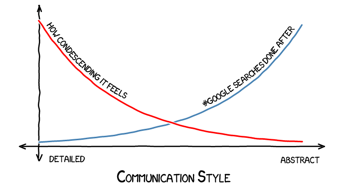
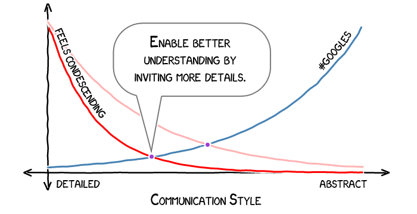

# The hardest and easiest way to be a better coder

## Notes on a communication culture that denies our humanity

Imagine visiting an alien planet that is much like modern Earth. Its denizens are humanoid. They love music and stories. Their technology supports things like newspapers, trains, and building complex architectural feats. Their culture includes a reverence for well-organized education and an impressive system of medical care and research. Yet, despite their other advances, they have yet to discover electricity.

No computers, no internet.

No video games.

I think our modern programming culture has an egregious missing piece like this society’s missing electricity. What we’re missing is an appreciation of great everyday communication skills.

This might just be the easiest way to improve yourself as a programmer because the first steps you can take are simple and greatly rewarding. In the long run, though, it may also prove to be one of the hardest because it’s a surprisingly deep and nuanced subject.

## The currency of code

Coder-to-coder communication, not coder-to-cpu, is the currency of programming.

It’s easy to think about programming as telling the processor exactly what to do. When I’m actually coding, and not designing or talking or emailing or commenting, that’s what I focus on — the precise steps that will be followed.

Stepping away from the trees, the forest is the experience of the end user. Certainly, the goal of programming is to solve a specific problem for the user, right? So where do coder-to-coder communications fit in?

The reality is that programming is an ongoing process. An economy is an ongoing exchange of goods and services — it doesn’t end. There is no ultimate state where each person has received everything they want, and the economy is dismantled. Similarly, a useful codebase evolves, and that evolution itself is what programming really is — not a means to some theoretical snapshot of perfect source.

The only thing flowing between the agents of this process are noisy, undervalued communications.

## **Why does programming culture undervalue communications?**

It’s often hard for programmers to appreciate the value of improving their communication skills. A few things can get in the way:

- People downplay evidence that suggests they’re bad at something.
- It’s easier to improve concrete skills than abstract ones.
- Most developers I know would consider communications improvements as “not a barrel of monkeys,” meaning it’s not fun.

Finally, and perhaps most significantly, developers tend not to talk about communication skills outside of HR-related events like interviews and performance reviews. What percentage of programming articles you’ve read were focused on this topic?

In a sense, it’s tradition to de-emphasize good communication skills.

## **Even coders get the feels**

Another unspoken tradition among programmers is to pretend we don’t have ugly emotions like anger, jealousy, or feeling protective of your code.

Imagine saying “I don’t want to change this code because I feel attached to it.” It feels awkward. It’s weird to speak openly of the ugly emotions.

We have an ideal software engineer in mind, one who only experiences good emotions like excitement, curiosity, or a desire to be helpful. For some, the scorn of criticism is also admired or emulated — but I’ll talk about criticism later. We hide the ways we’re different from this ideal engineer. Feelings are delicate if we suggest a peer has an ugly emotion.

Yet everyone regularly experiences a wide range of emotion. It’s natural. Maturity comes not from emotional changes, but from changes in the way we anticipate or respond to our feelings. When emotions are playing a large role in what we want, the most mature reaction is not to ignore them but to be aware of them, and respond with complete self-honesty.

It’s extraordinarily useful to be aware of your own feelings. This is surprisingly difficult. Our most natural behavior while communicating is to respond directly to our feelings, rather than analyzing them before expressing anything. We don’t usually think, “I’m going to say this next bit because I’m angry.” It’s something we can get better at with effort.

Even more difficult is to be respectful of others’ emotions. When trying to guess how they feel, we have strictly less information than they do. Misunderstanding another person’s feelings can be as bad as ignoring them — and even if we get it right, many people perceive the topic of their emotions as inappropriate.

It would be nice if coder culture accepted openly discussing emotions. The rationale of this taboo seems to be that the logical optimization of code has nothing to do with how you feel — but this denies the nature of programming as an ongoing collaborative process. Happy, positively motivated developers are more productive than disgruntled ones. Like bugs in code, feelings perceived as negative are inevitable. Instead of a protocol of denial, it’s ultimately more productive for a culture to explicitly address such difficulties.

However, cultures do not change overnight. For now, coders who want to address a peer’s feelings tread on dangerous ground. It is far easier if the peer initiates the topic. If you know them well, you could try to asking them how they feel, putting the question in the context that you’d like to understand their perspective without judgment. People feel more aligned with you if they see that you understand how they feel and why they feel that way. This is a great step toward productively addressing negative feelings.

## **Code as communication**

Other forms of communication are strongly detached from human emotion — but still critical. Specifically, let’s consider communication in the form of code readability and maintainability.

When I aim for readable code, I think in two steps:

1. Make the code as readable as possible, pretending there are no comments.
2. Write clear, minimal comments that describe high-level concepts or possible confusion points.

### **Pre-comment readability**

Good function and variablenames are paramount. To get a sense of the standards you might apply, I recommend [Apple’s naming convention guide](https://developer.apple.com/library/mac/documentation/Cocoa/Conceptual/CodingGuidelines/Articles/NamingBasics.html#//apple_ref/doc/uid/20001281-BBCHBFAH). For example, function names should be verbs by default. Class names should be nouns. Avoid words with low specificity such as “object.”

Some languages, such as Java, and occasionally Objective-C, tend to enable ridiculously long names. Java has the infamous

```
InternalFrameInternalFrameTitlePaneInternalFrameTitlePane-  
MaximizeButtonWindowNotFocusedState
```

while Objective-C has

```
willAnimateSecondHalfOfRotationFromInterfaceOrientation
```

among [others](http://psionides.eu/2010/10/31/the-longest-names-in-cocoa/). I think this is a mistake. Name clarity and length must be balanced. I would prioritize shorter names if I started typing something over 25 characters.

Function and file length are also strongly correlated with code readability. Files over 1000 lines, as a rough rule of thumb, could probably be split up. Functions over, say, 40 lines or so are candidates for refactoring.

It’s also nice to have consistency in style elements such as indentation, line lengths, or capitalization. [Google’s C++ style guide](http://google-styleguide.googlecode.com/svn/trunk/cppguide.xml) is a great example of what can be standardized in a codebase.

### **Good comments**

After trying to make comments unecessary, the next step is to fill in the inevitable missing details with human-friendly remarks.

Comments add length to your files and, written poorly, add maintenance cost to changing code. The goal is to comment in a way that makes code changes easier. A bad comment duplicates the working details of the code — this is a problem since minor code changes require the comment to be updated. It becomes easy for the comment and code to reflect different things.

Briefly describing the high-level functionality of a block of code is great when the name does not tell the whole story. Some example high-level descriptions are “encapsulates our custom network protocol” or “module that compresses natural language strings.” These descriptions are likely to remain relevant after many changes to the underlying code.

Some code is hard to make self-explanatory. A calculated size may require a non-obvious +1 at the end to avoid an off-by-one error; or some conceptually-easy operation could be performed in a complex manner as a bug workaround, or for performance reasons. It’s easy to imagine a future coder looking at these cases and thinking, “why is this like this?” Such cases are excellent for short explanatory comments.

Comments exist only to improve the evolution of the code toward the ultimate end-user experience. They are only as good as they are readable and useful with minimal maintenance cost. Keeping this in mind, abbreviations, bad grammar, and sentence fragments can easily be detrimental to a good comment. I’m happiest working in a code base commented with clear, concise, and complete sentences.

Since beautiful code is a topic dear to my heart, I want to mention a virtually abandoned idea called literate programming. The idea is to write a single file that compiles out to separate pieces: one for human-only consumption as documentation, and the other for machine-only use as the running code. This hasn’t caught on — probably because it adds a large chunk of engineering time to meticulously document the entire code base, and this doesn’t make sense for most code bases. If this idea intrigues you, I recommend Donald Knuth’s book *Literate Programming.* Despite its title, the book doesn’t focus completely on literate programming, but rather talks about high-level questions of what makes code readable and maintainable. It imbues a heightened respect for how much skill one can gain in this area.

## **The level-of-detail paradox**

There’s a tricky paradox in the traditional protocols of programmer explanations. If you under-explain an idea, the listener will need to put effort into filling in the missing details. If you over-explain, you’re at grave risk of insulting the listener.



The paradox is that there’s no realistic way to provide an explanation that at once provides *all* the information the listener needs, yet also avoids redundancy with what the listener already knows.

It would be nice if we could be more tolerant of slight over-explanations. Right now, we expect explanations to focus on information we *don’t* know, so that any extra information hints to the listener that their knowledge is undervalued. Deeper than this idea is the sense that it’s embarrassing not to know things. It’s as if the ideal engineer is somehow done with learning forever.

Despite this paradox, there are steps you can take to minimize the damage of under- and over-explanations.

The first step is simply being considerate of the listener’s perspective. If you’re worried you might be over-explaining, ask a judgment-free question. Instead of asking, “You know jQuery, right?” you can ask, “Do you mind if I show you some things in jQuery?” The second form of the question accomplishes these goals when compared to the first:

- If they don’t know jQuery, the first question implies an unmet expectation; the second implies it’s acceptable to not know it.
- If they do know jQuery, the first question feels like a dodged bullet, while the second feels like an opportunity to politely impress with their knowledge.

As a listener, you can avoid being offended at over-explanations, and be brave in asking ignorance-revealing questions. In our graph, this means moving the red “feels condescending” curve a little to the left, so that it takes more over-explaining to bug you. This shift fosters productivity by reducing the amount of information that was left out of a discussion.



## **The temptation to be mean**

Ignorance-revealing questions are hard to ask because programmers, particularly in online discussions, can be harsh.

It’s tempting for me to think, “People who write mean comments are jerks, and that’s not me.” But it’s not constructive for me to dismiss a problem just because I don’t cause it — and, to be deeply honest, such a thought is likely to be rationalized denial. I probably fall prey to the same pitfalls of human nature that motivate bad online behavior, even if it is to a lesser degree than others.

In other words, you can probably benefit from understanding mean behavior even if you’re already nice.

### **The perks of being mean**

Saying something critical makes the speaker sound smart. They sound as if they know more about the subject than whatever is being criticized.

But they often don’t.

Creating is far more difficult than criticizing. It’s another world. It’s easy to forget this when we see a criticism that sounds insightful. The critic reaps an easy reward in the form of a reputation boost. Kids pick up on this phenomena early and some of them turn into bullies. There’s not as much difference between kids and adults as we like to think.

What are the unhealthy motivations of a harsh critic?

I think many critics subconsciously express themselves for the expected reputation boost. In other words, they criticize for the sake of how their audience perceives them. The nature of this “audience” is abstract. The audience could be “the internet” if they’re commenting publicly, or the audience could be theoretical, if the critic is criticizing in notes to themselves. The audience could even be the subject of the criticism — human nature does funny things, and receiving criticism doesn’t exclude us from bestowing respect on the source of our negative feedback.

I suspect there are other, less direct, motivations for overly-harsh criticism. Since programming culture is steeped in this behavior, community members could simply be emulating others. In society at large, there are some archetypical personalities that associate brilliance with emotional vitriol. For example, consider Hugh Laurie’s character *House* or Benedict Cumberbatch’s *Sherlock.* I can imagine programmers looking up to their brilliance and, perhaps subconsciously, viewing such a personality as one worth pursuing.

### **Being nicer with negative feedback**

Some negative feedback is ultimately a good thing. Sometimes things can be improved, or better decisions can be made by being aware of useful criticisms. Negative feedback is good when it’s actually helpful and delivered well.

Start by understanding your own motivations and how your feedback is likely to be received. Imagine receiving the feedback yourself, either as the subject or as a third party. What parts of your message are most likely to help the listeners, and which can be left out?

A negative message is easier to receive when it’s less personal and less general. For example, let’s say that Bort introduced a security flaw into an SSL library. It would be bad to call it “Bort’s bug,” and talk about how “Bort always skips code reviews,” as these are personal or generalize a single incident into an ongoing trait. Instead, focus on the fix, the consequences, and what can change to avoid similar mistakes in the future. It’s good if Bort is privately made aware of the consequences of his actions and how to avoid future mistakes — but there’s not a clear benefit to associating negative emotions with him beyond this.

A negative book review was recently [posted to hacker news](https://news.ycombinator.com/item?id=7596280). Some commenters felt the review’s tone was overly harsh, and a small debate on the tone of feedback ensued. I’d like to address the perspectives of three particular comments that defend the practice of harsh criticism (at least for this review):

> Sorry, but I have a right to an emotional reaction to your content and a right to describe it, especially if the reaction is grounded in objective technical reality.

This perspective shifts the emphasis from what is the most helpful behavior to a question of what behavior is allowed. It’s true that harsh criticism is allowed. Any author does have a right to express it, and may consider it an honest expression of their reaction. The perspective of this post, however, is to improve ourselves, reaching beyond what we’re allowed to do into the realm of how we can be most productive.

Another comment from the discussion thread:

> In the case of this review, I would say [the reviewer]’s tone is appropriate, because security is Serious Business.

The commenter is proposing that a serious subject justifies a harsh tone. The implication is that negative consequences may occur if the review were less harsh. Specifically, readers of the review may not realize how serious the topic is, and make security mistakes because the review was not harsh enough in tone. That reasoning sounds silly when spelled out. Expressing the gravity of a topic is independent of a condescending tone.

Let’s finish by looking at one more comment that downplays the importance of being nice:

> Could [the review] have been worded more kindly? Of course. Do I care? Not at all… It was informative and useful. The tone was just fine.

This last perspective is one I have seen many times — the idea that being right justifies being callous; or that expressing information is the only goal of communication, without regard to emotional impact.

But the goal of communication is to move forward — to make improvements, decisions, and get things done. These are positive actions taken by humans, and humans are fundamentally driven by emotion. To deny this fact is to deny our humanity.

*The hacker news quotes are from* [*this discussion thread*](https://news.ycombinator.com/item?id=7596280)*.*
