# Use chips de milho (como Doritos) para criar uma fonte de fogo

[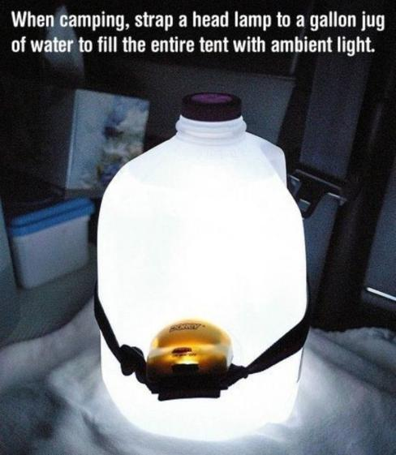](http://obutecodanet.ig.com.br/wp-content/uploads/2014/04/acampamento_02.jpg)

# Para criar uma lâmpada, coloque uma lanterna presa numa garrafa com água

[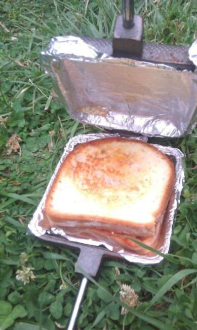](http://obutecodanet.ig.com.br/wp-content/uploads/2014/04/acampamento_03.jpg)

# Coloque papel alumínio na chapa para facilitar a limpeza

[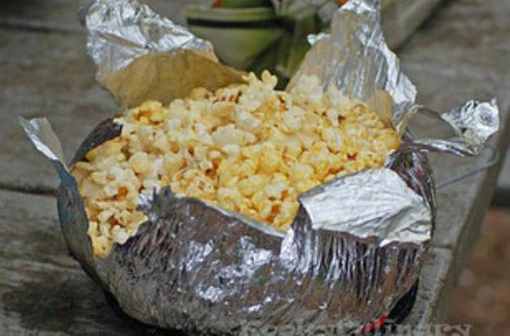](http://obutecodanet.ig.com.br/wp-content/uploads/2014/04/acampamento_04.jpg)

# Coloque milho numa folha de papel alumínio e coloque na fogueira para se transformar em pipoca

[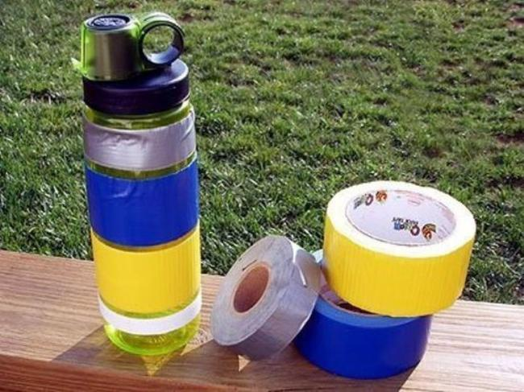](http://obutecodanet.ig.com.br/wp-content/uploads/2014/04/acampamento_05.jpg)

# Prenda fitas adesivas extras, para emergências, em sua garrafa de água

[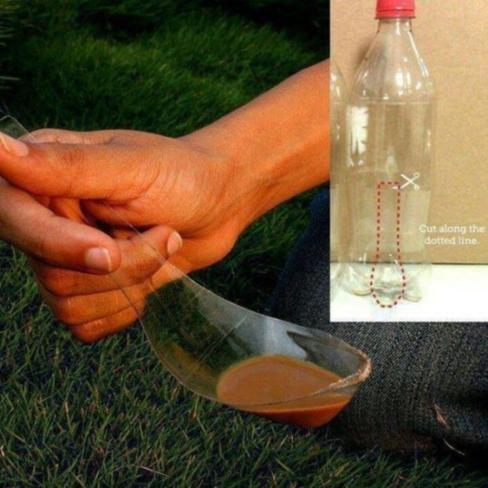](http://obutecodanet.ig.com.br/wp-content/uploads/2014/04/acampamento_06.jpg)

# Faça uma colher usando uma garrafa de plástico

[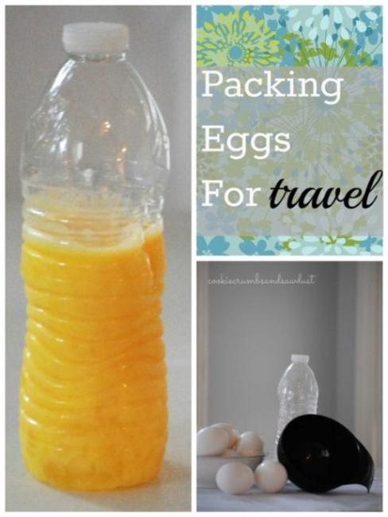](http://obutecodanet.ig.com.br/wp-content/uploads/2014/04/acampamento_07.jpg)

# Quebre 8 ou 9 ovos e coloque-os em uma garrafa de plástico. Isso evitará que você precise procurar e transportar os ovos.

[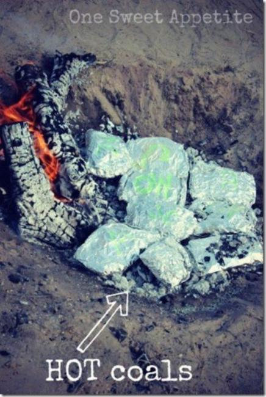](http://obutecodanet.ig.com.br/wp-content/uploads/2014/04/acampamento_08.jpg)

# Envolva sua carne em folhas de couve. Irá evitar que fique queimada.

# Copos de silicone são inquebráveis e fáceis de transportar

[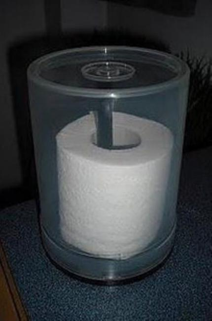](http://obutecodanet.ig.com.br/wp-content/uploads/2014/04/acampamento_10.jpg)

# Mantenha seu papel higiênico seco usando recipiente de CD

[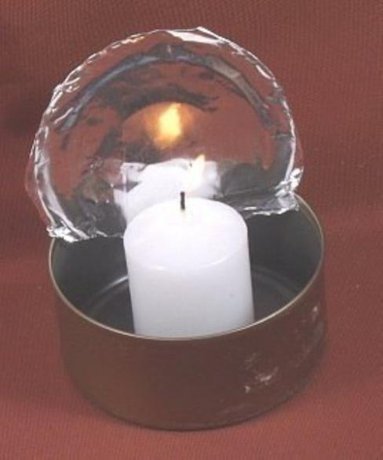](http://obutecodanet.ig.com.br/wp-content/uploads/2014/04/acampamento_11.jpg)

# Uma vela dentro de uma lata de atum pode se transformar numa lanterna

[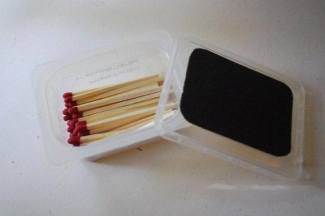](http://obutecodanet.ig.com.br/wp-content/uploads/2014/04/acampamento_12.jpg)

# Cole uma lixa na parte superior de um vasilhame de plástico. Os fósforos vão dentro, para evitar que se molhem

[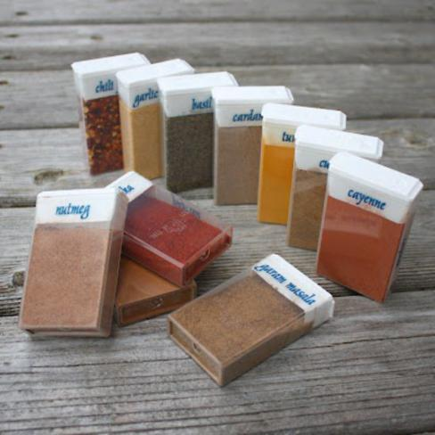](http://obutecodanet.ig.com.br/wp-content/uploads/2014/04/acampamento_13.jpg)

# Use caixas de Tic-Tac para armazenar temperos e especiarias

[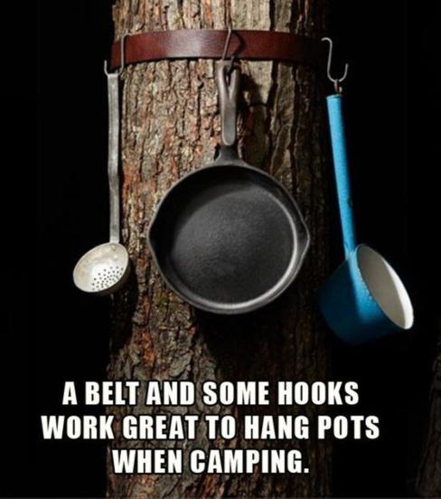](http://obutecodanet.ig.com.br/wp-content/uploads/2014/04/acampamento_14.jpg)

# O cinto pode se transformar em armário para panelas
