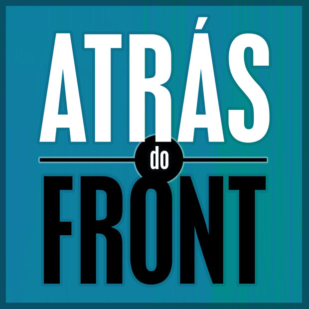

# Atrás do Front, podcast (ouça)

[Atrás do Front](http://atrasdofront.tumblr.com/), um podcast semanal sobre assuntos supimpas variados, em busca de um contínuo deleitoso amadorismo, procura ouvintes como você para gloriosos momentos íntimos auditivos.

Os [Eduardos Fernandes](http://caosordenado.com/) e [Pinheiro](http://tzal.org/) penetrarão sem medo os meandros bizantinos da sua mente, fazendo cócegas em seus dentritos e axônios com uma pletora de assuntos sempre diversíssimos, às vezes divertidíssimos, mas sempre ligeira e criativamente interconectados.

O diletantismo excepcional dos interlocutores, amplificado e retificado pelo [efeito de Dunning-Kruger](http://pt.wikipedia.org/wiki/Efeito_Dunning-Kruger), tornará a experiência insolitamente irônica, radicalmente sincera e descaradamente dando as reais, nas entrelinhas, explicita e indiretamente, ou obliqua e claramente — em outras palavras, tudo coisa de hipster coxinha classe-média esquerdista fascista moderado liberal progressista feminista analítico continental misógino falocentrista barroco wiccan adorador da deusa peruano saudita big brother anarquista rococó cheio de adjetivos que no português nunca empilham tão bem quanto em inglês, especialmente sem hifens.

E, acima de tudo, muito hippie.

E também cheio desses buzz de internet e papo de startup, teoria de conspiração, nova era californiana e academia rançosa. E, claro, meta-podcasting, nosso assunto favorito, além de Marc Maron.

Mas sério, o Eduf (E. Fernandes) não é que nem eu (E. Pinheirus), ele é um cara do povo, cheio de oxitocina, que fala a língua das ruas, um comunicador social, o Chacrinha em pessoa, um empreendedor curador editor radialista heurístico nato e carismático. Ele só, como eu, é músico e escritor no tempo vago, programador, designer, acima de tudo produtor de conteúdo e (shhh!) budista, e tem que, às vezes, bem de vez em quando, ganhar dinheiro.

Fora isso, não é um complicador nato como eu, nahh…

Depois que você se inteirar de todas as piadas internas, **aí, meu amigo, não tem volta**. Melhor nem começar. Nem ouve esse negócio. Mas já que você tem que fazer sua atividade física diária, porque ficar ouvindo essa música acéfala a que você está acostumado? Desculpa aí se fui muito gaúcho com você. Chega de mimimi. Tá, tu tens consideração por tua música, vivente, já entendi. Mas te aprochega. Dá uma chance. Eu próprio até ouviria a mim mesmo, se não ficasse com tanta vergonha.

Pinheiro. Fernandes. Ambos Eduardos

Assuntos já tratados no [Atrás do Front]( http://atrasdofront.tumblr.com/) (comigo três episódios, e uns 5 só com o Eduf entrevistando outras pessoas — claro que estou falando só dos dois últimos!):

Beatniks, compras na China, vida simples, demônio do início das coisas, diletantismo extraordinário, linhagem das formigas, heurística da filtragem de lixo conceitual, Malinovsky  e o lubrificante social, Honey Boo Boo, cultura de nicho, vender a si mesmo tal como um produto, nazi de sofá, ideologia vendida pela cultura pop.

Game of Thrones, memes na rua durante as manifestações, DRM, cultura geek do colecionismo e cosplay, manufatura do consenso, política do Led Zeppelin, política na música dos 70 e 80, engajamento da disco music, movimento anticorporação, occupy, futebol corrupto, meta-podcasting, Marc Maron, Marc Maron, Marc Maron, autoajuda, life metrics, ranking nas redes sociais, teoria dos jogos, Gustavo Mini.

Malcolm Gladwell, efeito Dunning-kruger, Skrotinhos, quadrinhos da Circo, Chiclete com Banana, Glauco, Niquel Náusea, Geraldão, Animal, Folha Ilustrada, Lester Bangs, Paulo Francis, Forastieri, Rogério de Campos, gauchismo-gaúchismo, Pepe Escobar, sinceridade radical, Pinheiro vs Slavos Zizek, Noam Chomsky vs Slavos Zizek, Foucault, Deleuse, Hegel, Heidegger, vocabulário próprio de seita.

Dave Rupert, Deeplinking, Paradoxo de Russell, Nalanda, Charvakas, budistas nazistas, e… Tecnologias do amor, o assunto do último podcast, disponibilíssimo para ouvir, baixar, plugar nos ouvidos e inundar os miolos.

Pois então! Diletantes de todo o planeta juntem-se a nós! Especialmente, enquanto é grátis, e enquanto não tem publicidade ostensiva! Toda quinta-feira, assim se espera, quando der, do jeito que der em<http://atrasdofront.tumblr.com/>.

E você, filho do 1%, sex shop ou cafeteria, anuncie no Atrás do Front, qualquer dez milhão rola. Contato por atrasdofront@gmail.com.

*Disclaimer: Eduardo Pinheiro [também escreve a coluna WTF](http://papodehomem.com.br/secoes/colunas/wtf/), aqui nesse site, e que não tem nada a ver [com o podcast do Marc Maron](http://www.wtfpod.com/) – não fui eu que nomeei minha coluna, embora goste do nome. O Marc Maron não é dono da marca What the Fuck. Acho eu. Espero não sermos processados.*
