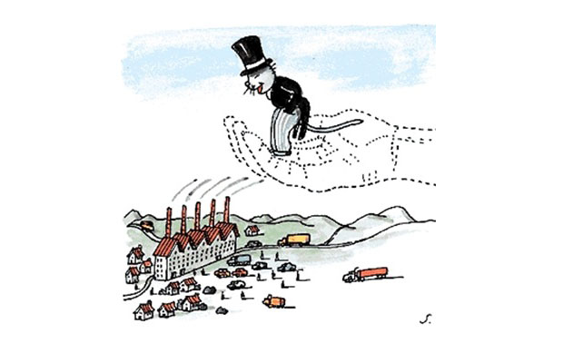
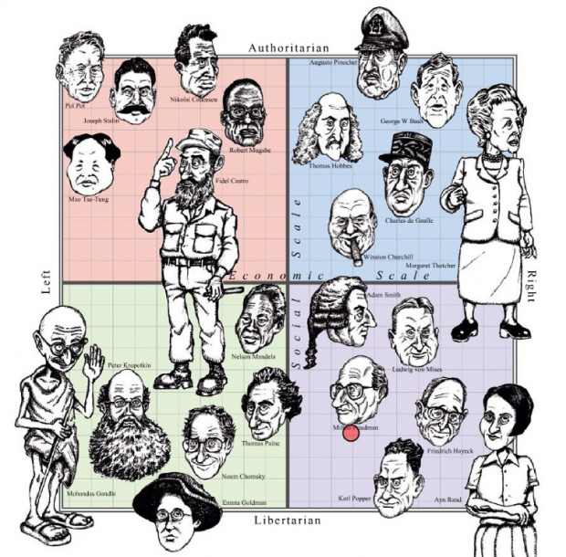
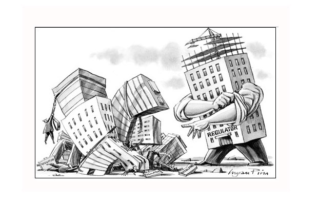
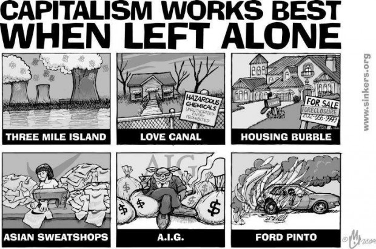
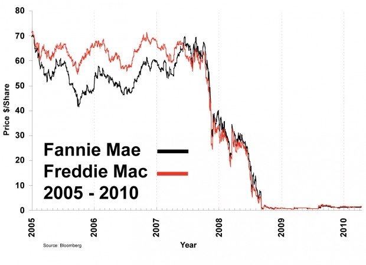
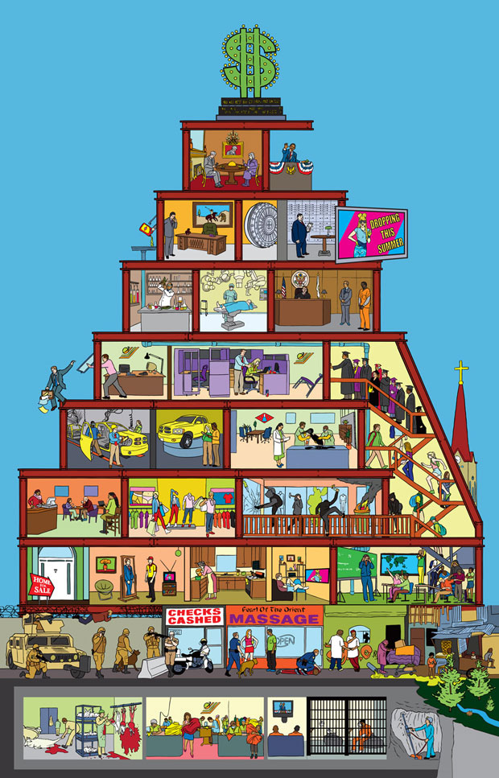

# Capitalismo: vamos então gameficar pra valer?

Cliclando na imagem, você já pode ouvir o podcast “Atrás do Front #18 – Gameficação da Política”

Para fins desse artigo, exporei as duas ideologias econômicas principais que se contrapõe como “direita” e “esquerda”. É óbvio que **ambos os termos são mais amplos do que as definições que darei**, mas são também frequentemente abusados e suas definições raramente surgem de uma posição imparcial e isenta.

Considero as definições a seguir precisas — ainda que incompletas — e relativamente imparciais.

A posição da direita implica uma crença e confiança fundamental nos processos relativamente isentos (isto é, não regulados) de competição como promovedores de bem comum e “progresso”, que é uma palavra carregada, mas basicamente, quer dizer melhorias progressivas para todos.

Ainda assim, deriva-se o fato de que a desigualdade é uma realidade e que ela promove a própria tensão competitiva. Além disso, quanto menos intervenção estatal nas transações entre pares, mais “justo” e “adaptável” se torna o mercado.

Já a esquerda confia na capacidade da organização humana para regular e intervir de forma hábil na direção de maximizar o bem comum. Caso os pares sejam deixados por si só, acredita-se que a tendência é o aumento progressivo da desigualdade, cuja intensificação é vista como negativa por razões compreensíveis e óbvias, e não só morais; do ponto de vista que um mundo mais desigual é mais desagradável e violento para todos.

Nesse sentido a própria noção de competição é desafiada como um valor intrínseco.

Perceba que procurei evitar os aspectos mais extremos e polêmicos, que surgem nas críticas, algumas vezes bem fundadas, de uma perspectiva perante a outra.

Por exemplo, a direita diz que a esquerda tende ao totalitarismo, à visão utópica e idealista, a não funcionar num sentido prático de “produzir as coisas que todos querem”, de atravancar o “progresso”, e de promover uma maior igualdade “por baixo”.

Já a esquerda critica a viabilidade a longo prazo (ambiental, social) da visão da direita, bem como faz uma defesa moral daqueles que não tem acesso as supostas benesses que a direita produz (coisas relativamente supérfluas como máquinas fotográficas baratas e restaurantes de fast food, e coisas necessárias e possivelmente mais abundantes, mas também, segundo a esquerda, mal distribuídas).

Por outro lado, em seus extremos, a “utopia social” da esquerda parece simplificar a realidade e os impulsos humanos sob o guarda-chuva ora protetor, ora restritor, de uma ideologia particular — enquanto que o extremo do mercado, parece cada vez mais evidente, ao contrário do que os próprios grandes teóricos do capitalismo ansiavam ou pregavam, enfim amoral.

Mais do que isto, alguns extremistas não se importam com isso ou aquilo. “Liberdade imposta” e arbitrariedade parecem ser o que há de comum nos extremos. Assim, as palavras “capitalismo” e “socialismo”, como a direta e a esquerda, existem numa gama de sentidos, que só se tornam estanques no espantalho atacado por um lado ou pelo outro.

É preciso também compreender que, em seus extremos, ambas as visões são embasadas numa crença que se pode dizer religiosa: ambos creem na progressiva melhoria, através do esforço humano, para um estado ideal de equilíbrio, uma homeostase.

A mão invisível do mercado

Essa homeostase como fim e resultado, para a direita, [é o deus mercado](http://www.theatlantic.com/magazine/archive/1999/03/the-market-as-god/306397/) (a autorregulação (não dirigida, cega, inconsciente) e adaptativa das livres relações entre as pessoas como tendendo ao bem comum) e, para a esquerda, a capacidade de uma consciência coletiva (a melhoria progressiva por meio de uma série de “reuniões de condomínio” e discussão por comitês de medidas que direcionem e controlem as relações humanas).

Quanto às duas abstrações, é preciso dizer que, de um ponto de vista absolutamente imparcial, não há evidência de que elas operem “bem” ou funcionalmente sequer para os diferentes fins e expectativas de cada um dos lados. Isto é, é claro que os objetivos finais, as expectativas e o que seria considerado “homeostase” difere bastante no espectro político, mas em geral não há grandes evidências sequer de que essas duas entidades abstratas e duvidosas produzam aquilo que é esperado delas, ainda que persista uma grande diversidade de expectativas.

Por exemplo, certo nível de expectativa poderia se traduzir em zerar os sofrimentos basais de alimentação, moradia, educação e saúde. Outro nível de expectativa seria simplesmente produzir uma economia em constante crescimento, independente do grau de sofrimento de certas camadas da população. E, enfim, uma expectativa mínima e egoísta seria “que eu, e apenas eu, possa viver bem neste mundo” — e nenhuma dessas expectativas é garantida, na experiência prática da história e nos diversos experimentos pelo mundo, pelos extremos de espectro ideológico apresentados, sejam de direita ou de esquerda.

A última expectativa, a “egoísta”, talvez seja justificável parcialmente, mas não é justificável por qualquer amostragem, nem mesmo focada numa classe específica.

Em outras palavras, [como as pesquisas demonstram](http://www.theguardian.com/science/2010/dec/13/happiness-growing-wealth-nations-study), a percepção de felicidade não aumenta após determinada renda e, de fato, todas as pessoas tem que viver nesse mesmo mundo, e hoje mesmo que uma pessoa não caminhe pelas ruas do terceiro mundo, ela tem sua TV ocasionalmente invadida pelo sofrimento humano, no seu sentido puramente econômico.

Além disso, é preciso frisar, é evidente que, ao contrário do que querem afirmar alguns, o socialismo não foi “derrotado” com o fim dos regimes no leste europeu. De fato aqueles experimentos foram formas de socialismo extremo, utópico — e enquanto tais experimentos parecem efetivamente ter acabado, a discussão do bem estar social como função precípua do estado segue, nunca esteve tão viva.

O socialismo hoje vive como uma crítica inteligente à realidade, não como uma ânsia de transformação radical, uma [imanentização do escatón](http://en.wikipedia.org/wiki/Immanentize_the_eschaton).

Assim qualquer um vai querer Imanentizar o Escatón

E a realidade é o capital e a competição em termos do capital.

Assim, devemos evitar cair numa discussão que remete a dois ou três passos atrás no diálogo e tensão entre essas duas formas de ver o mundo — ainda que na mesa de bar, e com as pessoas de educação média do mundo, essa discussão pareça seguir por aí (“Cuba isso, Cuba aquilo…”).

### O diálogo hoje se dá em outro âmbito

A desregulação da economia foi promovida e intensificada, desde o início dos anos 80, com consequências, segundo pessoas como eu (esquerdistas), extremamente funestas. A argumentação do outro lado é que as consequências funestas surgiram dessa desregulação não ter sido absolutamente completa.

É essa a discussão hoje: mais ou menos regulação, e como garantir a isenção da regulação perante grupos de interesses e grandes atratores econômicos (grandes corporações).

### O que significa regulação?

Existem várias formas [e níveis de regulação](http://en.wikipedia.org/wiki/Regulation#Reasons_for_regulation). Algumas delas defendem consumidores: cintos de segurança, indicações claras nos produtos, não vender veneno (ou placebo) como se fosse remédio (os casos de *[snake oil]( http://en.wikipedia.org/wiki/Snake_oil)* que redundaram na criação do [FDA](http://www.fda.gov/), em 1906), e infinitas outras formas de proteger um parceiro comercial em posição relativamente desigual.

Outras regulações impedem — ou ao menos dificultam — a formação de problemas comuns ao capitalismo, e reconhecidos como problemas na ideologia capitalista, como a formação de cartéis e monopólios.

E, enfim, o nível mais profundo de regulação — que algumas vezes não é reconhecido estritamente pelo nome “regulação”, mas como é uma forma de intervencionismo que “invade” o mercado e altera seu curso natural, deve ser visto dessa forma — **é quando o governo assume total ou parcialmente algum serviço considerado essencial**, e, por razões que supostamente deviam ser deixadas claras em cada caso específico, não adequadamente suprido pela iniciativa privada.

Coisas como polícia e bombeiros — em alguns locais, isso se estende a educação, saúde e além — e coisas como estradas e infraestrutura de transporte e outras.

Há uma grande discussão com relação ao tamanho da rede de segurança social, isto é, o quanto deveria ser garantido pelo estado ao cidadão. E de fato parece óbvio que a discussão de em que ramos ou atividades humanas a competição relativamente desregulada é mais daninha que a possivel morosidade burocrática, comum nos serviços públicos.

Isto é, essa discussão do tamanho e das áreas que englobariam a intervenção estatal se dá em termos do que seria viável economicamente, e do que seria conducente a uma sociedade em que a competição permanece não só mais justa, mas também mais ferrenha, bem como onde possivelmente a competição por si só, mesmo regulada, não produza o resultado óptimo.

Daí que, para alguns, por exemplo, o transporte coletivo deva ser totalmente subsidiado pelo estado e, para outros, nem mesmo o exército ou a força policial devem estar sob o âmbito privado.

Há poucos libertários absolutos que diriam que numa sociedade relativamente desenvolvida, não seria necessário nenhuma forma de regulação (de nenhum dos três tipos acima, ou outros), reduzindo a necessidade de governo a zero, ou quase zero — um corpo diplomático, por exemplo, talvez não fosse privatizável. Porém, alguns libertários chegam a dizer que o cinto de segurança é uma intrusão governamental abstrusa, já que quem deseja arriscar a própria vida pelo incômodo de usar um cinto, não deveria ser protegido de fazê-lo.

Compasso político: repare que há um eixo social e um econômico

E aqui é talvez importante distinguir liberdades econômicas de liberdades sociais, porque o discurso carregado em torno da política muitas vezes as confunde — talvez deliberadamente, se pensar de uma forma um pouco conspiratória.

Assim, pode parecer muito palatável a alguém a liberdade perante certos intervencionismos regulatórios estatais, tais como uso de drogas ou aborto, enquanto que essa mesma pessoa entende que uma empresa que venda leite adulterado (aguado, que seja, nem entremos nas adulterações mais criminosas perpetradas no Brasil recentemente) precisa ser punida, e que a qualidade do leite, enquanto leite, precisa ser regulada — e fiscalizada.

Esse texto não lida com as liberdades sociais, porque isso é uma discussão de outro tipo totalmente diferente.

Porém, é preciso deixar claro que é insidioso que essas discussões sejam misturadas. E isso é cada vez mais comum, e talvez esteja ligado pela raiz à agenda libertária. Por exemplo, a corporação, nos EUA, vista como uma pessoa, tem “liberdade de expressão”, que é incrivelmente interpretado como “liberdade de gastar dinheiro no que quiser”, **isto é, patrocinar políticos — legalmente e em segredo**, se necessário.

As legislações de direitos civis são, atualmente, todas abusadas por “pessoas corporativas” que, por meio de interpretações absurdas das leis, usam as liberdades civis tão duramente conquistadas para criar gambiarras legais e beneficiar grupos de interesses.

Com relação a regulação, particularmente a econômica (repito que não entrarei na questão da liberdade individual, o âmbito social da relgulação) — parece ser impossível fugir de algum nível dela. Aqui no Brasil, a maioria das pessoas (de esquerda ou de direita) possivelmente não se importaria [com uma regulação do chocolate](http://noticias.r7.com/economia/noticias/um-terco-dos-chocolares-do-brasil-e-falso-diz-produtor-20130715.html?question=0) como a que ocorre no Japão. Lá, só pode ser chamado de chocolate aquele doce que tem determinado percentual de cacau.

O resto é “doce achocolatado”.

Esse nível de regulação provavelmente não ofenderá ninguém senão um libertário fundamentalista.

Ainda assim, existem várias regulações que lidam com interesses muito vastos, ainda que explicitamente só estejam ligadas a forçar a empresa a informar o consumidor sobre as qualidades do que consome, e nesse caso, os brios libertários curiosamente se acendem de novo. Por exemplo, recentemente a Califórnia passou legislação desobrigando as empresas de informarem sobre a presença de transgênicos nos alimentos.

Isso ocorreu, sem dúvida, devido ao forte lobby das empresas alimentícias. Aqui no Brasil, reparei que uma embalagem de salgadinho popular tinha os dizeres “preparado com milho transgênico”. Isso certamente não surge na embalagem por iniciativa e vontade própria da empresa de salgadinho.

É aqui que aquela ideologia de “liberdade” de não usar cinto, ou fumar na rua (em Nova Iorque, por exemplo, é proibido), pode ser cooptada pelo grupo de interesse através de uma ideologia econômica em termos da “liberdade” de não informar o consumidor sobre o que ele está consumindo.

E é preciso também reconhecer que essa é uma “desregulação” que também possui teor intervencionista, a saber, visa defender uma visão particular, ideológica, sobre como o consumidor deve decidir.

Regulação

Isto é, precisamos alguma regulação, e num ambiente onde alguma regulação é necessária — e parece ser evidente que é –, o ato de não regular também possui impacto político e social.

É importante frisar isso porque algumas vezes o libertarianismo prega que a desregulação é sempre melhor, em todos os casos. Até que você lembre que é necessário alguém fiscalizar o leite – e talvez algum libertário venha até a dizer “ué, deixa morrer umas crianças, a partir disso o consumidor saberá escolher a marca saudável”, mas não é tão comum uma visão assim ser defendida publicamente (embora [algo semelhante tenha ocorrido](http://gawker.com/5839564/gop-debate-crowd-on-uninsured-sick-americans-let-them-die) durante as primárias do Partido Republicano nos EUA).

Mas o segundo ponto é que, havendo pelo menos alguma regulação, a não regulação de algum elemento se torna uma questão também deliberada.

O argumento central da competição livre como motivador de melhorias para todos, o argumento moral (e ele é moral, embora o libertarianismo muitas vezes abra mão dele) já exposto por Adam Smith [em sua obra seminal](http://en.wikipedia.org/wiki/Wealth_of_nations), não enfatiza suficientemente a importância da informação no processo competitivo.

É óbvio que, independente das condições iniciais médias de um sujeito no séc. XVIII, a desigualdade em termos de informação era prosaica. Isto é, no séc. XVIII dois negociantes de café, um iniciante e outro tarimbado, diferiam em termos de seus conhecimentos de fornecedores, grãos, meios de transporte e mercado – mas quanto tempo duraria a vantagem do fornecedor tarimbado?

Essa relativa mobilidade informacional era imprescindível para a competição ocorrer no contexto moral que Adam Smith esperava dela (isto é, como produzindo resultados de bem-estar comum).

Hoje, não precisamos nem entrar na revolução da informação, basta passear pela ala de azeites de oliva de um supermercado. São muitas opções. Alguém mais cínico [poderia dizer que são opções demais](http://www.amazon.com/The-Paradox-Choice-More-Less/dp/0060005696)!

Porém, o capitalismo como promovedor adaptativo do bem-estar confia em nossa escolha informada. Mais do que isso, para seu funcionamento “correto”, ele dependeria, num mundo ideal de transparência total e informação plena (uma espécie de onisciência, pelo menos potencial, de cada um dos players).

Isto é, o capitalismo exige de nós, como consumidores, a capacidade de conhecer marcas, proveniências, preços relativos a qualidade e quantidade (poderia haver regulações do tipo: “azeite só se vende em 250ml, 500ml ou 1l” e dessa forma seria mais fácil comparar os preços), e aspectos próprios do produto como acidez (parece já haver regulação nos obrigando a informar isso), cor, e assim por diante.

Precisaríamos hoje mais do que nunca, também conhecer as condições das fazendas e dos trabalhadores, métodos de fertilização e controles de pragas, variações genéticas, clima, formas de prensagem (e há uma grande confusão quanto a isso [como artigo recente do Guardian](http://www.theguardian.com/books/2012/jan/13/extra-virginity-tom-mueller-review?view=mobile nos mostra)).

Bom, você pode pensar, se você é como eu, que quando compra azeite você repara país, preço, e aspecto do rótulo e garrafa. Você gosta das palavras “extra virgem”, e se é exatamente como eu, tende a achar que menos acidez é melhor, embora não tenha certeza disso. Você passa alguns meses sem comprar azeite, e novas marcas e importações aparecem, e há anos você não forma relação com uma marca ou outra, mesmo que eventualmente reconheça algumas.

Você algumas vezes compra o azeite promocional, e, se é paranoico como eu, pensa “porque será que esse azeite português está tão barato? Será que não passou no critério regulador de algum país com legislação mais dura? Será que não é uma carga rejeitada por alto nível de pesticidas, que veio parar aqui neste supermercado no Brasil?”

É preciso reconhecer que, se você tem uma inclinação mais no sentido da direita libertária, você depende de um consumidor, um negociante, com um interesse crescente e cada vez mais onisciente – uma vez que, sem governos, será ainda mais do que como já é hoje: quanto melhores os rótulos e publicidades, maior a desinformação, em geral vencendo o produto que arbitrariamente é melhor num único quesito: “o que vende mais”.

E aí temos um problema central do livre mercado. Isto é, passado um ponto de desregulação, em muitos casos, uma desconexão cada vez maior entre o valor intrínseco do produto e seu valor de mercado passa a ocorrer — pelo simples fato de que a própria desinformação pode ser, e naturalmente acaba sendo, explorada como veio a ser minerado.

É claro que, a longuíssimo prazo, a tendência é haver uma adaptação e finalmente um estado de homeostase. O que são milhares de pessoas com câncer ao longo de dezenas de gerações, se enfim, os consumidores por si só, sem regulação, vão se decidir pelo que é melhor para eles?

A desoneração do governo, além disso, onera o lado mais fraco da competição, afinal, eu não tenho dinheiro, conhecimento ou tempo, pessoalmente, para montar um laboratório para avaliar o leite que consumo. O máximo que eu posso fazer, na situação atual, é exigir de meus governantes que eles pressionem as agências reguladoras para que elas garantam a qualidade, e indicadores precisos e acurados que facilitem a escolha de um produto perante o outro.

É óbvio que a crítica que se seguiria como resposta é que, num país socialista daqueles tradicionais, que hoje já não são mais socialistas (ou tão socialistas, porque, como vimos, a regulação causa, em todo caso, um espectro socialista, mesmo nas economias mais livres), ou em Cuba, não há ou não haveria azeite de oliva, e se houvesse, seria só um, ruim, numa embalagem feia, caro, e escasso.

Mas essa crítica extrema não vem ao caso: ora, saber pelo rótulo, e confiar até certo ponto, nos níveis de gordura e açúcar, e outros nutrientes, ali escritos, é bem útil. Não encontrar óleo de soja aromatizado denominado “azeite de oliva” também ajuda muito.

Se o governo puder fiscalizar as fazendas, os trabalhadores, o transporte, assegurar que as informações do rótulo são acuradas, e obrigar a exposição de certas informações, ajudar a comparação de preços, e assim por diante, esse nível de “socialismo” já ajuda muito.

Isto é, aparentemente o mercado funciona melhor quando não é tão natural assim. Afinal de contas, eu não sei medir o ph do azeite, e eu espero que quando pago por “primeira prensa” eu tenha pelo menos uma boa chance de estar comprando um azeite de primeira prensa.

Então fica estabelecido que a regulação, em algum nível e em algum sentido é necessária. E ela não só é necessária, e aqui é o pulo do gato, ela intensifica o processo de competição, torna mais rápida a zona de estabilidade, e ela, enfim azeita, se me permitem o trocadilho, o capitalismo.

O capitalismo realmente funciona melhor quando deixado por si só?

Mas agora nos deparamos com a verdadeira boa crítica do libertarianismo.

Afinal de contas, essas agências regulatórias, e o governo como um todo, tornam-se o objeto máximo da distorção dos grupos de interesse, e assim impedem o capitalismo de operar como deveria. Isto é, se você quer roubar no jogo, nada melhor que ter colaboração da banca. E, de fato, no mais dos casos, o poder econômico é que elege a banca.

Assim, em vez do governo e dessas agências protegerem o lado fraco (informacional, econômico, social) numa transação desigual, elas servem como garantias extras para os grupos de interesse que, tacitamente e inevitavelmente, as controlam.  
Em outras palavras, uma vez que você cria agências reguladoras, toda a hierarquia de forças por trás da regulação passa a ser manipulável por meios legais ou ilegais.

Com isso, o libertário concede que a informação sobre os transgênicos ajudaria a informar o consumidor atomar a própria decisão, e digamos que aceite que o ato de desregulação é visto como uma manipulação do estado pelos grupos de interesses. O melhor seria, diz o libertário, que organismos não estatais fizessem essa regulação, onde ela for necessária. O mercado resolve o mercado, o estado é sempre passível de corrupção: este é o argumento libertário.

Porém, vejamos se é isso mesmo. Esse é o caso da MPAA, a organização que, nos EUA, classifica os filmes por faixa etária e de acordo com os conteúdos. Pela questão da liberdade de expressão, nos EUA o governo não pode intervir quanto a isso, então a indústria se autorregulou. Agora, não é que mesmo numa organização não governamental, numa agência reguladora [como a MPAA,](http://en.wikipedia.org/wiki/Motion_Picture_Association_of_America_film_rating_system) encontramos distorções do mesmo tipo encontradas nas agências governamentais?

É evidente que os seis grandes estúdios pressionam produtores independentes a classificações menos desejáveis ([há classificações mais e menos lucrativas](http://en.wikipedia.org/wiki/Motion_Picture_Association_of_America_film_rating_system#Tougher_standards_for_independent_studios ) – os filmes pg13, e os com classificação familiar, tem o público mais amplo), e, além disso, os critérios se mostram extremamente arbitrários.

Então parece que, se precisamos regulação, e a regulação é similarmente distorcível a nível do estado e da iniciativa privada, a questão talvez seja aceitar algum grau de distorção, mas deixá-la, no mais das vezes, a encargo do estado. Via estado, há uma leve maior tendência à isenção — e a questão do tempo e da eficiência tende um pouco mais ao bem comum, em contraposição a velocidade dos negócios.

Todo aquele empresário que reclama da burocracia e da morosidade, de seu empreendimento passar num laudo ambiental, por exemplo, está chorando por esse segundo aspecto. Porém a autorregulação pela iniciativa privada, em particular em casos de vastas externalidades, como o ambiental, é bastante incerto. Ou acreditamos na publicidade das indústrias verdes? Conseguimos verdadeiramente punir, com boicotes de consumidores, os grandes vilões da destruição ambiental e da exploração dos trabalhadores?

É difícil.

Além disso, o mesmo argumento do libertário quanto a regulação poderia ser feito quanto a polícia: ora, já que uma parcela considerável da polícia é corrupta, é mesmo melhor não ter polícia nenhuma? É isso que o libertário na verdade argumenta ao dizer que agências reguladoras são contraproducentes para o bem comum, ora, porque frequentemente serviriam a grupos de interesses.

Isso é verdade, mas não parece haver solução melhor.

A alternativa da autorregulação não só é sujeita aos mesmos tipos de pressão como tem uma série de outras distorções: ela só é vantajosa para a velocidade dos negócios e o bem-estar de parte dos empreendedores.

Famílias sem casa e comida nos EUA?

Vamos sair da economia real e ir para o mercado financeiro. Os piores problemas com regulação, que redundaram na crise de 2008, se deveram a organizações mistas, isto é, iniciativa privada com concessões públicas, [como Fannie Mae](http://en.wikipedia.org/wiki/Fannie_Mae e Freddie Mac http://en.wikipedia.org/wiki/Freddie_Mac). A existência de [GSE](http://en.wikipedia.org/wiki/Government-sponsored_enterprise) (Empreendimentos Patrocinados pelo Governo) também ocorreu devido a desregulação.

Após algumas histórias de sucesso nos anos 70, como por exemplo, a desregulação das companhias aéreas nos EUA, que barateou muito as passagens, e também a desregulação da telefonia, que produziu uma contínua revolução que se estende até hoje, seguiram-se duas décadas de enlouquecida desregulação a partir do [governo Reagan](http://pt.wikipedia.org/wiki/Doutrina_Reagan).

Aqui no Brasil, a ideologia neoliberal foi muito criticada pela privatização, mas a privatização nem sempre dá errado, e de fato é, se feita com certas garantias, a forma mais branda de desregulação. Podemos reclamar dos pormenores dos processos de venda, e dos preços, mas é difícil argumentar que haja bons motivos para o governo competir em certos ramos, da mesma forma que é difícil aceitar que a iniciativa privada funcione melhor em todos os âmbitos.

As formas mais funestas de desregulação parecem ser as ligadas essencialmente ao mercado financeiro, particularmente as formas que permitiram “bancos mistos”, isto é, bancos que lidam com commodities, clientes da economia real, e clientes da economia artificial (mercado financeiro). Foi essa união que criou o “[grande demais para fracassar](http://en.wikipedia.org/wiki/Too_big_to_fail)”.

Aqui a argumentação libertária se torna absurda (fora isso, ela é a forma de direita um pouco mais coerente que temos hoje — e que na verdade aos poucos se configura efetivamente como direita, o que não era necessariamente, em contraposição a uma esquerda moderada muito mais do lado da regulação do que de qualquer outra coisa).

Eles seguem querendo mais desregulação, afirmando que o “[corporate welfare](http://en.wikipedia.org/wiki/Corporate_welfare)”, os auxílios concedidos ao governo para as instituições financeiras não quebrarem, é amoral e contraproducente, desagrada o “deus mercado”.

Ora, não se estaria punindo devidamente quem precisa ser punido. E com certeza é amoral, ninguém duvida, porém mais amoral foi em primeiro lugar a desregulação promovida pelos mesmos grupos durante os anos 90, que permitiu que um único banco mantivesse a conta da vovó e os especuladores.

Estes últimos, também através de desregulação, criaram produtos “pega trouxa”, ou esquemas de pirâmide, que redundaram em “derivativos podres” (produtos n-vezes separados da economia real e embasados em *snake oil*, pega trouxa, financeiro) e em toda a confusão que empobreceu tanta gente. Daí deixar que esses bancos falissem e foder com a vovó, para o libertário, estaria tudo muito bem.

Daqui a 500 anos, talvez, o mercado se estabilizasse. Que se dane o fato de que durante esse tempo todo, vai ter gente real sofrendo por causa disso.

É isso que esse pessoal que lê Ayn Rand e gosta do Instituto Von Misses está propagando aí, como se fosse bonito – e enrolando gente tola que quer fumar na rua em Nova Iorque, direito de aborto ou não usar cinto de segurança.

O libertário acha que há regulação demais, e que o governo tem que simplesmente intervir o mínimo.

No caso dos produtos financeiros, não intervir o mínimo significa permitir a criação de esquemas mirabolantes, incompreensíveis para o cliente, vendê-los com publicidade enganosa, separá-los em miríades de produtos em miríades de instituições financeiras (vender a garantia do empréstimo da garantia do empréstimo da garantia *ad infinitum* — numa dança de cadeiras que deixaria o [Hotel de Hilbert](http://en.wikipedia.org/wiki/Hilbert_hotel) controlando [uma pirâmide](http://en.wikipedia.org/wiki/Pyramid_scheme) de [Möbius](http://en.wikipedia.org/wiki/Moebius_strip) com o dinheiro de sua vó — não entendeu? isso mesmo!) e lucrar o máximo enquanto a bolha não estoura.

O governo não existiria para proteger os trouxas – ora, proteger os trouxas: eles são trouxas, para alguns libertários sua trouxice devia ser considerada até mesmo ser um recurso a ser explorado.

O problema é que no mundo financeiro se aplica o mesmo problema do leite adulterado: não temos tempo, capacidade ou dinheiro para examinar nossas opções como consumidores — hoje, nem quem trabalha no mercado financeiro: eles mesmos operam em conjunto com engenheiros de software para fazer algorítmos para tomar essas decisões, numa mistura de astrologia, caça-níqueis e teoria do caos — que ninguém entende completamente.

Como somos nós (todos os humanos?) os trouxas, em certo sentido artificialmente produzidos – pela elaboração sistêmica de esquemas de todo tipo –, é evidente precisamos das agências reguladoras, por falhas que sejam, para nos proteger.

Clique na imagem para vê-la em tamanho maior

### A burocracia é um saco? É. Mas pior sem ela

Hoje, qualquer coisa que desacelere o mercado financeiro da economia artificial surge como positivo. O problema é que isso não vai acontecer porque os mecanismo de regulação global ainda são muito incipientes.

Ninguém está dizendo que as pessoas não possam ficar jogando com economia artificial. Uma pequena regulação referente a não permitir bancos mistos já resolveria boa parte do problema.

E nem entremos a fundo no terceiro item da mistura, a questão das commodities: no início de agosto uma instituição financeira nos EUA estava especulando o preço do alumínio, mantendo um vasto armazém do produto. A regulação diz que o produto precisa deixar o armazém todos os dias. Então o caminhão pega o alumínio, faz a volta na quadra, e volta para o armazém. O mesmo banco que especula no mercado do alumínio, detém o alumínio: aí outro exemplo da linda desregulação efetuada nos anos 90, que permitiu esse tipo de banco misto.

Veja que há uma regulação: o alumínio precisa sair, e nesse ponto a burocracia da regulação e sua morosidade inerente é outro elemento dificultoso. Porém esse problema surge de uma desregulação muito específica tomada nos anos 90, isso todo mundo vê.

Para o libertário, tudo isso vai bem, toda essa monstruosidade da desregulação que cria o monstro das instituições que lidam com commodities, economia real e artificial. Que o mais forte sobreviva, e pode ser que um dia a homeostase ocorra. O problema que ele identifica é que ainda há alguma regulação em operação, e por isso tudo vai mal. A culpa, para o libertário, é sempre da regulaçãozinha remanescente.

A imaginação que falta ao libertário é a compreensão do termo “[jogabilidade](http://en.wikipedia.org/wiki/Playability#Playability)”, que surge em algumas resenhas de videogames. Um jogo pode ser muito bem feito, ter gráficos excelentes, responder perfeitamente aos comandos, ter uma história envolvente, ser a continuação de uma celebrada franquia, e assim por diante: mas se ele for difícil demais, ou fácil demais, vai ser um jogo ruim.

Assim as pessoas que desenham jogos procuram o nível ideal de dificuldade que permita o maior engajamento possível no jogo. Isso algumas vezes envolve lidar com diferentes níveis de habilidade: é natural que um jogo fique mais difícil ao longo do tempo, para acompanhar o crescimento da habilidade do jogador.

Eu mesmo parei de jogar na década de 90, mas já havia jogos como [*Gods*](http://en.wikipedia.org/wiki/Gods_%28video_game%29 ), em que os inimigos no jogo iam aprendendo, por uma forma rudimentar de inteligência artificial, com o jogador – e assim apresentando, a cada fase, uma capacidade crescente comparável com também a crescente capacidade do jogador.

A direita mais moderada acredita no bem-estar social como uma forma de permitir uma competição mais justa. Isto é, apenas a direita mais enlouquecida vai contra iniciativas tão claramente benéficas para a economia como o bolsa família – e espera que uma pessoa a quem falta condições básicas adentre no mercado de trabalho para competir com quem mora nos grandes centros e vai para a escola. E não estou dizendo para Sorbonne.

Por todo lado a direita gosta de chamar quem está relativamente excluido do jogo capitalista de “preguiçosos”. Porém a direita moderada vai concordar que uma rede de segurança social, assim como a regulação, é integral ao azeitamento do capitalismo.

Indícios do vício

Essa direita moderada, em alguns lugares, já é até chamada de “socialismo”, porque para alguns, qualquer forma de tentativa de interferir na jogabilidade do capitalismo é macular o deus mercado. É como se eles fossem contra o *Candy Crush Saga* dar aqueles brigadeiros e pirulitos no início, que, ao que me parece, são concedidos exatamente para a pessoa aprender a jogar, num momento em que o engajamento contínuo é importante para gerar um hábito ([ou, mais cinicamente, um vício](http://www.theatlanticwire.com/technology/2013/07/ethics-candy-crush-pusher/67572/ )).

Ademais, essa minha proposta de gameficar de vez o capitalismo é uma mistura do intervencionismo de esquerda com a competição.

E é claro que há formas de turbinar a regulação, embora essa seja a área mais complexa da ação pública, porque há uma mistura de legisladores (ignorantes, como nós, em quase tudo que é técnico e precisa ser avaliado) criando, em conjunto com técnicos e a pressão de diversos interesses, regras que estabelecem, por exemplo, a norma do que é “leite”, qual o percentual de gordura e água, quais coisas não podem estar presentes, e assim por diante.

É evidente que a regulação pode encontrar caminhos cada vez mais ágeis e isentos para ocorrer, basta que haja clareza quanto a sua necessidade — e precisa haver uma flexibilidade temporal, isto é, precisamos entender que, em certo sentido, o mercado (e todos nós) é (somos) uma cobaia da regulação.

A morosidade hoje é demasiada, para fazer ajustes necessários. Porque a Anatel funciona tão mal? Ora, o libertário vai dizer que são os grupos de interesse, e ele está certo. Mas todos sabemos disso. Que tal mais transparência, [mais participação direta](http://papodehomem.com.br/direta-ja-e-se-realmente-colocassemos-a-mao-na-politica/)?

Isso, com as ferramentas atuais, é totalmente possível. As reclamações para a Anatel, e suas respostas, e rankings sobre prestadoras de serviço, e opinião pública sobre regulações, e assim por diante, deviam estar todas online.

Além disso, como alguém de esquerda, eu não acho que a competição tenha um valor intrínseco. Acredito que a vida das pessoas piora em ambientes extremamente competitivos, e até mesmo acho que, numa perspectiva mais ampla, jogos de forma geral não são muito bons para a paz de espírito das pessoas.

Mas, aceito que essas coisas fazem parte da realidade humana, e que a competição possui muitos elementos positivos, entre eles os claramente enfatizados pelo capitalismo: aumento de eficiência e maior taxa de inovação. O extremo da esquerda que tenta amortizar todo tipo de competição é realmente utópico, e no sentido mais negativo de utópico.

Da mesma forma, um elemento central à esquerda precisa ser trabalhado, que é o da disputa de classes. O que precisamos é da esquerda moderada, que assume seu papel regulatório, e que tenta ressaltar os melhores aspectos da competição – que vai ocorrer inevitavelmente, e que não vai parar de ocorrer.

Temos hoje, com toda essa desregulação e com o mundo cada vez mais libertário e neoliberal, um inacreditável aumento dos índices de desigualdade nos últimos 30 anos (nos EUA principalmente)

*[Link YouTube](http://youtu.be/JTj9AcwkaKM) | Wealth Inequality In America*

Esse é um indício de que a jogabilidade está distorcida. Em outras palavras, se os índices de desigualdade tendem a aumentar, mais regulação é necessária.

Parece também ser sinal claro de que o capitalismo está doente (e prejudicando o planeta, e, beneficiando pouca gente). Se a desigualdade se mantém, ou diminui até determinado patamar, isto é o ideal.

Ninguém mais, fora dos extremos, anseia por uma sociedade totalmente igualitária no sentido econômico.  
Mobilidade social e uma curva suave de desigualdade parecem ser o que melhor funciona, no sentido de fomentar a competitividade e azeitar a coisa, permitir a jogabilidade.

Aqui no Brasil a expressão “classe média” tomou, possivelmente por causa de gente insana [como Marilena Chauí](http://www.youtube.com/watch?v=-k7yQhBqdPg), um viés extremamente perigoso.

A construção de uma classe média vasta e sadia deveria ser o objetivo de qualquer governo. E aqui temos hoje duas classes médias, a que Chauí identifica como reacionária e “de direita”, e a classe média emergente – que ela mesma não chama de classe média, mas que o governo parece ansiar rotular dessa forma, mesmo com ganhos no limite da pobreza.

Ambas as classes médias são termos utilizados por visões distorcidas do que deveria ser a fatia populacional mais fomentada, de forma a se tornar a mais ampla – porque ela seria a ponte entre os extremos da desigualdade e a viabilizadora da mobilidade social. É nela que se concentra a economia real, que deve ser liberalmente regulada, como num jogo com ótima jogabilidade.

A economia artificial e as grandes fortunas, bem como a rede de proteção social dos mais desafortunados, estas devem ser meticulosamente reguladas.

Em outras palavras, capitalismo para a classe média. Socialismo para a classe baixa, e totalitarismo para as grandes corporações e grandes fortunas. Liberdade social, com limites sempre negociados, para pessoas, e nenhum abuso de liberdades sociais por pseudo-pessoas: corporações. Esse seria o espectro ideal da regulação econômica.

Nesse sentido, é fácil entender que os governos devem ser populistas. Isto é, um sistema político está saudável se elege governantes que defendem as camadas mais frágeis da população.

A política do trickle-down (tanta riqueza no topo que ela escorre em pequenos riachos para as classes inferiores), a economia voodoo do Reagan, claramente não funcionou. Que a defesa das camadas mais desprotegidas seja feita por demagogia (eleitoreira ou outra), não interessa.

Economicamente, alguma intervenção, algum nível de regulação, vai ser sempre necessário: portanto o melhor é assumir que o jogo não é “natural” — que o livre-mercado é uma abstração, e uma idolatria, que não se sustenta. Melhor dizendo, ele se sustenta, mas exatamente através do jogo de tensões que incluem certa manipulação e consciência, deliberação, por parte de reguladores.

Quando estão funcionando bem, o governo e o processo eleitoral tornam-se uma força de tensão contra as grandes concentrações de poder e renda (particularmente as pseudo-pessoas, corporações). E isso raramente é assim, mas pelo menos precisamos ter essa clareza.

A função do governo deve ser, portanto, permitir a maximização da jogabilidade.
