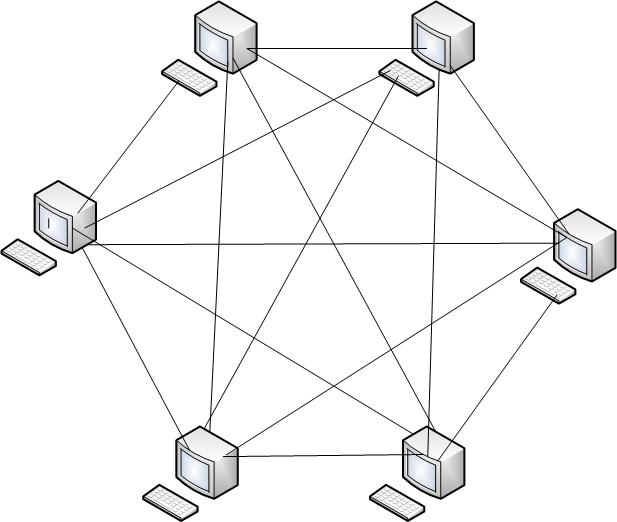
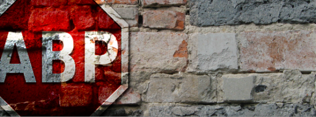
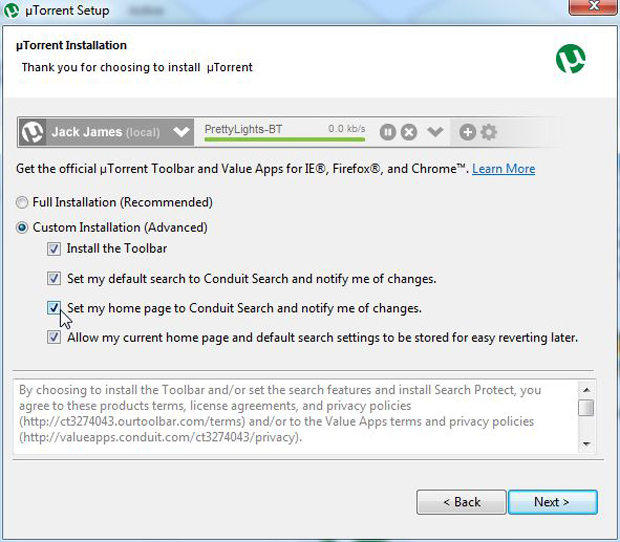
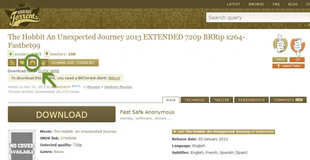
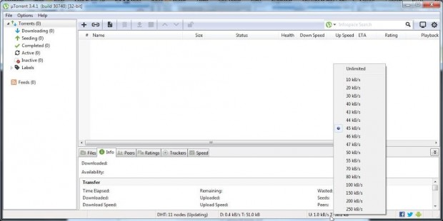
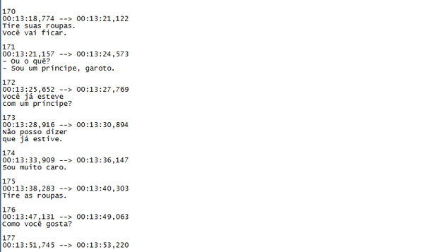

# Como baixar torrent, passo-a-passo

Algumas vezes encontramos pessoas que ainda não sabem fazer download por torrent, e que acham mais fácil preencher um formulário, com informações de cartão de crédito, do que seguir os quatro simples passos necessários para fazer um download por *p2p*.

Torrent é uma [tecnologia *p2p*](http://pt.wikipedia.org/wiki/Peer-to-peer), o que quer dizer *peer to peer*, em que nodos iguais numa rede compartilham arquivos. Isso significa que **o computador baixa pedacinhos daquele conteúdo de outros computadores como o seu**, e, enquanto baixa, e por quanto tempo você mantiver o arquivo no seu cliente de torrent (um programa gratuito que se baixa, tal como o uTorrent, mas há vários), **outras pessoas baixarão pedacinhos daquele conteúdo de você**.

É mais ou menos assim que a coisa funciona

As outras formas de download envolvem uma assimetria em que você, computador cliente, recebe o arquivo de um servidor. Numa rede de iguais, todos são clientes e servidores.

Você pode se perguntar porque baixar torrent, com tanto conteúdo disponível no YouTube ou via sites de streaming como o Netflix. Torrent já é uma tecnologia bastante velha e algumas pessoas consideram o streaming uma grande comodidade — ainda que nem sempre ele não engasgue, não se encontre de tudo, as funções de busca de um momento dentro de um vídeo sejam todas necessariamente lentas –, além de que em alguns casos se precisa pagar, e muito provavelmente navegar por mais de um serviço para atingir o conteúdo que você quer.

A questão é que torrent exige de fato uns 15 minutos de aprendizado, e uma aculturação que pode levar dias. Para quem baixa torrent só uma vez, ou apenas uma meia dúzia de vezes, o custo benefício de sua comodidade versus conteúdo talvez não valha a pena. Mas quando se começa a se aculturar e pensar no longo prazo, de fato o download é bem mais cômodo do que o streaming.

Eu baixo torrents há mais de 10 anos e quase bufo de raiva quando, por acaso, algum conteúdo que quero ver está apenas em streaming (em geral, são só segmentos como [*Funny or Die*](http://www.funnyordie.com/), ou coisas assim). É extremamente incômodo. Quando o vídeo no YouTube é mais longo, eu geralmente uso uma ferramenta para fazer o download na maior qualidade disponível, e assisto depois.

Em certo sentido, o download é um streaming com “[buffer](http://pt.wikipedia.org/wiki/Buffer_(ci%C3%AAncia_da_computa%C3%A7%C3%A3o))” sempre em 100%. A única coisa que a pessoa precisa ter é uma boa disciplina de deletar os arquivos já assistidos e sem interesse duradouro (talk shows, por exemplo, assisto vários, mas não deixo guardado). E pode ter certeza, você vai se deparar com conteúdo que só encontrará em torrent.

Sem dúvida, se gostar de algumas coisas mais obscuras, não encontrará em disco (para comprar em loja, nos piratinhas da rua, eBay, ou… cof… alugar), na TV ou em streaming. Então, o melhor é já se adaptar, enquanto algo melhor não aparece (algumas pessoas dizem que o [Popcorn Time](http://popcorn-time.tv/) é a resposta, embora ele seja uma mistura de tecnologias de streaming e torrent. Pessoalmente, não me convenço, mesmo porque não é só vídeo que eu baixo e, portanto, não posso abandonar o cliente de torrent).

Vou então te guiar pelos passos do mundo do compartilhamento de arquivos entre iguais.

### Primeiro passo | o bloqueador de publicidade

[Baixe um bloqueador de publicidade](https://adblockplus.org/). Isso serve mesmo que não queira usar torrent, apenas para a internet de forma geral ficar mais palatável e, claro, rápida. Se você se sentir mal em não ajudar sites como o Papo de Homem a pagarem suas contas, pode adicioná-los como exceções (embora parte da publicidade nesse site não seja bloqueada pelo software).

A questão com torrent em particular é que **sites como o The Pirate Bay e outros possuem muita publicidade invasiva** (é sua forma de sobreviver), e algumas vezes enganosa, imitando, por exemplo, o botão de download. Então, ao clicar para baixar, vem outra coisa.

Com um bloqueador de publicidade, ficamos livres disso e de muito mais coisas que não precisamos. Vai por mim, se você ainda não usa algo assim, é outra experiência. Vais me agradecer para o resto da vida.

Esses bloqueadores podem vir em vários formatos, desde algo que você instala no seu roteador — e que exige conhecimento técnico — até um simples complemento de navegador, que é o que recomendo (e linkei acima) para quem não quer se complicar muito.

### Segundo Passo | o cliente de torrent

Baixe um cliente de torrent, como o [uTorrent](http://www.utorrent.com/downloads/). **Leia tudo com cuidado durante a instalação, porque ele vai querer que instale complementos desnecessários e invasivos**. No caso do uTorrent, atualmente é um toolbar (uma barra de ferramentas que não se usa nunca) chato — como todo toolbar — invasivo e inofensivo, mas impertinente.

Em uma das telas, peça para customizar a instalação e desmarque as quatro opções. O software não mente e não engana (senão ele não seria distribuído por canais legítimos e amplamente aceito), mas a maioria das pessoas não lê, vai clicando durante a instalação e, assim, se ferra. Esse “vírus” entra por uma falha na pecinha de água e carbono entre a cadeira e a tela, não do computador.

Desmarque essas quatro opções aí

### Terceiro Passo | o site de torrents

Entre num site de torrent, como o [The Pirate Bay](http://thepiratebay.se) ou o [Kick Ass Torrents](http://kickass.to/) e faça uma busca.

Quando escolher algo, deve clicar no link do *link magnet* (geralmente representado com um imã) ou no download do torrent. O torrent não é o conteúdo, mas sim as informações que o seu cliente (no caso o uTorrent) precisa para baixar o seu conteúdo. E o *link magnet* é apenas a informação suficiente para que o cliente baixe o arquivo de torrent e então baixe o conteúdo.

Esses sites ainda estão no ar porque, embora os conteúdos muitas vezes (nem sempre!) violem propriedade intelectual, os *links magnet* e o arquivo torrent não o fazem (nunca!). Eles são apenas “nomes próprios matemáticos”, que identificam inequivocamente um conjunto de informações como sendo ele mesmo e nenhum outro — o que, tecnicamente, é chamado de *hash*, mais algumas informações sobre redes que ajudam a localizar computadores, como o seu — o download é entre iguais –, que contém o arquivo com aquele *hash* (mas isso não quer dizer que o título humanamente legível do torrent não possa se referir a um conteúdo que não tenha nada a ver com ele; mais sobre isso adiante — esse já foi um grande problema das redes *p2p*, mas não é mais há anos).

É aquele ícone lá em cima (pode clicar na imagem para ver maior)

### Quarto Passo | regular as taxas de download e upload

Há a necessidade de regular as taxas de download e upload em seu cliente. No uTorrent, elas estão na barra inferior, e basta clicar e escolher uma velocidade. **Deve-se deixar sua velocidade de upload em menos da metade de sua velocidade de upload total**.

Vá a um site de testes de velocidade e descubra suas velocidades. Repare que o uTorrent as mede em kB/s, e não em “megas” como a publicidade das operadoras faz. Um mega BIT da propaganda da operadora por segundo, 1024, dividido por oito, dá 128 kBYTES/s. Portanto, se você tem 10 megas de download, e um pouco mais de um mega de upload, o seguro é deixar o upload em torno de 50kB/s (e, com 10 “mega de operadora” você baixa entre 1000 e 1200 kilobytes por segundo, isto é ~1,1 megabytes por segundo; o tamanho dos seus arquivos também é medido em bytes, e não em bits, quando você olha na sua pasta).

É ali embaixo, onde diz D e U, na barra de status. Só clicar com o botão direito e abre esse menu de contexto (clique na imagem para ver maior)

Quanto à velocidade de download, essa é a melhor parte: **quando você não estiver usando, deixe em ilimitada, e seus downloads virão na máxima velocidade**. Quando precisar ver algo no YouTube ou quiser que as páginas carreguem prontamente, você reduz para onde fica confortável para você. O ideal é não fechar o uTorrent nunca e, de preferência, nem mesmo desligar o computador enquanto você tem downloads acumulados, o que, no meu caso, é sempre.

Quando você desliga ou fecha o uTorrent, você perde seu lugar na fila e, quando liga novamente, precisa esperar um tempo para a coisa se normalizar de novo. Há uma cultura do torrent que nos pressiona a participar, para bem de toda a rede, 24/7/365. Se não usamos assim, nem conseguimos entender bem o quão rápido, no fundo, é o torrent.

Aqui em casa, tenho um computador dedicado ao download e como media center. Ele fica direto ligado na TV (não tenho TV a cabo desde a década de 90). Se você quer economizar em eletricidade (e ser mais ecológico), use algo como um [Raspberry PI](http://pt.wikipedia.org/wiki/Raspberry_Pi) com um HD externo, embora isso vá exigir a leitura de vários tutoriais na internet, caso sejas menos manjado de informática.

Até aqui, tudo bem.

Mas o diabo está nos detalhes.

### Atenção | ainda sobre a velocidade

A maioria das pessoas acha torrents lentos, mas isso se deve a uma série de fatores.

A velocidade na internet de forma geral (sem considerar torrents) varia selvagemente, mesmo quando se baixa algo de um servidor, não se sabe os gargalos de tráfico que ele porventura encontrará até te encontrar. Por isso, mesmo com sua internet ultrarrápida, **pode acontecer de algum gargalinho imponderável fazer seu serviço de streaming bombadaço simplesmente engasgar**. Ora, a HBO GO (serviço de streaming do canal a cabo americano) acabou de se ferrar com o finale de *True Detective* e o primeiro episódio da nova temporada de *Game of Thrones*!

Mas nem só por excesso de demanda.

No serviço cliente/servidor do seu site de streaming, escalar para momentos de grande demanda é extremamente caro e complicado, e no futuro previsível, sempre veremos problemas. No sistema *p2p*, pelo contrário, quanto maior a escala, mais rápido é para cada um dos *peers*. É um sistema que melhora com a demanda! E isso nos leva ao fator número um que determina a velocidade: **a quantidade de pessoas no “enxame” (swarm), a multidão que está baixando esse mesmo arquivo**. Quanto mais pessoas, potencialmente mais rápido.

Fluido

Porém, considerando torrents, há mais alguns fatores.

Há dois tipos de membros do enxame: os semeadores (seeders) e os sanguessugas (leechers). Você é sanguessuga quando baixa mais do que compartilha (upload). Mas como você evita isso, já que a velocidade de upload modo geral é até 10x inferior a velocidade de download?

Semeando.

O ato de semear é permanecer com o torrent na lista, fazendo upload, mesmo depois de terminar de baixar. Quando se é um semeador e não um sanguessuga, há a preferência na fila para baixar o arquivo e, portanto, seus outros arquivos chegam mais rápido. Ao baixar o arquivo em um site, pode-se verificar quantos semeadores e quantos sanguessugas o arquivo tem e, quanto mais (dos dois números), indica que o arquivo vem mais rápido.

Esses números também indicam a “saúde” do arquivo. Por exemplo, se um arquivo é falso (tem outro conteúdo e não aquele descrito pelo título e pela página do torrent), ele tende a ter mais sanguessugas do que semeadores — porque é claro os semeadores que primeiro baixaram viram isso e apagaram o arquivo. Mas de forma geral, basta passar os olhos pelos comentários do arquivo no site, se houver. Se não há comentários, ou só comentários positivos, e o número de seeders é maior que dez, é boa a chance de não ser um arquivo falso, ou [malware](http://pt.wikipedia.org/wiki/Malware).

Outro fator é o tempo que o cliente está aberto. Torrents são melhores baixados às cegas: se ficar olhando para a lista, vai ficar nervoso. O tempo é muito pouco linear. Pode-se levar horas para entrar na fila de um arquivo com poucos semeadores, mas se após essas horas, por acaso, você entra direto em um semeador com conexão rápida, o arquivo pode vir na máxima velocidade à partir daquele momento.

De fato, o fator imediatismo é o que mais seduz as pessoas ao streaming.

“Já sai tocando”.

Só que, [em termos de economia da atenção](http://www.portalhomem.com.br/especialistas/eduardo-pinheiro/artigos/economia-de-atencao), **deve-se priorizar seus conteúdos**. Então você está lendo um texto com a recomendação de um filme, e vai sair no meio do texto para ver esse filme? No streaming, é preciso fazer uma lista ou colocar nos favoritos. No torrent, enquanto você lê, coloca para baixar e, assim, sempre tem uma pasta com conteúdo priorizado e determinado como relevante. Uma hora você assiste.

Nos dias de hoje, seu tempo vale muito mais do que o conteúdo, e o torrent ajuda, de fato, a valorizá-lo. Logo descobre-se, como eu, deletando conteúdo que você baixou mas descobriu que não era mesmo para perder tempo com aquilo, enquanto que, no streaming, a essa altura, **seu tempo já foi gasto e segue assistindo semi-aleatoriamente a qualquer conteúdo**. O fardo maior fica sempre com o computador, que passou o trabalho de baixar em vão, não com você, que, não desenvolvendo uma prioridade bem estabelecida devido a seu imediatismo, perdeu tempo vendo porcaria.

Além disso, os sites de streaming são, na verdade, lentos. A maioria dos conteúdos chega, algumas vezes, com semanas de atraso em relação à TV ou torrent, em que os programas aparecem cerca de 10 a 15 minutos depois que passaram no país de origem. Então, é preciso repensar esse comodismo e imediatismo, e o que eles verdadeiramente representam, essencialmente, [a exploração comercial da sua deficiência tecnológica](http://papodehomem.com.br/deficientes-tecnologicos-wtf-14/). Você acredita estar economizando tempo com a aparente comodidade mas, na verdade, está se prendendo a um sistema viciado.

### As legendas!

Enfim, de fato muitas vezes não é tão fácil baixar legendas para os arquivos baixados em torrent. Algumas vezes, precisa testar várias, até funcionar.

Legenda do começo do primeiro episódio da nova temporada de Game of Thrones. Não, não contém spoilers (Crédito: legendas.tv)

Eu já perdi muito tempo sincronizando legendas com softwares complicados. Mas, em geral, isso ocorre em conteúdo que você não acha facilmente de outra maneira de toda forma. No conteúdo manjado de todo dia — séries populares de TV e assim por diante –, legendas ruins estão disponíveis no outro dia, e palatáveis, uma semana depois (na televisão, as legendas rápidas de programas que passam com apenas algumas horas de diferença aqui do que nos países de origem, também são uma droga!).

Minha dica é o [XBMC](http://xbmc.org/download/), que procura e baixa as legendas automaticamente **e acerta em 99% dos casos, exceto nos arquivos recentes demais** (como as tais séries que acabaram de passar ou conteúdos para os quais ninguém fez legenda). Ele organiza sua coleção, baixa capas e descrições (em inglês) automaticamente, e é uma interface perfeita para usar [com um controle remoto baratinho](http://www.dx.com/pt/p/wireless-multimedia-infrared-ir-remote-controller-with-usb-receiver-for-pc-2-aaa-34435).

Meu site favorito para baixar legendas, caso você decida por não usar o XBMC, é o [Opensubtitles](http://opensubtitles.org/) (a dica também é ler bem e verificar onde se está clicando: ele é deliberadamente complicado para te vincular em “promoções”, mas depois que você descobre onde clicar, fica bem fácil).

E, apenas para assistir, caso você não queira toda a parafernália do XBMC (que funciona melhor em uma TV grande mesmo, com um computador dedicado na função de media center), e não precise ou tenha as legendas (por ter baixado manualmente ou por elas já estarem incluídas no download principal baseado no torrent), recomendo [o VLC](http://www.videolan.org/vlc/#download), que é leve, simples, toca praticamente tudo e tem uma interface adequada para telas pequenas (só que ele não baixa legendas automaticamente).

### Disclaimer

Baixar e fazer upload (lembre-se que o *p2p* obrigatoriamente envolve fazer upload) de conteúdos protegidos por leis de propriedade intelectual é ilegal em algumas jurisdições, embora hoje em dia — com exceção da Inglaterra e Japão — nem mesmo táticas de medo e exemplos de punição por esses motivos sequer ainda existem (isto é, você não vai receber uma cartinha de seu provedor).

De qualquer modo, todas as tecnologias *p2p* podem ser usadas para baixar conteúdo no domínio público, e, portanto, nada disso que descrevi é inerentemente ilegal, e nem eu recomendo que se cometa ações ilegais de acordo com a sua jurisdição. Porém, como já disse em outro texto, [não considero essa ação imoral](http://papodehomem.com.br/copia-de-arquivos-na-internet-um-raciocinio-em-7-pontos-curtos/). Pelo contrário.

É imoral, por uma série de razões (lobby contra neutralidade da rede e outros nefastos, cartéis de corporações, conteúdo que tende ao menor denominador comum cultural — a tendência da produção cultural patrocinada por corporações a privilegiar o que agrada os bocós das massas), isto sim, assinar serviços de streaming. Assim, você pode se considerar um ativista ao participar da derrocada da cultura enquanto produto.

*Occupy information*.

Devido à demanda (pelo menos na minha própria vida pessoal, não necessariamente dos leitores aqui), escreverei uma segunda parte desse texto com dicas sobre como optimizar buscas em sites de torrent, e como interpretar certas palavras-chave que aparecem junto ao título, como nomes de *releasers*, fonte e qualidade — em video, áudio, software e livros.

Também falarei da relação entre o tamanho dos arquivos, confiabilidade e qualidade, de *trackers* privados e dos arquivos RAR, que para algumas pessoas são obstáculo.
