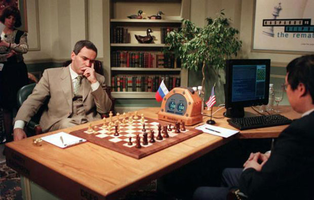
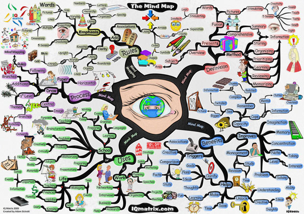
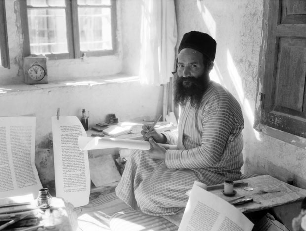

# Como e por que escrevo | WTF #16

Nunca começo com uma página em branco. Escrever envolve tudo que penso ou faço, cada conversa que tenho e, principalmente, a hora do banho ou da caminhada. Ao mesmo tempo em que é um processo criativo e espontâneo, e que utiliza tudo que se apresenta sem grande interferência ou “pesquisa” deliberada, um método particular se mostra, talvez por isso mesmo, necessário.

O método inclui principalmente a tomada de notas e a classificação contínua de informações — não de algo que se pode encontrar na Wikipédia ou de forma geral no Google, ou de informações quaisquer –, mas de “**coisas a olhar com atenção**”. Isso depura o olhar, e a relação com o mundo naturalmente integra a cultura, a expressão e a vida pessoal como uma [Rede de Indra](http://en.wikipedia.org/wiki/Indra%27s_net), cada parte espelhando todas as outras em supersimetria fractal.

A rede de Indra

Com o tempo, grupelhos de ideias de formam e nasce então um texto.

Num dado momento ele pode ou não passar à fase de composição, onde essa estrutura ganha vida. Ela às vezes leva literalmente anos para chegar onde chegou, sendo montada e complementada por todos os inputs, seja por leitura ou qualquer contato cultural que porventura se estabeleça, sem falar de inferências e experiências próprias minhas.

Embora ocasionalmente eu chegue a conclusões relativamente robustas — nunca totalmente irrefutáveis, mas de que dá para ter boas dúvidas se haverá refutação — minhas discussões dificilmente acabam, as tenha com outros ou as tenha comigo mesmo. Novas formas de encarar o problema, exemplos, experimentos de pensamento e mudanças sutis no vocabulário empregado e no espectro semântico nunca param de ocorrer.

Os labirintos bizantinos de sentido e expressão sucessivamente passando da reificação para a fluidez da dúvida, e de volta para algum nível de reificação rearranjados. **Há uma estética na composição textual de qualidade que é matemática e poética simultaneamente**, ondas de significados marmorizados em sentenças cheias de metáforas, analogias, imagens e lógica.

Algumas vezes percebo que os debates que meus textos causam (desde que comecei escrevendo nas BBSs, antes da Internet) estão muito mais ligados, ironicamente, ao fato de surgirem tão armadilhados e já provocadores: o efeito da coação intelectual não é agradável. [Cogência](http://www.dicionarioinformal.com.br/cogente/) normalmente é vivenciada como coação, e, aliás, é psicologicamente normal se achar vítima de uma violência ao reconhecer a derrota por meio de argumentos (a maioria das pessoas, inclusive eu, não assume, ou leva um bom tempo para assumir uma derrota desse tipo).

Creio que tinha um pouco menos de 30 anos quando eu, pela primeira vez, acedi a uma derrota num argumento. Somos todos naturalmente turrões no que diz respeito a reconhecer erros, particularmente os intelectuais, e particularmente depois que nossas emoções foram convocadas.

Garry Kasparov, o primeiro campeão mundial de xadrez a perder uma partida para um computador, em 1997

O leitor que se engaja muitas vezes passa a estudar meu texto como a [Estrela da Morte](http://pt.wikipedia.org/wiki/Estrela_da_Morte), acreditando que ele possua um óbvio, ainda que difícil de atingir, ponto fraco. Pode até ser que tenha, mas o fato é que normalmente me desaponto com as inúmeras coisas ignoradas no ataque, e basicamente “discutir” se torna explicar o texto repetidas vezes.

Não que algumas revisões e ideias para fortalecer o argumento não surjam nesse processo, e um texto nunca é “definitivo” — todos os textos que escrevi e mantenho no computador, desde 1993, são naturalmente revisados todas às vezes que abro algum deles –, mas é extremamente raro encontrar um interlocutor que me faça parar e pensar “esse flanco eu não tinha protegido, como é que eu desarmo isso”, ou menos ainda “será mesmo possível achar uma saída?”.

Normalmente a resposta não leva mais que uns segundos para ser formulada e escrita. O bom texto é agônico e sedutor simultaneamente, queremos refutá-lo porque nos fascina, e vice-versa.

A orientação normal para quem escreve é pensar seu público alvo, visualizar seu leitor. A crítica mais usual a meus textos é que eles são desnecessariamente complexos, às vezes prolixos. O problema é que não tenho interesse em fomentar uma audiência de simplórios, ainda que os ditames comerciais (tenho vontade de rir nervosamente ao escrever isso, porque é uma realidade para qualquer um que lide com um editor e queira ganhar a vida, ainda que parcialmente, com o que escreve) nos levem a escrever para alcançar o maior público possível, e é fato que esse público mais amplo, quando lê, não quer parar para pensar ou pesquisar uma ideia nova a que é exposto.

Normalmente ele quer ler o vocabulário que já conhece, com argumentos que já conhece e, de preferência, o confortando dizendo o que ele já sabe. Algumas vezes textos “tapa na cara” funcionam, mas mesmo nestes casos, o que se vê é o “tapa na cara que se quer levar”, textos que funcionam apertando os botões que já estamos cansados de saber precisam ser apertados, e que no mais das vezes, apenas nos reconfortam no conformismo de que algo está sendo feito: afinal alguém já escreveu, e estamos lendo — mas na verdade nada, além de justificar nossa permanência numa zona de conforto, mesmo quando supostamente a desafia, foi realizado.

Queremos [simulacros de epifania](http://papodehomem.com.br/viciados-em-epifanias-dr-wtf-1/), como *fast food* intelectual. Epifanias de verdade são raras e não são fáceis em qualquer dimensão.

Quanto a eu ser prolixo, aceito essa crítica. É muito mais fácil adicionar texto do que retirar. Ainda assim, minha tendência é pensar um pouco como programador.

Mapas mentais são uma das ferramentas/métodos possíveis (clique na imagem pra ver maior)

Num texto recente tomei o cuidado de qualificar duas palavras com complementos e realmente parei para pensar que se não usasse esses termos, estaria sendo leviano e seria criticado. Mesmo assim, como se tivessem pulado totalmente meus complementos, duas pessoas levantaram as exatas críticas que eu tomei particular cuidado de evitar. Isso não acontece quando programamos, o oposto é mais comum: você erra a sintaxe ou comete algum outro erro e o computador avisa. O “compilador” humano é tão passível de erros quanto o programador, coisa que não acontece tão frequentemente na máquina (ocasionalmente há um erro no compilador!).

Há algumas semelhanças entre escrever argumentos e programar. Há muitas formas de representar um problema e as soluções são também múltiplas. Ao escrever temos que ter cuidado de ter “carregado as bibliotecas”, pelo menos mencionando como estamos usando certos termos, caso contrário o leitor nos refuta pelo simples fato de não saber bem de onde vem nossa terminologia e o quanto ela é respaldada por uma comunidade particular.

Além disso, podemos indicar brevemente velhos argumentos já bem conhecidos, mas os leitores em geral precisam retomá-los. Não podemos assumir que eles sejam conhecidos, mas podemos ser bem breves quando problemas velhos, particularmente problemas sem solução há milênios, estão em jogo. Nesse caso deveria bastar dar o nome do problema.

**O problema é que não somos educados, mundialmente falando, mas também em particular no Brasil**, para apreciar os elementos retóricos e lógicos de um texto. Emoções e raciocínio, num bom texto, são sempre combinadas para produzir um efeito sinergético. Em nossa cultura, a maioria dos textos que lemos, talvez a maior parte de nossas comunicações interpessoais, simula [textos publicitários e de troca comercial](http://www.portalhomem.com.br/especialistas/eduardo-pinheiro/artigos/desconfie-da-leitura-facil): tratam-se de retórica grudenta e leve, com uma mensagem subjacente, ou de venda, no caso de um texto não explicitamente publicitário, que diz apenas algo como “goste de mim”, “partilhe do meu dilema”, ou “partilhe da minha vitória” (nada de errado diretamente com isso, mas há uma quase total ausência de textos desafiadores). E aí que está, por algum motivo entre [Umberto Eco](http://pt.wikipedia.org/wiki/Umberto_Eco) e [Dan Brown](http://pt.wikipedia.org/wiki/Dan_Brown), escrevendo sobre quase os mesmos temas, eu tendo, chamem-me de elitista, a preferir Eco.

Na verdade eu nem sinto a necessidade ou pertinência de explicar porque; parece-me autoevidente quem é o melhor escritor.

*Obs: vi o filme baseado na obra mais vendida de Dan Brown e foram as piores duas horas que passei num cinema em toda minha vida. O livro pode até ser substancialmente melhor que ainda assim seguiria lixo.*

Mas isso tudo é o óbvio: as coisas populares são inferiores porque são massificadas para agradar ao gosto menos refinado e menos educado. Todo mundo já pensou isso, já fez ironia hipster invertendo isso, já postulou e refutou algo parecido. E muitas vezes há algo de adorável no simples, no direto e humano – ninguém nega.

Talvez o mais difícil de tudo seja destilar a profundidade no que apela o mínimo denominador comum e segue apresentando algo original, profundo ou fascinante. Porém, nossa cultura já produz tanta simplicidade artificial, de redução, embasada no fato de que nossas vidas já são demasiado complexas e cheias de informações, que não sabemos se a simplicidade é o destilado supremo ou cachaça barata. Daí que somos metralhados por versões mastigadas e castradas de clichês de telemarketing, como se fossem filosofia, literatura ou os sentimentos pessoais de um “autor”, no caso um simplório que tenta cooptar, através do texto, um igual.

E ai de nós se tentamos outra coisa!

**Escrever é trabalho, também, para gente com algum grau de compulsão**. O texto como discurso até certo ponto engessado, pelo menos o bom texto, é composto em vários níveis simultâneos, os vários leitores se sobrepondo e conversando entre si, com decisões em todos os níveis quanto ao que complementar, o que cortar, como dizer melhor, e o que dizer.

Para desenvolver a escrita, é necessário ler e escrever constantemente — viver a mesa e a tela, verificando construções com repetida atenção; não diferente de um escriba no passado, não diferente de um programador. E o leitor desavisado que se aproxima de um texto feito nesse contexto de compulsão pelas letras, pelo mundo das ideias e relações intertextuais e polissemias aninhadas (e nem entremos [na ironia](http://papodehomem.com.br/ironia-rasteira-e-ironia-tragica-wtf-13/)) adentra numa conversa que começou lá no vasto tecido atemporal da intertextualidade e se refere a ele.

O escriba

Não existem águas rasas na cultura, e os [tigres e espelhos de Borges](http://www.amalgama.blog.br/11/2012/tigres-no-espelho-george-steiner/) nos espreitam a cada vírgula.

 Uma particularidade do meu jeito de escrever é uma espécie de antirretórica: gosto de fazer alguém reconhecer a lógica em algo que deliberadamente faço parecer repulsivo. Normalmente a retórica vai vender a ideia como algo bonitinho, vai tentar puxar a pessoa emocionalmente na direção de aceitar o argumento. Faço o oposto.

Acho isso um recurso estilístico bonito, e quando leio, é o que mais me dá prazer. A ideia é da família da sátira, seria, na verdade, a mais elevada forma de defesa contra a sátira — se ainda alguém escrevesse sátira fora do [Colbert Report](http://pt.wikipedia.org/wiki/The_Colbert_Report). Acho que, num mundo onde a publicidade manda, a antirretórica se torna cheia de caráter: veja só como minha ideia é boa, eu posso expô-la de forma repulsiva, mas você vai ter que aceitar ainda assim.

Mas, novamente, não é leitura fácil (como a ironia, a wit ou a sátira não são), e como a maioria dos que escrevem, do alto do seu trono de proclamadores da cultura, se esforçam em desenvolver aquela leve e simpática humildade, um grau de arrogância ambivalente é o mote e subterfúgio da antirretórica.

Para escrever, precisamos isolamento na prática, mas uma crença quixotesca no poder das palavras em geral e de nossas palavras em particular. Poder de tocar os outros, no sentido de atingir, incomodar, alterar. Mas nenhum escritor, seja de ficção seja ensaísta ou outro, por mais que venda a si próprio como pouca coisa, maldito ou algo assim, funciona sem a megalomania de que a atenção despejada sobre suas ideias na página será significativa para os outros.

Toda a conversa sobre as expectativas de aprovação, ou sobre o leitor imaginário, sobre o supremo outro debruçado sobre nosso texto, e sobre a suposta autenticidade de trabalhar livre de tudo isso, é por si só prova dessa tensão extrema. Podemos tentar evitar os múltiplos olhos de nossos “neurônios-espelho” vislumbrando e dando palpites sobre o que deitamos na página, mas eles, suprimidos ou não, estão lá.

Aqui poderia até invocar os argumentos de [Wittgenstein](http://pt.wikipedia.org/wiki/Ludwig_Wittgenstein) contra a linguagem privada, para indicar que as palavras não tem sentido senão quando compartilhadas… mas no fundo sabemos que o escritor que não é (bem/mal, não importa) reconstruído na leitura por outros simplesmente não chamamos de “escritor”.
