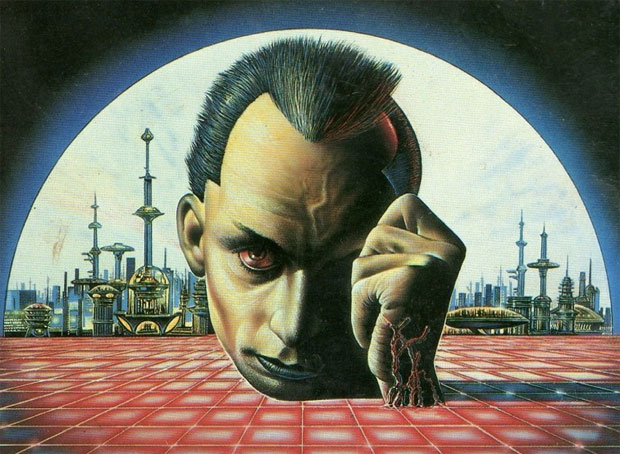

# Cópia de arquivos na internet – um raciocínio em 7 pontos curtos

A questão da cópia de arquivos na internet é muito simples: **se há comunicação privada entre *peers*, não há como impedir a cópia do “trabalho de outros”** – não garantir essa comunicação privada não só é difícil por ser (mais) antiético do que usar o trabalho dos outros, mas, com criptografia, darknets, etc., é também impossível.

Sendo impossível impedir a cópia de material que não se quer ver copiado, esqueça imperativos supostamente éticos por um momento: foquemos na economia – **o trabalho intelectual tem agora menos valor econômico**. Isso é “bom”? Depende.

Nós já tivemos na história muitas épocas e circunstâncias onde não se engajava em trabalho intelectual por remuneração. Em que se poderia até mesmo considerar isso desprezível. Além disso, o trabalho “intelectual” remunerado produz tumores como Justin Bieber e filmes de robôs-carros. Então, em alguns anos acabarão as superproduções blockbusters? Não sei. Isso é desejável ou indesejável? Talvez desejável, mas nem interessa.

O que interessa, para fins dessa discussão, é:

O preço de algo é dado em função da disponibilidade.

É impossível coibir comunicação entre *peers*, e hoje essa comunicação pode envolver, numa questão de dias, gigabytes, terabytes e aumentando exponencialmente, seguindo padrões semelhantes à [lei de Moore](http://eletronicos.hsw.uol.com.br/lei-de-moore.htm). Peter Sunde, um dos fundadores do [Pirate Bay](http://www.thepiratebay.org), disse que os torrents e outros modos *peer to peer* serão logo obsoletos, visto que breve todos os filmes e músicas já produzidos caberão num espaço equivalente a um pen drive, e poderão ser copiados em questão de segundos.

Ninguém se sente antiético por copiar algo sem pagar. E nem deveria, já que:

**a)** não há perda REAL para o criador;  
**b)** a perda SENTIDA, uma frustração de lucros previstos, é uma função do preço, determinada pela disponibilidade (ver item 1);  
**c)** ir contra a vontade ou os sonhos de alguém receber um valor por algo que fez não é antiético. Esse valor é determinado pelo item 1, não pelo sonho da pessoa;  
**d)** é algo que sempre fizemos, ainda que de maneira nunca tão rápida e eficiente, mas sempre fizemos, ao emprestar os meios para os amigos.

Mesmo que alguém se sinta antiético, a ética não determina as relações do mercado.

Atualmente, essa cópia (seja ética ou não) é ilegal, mas, corretamente, é mais ilegal ainda bisbilhotar a conexão entre dois peers. Mesmo que o inverso infelizmente venha a ocorrer (bisbilhotar venha a ser menos ilegal). Lembre do item 2.

Seria romântico pensar que as coisas devam ser de um jeito para só então as coisas funcionarem do jeito que se acha que devem funcionar: as coisas já estão funcionando assim.

Não é errado ou hipócrita, no caso dos criadores, receber o que se é devido em termos de direitos autorais, mesmo considerando (sabendo, acreditando) os itens de 1 a 6. Seria errado perseguir ou processar os “violadores”, só isso.

"A rua encontra seus próprios usos para as coisas." – William Gibson

Resumidamente: eu faço algo, mas quem põe o preço é o mercado, não eu mesmo. O preço de cada cópia (que podem ser feitas quase infinitamente, a preço quase zero), hoje é, portanto, bem menor do que o valor econômico do seu tempo de atenção dado a essa cópia.

A informação bruta é um recurso sem competição – **você não perde informação ao ceder informação para alguém.** Com disponibilidade infinita, o preço de recursos pelos quais não se compete tende a zero. Água é um exemplo de recurso competitivo: se você toma minha água mineral, eu tenho que comprar outra. Com informação bruta, se você copia meus arquivos, nada muda para mim.

Caso o custo de uma produção intelectual fosse um valor intrínseco baseado no custo de produção, DVDs de supreproduções horrendas e fracassadas no cinema custariam muito mais caro do que ótimos filmes baratos de produzir, mas elas estão no balaio. A indústria tenta criar escassez artificial e faz lobby por legislações de propriedade intelectual cada vez mais duras de forma a arrecadar em alguns casos até centenas de vezes o valor investido – dinheiro este que fica com os produtores e outros especuladores, cuja função é apelar para o mínimo denominador comum intelectual e produzir a cultura mais rasa e insossa possível.

Além disso, com o esgotamento dos meios de produzir escassez artificial, as tentativas desesperadas dos últimos dez anos foram bombar as leis de propriedade intelectual ao ponto delas infringirem direitos civis. Essa indústria que produz toda essa mediocridade ainda por cima **quer interferir no direito de passar informação privada e livremente com um igual.** É ultrajante.

Quando Elvis gravou discos, ele foi beneficiado por uma legislação específica e um estado das coisas com relação a cópias (indústria fonográfica) que criou uma bolha de rendimentos absolutamente absurdos para o que devia ser, basicamente, o pagamento de um menestrel. **A realidade distorcida é a em que vivíamos antes, não esta que vivemos agora.** Isto que se passa atualmente está de acordo com a realidade de que a informação pode ser digitalizada e que não custa quase nada replicar dados digitais. Isso só tende a intensificar.

Ao assistir algo que você baixa, portanto, você paga, com sua atenção, muito mais do que o valor de mercado dessa cópia. **Você está sendo, na verdade, extremamente generoso ao assistir e gastar seu tempo com isso.** A primeira cópia, ou pelo menos até a última cópia feita num ambiente de confiança, que não torne o conteúdo público, pode ser precificada de acordo com minha vontade. Uma vez que ela caia no domínio público *de facto*, ela caiu em domínio público.

Não pela lei, mas pela realidade da natureza da cópia.

*(Adaptado de uma conversa com [Daniel Pellizzari](http://www.facebook.com/cabrapreta).)*
