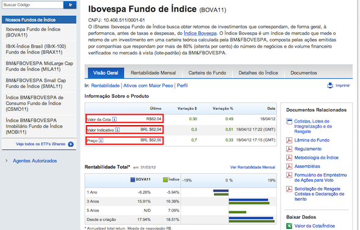
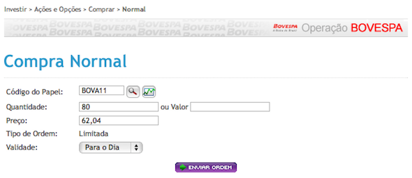

# Passo-a-passo para investir em Fundos de Índice

19/4/2012 *por* Rafael Seabra | [Investimentos](http://queroficarrico.com/blog/category/investimentos/ "Ver todos os posts em Investimentos") [79](http://queroficarrico.com/blog/2012/04/19/passo-a-passo-para-investir-em-fundos-de-indice/#disqus_thread)

Facebook
76
Twitter
32
Google+
2

Ainda pouco difundidos no mercado, os **[fundos de índice](http://queroficarrico.com/blog/2010/12/24/o-que-e-um-fundo-de-indice-etf/ "Fundos de Índice")** (também conhecidos como fundos ETF) ganhando cada vez mais espaço nas carteiras dos investidores. Afinal existe uma série de vantagens que tornam esse ativo interessante.

Ao comprar cotas do **BOVA11**, por exemplo, você está “comprando” dezenas de ações de uma única vez, pagando apenas uma taxa de corretagem e com taxa de administração de apenas 0,54% ao ano.

O objetivo deste artigo é explicar o que é um fundo de índice, quais as principais vantagens e um passo-a-passo explicando como comprar cotas dos fundos disponíveis no mercado.

### O que é um fundo de índice?

**Fundo de índice** (também conhecido como fundo ETF) é um fundo de investimento que busca obter desempenho semelhante à performance de um determinado índice de mercado e, para tanto, sua carteira replica a composição desse índice.

Para saber mais sobre esse investimento e conhecer os principais fundos disponíveis no mercado, recomendo a leitura do artigo “**[O que é um fundo de índice (ETF)?](http://queroficarrico.com/blog/2010/12/24/o-que-e-um-fundo-de-indice-etf/ "O que é um fundo de índice (ETF)")**“.

### Principais vantagens (e desvantagens)

Como citei no começo do texto, quando você compra cotas de um determinado fundo de índice, está investindo de uma só vez em dezenas de ações, pagando uma única taxa de corretagem e uma taxa de administração muito baixa, em se tratando de mercado de ações.

Um dos fundos de índice mais negociados é o BOVA11, que busca obter retornos de investimentos que correspondam, de forma geral, à performance, antes de taxas e despesas, do **Índice Bovespa**.

Este fundo é composto por **69 ações** e tem uma taxa de administração de apenas **0,54% ao ano**.

Por isso tudo, podemos ressaltar várias vantagens desses fundos:

- **Diversificação**: a compra de várias ações numa única operação permite diluir bastante o risco do investimento no mercado de ações.
- **Baixo custo**: além de pagar apenas uma taxa de corretagem, a taxa de administração desses fundos é muito baixa, diminuindo significativamente os custos para investir em ações.
- **Tempo livre**: ao investir nesses fundos, não é mais necessário ficar analisando diversas ações, estudando balanços e pesquisando em fóruns. Basta comprar cotas e o resto fica por conta do administrador do fundo.

Como nem tudo são flores, há também **desvantagens**.

A principal delas é que qualquer venda de cotas desses fundos com lucro **sofre incidência do imposto de renda**.

Enquanto os investidores são **isentos** do imposto de renda quando a soma das suas vendas mensais de **ações** não ultrapassam **R$ 20.000,00**, nos fundos de índice **não há** essa isenção.

Outra desvantagem fica por conta da baixa liquidez da maioria dos fundos ofertados. Enquanto o BOVA11 tem uma quantidade bastante significativa de negociações diárias, os demais ainda são pouco negociados no mercado secundário, dificultando um pouco a compra e venda desses ativos.

Para saber muito mais sobre as vantagens e desvantagens desses fundos, recomendo o artigo “[5 Motivos para Investir em Fundos de Índice (ETFs)](http://hcinvestimentos.com/2011/06/20/5-motivos-para-investir-em-fundos-de-indice-etfs-pibb11-bova11-e-smal11/)“, publicado no excelente HC Investimentos.

### Passo-a-passo para comprar cotas de fundos de índice

Se você já investiu diretamente em ações alguma vez na sua vida, não terá dificuldade alguma. O procedimento é exatamente o mesmo: indica o **código do papel** (ex: BOVA11), a **quantidade** (ex: 70 cotas) e o **preço** que você quer pagar por cada cota.

Entretanto as cotas desses fundos têm uma peculiaridade em relação às ações: o **valor da cota** (divisão do patrimônio do fundos pela quantidade de cotas) pode ser diferente do **preço** cobrado no mercado.

Por isso, antes de fazer sua oferta de compra, é preciso saber quanto está valendo a cota do fundo e só então lançar sua oferta com um valor próximo ao valor da cota.

Para tanto, basta acessar o site do **[iShares](http://br.ishares.com/)** e consultar o fundo que você pretende investir. Vou dar uma exemplo (mais uma vez) com o [BOVA11](http://br.ishares.com/product_info/fund/overview/BOVA11.htm):

Você pode observar que o site apresenta o valor da cota, o valor indicativo e o preço.

O **valor da cota** é calculado diariamente e representa quanto vale cada cota do fundo, baseado na divisão do patrimônio do fundo (valor de mercado de todas as ações da carteira) pela quantidade total de cotas em negociação.

O **valor indicativo** é a sugestão de preço a ser pago pela cota em determinado momento do mercado. Como a valor da cota é determinado pelas ações que compõem a carteira, e a cotação dessas ações varia ao longo do dia, o valor indicativo é calculado a cada 30 segundos durante o horário de funcionamento da bolsa.

O **preço** é quanto custou o último negócio realizado durante o pregão. Se o **preço for igual** ao valor indicativo, a compra foi feita pelo valor justo. Se o **preço for maior**, a compra foi realizada com ágio. Caso contrário, com **deságio**.

Mesmo que você não tenha entendido muito bem, a sugestão é que faça a oferta de compra pelo **valor indicativo**, que é o mais próximo do valor justo a ser pago pela cota.

E para lançar a ordem, como já havia falado, é exatamente o mesmo procedimento para comprar ações, como mostro abaixo:

Basta escolher o papel, a quantidade, o preço e enviar a ordem. Depois é só acompanhar o livro de ofertas e verificar se sua ordem for executada.

### Dúvidas?

Por se tratar de um tema pouco difundido, é natural que existam diversas dúvidas. Caso você tenha alguma dúvida ou consideração a fazer sobre o assunto, **deixe um comentário**.

*Imagem: [FreeDigitalPhotos.net](http://www.freedigitalphotos.net/images/view_photog.php?photogid=2337)*

#### Assine (é grátis)

Cadastre seu email e receba gratuitamente as atualizações do Quero Ficar Rico!
