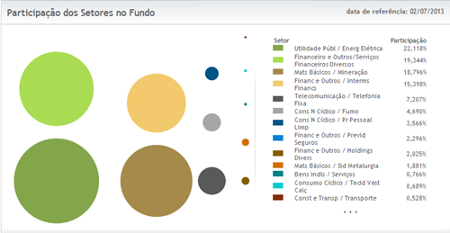

# Conhecendo os fundos de índice (ETF): DIVO11

A participação dos fundos de índice (ETF's) na composição das carteiras de investimento vem crescendo ano a ano - apesar deste ativo ainda ser bastante desconhecido de grande parte dos investidores. Hoje o blog Rico por Acaso apresenta o ETF DIVO11 que replica o índice de dividendos da Bovespa.

**O que é**

Como já foi escrito anteriormente, a função principal do ETF DIVO11 é replicar o índice IDIV da Bovespa que por sua vez é composto pelas empresas que apresentaram os maiores dividend yields nos últimos 24 meses anteriores à formação da carteira.

**Leia também:** **[Conhecendo os fundos de índice (ETF): Small Caps - SMAL11](http://www.ricoporacaso.com/2013/04/conhecendo-os-fundos-de-indice-etf.html)**

**Como adquirir**

O procedimento para a aquisição de cotas do fundo de dividendos é igual ao realizado para a compra de outros fundos, bastando digitar o código do ETF no Homebroker (neste caso o código é DIVO11) e realizar os procedimentos de confirmação da compra. O lote padrão é de 10 "ações".

**Leia também:** **[Como investir em fundos de índice (ETF's)](http://www.ricoporacaso.com/2013/02/como-investir-em-fundos-de-indice-etfs.html)**

**Composição**

Fonte: http://www.bmfbovespa.com.br/etf/ETFDetalhe.aspx?Codigo=DIVO11&idioma=pt-BR

A composição do fundo - como não poderia deixar de ser - está prioritariamente alocada nos setores de serviços públicos (como a energia elétrica, leia-se: Cemig, Coelce etc.) e os setores financeiros (como os bancos) e as empresas de telecomunicações.

Vale lembrar, que apesar das novas regulamentações que recentemente bagunçaram o setor elétrico nem todas as empresas de energia elétrica tem apresentado resultados ruins, o que justifica a elevada alocação de recursos neste setor.

**Leia também:** **[A situação atual do setor elétrico](http://www.ricoporacaso.com/2013/06/a-situacao-atual-do-setor-eletrico.html)**

**Taxas**

Os custos para se investir no fundo DIVO11 são os mesmos de quando investimos em qualquer fundo de ações: taxa de administração e imposto de renda. No caso específico do ETF de dividendos a taxa de administração é de 0,50% ao ano.

Ao contrário do que acontece com as ações individuais (que possuem isenção de imposto de renda em vendas não superiores a R$ 20.000,00), nos fundos esta isenção não ocorre, sendo que os 15% do "leão" serão cobrados em qualquer resgate (independente do valor).

**Resultados**

O fundo DIVO11 vem superando o Ibovespa de forma consistente há alguns anos, exceto no ano de 2007 e 2009. Nos outros anos (de 2006 a 2009) e de 2010 à 2012 o fundo vem "batendo" e muitas vezes superando bem o resultado do índice Bovespa, como veremos a seguir:

- **2006:** DIVO11 (37,3%) / IBOVESPA (32,9%)
- **2007:** DIVO11 (42,6%) / IBOVESPA (43,7%)
- **2008:** DIVO11 (-24,0%) / IBOVESPA (-41,2%)
- **2009:** DIVO11 (55,5%) / IBOVESPA (82,7%)
- **2010:** DIVO11 (11,0%) / IBOVESPA (1,0%)
- **2011:** DIVO11 (14,0%) / IBOVESPA (-18,1%)

Podemos observar nestes resultados que mais uma vez, a diversificação proporcionada pelos ETF's levam à uma maior proteção do patrimônio, pois em diversos anos de crise o fundo se comportou bem melhor que o índice Bovespa como um todo.

**E os dividendos?**

O fundo DIVO11 - a exemplo dos outros fundos do mercado - reaplica os dividendos nas cotas do fundo e portanto, não paga dividendos.

**Conclusão**

Particularmente, o que "mata" este fundo é não pagar dividendos. Evidente que esta é uma caraterística dos fundos de investimento, mas se estamos falando em dividendos o interessante é recebe-los (em conjunto com a valorização do ativo). Apesar dos bons resultados apresentado - **na minha opinião** - falar de boas pagadoras de dividendos e não receber dividendos acaba sendo um grande contra-senso.

Crédito da imagem: http://www.freedigitalphotos.net/
