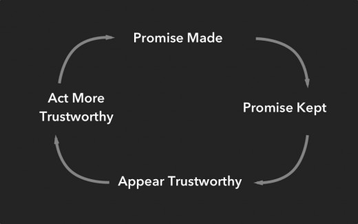
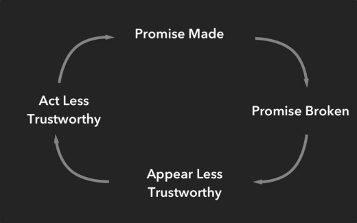
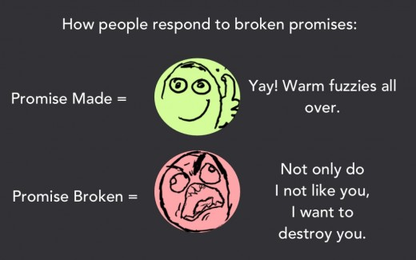

# Why you should always under-promise and over-deliver

*[Andrea Ayres-Deets](https://twitter.com/missafayres) is the Lead Writer at [ooomf](http://ooomf.com/), an invite-only network connecting short-term software projects with handpicked developers and designers. Andrea writes about psychology, creativity, and business over on the [ooomf blog](https://ooomf.com/blog/why-you-should-always-under-promise-and-over-deliver/).*

---

  
*“**Sure boss, I can have that article to you in two hours.”*

That’s an unnaturally short period of time. I knew it, my boss knew it—yet here we were—both agreeing to this farce.

Two hours later I had produced not an article, but random words thrown into a document with some pictures.

I shot him an e-mail with the subject line: *Here! Is this okay?! Can fix if needed…*

Meanwhile, I’d anxiously await his inevitable response: *Are these even words? Rewrite.*

My life was punctuated with moments like these, horrible and painfully unnecessary moments because I was a habitual over-promiser.

Under-promise and over-deliver. A phrase often spoken but rarely explained.

Who wants to under promise? That sounds terrible. Shouldn’t we just over promise and do what we can—it’s the effort that counts, right?

Nope.

Promises date back [thousands](http://www.sciencedirect.com/science/article/pii/S0896627309009003) of years, they represent a complex social norm and when we break them, the consequences extend beyond our control.

Here’s why you should always under-promise and over-deliver.

### Why do we make promises?

Before courts, laws, and complex social systems, we had promises—the assurance that something will be done. Promises are still one of the most important tools we have to help us navigate social encounters.

There are [four](http://psycnet.apa.org/index.cfm?fa=buy.optionToBuy&id=2009-12532-009) reasons that we make promises:

- to create obligation
- to regulate and direct behavior
- to reduce uncertainty
- to build trust

People keep [promises](http://psycnet.apa.org/index.cfm?fa=buy.optionToBuy&id=2009-12532-009) because it helps to build the foundation necessary for maintaining and evolving relationships. The larger the promise, the greater the obligation is to fulfill it.

Big promises create big expectations and when those expectations aren’t met the brain responds by signaling a decrease in [dopamine](http://physiologyonline.physiology.org/content/14/6/249.full) production. When we make a promise and meet or exceed expectations that [signals](http://physiologyonline.physiology.org/content/14/6/249.full) an increase in dopamine production which makes us, and the person(s) we made the promise to, feel good.

Promises also help signal to the outside world our level of trustworthiness.

**Promise Kept:**

**Promise Broken:**

Your brain wants consistency, it needs it. So when someone makes a promise that something will happen, our brain believes that it will, which is quite comforting for the brain.

When a promise isn’t fulfilled, that consistency your brain was counting on disappears. It’s not only a [breach](http://www.sciencedaily.com/releases/2009/06/090630163531.htm) of trust and expectation—it’s a violation of one of the most fundamental social norms that people have. This goes way beyond disappointment, it [alters](http://www.sciencedirect.com/science/journal/00018791/65/2) the way people perceive and interact with us.

**A promise is a [debt](http://www.sciencedaily.com/releases/2009/06/090630163531.htm).**

A [study](http://www.sciencedaily.com/releases/2009/06/090630163531.htm) by Dutch Researcher Manuela Vieth, found that broken promises cause us to want to punish and seek revenge upon the promise breaker. These feelings impact any future interactions between the two parties involved.

### Anatomy of a broken promise

Your brain knows when you are going to break a promise long before you are even willing to admit it to yourself. Researchers in Switzerland [discovered](http://www.sciencedaily.com/releases/2009/12/091209121156.htm) that they could predict who would break a promise based on the brain’s reaction during the three-stage model of promise making.

**Promise Stage**

Let’s say you’ve told your coworkers that you would absolutely, definitely, help them finish a project.

At this initial stage, you haven’t fully decided whether or not you are going to keep or break the promise to your coworkers. Your brain, however, has already registered an emotional conflict because it knows that you don’t really intend on keeping that promise. Because of this, the brain will [activate](http://www.sciencedirect.com/science/article/pii/S0896627309009003) your negative emotional processing centers.

**Anticipation Stage**

Now that you’ve told your coworkers of your promise, you have to wait and see whether or not they will trust you to keep that promise…

The anticipation of their response causes you increased stress, which of course your brain will register. Your brain is already [preparing](http://www.sciencedirect.com/science/article/pii/S0896627309009003) you for possible negative outcomes and future consequences.

**Decision Stage**

You’ve decided to break your promise to your coworkers because you are too busy.

The decision to break a promise promotes a reaction in your brain [similar](http://www.sciencedirect.com/science/article/pii/S0896627309009003) to that of a lie or deception. You’ll feel some guilt and fear over how breaking this promise will affect you. To combat these feelings your brain will remind you of the motivation for breaking the promise by activating your [reward-based](http://www.ncbi.nlm.nih.gov/pubmed/17558276) decision making part of the brain.

### Three ways to help you keep a promise

**1. Ask yourself if the promise is necessary**

You should make a promise out of your genuine desire to follow through, not because you feel an [obligation](http://www.psychologytoday.com/blog/lights-camera-happiness/201005/why-keeping-your-promise-is-good-you) to do so. Consider what you are trying to achieve by making this promise and whether or not it can be obtained by making a smaller, more manageable promise.

*Example:* It’s Wednesday and you are not even close to half-way done with a project, but you promise to have it completed by the end of the week. You make the promise because you want to impress your co-workers, but you’ve forgotten to take into consideration all of the other work you have to do.

Instead of promising to complete the entire project in an unreasonable amount of time, break the project up into sections. Promise to have portions of the project completed by a certain date. This allows you to manage [expectations](http://www.psychologytoday.com/blog/everybody-marries-the-wrong-person/201106/are-lowered-expectations-the-key-happiness) and keep up with the workload. You’re co-workers will still be impressed and you’ll be able to keep your promise. [Double points](http://www.youtube.com/watch?v=x-veP35NHUQ)!

**2. Under-promise**

Estimate how long you *think* it will take you to fulfill the promise and then double or triple that time. If you are not able to answer how long it will take you to complete a task, don’t give an answer. Tell the other person or group that you will get back to them.

*Example:* If an article normally takes me three days to write, I’ll say four just so I have extra time in case part of the process takes longer than planned. If I get it done before the four day period is up, that makes the client happier, it makes me happier. [Everyone wins](http://www.theguardian.com/lifeandstyle/2013/oct/12/happiness-reality-expectations-oliver-burkeman).

**3. Shit happens**

Sometimes we can’t help but break a promise. Be up-front and immediately offer an apology. It makes a difference and will go a long way towards [repairing](http://jom.sagepub.com/content/30/2/165.short) your relationship.

*Example:* Say I promised to have five articles completed by the end of the week but will only successfully complete four. Here’s what I would tell my boss directly: “Because the articles have taken longer than expected, I will have four (rather than five) done by Friday. In order to move fast next time, I’m going to choose topics of a smaller scope.”

I offer the reason—not an excuse—and a solution for how best to avoid this situation from happening the future.

Over-promising always made me feel like I was playing catch up. I’d do a half-assed job just so I could say, “See, it’s technically done…”

When I under promise I’m able to surprise not only those around me but often myself. It gives me the space to do my absolute best and that makes me feel good—that makes me feel proud.

This is about giving yourself momentum. Each time you make good on a promise you will feel that much more confident in your abilities. Every promise fulfilled will help you to associate your name with positivity and trust. Making promises you can keep is instrumental to helping you build and maintain any relationship in life.

[Show 8 comments](#comments)
