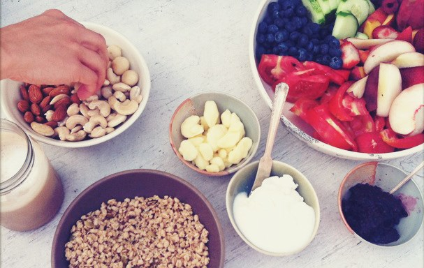

# Como organizar um café-da-manhã gostoso e legal para a sua família

Imagem: Charles Progers

Pessoal, este não é um blog sobre nutrição ou alimentação saudável, mas um blog de organização! Comento isso porque sempre que escrevo um post sobre algo que envolva comida, surgem comentários como “mas isso não é saudável” ou outros parecidos. Não incentivo nenhum dos dois lados. A ideia é sugerir dicas de organização que podem ser aproveitadas pelos leitores ou não. Como cada um se alimenta é uma opção pessoal.

Hoje eu gostaria de dar dicas para quem tem o dia a dia bem corrido e gostaria de desacelerar um pouco no café-da-manhã.

Na nossa casa, pelo menos, as coisas são bem corridas. Não tem muito segredo quanto a isso – tem que acordar um pouco mais cedo e preparar, se esse for o seu desejo. Não dá para deixar muita coisa pronta na noite anterior, mas tem alguns truques para facilitar.

Imagem: No Trash Project

Uma dica que eu sempre dou é deixar uma bandeja tanto na geladeira quanto fora dela com os artigos utilizados no café-da-manhã. Na bandeja da geladeira, por exemplo, você pode deixar o leite, iogurte, margarina, frutas e tudo o mais que for utilizar. Na bandeja que não precisa ser refrigerada, você pode deixar pote de açúcar, pães, canecas, copos, talheres, guardanapos e por aí vai. A ideia é pegar tudo o que você usa no café-da-manhã e deixar essas duas bandejas prontas, para simplesmente levá-las à mesa pela manhã. Você pode prepará-las na noite anterior ou apenas conferir se não está faltando nada.

Se precisar preparar algo, como um omelete, café fresco ou waffles, deixe tudo o que precisa diariamente sempre à mão. Se suas manhãs são muito corridas, considere como opções somente alimentos que não demandem preparo, pois facilitará a sua rotina.

Imagem: Little Black Book Delhi

Você pode fazer, aos finais de semana (ou quando tiver um tempinho), receitas gostosas para o seu café-da-manhã e que duram a semana inteira, como bolos e cookies.

O que cada um vai comer é super, super pessoal. Não vou entrar nesse mérito. =) Em casa, alternamos frutas, pães, frios, bolos, iogurtes, sucos, leite, café. Não vamos muito além do trivial.

Eu valorizo bastante os momentos de alimentação e gosto de ter uma mesa arrumada para comer. Portanto, faça um esforço (se você também gosta) e deixe a toalha posta, os pratos arrumados. Pelo menos a toalha é algo que eu gosto de deixar pronto e faz muita diferença.

Abra as janelas. Não coma no escuro.

Imagem: Travel Rakuten

Se morar com outras pessoas, não discute assuntos sobre a casa e finanças, por exemplo. Essas conversas, por melhor que seja o tom da nossa voz, sempre são associadas a problemas e, quando menos se espera, a gente já começa o nosso dia com preocupações. Vale a pena falar sobre o que se espera do dia que começa e contar notícias agradáveis.

Se não tiver tempo para lavar a louça, deixe para mais tarde. Não faça com pressa, amaldiçoando os pratos sujos. Nada paga a nossa paz.
