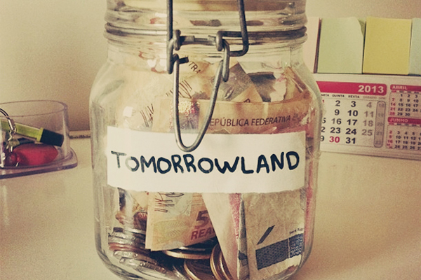
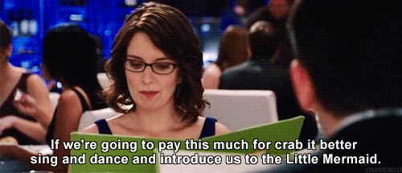
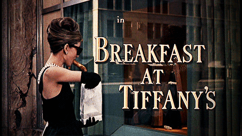
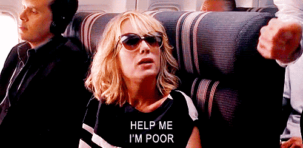
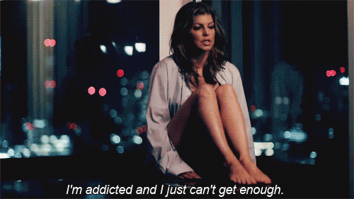
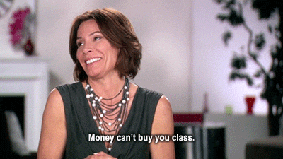

# 5 Hábitos da vida moderna que estão esvaziando sua poupança

Arquivado em [Comportamento](http://fake-doll.com/e-a-vida/ "View all posts in Comportamento")

Você sofre quando não vai a uma festa incrível? Está sempre caçando o lugar mais legal da cidade para passear e faz questão de ser o primeiro a dar “check-in” no local? Bem-vindo à vida moderna! Temos pânico de estar por fora de alguma coisa e queremos sempre ter experiências incríveis para contar para os amigos ou publicar nas redes sociais.

Apesar de parecer um baita incentivo para viver cada dia como se fosse o último, estes costumes custam bem caro para nossos preciosos cofrinhos: **o gasto imediatista é justamente o que está te privando de investir no que realmente importa.**

Toda nossa geração já ouviu economistas explicando como poupar dinheiro, mas ainda assim cai em situações nada inteligentes para o bolso…

*dica: guardar dinheiro só no cofrinho não é uma boa*

**5 HÁBITOS DA VIDA MODERNA QUE ESTÃO ESVAZIANDO SUA POUPANÇA**

**1. A SAIDINHA CASUAL**

Seus amigos querem sair toda semana: jantar fora, aquela balada incrível, o aniversário de fulano num lugar super “exclusivo”. Mesmo sem dinheiro, você acompanha sem pensar duas vezes e diz que merece aquela bebidinha, ou que fulano não vai te perdoar se você não for… Dica: somos insubstituíveis em pouquíssimos lugares, então guarde esta desculpa para quando realmente for verdade.

Durante uma noitada, é bem fácil esquecer do sonho do apartamento próprio e torrar muito mais que o necessário num jantar regado a taças de drinks que custam no mínimo R$20. Só não se esqueça que a ressaca sempre vem, principalmente a moral. Estipule metas e cumpra! Quando você assumir que tem um problema financeiro, provavelmente mais alguém da turma vai “sair do armário” e vai topar dividir o Netflix no sabadão com você.

**2. A VIAGEM ECONÔMICA COM A TURMA**

Você planeja uma viagem econômica com os amigos, mas, chegando lá, o mochilão ganha ares de tour de compras: alguém sempre arrasa nas sacolas ou prefere tomar um táxi para evitar o metrô naquele horário, já que perderam tanto tempo, adivinha aonde? Nas lojas.

Além de passar vontade de giletar o cartão *(quem nunca?!)*, a preguiça é sedutora e os planos de gastar pouco podem ir IOF abaixo. Que tal planejar um dia de compras pra todo mundo e outro de turismo local em horários mais tranquilos? Também não custa nada relembrar qual era o plano original da viagem.

**3. O SHOW DA VIDA**

Aquele festival incrível surgiu e você precisa comprar o ingresso correndo antes que vire o lote e fique ainda mais caro. Na pressa de fazer uma “economiazinha”, muita gente se esquece que já está com a fatura do cartão cheia de letrinhas e que a poupança já foi remexida umas três vezes só esse mês.

Que tal pensar no futuro? Sim, é chato, é péssimo, é quase melancólico saber que aquela banda incrível vai vir para sua cidade e que todos os seus amigos vão. Eu entendo, já tô chorando também. Mas pense pelo lado positivo: nada de lavar tênis com lama, tudo de ver o seu show favorito (muitas vezes transmitido) no conforto do lar, com pipoca em mãos. Às vezes pode até não ser tão ruim…

4.**AS COMPRAS QUE SÃO “INVESTIMENTOS”**

Toda vez que você entra numa livraria boa, não se controla e sai com pelo menos um, ou dois, ou vários títulos na mão, feliz da vida por serem investimentos intelectuais. Sim, livros são investimentos, mesmo! Conhecer novas histórias te ajuda a conhecer a sua própria, auto-ajuda às vezes realmente ajuda e muitas biografias são pratos cheios de informação. Mas se você sempre sai carregada de *chic lits* e ao chegar em casa, todos se acumulam numa pilha de não lidos, hora de pensar duas vezes, não?

O mesmo vale para outros produtos: aquela jaqueta de couro básica em promoção, o pretinho essencial e eterno, o utensílio de cozinha super útil que o Jamie Oliver usa sempre… Se você sobreviveu até o dia de hoje se mantendo informado, vestido e alimentado, sabe que pode continuar sem esse produto. Obviamente, não quero dizer que nenhum luxo é válido; longe de mim! Mas quando a situação não tá para peixe e o cartão não tá pra crédito, é preciso ir devagar, concorda? Os seus limites são só seus e diferentes dos limites do outro, portanto tenha noção disso. Vale usar sempre aquela imagem mental do apartamento/casamento/viagem dos sonhos para se controlar.

**5. O EVENTO DO ANO**

Surge aquela festa bombástica em que você vai ver e ser vista. Poderá fazer contatos. Poderá, quem sabe, até conhecer o amor de sua vida. Uau! Sem pestanejar, você topa pagar absurdos três ou quatro dígitos num vestido para um evento com gente que ainda nem conhece, à bem da verdade. Veja: pode ser que não tenha um solteiro interessante e pode ser que você caia numa mesa cheia de gente com quem não tem praticamente nada em comum. Logo, para que correr o risco?

Antes de parcelar mais um vestido, que tal considerar mandar um whatsapp para as amigas? Nunca se sabe: às vezes alguém tem algo bacana encostado para emprestar! Se o evento não envolver ninguém da sua turma, não pense duas vezes: o empréstimo pode valer bastante a pena.

No fundo, no fundo, tudo é uma questão de planejamento. Agora se você se encontrou em uma – ou mais – situações citadas e fica desesperado e ansioso só de pensar em precisar se conter, talvez seja o caso de procurar ajuda profissional. **Sim, isso também pode custar caro, mas vai te ajudar no futuro, algo que você realmente não está fazendo até agora…**

### Você também poderá gostar de:
