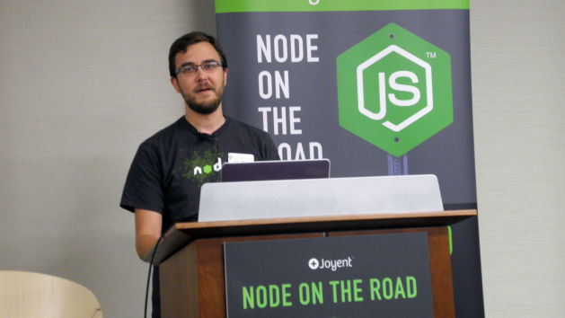

# Why The JavaScript World Is Still Waiting For Node.js 1.0

Node is a little wary of commitment.

Software version numbers seem increasingly passé in these days of continuously updated apps and cloud services, but in some corners of the programmable world, they still matter. A lot.

Take, for instance, [Node.js](http://nodejs.org), the development framework that popularized the use of JavaScript-based Web apps on servers as well as browsers. Node has been on the scene for five years, during which time it's become the go-to tool for JavaScript developers who build messaging tools, game servers, and other real-time applications that require a speedy response from servers.

Node.js project lead TJ Fontaine

While Node isn't exactly an industry standard, [several high-profile websites swear by it](http://nodejs.org/industry/), including LinkedIn, eBay and Uber.

> **See also: [What You Need To Know About Node.js](http://readwrite.com/2013/11/07/what-you-need-to-know-about-nodejs)**

Yet the world is still waiting for Node 1.0. That's the somewhat arbitrary milestone that to many developers (and, perhaps more important, many IT managers) distinguishes experimental, "beta" software from a mature, ready-for-prime-time product. That's no small thing for a software platform like Node, which aspires to be an everyday tool for big business as well as individual developers.

Which is the main reason Node project lead Timothy Fontaine, who goes by "TJ," is in the midst of an intermittent international tour called [Node on the Road](https://www.joyent.com/noderoad). His aim: to convince the business world that even Node 0.10 is ready to handle big tasks—such as, for instance, Walmart.com's massive traffic spike every Black Friday. (Walmart is one of the largest corporations to adopt Node.js so far.)

## On The Road With Node

“That’s part of what this event is about,” Fontaine told a crowd Wednesday night at a Node on the Road event in Washington, D.C. “To highlight production use cases and to show that Node is a thing you can be using on an enterprise level.”

PayPal is one of the companies that bet big on Node as an early adopter. In a blog post late last year, engineer Jeff Harrell explained that the team [slipped Node in as a prototyping platform](https://www.paypal-engineering.com/2013/11/22/node-js-at-paypal/) before deciding to try it out in production. Even then, a separate team built an equivalent application in Java so the company would have something to fall back on should the Node project stumble.

Much to their surprise, the developers managed to build the Node application almost twice as quickly, and with fewer people. In tests against the Java app, Node handled twice as many requests per second and served up pages 35% faster. Node worked out for PayPal, which has since been building all its consumer-facing Web apps using Node.

Advertisement — Continue reading below

> See also: [How Node.js Stays On Track](http://readwrite.com/2014/01/17/nodejs)

During the event, engineers from local DC companies like Capital One and Mapbox talked about how they got their teams to adopt Node. "When we decided on Node in 2010, there were zero Node developers or projects," said [Young Hahn](https://twitter.com/younghahn) of Mapbox. "But I believe you should always bet on JavaScript."

## We're Number 1.0! Just Not Yet

Fontaine, however, can still sound a little defensive when pressed on the question of when, exactly, he expects Node to graduate to 1.0 status.

"I could move the decimal today," he said. "We could call it version 1.10, problem solved. But the last thing we want to have happen to the Node ecosystem is to create a Python 2, Python 3 situation."

That's a reference to a version-related schism involving the Python programming language. Its most recent major update, Python 3, came out in 2008, yet many developers still prefer to work in the incompatible Python 2, which dates back to 2000. Reasons for the split are still [hotly debated](http://alexgaynor.net/2013/dec/30/about-python-3/), although two major factors seem to be the difficulty of migrating to Python 3 and the fact that the language's overseers never wound down Python 2.

Overall, Fontaine is reluctant to announce Node 1.0 until the project is ready to “commit to a version we want to support forever.” In other words, he doesn't want to risk breaking Node by crowning a formal production release too soon.

“1.0 is tricky,” he said. “We can’t just release something and then say, ‘Oh, we’ll just fix it up with version 2.0 next year.’ We don’t want an environment where we create Perl 5 and Perl 6 and then get zero adoption moving forward.” (That's a reference to yet another version issue—in this case, one that [helped stall growth of the scripting language Perl](http://www.fastcolabs.com/3026446/the-fall-of-perl-the-webs-most-promising-language).)

> **See also: [It's Time To Bet Big On Node.js](http://readwrite.com/2014/07/15/bet-big-node-js)**

Until version 1.0, the Node.js project can experiment freely. It's unwilling to commit to a higher version since some people will inevitably use that version forever and will resist moving to news ones.

So before that happens, there are still a few unreliable features that still need fixing, Fontaine said. Simply pulling out those features isn't really an option, because they're widely used. "We have to very cautiously make those decisions because people are depending on Node to be a quality piece of software,” he said.

Instead of 1.0, Fontaine focused on Node's next release, version 0.12, a relatively minor upgrade. “We’re very cautious when we make changes and add features that we’re adding them for the right reasons and fixing the right things,” he said.

*Photo of Timothy Fontaine by Lauren Orsini for ReadWrite*
