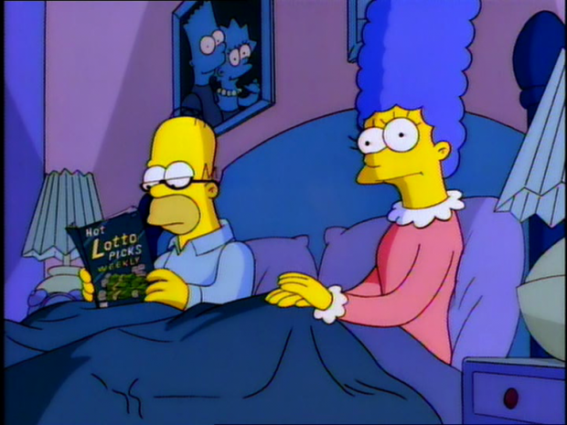

Um dos meus textos mais populares aqui no PapodeHomem é o [“O que ninguém conta sobre morar sozinho”](http://papodehomem.com.br/o-que-ninguem-conta-sobre-morar-sozinho/). Apesar de apresentar muitos detalhes similares – pelo simples fato de se desvincular dos cuidados dos pais – juntar as escovas de dentes tem algumas particularidades que só começamos a entender depois que vivemos essa transição.

Infelizmente, muitas pessoas ficam com medo de abrir alguns detalhes, com medo de estar jogando um balde de água fria num momento importante na vida das pessoas. Conviver é difícil e choques vão acontecer por muito tempo até acostumarem-se.

Eu, dentro da incrível jornada que é a vida, já morei junto, já me separei, já morei junto de novo (até com a mesma pessoa) e assim fui colecionando alguns aprendizados que, sim, adoraria que alguém tivesse me contado quando tomei a decisão pela primeira vez.

O fato é que quando esse dia chega, e os dois lados estão com o julgamento extremamente comprometido pela paixão. Você só consegue pensar naquela pessoa, tudo o que quer é morar junto e acordar sentindo aquele calor na nuca, todas as manhãs. Os pontos negativos são negligenciados e a emoção acaba falando bem mais alto do que a razão.

### 1. Morar junto é como abrir uma empresa

Este é o ponto que o amor oculta logo de início. Morar junto (casando ou não) é como abrir uma empresa e tocar um negócio. A paixão ajuda a manter as coisas mais leves e com um peso menor, mas existem burocracias e pormenores que acabam criando incômodos muitas vezes inevitáveis.

Pode ser uma empresa ou uma rebelião…. dá tudo na mesma.

Tudo isso inclui transparência financeira, cronograma de planos e direcionamentos que o casal pretende tomar. Levei muito tempo para aprender que, sem estes pontos, é muito difícil se guiar em dupla sem medo. Seu parceiro é como um sócio, que apesar de já ter confiado um passo inicial muito importante, precisa e busca por algumas certezas que amenizem o medo de caminhar no escuro.

Por isso, é normal ver conflitos acontecerem quando um membro da relação não entende claramente para onde o outro está caminhando. A comunicação sobre mudança de planos, imprevistos e o andamento do caixa deve ser frequente e sempre bem honesta.

Este é o ponto no qual muita gente se exalta e clama por liberdade, mas é só medo de sentar e lidar com as coisas de forma adulta.

### 2. Seu parceiro só mostra a versão melhorada de quem é

Uma das coisas mais marcantes nesta transição é o choque entre o idealizado e o modelo real.

Quando passamos apenas uma fatia limitada de tempo com uma pessoa, é muito comum ver apenas a parte boa. Sua namorada é doce, sensível e compreensiva porque você normalmente não está perto quando ela perde a cabeça, fica sem paciência e quer ficar deitada na cama, com preguiça de tomar banho e pentear o cabelo. Seu namorado não a visita quando está com aquele calção de goleiro, que já completa o sexto jogo sem lavar. Você acredita que ele é incrivelmente organizado porque ele sempre arruma o apartamento quando você avisa que vai chegar, mas nunca contou que deixou uma fatia de pizza por 2 semanas em cima da mesa da cozinha.

E você pode dizer que passa muitos dias seguidos na casa dela e que nunca viu nada disso acontecer, mas acredite, se tem algo que você não está mostrando, do outro lado acontece a mesma coisa. Ao longo do tempo a resistência cai e tudo se mostra, abrindo espaço para o choque de realidade.

### 3. A relação muda no primeiro dia

Apesar do ponto anterior ser até esperado pelos mais observadores, este me pegou inteiramente de surpresa. É comum ver casais que passam de 3 semanas a 1 mês juntos, um na casa do outro ou em viagens, acreditarem que esta experiência mostra como seria morar junto. Puro engano.

Pensa que dá pra manter essa pose toda por muito tempo?

A partir do momento que entram na casa onde vão morar, não importando se um mudou pra casa do outro ou mudaram juntos para um lugar novo, aquele passa a ser um problema dos dois. Já no primeiro dia, quando os dois sentam e observam todas as caixas e coisas espalhadas pela casa nova, fazendo a lista do que falta comprar e quanto dinheiro ainda tem no banco, as atitudes começam a mudar.

É difícil dizer exatamente o que muda, dada a complexidade de cada relação. Mas é comum comentar sobre esta súbita mudança com casais de amigos que passaram a morar junto e receber uma confirmação de que foi parecido.

Os motivos vão variar bastante. O medo de não conseguir pagar as contas, de estar dando um passo maior que a perna, de ter tomado uma atitude precipitada. E se aquela não for a pessoa certa? E se eu quiser ir para praia com meus amigos sem ela? Será que eu estava pronto? Os medos são muitos e começam a assombrar muito rápido, surge a realização de que qualquer decisão, por menor que seja, terá alguém a ser consultado e essa pessoa possui um altíssimo poder de veto.

Essa pressão, se observada com bastante antecedência pode ser reduzida e transformada em motivo de maior companheirismo entre os dois. É comum, para quem viveu sozinho por muito tempo, se retrair e  assumir seus medos como um problema individual, ao invés de dividir os medos e encarar a situação em dupla, como um inimigo comum.

### 4. A individualidade existe e deve ser preservada

Eu sei, falei um monte sobre como o casal se torna uma entidade e que divide todas as decisões sobre o andamento do time, mas existe um problema:

Você não se apaixonou por uma cópia de você e isso pode ficar evidente o tempo todo.

Ao morar junto, vários traços da nossa personalidade passam a ser omitidos em detrimento da vida conjugada. Você gosta de jogar futebol nas terças à noite, mas não gosta de deixar sua namorada sozinha em casa. Você gostava de treinar Muay Thai, mas agora seu namorado fica em casa vendo TV e você prefere ficar esse tempo com ele.

No começo, tudo isso parece atitude de um casal unido, sacrificando seus passatempos preferidos para ficar mais tempo um com o outro. Parece funcionar, até o momento em que ambos perdem suas características mais marcantes.

O casal vai se tornando cada vez mais dependente da presença do outro, o que antes era um cessão voluntária passa a se tornar uma obrigação. Esse comportamento vai se estendendo até o momento em que nenhum dos dois faz mais nada sozinho, a não ser trabalhar. E se algum dos dois trabalha em casa, é pior ainda. Daí em diante um vira uma cópia do outro e começa a se perceber num caminho bem entendiante, praticamente sem saída.

Evitar este ciclo é um exercício constante. Saber quando exigir, e também respeitar a individualidade ajuda não apenas a movimentar o cotidiano, mas a manter o assuntos variados.

Caso contrário, a pessoa interessante que você conheceu pode estar com os dias contados.

### 5. Saiba existir em silêncio

Existe algo muito ruim e que afeta demais a forma que o casal interage diariamente. Por muito tempo sofri do que acredito ser um mal e em conversas vejo amigos reclamarem com bastante frequência. Existe uma dificuldade em estar junto, no mesmo cômodo sem interagir.

Há uma inquietude em ver a outra pessoa calada, focada em alguma atividade. A insegurança bate, o medo e as aflições começam a falar mais alto. *“Sera que fiz algo?”*, *“Por que ele está tão calado?”*, *“Será que está chateado com alguma coisa?”*.

Da faísca surgem os questionamentos: *“Está tudo bem?”*, *“Por que você está tão calado?”*.

Assim, o casal desaprende que ficar em silêncio e cuidar das coisas da vida faz parte, que não precisam conversar o tempo todo, retomando a fagulha de atenção. Que este tipo de situação vai ficar cada vez mais comum, e a ausência de toque e fala, não significa que estão se distanciando. Apenas que estão cada vez mais à vontade na presença do outro.

\* \* \*

Tudo o que falei até aqui não quer dizer que a experiência de compartilhar um lar seja intrinsecamente negativa, mas são pontos que, acredito, devem ser observados e contornados sem pânico.

Importante aceitar que cada um vem de um lugar diferente, com costumes, hábitos e preocupação que às vezes podem ser conflitantes. Seu marido pode lavar louça de uma forma que não é costumeira pra você, assim como sua esposa pode guardar coisas com uma lógica que você não compreende.

O choque de pequenas diferenças vai se tornando um problema com o tempo e a convivência, caso não entendam – e aceitem – que as diferenças fazem parte do que torna a parceria tão interessante.

### Para ler mais

*Esse texto faz parte de uma série sobre moradia e convivência, feita pelo Alberto Brandão. Se quiser ver o que mais já foi dito sobre o tema, aqui vão os links:*

- *[O que ninguém conta sobre morar sozinho](http://papodehomem.com.br/o-que-ninguem-conta-sobre-morar-sozinho/)*
- *[O que ninguém conta sobre morar sozinho – Parte II](http://papodehomem.com.br/o-que-ninguem-conta-sobre-morar-sozinho-parte-2/)*
- *[Fazendo miojo com água do chuveiro & outras histórias bem pessoais sobre morar sozinho](http://papodehomem.com.br/fazendo-miojo-com-agua-do-chuveiro-outras-historias-bem-pessoais-sobre-morar-sozinho/)*

  
por Alberto Brandão  
  
[[anexo ausente]](http://pubads.g.doubleclick.net/gampad/jump?iu=1051165/PdH_Feed_superbanner/leaderboard&amp;sz=728x90&amp;c=451020031) [anexo ausente]  
  
  
[[anexo ausente]](http://da.feedsportal.com/r/204366887142/u/49/f/530922/c/32911/s/3dd0d9be/sc/19/rc/1/rc.htm)  
[[anexo ausente]](http://da.feedsportal.com/r/204366887142/u/49/f/530922/c/32911/s/3dd0d9be/sc/19/rc/2/rc.htm)  
[[anexo ausente]](http://da.feedsportal.com/r/204366887142/u/49/f/530922/c/32911/s/3dd0d9be/sc/19/rc/3/rc.htm)  
  
[[anexo ausente]](http://da.feedsportal.com/r/204366887142/u/49/f/530922/c/32911/s/3dd0d9be/sc/19/a2.htm)[anexo ausente]

[[anexo ausente]](http://feeds.feedburner.com/~ff/PapodehomemLifestyleMagazine?a=KXavI72P5mk:VDeiXRn8O4w:yIl2AUoC8zA) [[anexo ausente]](http://feeds.feedburner.com/~ff/PapodehomemLifestyleMagazine?a=KXavI72P5mk:VDeiXRn8O4w:D7DqB2pKExk) [[anexo ausente]](http://feeds.feedburner.com/~ff/PapodehomemLifestyleMagazine?a=KXavI72P5mk:VDeiXRn8O4w:qj6IDK7rITs) [[anexo ausente]](http://feeds.feedburner.com/~ff/PapodehomemLifestyleMagazine?a=KXavI72P5mk:VDeiXRn8O4w:-BTjWOF_DHI)

[anexo ausente]
