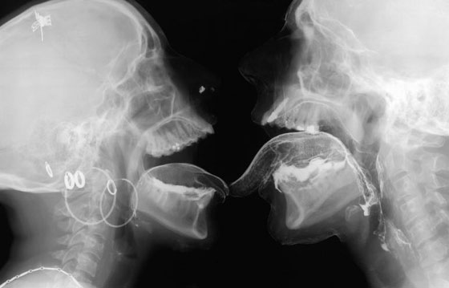

Você chega em casa e abre o computador. Acessa a internet, olha o Facebook, e vai pra um site qualquer, um desses de filmes pornôs. Escolhe o vídeo que tem a imagem mais interessante, bate uma, toma uma água e liga a TV… Normal. Inofensivo. Muitos diriam: saudável.

Mais um dia. Você chega em casa, vai pro computador, acessa a internet e, desta vez, clica em uma dessas reportagens que aparece na timeline. Na imagem que chama para o texto, destaque para uma mulher americana de meia idade: o nome dela é Shelley Lubben.

Bastante revoltada, ela fala de garotas que, durante a gravação de pornôs, foram forçadas a fazer o que não queriam. A reportagem mostra vídeos de mulheres chorando de dor, enquanto os parceiros de atuação não param de meter e machucá-las. Em seguida, ela fala sobre dados de atores e atrizes que morreram de AIDS – afinal, não é aceitável gravar pornô usando preservativos. Shelley mostra também a lista das muitas atrizes que se suicidaram por depressão ou morreram de overdose.

Para ela, tudo isso é reflexo de uma indústria pornô hardcore que vitimiza e danifica permanentemente aqueles que fazem parte dela.

Inclusive ela mesma.

Shelley atuava em pornôs nos anos 90. Depois de ser expulsa de casa e ir trabalhar em uma boate de *strip*, viu nos filmes uma oportunidade de ganhar mais dinheiro e dar uma boa vida à filha pequena.

Durante os 4 anos de carreira, sofreu agressões. Chegou a perder metade do útero por um câncer causado pelo HPV. Mesmo assim, a atriz só largou a indústria quando contraiu herpes e teve grandes problemas de saúde por que esta se espalhou pelo resto do corpo. Se enxergou alcoólatra e só deu uma guinada na vida pessoal ao casar com um filho de pastor e construir a família tradicional com que sempre sonhou.

Hoje é presidente da [Pink Cross Foundation](https://www.thepinkcross.org/), organização voltada para os trabalhadores do pornô americano, acusa a indústria pornográfica de realizar tráfico sexual e acobertar estupros, além de exibir alguns deles na íntegra.

Eu a conheci clicando em um destes links, e fiquei com isso na cabeça. Ela te mostra uma lado tão feio e tão perturbador do pornô que fica difícil navegar pelos sites ou pensar em assistir aos filmes da mesma maneira. Todas as vezes em que um cara apertar o pescoço da garota, você pensará: *“Será que isso é uma expressão de tesão ou de dor? Será que nós, espectadores voyeristas, continuamos consumindo porque é justamente a dor alheia que alimenta o nosso prazer? Será que eu tô contribuindo e sendo conivente com a destruição da vida de algumas dessas pessoas?”*

Trabalhando na TV USP, eles me deram a liberdade de fazer uma reportagem sobre o assunto. Afinal, será que no Brasil é assim também? Será que os mesmos problemas da maior indústria pornográfica do mundo também são problemas aqui, na nossa pequena fábrica de pornôs?

Eu fui atrás da Shelley Lubben, de algumas atrizes brasileiras e de mais um monte de gente interessante pra falar sobre o assunto. Foram poucos os que toparam me dar entrevista. O vídeo a seguir, uma reportagem feita e exibida pela TV USP, é o resultado dessa busca.

[Link Youtube](https://www.youtube.com/watch?v=hIok-mr12P0)

No Brasil, a indústria pornô não reserva luxos.

Apesar de ser um diretor (e representar a figura do “acusado”), Valter não teve cerimônias em se abrir. Contou sobre os pagamentos miseráveis, sobre as garotas que topam fazer de tudo sem questionar, porque precisam de dinheiro a qualquer custo. O diretor falou ainda sobre a prostituição que anda de mãos dadas com o estrelato na indústria dos filmes. *“Há 20 anos, uma atriz entrava num set de filmagem e saia com dinheiro pra comprar um carro novo. Hoje, o dinheiro só dá pra pagar as contas.”*

Não é por acaso, portanto, que os entrevistados foram unânimes em afirmar que quase todas as atrizes brasileiras do gênero trabalham como garotas de programa. *“Eles me veem num vídeo e aí ligam porque querem sair com aquela mulher do filme”*, explicou Patrícia.

A atriz, aliás, foi outra que também conversou conosco sem pudores. Falou dos problemas que teve com algumas produtoras que agem de maneira abusiva, mas deixou igualmente claro que tinha outras opções na vida. Não era de família rica, nem de classe média alta, mas dava aulas de inglês e queria fazer um curso universitário de secretariado. Mesmo assim, escolheu a indústria do sexo: se identificou com a profissão, se sentiu bem sendo desejada, recebendo atenção e não reclama do dinheiro que a atividade rende.

No final das entrevistas, depois de apresentarem todos os problemas, ambos sorriram e explicaram, de maneira bem semelhante, por que continuam na área – a repulsa à rotina de bater cartão e trabalhar de 8h às 18h.

Patrícia disse: *“Eu não trocaria pra trabalhar em uma outra coisa, numa dessas salas fechadas…”* No dia de sua conversa, Valter, depois de explanar todos os problemas pelos quais as atrizes passam, completou: *“É… ainda assim, é bem melhor que trabalhar em escritório, né?”*.

### Elas estão fingindo

Patrícia garante que gosta da profissão e que até sente prazer em algumas cenas. Por sua vez, Shelley não acredita que seja possível ter prazer fazendo filmes. Shelley é enfática.

*“Elas estão atuando! Elas são atrizes, tudo que elas fazem é atuar. – Ahhhhhh eu adooooro. Ahhh eu amo! – MENTIRA!”.*

E o desejo e as referências a sexo que vemos na vida das profissionais mesmo quando estão fora das telas – no Twitter por exemplo? Shelley diz que as atrizes precisam se vender como personagens que vivem pro sexo mesmo na vida real, e por isso nunca saem por completo de seus papéis.

Na visão da ex-atriz, a degradação psicológica e a pressão causada pelos desempenhos humilhantes e fisicamente difíceis obriga as garotas a recorrerem ao álcool e às drogas. *“Você quer saber se uma estrela pornô é feliz mesmo? Então não escute o que ela diz, só olhe pra vida real dela: indo e voltando de clínicas de reabilitação, flagrada bêbada chorando, perdendo a guarda de seus filhos num tribunal”*.

Com essas situações em mente, a ativista não quer apenas que sejam garantidos direitos básicos e segurança aos profissionais que trabalham com filmes. Ela quer o fim da indústria pornô. *“Shelley tem muita razão em algumas coisas que diz, mas é uma fanática religiosa. Esse é o problema dela”*, diz Valter, católico praticante. Fanática ou não, fizemos o teste que ela propôs: olhamos para a vida real de Patrícia.

Em uma conversa informal, ela contou sobre a relação com a família. Sua mãe e seus irmãos sabem da sua carreira: *“minha mãe não deixou de me apoiar”*. Nos dias de lazer vive normalmente, conta histórias corriqueiras da sua relação com a família, como ir em quermesse de igreja na época das festas juninas. Ela conta que alguns garotos e homens a reconhecem. Quando está em família, pede pra eles respeitarem seu momento.

Apesar de demonstrar que é possível viver de sexo sem ser emocionalmente demolida, Patrícia sabe que sua situação não é a de uma atriz qualquer. Ela tem nome, fama e 10 anos de carreira. Para as novatas, é muito mais difícil impôr respeito. E essa é a grande diferença.

### Meu corpo, minhas regras

Ainda que aquela garota de que você gosta aceite ir ao motel contigo, isso não significa que você pode fazer o que quiser com ela. Mas por que ainda soa estranho ouvir que uma atriz pornô se recusou a fazer sexo anal? E que ela não aceitou apanhar durante uma cena? Ou, em um exemplo mais severo, classificar como estupro o desrespeito a qualquer um desses limites?

Decidir sobre como dispor do próprio corpo é um direito básico de cada um de nós – incluindo as atrizes pornôs e as prostitutas. A impressão de glamour que envolve algumas superproduções faz parecer que todas as garotas são bem tratadas, pagas e protegidas como se deve, mas ainda que o pagamento que ambos os tipos de trabalhadoras do sexo seja relevante, isso não é algo que tire delas a garantia à integridade física e psicológica.

E apesar do foco dessa reportagem recair sobre a questão da mulher na indústria do pornô, isso não quer dizer que são só elas que sofrem. Muitos atores são constantemente submetidos a injeções e remédios para manterem ereção por um período que a natureza não permitiria. Os atores homens, inclusive, são as maiores vítimas da Aids no universo pornô.

### Camisinha: usar ou não usar?

A proteção é uma peça chave na discussão sobre o respeito e segurança dos profissionais do sexo. Aqui no Brasil, depois de alguns anos de pressão do Ministério da Saúde, a maioria dos filmes são gravados com preservativo – mas muitos empresários da pornografia alegam que esse modelo não é rentável.

Produtores americanos acreditam que não é isso que o público quer ver e, por isso, garantem que os consumidores não compram filmes do tipo. Shelley rebate dizendo que são os produtores que determinam o que o público vai assistir: se só houver filmes com preservativos, os espectadores só assistirão a filmes com preservativos. E não adianta ficarmos alheios à discussão, pois a decisão dos EUA afeta o mundo todo. Os filmes gravados “para exportação” aqui no país, por exemplo, também são gravados sem preservativo.

Atualmente, as produtoras dos Estados Unidos estão sendo pressionadas a aderir ao uso de camisinha por causa da [Medida B, lei aprovada no Estado da Califórnia](http://www1.folha.uol.com.br/ilustrada/2014/08/1498377-exigencia-de-camisinha-pode-representar-fim-da-industria-porno-na-california.shtml?cmpid=%22facefolha%22), coração da indústria pornográfica.

A legislação trabalhista americana já determinava que empresas que submetam profissionais a entrar em contato com fluídos potencialmente contaminantes devem fornecer e aplicar toda a proteção necessária, mas a nova regra especifica que atores e atrizes pornôs estão inseridos nessa legislação.

Para evitar que a camisinha seja obrigatória, as produtoras recorreram à primeira emenda da Constituição americana: acusam a medida B de interferir na liberdade de expressão artística de seus contratados.

Parece muito razoável exigir o uso de preservativos na gravação de filmes. Mas para dimensionar a polêmica, é importante lembrar que a proteção não seria apenas no momento da penetração: de acordo com a Medida B, homens e mulheres deveriam usar camisinhas masculinas ou femininas no sexo oral também.

Pense consigo. Se usar uma camisinha feminina para fazer um sexo oral numa mulher não é algo que normalmente se pratica na vida real, será que a prática deveria mesmo ser obrigatória nos vídeos? Ou seria uma prova de que usar camisinha, não importa em que circunstância, pode ser excitante? É parte da função de um filme pornô participar de um processo educativo para mudar nosso hábito e cultura?

### Que outro pornô é possível?

Quantos clichês você vê numa só imagem?

Se como espectadores nós encaramos a questão da segurança, as agressões, cenas extremas e a falta de reconhecimento dos direitos como parte da causa dos danos que podemos perceber entre os membros e ex-membros da indústria pornográfica, também precisamos entrar no debate.

Ao contrário do que pensa Shelley, que quer acabar de vez com os pornôs, eu acredito que a solução não é eliminar os filmes, e sim, a violência e as opressões cometidas dentro de um *set*.

> “O pornô é um microcosmos do mundo em que a gente vive. O que se vê nos filmes é o que se vê no mercado. É como a marca de cerveja competindo pra ver quem faz o comercial mais babaca. Um diretor faz um filme de anal, aí vai o outro e tem que fazer o super super anal e assim por diante…” –Valter

> “Não dá pra voltar pro pornô arroz com feijão. (…) Elas usam álcool e drogas porque sabem que não dá pra cumprir certas exigências sóbrias.” –Shelley

Tanto na fala da Shelley quanto na do Valter pode-se perceber a falta de perspectivas que amenizem o problema. Os dois falam sobre a competição cada vez mais agressiva e mais distante do sexo comum: é a cultura do sexo hardcore. As orgias têm que ser cada vez mais numerosas; o *freak*, cada vez mais *freak*; e assim o sexo “comum” se torna cada vez menos atrativo comercialmente e, portanto, inviável.

Diretor das antigas, Valter critica a estrutura comum, não concorda com o modelo de produção atual e tem saudades da época em que os filmes eram mais eróticos, mais únicos e feitos em escala menor. *“Se você for observar, os filmes seguem todos uma mesma estrutura, 4, 5 posições, ângulos de câmera muito parecidos, e até o ponto de corte chega a ser o mesmo”*. Será que não é mesmo possível apostar em um modelo que não seja esse?

Será que não é possível fazer um filme que excite, que instigue, sem machucar? A maior parte da indústria pornô atende determinados grupos de homens héteros e outros grupos de homens gays. E digo ‘determinados grupos’ porque nem todos os homens héteros tem como fetiche ver mulheres com um padrão de beleza questionável, gemendo de maneira mais questionável ainda. Nem todos os homens héteros ou gays acham que os filmes com aquele sexo exagerado e tão claramente atuado é o que se pode ter de melhor num filme pornô.

Que tal pensar em algo que possa valorizar mais o casal, em que a interação e fetiches sejam mútuos e não levem em conta só o prazer masculino? E se fossem produzidos filmes em que o homem também seja objeto de prazer (não necessariamente voltados para o público gay)? Será que não é possível que o público lésbico seja de fato atendido, sem ficar refém do pornô em que duas mulheres se tocam com o claro objetivo de satisfação hétero-masculina?

Há até um vídeo em que [garotas homo fazem comentários](https://www.youtube.com/watch?v=PJvYprLDcRs) sobre o pornô lésbico main stream:

[Link Youtube](https://www.youtube.com/watch?v=PJvYprLDcRs) | *“Seis dedos? Pra que tantos? Lésbicas nem gostam tanto de penetração assim, e muitas ainda tem hímen”*, *“E agora a outra menina ta enfiando o salto do sapato na vagina dela!”*

É possível encontrar filmes e produtoras alternativas, claro, mas ainda em uma quantidade muito pequena, com dificuldade para se manter e, por muitas vezes, com custo acima do pornô comum. Se você não é uma pessoa que se sente plenamente atendida pelo modelo atual e resolver procurar outro tipo, muito provavelmente vai levar três vezes mais tempo buscando um vídeo do que se masturbando.

Uma das alternativas atuais é o site “[Make Love, Not Porn](https://makelovenotporn.tv/)”. Criado por [Cindy Gallop](https://twitter.com/cindygallop), pessoa chave na briga por novos modelos de pornô, o site tenta trazer o sexo da vida real para as telas. A criadora incentiva que casais normais façam filmes amadores reais e forneçam esse material para o site. Os visitantes pagam um taxa para assistir ao vídeo por um período determinado (algo em torno de US$5 por 3 semanas) e os usuários que fizeram a filmagem ganham metade dos lucros que o filme arrecadar.

No Brasil, a [X-Plastic](http://www.xplastic.net/) tem um trabalho relevante – até por ser a única grande produtora de pornô alternativo. Fundada por três integrantes de uma banda de rock, tem nas músicas um forte atrativo, assim como a inspiração na pornochanchada. A fotografia bem cuidada também chama atenção, e as garotas fazem o estilo de pin-ups modernas: tatuadas, com corpo natural e cabelos cuidadosamente diferentes (Patrícia Kimberly, nossa entrevistada, é uma das profissionais que gravam com a X-Plastic).

Alt Porn ou amador. Gonzo ou super produção. Tapas, apertões, puxadas de cabelo… Orgias, vários homens e uma só mulher… todas essas opções podem ser muito excitantes e não têm nada de errado, mas pra isso, é preciso que os envolvidos estejam gostando. Sentir prazer com algum desses tipos de interação é diferente de sentir prazer vendo uma mulher gritar aflita porque a penetração em grupo, os tapas, os puxões estão doendo sem lhe dar nenhum prazer.

Acredito que o ponto não é criar uma cartilha de “pode” e “não pode” dentro do pornô. A intenção desse texto, inclusive, é levantar o questionamento sobre os padrões que temos hoje. Creio que seja preciso encontrar um ponto de equilíbrio que garanta o bem estar dos profissionais, seja economicamente rentável e que, ao mesmo tempo, não criminalize as práticas sexuais de alguém.

O sexo agressivo não é, necessariamente, errado. O sexo com abuso é.

Como a Patrícia disse pra gente: “Enquanto eu estiver gostando e enquanto eu estiver tendo prazer, tudo vale.”

  
 por Gabriella Feola  
  
  [[anexo ausente]](http://pubads.g.doubleclick.net/gampad/jump?iu=1051165/PdH_Feed_superbanner/leaderboard&sz=728x90&c=1161379618) [anexo ausente]  
  
  
[[anexo ausente]](http://da.feedsportal.com/r/204366938112/u/49/f/530922/c/32911/s/3de29b8b/sc/19/rc/1/rc.htm)  
[[anexo ausente]](http://da.feedsportal.com/r/204366938112/u/49/f/530922/c/32911/s/3de29b8b/sc/19/rc/2/rc.htm)  
[[anexo ausente]](http://da.feedsportal.com/r/204366938112/u/49/f/530922/c/32911/s/3de29b8b/sc/19/rc/3/rc.htm)  
  
[[anexo ausente]](http://da.feedsportal.com/r/204366938112/u/49/f/530922/c/32911/s/3de29b8b/sc/19/a2.htm)[anexo ausente]

[[anexo ausente]](http://feeds.feedburner.com/~ff/PapodehomemLifestyleMagazine?a=YUOdYWZDLFw:v6Peuf6WJ8A:yIl2AUoC8zA)  [[anexo ausente]](http://feeds.feedburner.com/~ff/PapodehomemLifestyleMagazine?a=YUOdYWZDLFw:v6Peuf6WJ8A:qj6IDK7rITs) [[anexo ausente]](http://feeds.feedburner.com/~ff/PapodehomemLifestyleMagazine?a=YUOdYWZDLFw:v6Peuf6WJ8A:-BTjWOF_DHI)

[anexo ausente]
