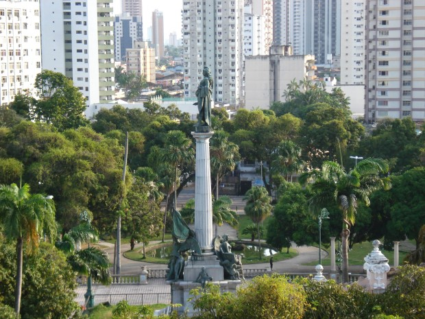
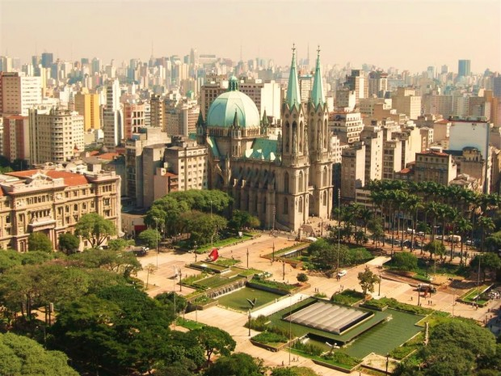
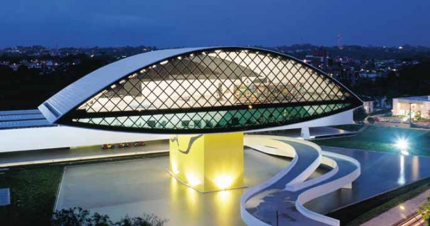
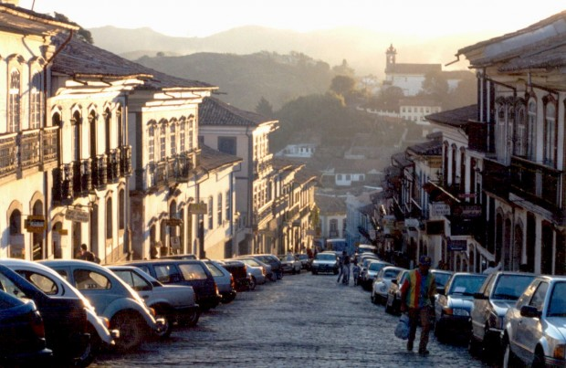

> “Deveríamos nos ver como antropólogos de quintal, investigando as mentes desconhecidas pelas quais passamos todos os dias – ou conhecemos no casamento de um vizinho –, descobrindo a sabedoria dentro da cabeça de outras pessoas e criando pontes de compreensão mútua.
>
> Você poderia iniciar uma conversa com a mulher que trabalha na oficina de bicicleta e descobrir que ela é uma bahaísta. Poderia se candidatar a fazer trabalho voluntário no centro de apoio a refugiados local e conhecer seu primeiro médico congolês, ou hospedar estudantes de língua estrangeira, de modo a trazer o mundo até você.
>
> Talvez possa iniciar cada manhã de sábado com uma visita a uma lanchonete barata diferente, e encontrar um universo de italianos e cipriotas de segunda geração.
>
> Você não precisará de um Baedeker nessas jornadas, nem terá qualquer necessidade de fazer fila no aeroporto ou gastar uma fortuna em hotéis.” —Roman Krznaric, [Sobre a arte de viver](http://www.buscape.com.br/sobre-a-arte-de-viver-licoes-da-historia-para-uma-vida-melhor-roman-krznaric-8537810738.html)

No ano passado fui para Paris. Numa experiência tão onírica, Paris se mostrou a mim uma cidade incrível. Eu andei a pé, andei de metrô, conheci um monte de coisas novas, comi em lugares ótimos, comi em lugares dos quais não gostei tanto assim e voltei pensando: para viajar, para alcançar este estado de abertura e disponibilidade, é preciso sair da própria cidade?

Por mais que sua cidade não tenha uma torre incrível ou a aura romântica de uma cidade europeia, cada lugar tem encantos a serem encontrados. E antes da gente sair pelo mundo enfrentando horas de voos longos e muitos reais a menos no bolso, a gente deveria aprender a se aventurar por nossas próprias cidades. Como? Aprendendo que a viagem é também um movimento interno, uma posição de abertura e disponibilidade que pode e deve ser mais acessada.

Belém, Praça da República

Quando dizemos que gostamos de entrar no avião e ir para outro país, o que queremos dizer mesmo é que gostamos de nos colocar em uma posição interna de viajante. Mas por que precisamos sair da nossa cidade para isso?

> “…e o fim de nossa viagem será chegar ao lugar de onde partimos. E conhecê-lo então pela primeira vez.” —T.S. Eliot

[Roman Kzrnaric](http://www.romankrznaric.com/), autor do excelente *[Sobre a arte de viver](http://www.buscape.com.br/sobre-a-arte-de-viver-licoes-da-historia-para-uma-vida-melhor-roman-krznaric-8537810738.html)*, conta como eram nossos costumes ao longo da história e como estamos mudando. O livro explica como algumas culturas encaravam o trabalho, o amor, a família, a morte… Existe sabedoria em cada um destes jeitos milenares de viver e Roman mostra a importância de buscarmos maneiras inteligentes de reincorporá-los nas nossas vidas.

Quando fala sobre viagens conta que existiram quatro tipos de viajantes: peregrinos, turistas, nômades e exploradores. E enquanto destrincha cada um dos tipos, corre para uma conclusão inevitável: a melhor viagem é aquela que confronta nossos costumes e amplia nossa visão.

Que tal se conhecêssemos cada pedaço da nossa cidade como um turista conheceria, com a mesma sede de conhecimento com a qual entramos num lugar novo? E se confrontássemos costumes e ampliássemos nossas visões em nossas próprias cidades?

Existem muitos países esperando para serem descobertos bem do seu lado. E são os viajantes da história que Roman traz lindamente em seu livro que vamos tomar emprestados para imaginar como eles desbravariam as próprias cidades.

### Aproveite o trajeto

O viajante peregrino é aquele que tinha o percurso como parte da viagem. Distante das nossas sonhadas poucas horas no aeroporto para chegarmos à praia paradisíaca e lá, então, descansar, o peregrino sabia que o trajeto era o passeio. O peregrino tinha um objetivo em mente (geralmente chegar a um local significativo) e entendia seu percurso como um alargador de experiências. Sua travessia era seu propósito, tão importante quanto seu fim.

São Paulo, Praça da Sé

Somos peregrinos na nossa cidade quando vemos os percursos que fazemos como rotas interessantes de uma cidade a ainda ser conhecida. Você muda seu trajeto? Olha ao redor? Conhecer caminhos novos, explorar outras ruas, conhecer outros cantos, andar mais a pé, de bicicleta e tentar opções de deslocamento mais prazerosas e fáceis sempre que possível te dará a oportunidade de abrir os olhos para a cidade, de conhecê-la melhor e de enxergar as pessoas ao seu redor.

### Conheça a arte

O viajante do tipo turista é aquele que viajava para cumprir um roteiro programado por alguém. A ideia do turismo como hoje conhecemos — aquele combo para a Europa, aquela lista de coisas que tem de ser feitas (visitar museus, entrar em igrejas e ver monumentos imperdíveis) — foi toda construída culturalmente.

Herdamos dos nobres esta ideia de viajar para longe para ver a arte do mundo, conceito que é bastante criticado por Roman Krznaric: afinal, seriam as igrejas e os museus mais importantes do que as relações que podemos construir naquelas cidades? Do que os costumes, os hábitos novos que aprenderíamos, as conversas que teríamos naquela cidade?

Curitiba, Museu Oscar Niemeyer (ou Museu do Olho)

Antes de ir para Paris, Roma, Berlim, que tal brincar de artista viajante na sua cidade? Em quantos lugares artísticos você nunca esteve? Museus, exposições, peças, mostras, monumentos, shows: a arte do mundo está espalhada por aí.

Você pode brincar de Louvre na sua cidade e ir além dos meros turistas: quantos artistas você conhece? O que sabe sobre o processo de criação deles? E mais: quantas pessoas conhecem as histórias do seu bairro? Você já conversou com elas? Quanta gente que presenciou mudanças na estrutura da cidade, que sabe de histórias únicas e que conhece a cultura a fundo você nunca notou?

### Descubra a natureza

O povo nômade, diferentemente da ideia mitificada que temos de liberdade e estilo de vida, seguia viajando por necessidade, sempre com rota estabelecida e com a família e a tribo à tiracolo. Foram eles os primeiros praticantes de *camping*. E se há uma lição que este povo deixou sobre a arte de viajar é a simplicidade, o desapego material e a necessidade do contato com a natureza.

Ouro Preto

Podemos entender a visão dos nômades em nossas cidades quando nos libertamos da necessidade de uma vida previsível, quando entendemos que não somos, necessariamente, eternos moradores daqui.

A cidade fica mais interessante quando a olhamos com olhos de estranhamento, como transeuntes curiosos e atentos.

Livre-se de uma vida de acúmulos, atente para a natureza que existe ao redor. Uma praça, uma horta, um parque, um lugar que dê para ver o céu, fazer um piquenique. Você já praticou a simplicidade hoje? Já procurou com olhos ávidos o que há de natureza por aí?

### Coloque-se em xeque

Um explorador era alguém que abdicava da própria vida de confortos e partia para entender outras culturas. Que viajava para combater a estreiteza de sua visão de mundo, para se livrar das crenças herdadas e arraigadas, que viajava para entender outras formas de pensar e de viver.

Podemos nos colocar em xeque todas as vezes que nos desafiamos a descobrir o outro. E daqui pode surgir um trabalho comunitário, uma inserção na vizinhança, uma oportunidade de hospedar estrangeiros, a opção de conhecer e se aventurar por um bairro distante.

Você pode começar oferecendo caronas, dividindo táxis, se forçando a olhar nos olhos dos outros no metrô, gerando empatia pelas pessoas que atravessam seu caminho.

Quantos seres não passam por você diariamente em seu trajeto habitual?

Quantos ao seu redor estão sutilmente pedindo ajuda?

\* \* \*

> “Onde perdemos a capacidade de não seguir coerências? Por que mesmo achamos absurdo pegar um táxi sem destino apenas para conversar com o taxista? Ou andar pela cidade, sem celular, parando a cada ponto que nos atrai? Por que não é natural faltar um dia no trabalho sem precisar ligar com alguma justificativa manjada? Por que carregamos um mesmo nome a vida toda em vez de ganhar um novo a cada 5 anos, 17 dias e 22 horas? Por que pegar o metrô mais próximo se podemos andar e deixar que o céu nos percorra um pouco mais?”
>
> —Gustavo Gitti em [Sobre coerência e bombons no metrô](http://nao2nao1.com.br/sobre-coerencia-e-bombons-2-4-6-8-69/)

A história nos diz que por mais que sonhemos com férias rejuvenescedoras, ficamos mais leves e inteiros quando nos entregamos com abertura e disponibilidade ao que acontece ao nosso redor. Quebrando automatismos e perdendo a coerência conseguimos alcançar este estado de viajantes.

Se permitir mudar o trajeto, conhecer a cidade, descobrir a arte e a natureza ao redor e se desafiar conhecendo outras pessoas, outras culturas, outras histórias.

Com um pouco de ludicidade, abertura e disponibilidade conseguimos nos engrandecer viajando em nossas próprias cidades.

### Mecenas: Heineken | [Open your City](http://pdh.co/opensp)

O tempo todo nos surpreendemos com fotos e relatos de lugares e cidades incríveis.

A Heineken faz um convite para as pessoas explorarem um lugar que pode surpreender: a cidade que você mora.  
 Estamos acostumados a frequentar sempre os mesmos lugares, que tal arriscar algo novo e diferente agora?

Se você mora em São Paulo, a Heineken vai te dar uma forcinha para descobrir novos lugares, com [o Guia #OpenSP](http://opensp.com.br/).

[Explore sua própria cidade.](http://pdh.co/opensp)

  
 por Isabella Ianelli  
  
  [[anexo ausente]](http://pubads.g.doubleclick.net/gampad/jump?iu=1051165/PdH_Feed_superbanner/leaderboard&sz=728x90&c=1001101016) [anexo ausente]  
  
  
[[anexo ausente]](http://da.feedsportal.com/r/204367035941/u/49/f/530922/c/32911/s/3deb6256/sc/19/rc/1/rc.htm)  
[[anexo ausente]](http://da.feedsportal.com/r/204367035941/u/49/f/530922/c/32911/s/3deb6256/sc/19/rc/2/rc.htm)  
[[anexo ausente]](http://da.feedsportal.com/r/204367035941/u/49/f/530922/c/32911/s/3deb6256/sc/19/rc/3/rc.htm)  
  
[[anexo ausente]](http://da.feedsportal.com/r/204367035941/u/49/f/530922/c/32911/s/3deb6256/sc/19/a2.htm)[anexo ausente]

[[anexo ausente]](http://feeds.feedburner.com/~ff/PapodehomemLifestyleMagazine?a=DysguWLttqc:diMVvfa6hRM:yIl2AUoC8zA) [[anexo ausente]](http://feeds.feedburner.com/~ff/PapodehomemLifestyleMagazine?a=DysguWLttqc:diMVvfa6hRM:D7DqB2pKExk) [[anexo ausente]](http://feeds.feedburner.com/~ff/PapodehomemLifestyleMagazine?a=DysguWLttqc:diMVvfa6hRM:qj6IDK7rITs) [[anexo ausente]](http://feeds.feedburner.com/~ff/PapodehomemLifestyleMagazine?a=DysguWLttqc:diMVvfa6hRM:-BTjWOF_DHI)

[anexo ausente]
