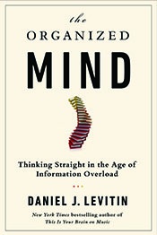

# How to Solve Google’s Crazy Open-Ended Interview Questions

[anexo ausente] Getty

One of the most important tools in critical thinking about numbers is to grant yourself permission to generate wrong answers to mathematical problems you encounter. Deliberately wrong answers!

Engineers and scientists do it all the time, so there’s no reason we shouldn’t all be let in on their little secret: the art of approximating, or the “back of the napkin” calculation. As the British writer Saki wrote, “a little bit of inaccuracy saves a great deal of explanation.”

For over a decade, when Google conducted job interviews, they’d ask their applicants questions that have no answers. Google is a company whose very existence depends on innovation—on inventing things that are new and didn’t exist before, and on refining existing ideas and technologies to allow consumers to do things they couldn’t do before.

Contrast this with how most companies conduct job interviews: In the skills portion of the interview, the company wants to know if you can actually do the things that they need doing.

But Google doesn’t even know what skills they need new employees to have. What they need to know is whether an employee can think his way through a problem.

### Of Piano Tuners and Skyscrapers

Consider the following question that has been asked at actual Google job interviews: How much does the Empire State Building weigh?

Now, there is no correct answer to this question in any practical sense because no one knows the answer. Google isn’t interested in the answer, though; they’re interested in the process. They want to see a reasoned, rational way of approaching the problem to give them insight into how an applicant’s mind works, how organized a thinker she is.

Excerpted from *The Organized Mind: Thinking Straight in the Age of Information Overload*

There are four common responses to the problem. People throw up their hands and say “that’s impossible” or they try to look up the answer somewhere.

The third response? Asking for more information. By “weight of the Empire State Building,” do you mean with or without furniture? Do I count the people in it? But questions like this are a distraction. They don’t bring you any closer to solving the problem; they only postpone being able to start it.

The fourth response is the correct one, using approximating, or what some people call guesstimating. These types of problems are also called estimation problems or Fermi problems, after the physicist Enrico Fermi, who was famous for being able to make estimates with little or no actual data, for questions that seemed impossible to answer. Approximating involves making a series of educated guesses systematically by partitioning the problem into manageable chunks, identifying assumptions, and then using your general knowledge of the world to fill in the blanks.

How would you solve the Fermi problem of “How many piano tuners are there in Chicago?”

Where to begin? As with many Fermi problems, it’s often helpful to estimate some intermediate quantity, not the one you’re being asked to estimate, but something that will help you get where you want to go. In this case, it might be easier to start with the number of pianos that you think are in Chicago and then figure out how many tuners it would take to keep them in tune.

There is an infinity of ways one might solve the problem, but the final number is not the point—the thought process, the set of assumptions and deliberations, is the answer.

In any Fermi problem, we first lay out what it is we need to know, then list some assumptions:

1. How often pianos are tuned  
2. How long it takes to tune a piano  
3. How many hours a year the average piano tuner works  
4. The number of pianos in Chicago

Knowing these will help you arrive at an answer. If you know how often pianos are tuned and how long it takes to tune a piano, you know how many hours are spent tuning one piano. Then you multiply that by the number of pianos in Chicago to find out how many hours are spent every year tuning Chicago’s pianos. Divide this by the number of hours each tuner works, and you have the number of tuners.

Assumption 1: The average piano owner tunes his piano once a year.

Where did this number come from? I made it up! But that’s what you do when you’re approximating. It’s certainly within an order of magnitude: The average piano owner isn’t tuning only one time every ten years, nor ten times a year. One time a year seems like a reasonable guesstimate.

Assumption 2: It takes 2 hours to tune a piano. A guess. Maybe it’s only 1 hour, but 2 is within an order of magnitude, so it’s good enough.

Assumption 3: How many hours a year does the average piano tuner work? Let’s assume 40 hours a week, and that the tuner takes 2 weeks’ vacation every year: 40 hours a week x 50 weeks is a 2,000-hour work year. Piano tuners travel to their jobs—people don’t bring their pianos in—so the piano tuner may spend 10 percent–20 percent of his or her time getting from house to house. Keep this in mind and take it off the estimate at the end.

Assumption 4: To estimate the number of pianos in Chicago, you might guess that 1 out of 100 people have a piano—again, a wild guess, but probably within an order of magnitude. In addition, there are schools and other institutions with pianos, many of them with multiple pianos. This estimate is trickier to base on facts, but assume that when these are factored in, they roughly equal the number of private pianos, for a total of 2 pianos for every 100 people.

Now to estimate the number of people in Chicago. If you don’t know the answer to this, you might know that it is the third-largest city in the United States after New York (8 million) and Los Angeles (4 million). You might guess 2.5 million, meaning that 25,000 people have pianos. We decided to double this number to account for institutional pianos, so the result is 50,000 pianos.

So, here are the various estimates:  
1. There are 2.5 million people in Chicago.  
2. There are 2 pianos for every 100 people.  
3. There are 50,000 pianos in Chicago.  
4. Pianos are tuned once a year.  
5. It takes 2 hours to tune a piano.  
6. Piano tuners work 2,000 hours a year.  
7. In one year, a piano tuner can tune 1,000 pianos (2,000 hours per year ÷ 2 hours per piano).  
8. It would take 50 tuners to tune 50,000 pianos (50,000 pianos ÷ 1,000 pianos tuned by each piano tuner).  
9. Add 15 percent to that number to account for travel time, meaning that there are approximately 58 piano tuners in Chicago.

What is the real answer? The Yellow Pages for Chicago lists 83. This includes some duplicates (businesses with more than one phone number are listed twice), and the category includes piano and organ technicians who are not tuners. Deduct 25 for these anomalies, and an estimate of 58 appears to be very close.

### But Wait, What About the Empire State Building?

Back to the Google interview and the Empire State Building question. If you were sitting in that interview chair, your interviewer would ask you to think out loud and walk her through your reasoning. There is an infinity of ways one might solve the problem, but to give you a flavor of how a bright, creative, and systematic thinker might do it, here is one possible “answer.” And remember, the final number is not the point—the thought process, the set of assumptions and deliberations, is the answer.

Let’s see. One way to start would be to estimate its size, and then estimate the weight based on that. I’ll begin with some assumptions. I’m going to calculate the weight of the building empty—with no human occupants, no furnishings, appliances, or fixtures. I’m going to assume that the building has a square base and straight sides with no taper at the top, just to simplify the calculations.

For size I need to know height, length, and width. I don’t know how tall the Empire State Building is, but I know that it is definitely more than 20 stories tall and probably less than 200 stories.

I don’t know how tall one story is, but I know from other office buildings I’ve been in that the ceiling is at least 8 feet inside each floor and that there are typically false ceilings to hide electrical wires, conduits, heating ducts, and so on. I’ll guess that these are probably 2 feet. So I’ll approximate 10–15 feet per story.

I’m going to refine my height estimate to say that the building is probably more than 50 stories high. I’ve been in lots of buildings that are 30–35 stories high. My boundary conditions are that it is between 50 and 100 stories; 50 stories work out to being 500–750 feet tall (10–15 feet per story), and 100 stories work out to be 1,000–1,500 feet tall. So my height estimate is between 500 and 1,500 feet. To make the calculations easier, I’ll take the average, 1,000 feet.

Now for its footprint. I don’t know how large its base is, but it isn’t larger than a city block, and I remember learning once that there are typically 10 city blocks to a mile.

How many uses can you come up with for a broomstick? A lemon? These are skills that can be nurtured beginning at a young age. Most jobs require some degree of creativity and flexible thinking.

A mile is 5,280 feet, so a city block is 1/10 of that, or 528 feet. I’ll call it 500 to make calculating easier. I’m going to guess that the Empire State Building is about half of a city block, or about 265 feet on each side. If the building is square, it is 265 x 265 feet in its length x width. I can’t do that in my head, but I know how to calculate 250 x 250 (that is, 25 x 25 = 625, and I add two zeros to get 62,500). I’ll round this total to 60,000, an easier number to work with moving forward.

Now we’ve got the size. There are several ways to go from here. All rely on the fact that most of the building is empty—that is, it is hollow. The weight of the building is mostly in the walls and floors and ceilings. I imagine that the building is made of steel (for the walls) and some combination of steel and concrete for the floors.

The volume of the building is its footprint times its height. My footprint estimate above was 60,000 square feet. My height estimate was 1,000 feet. So 60,000 x 1,000 = 60,000,000 cubic feet. I’m not accounting for the fact that it tapers as it goes up.

I could estimate the thickness of the walls and floors and estimate how much a cubic foot of the materials weighs and come up then with an estimate of the weight per story. Alternatively, I could set boundary conditions for the volume of the building. That is, I can say that it weighs more than an equivalent volume of solid air and less than an equivalent volume of solid steel (because it is mostly empty). The former seems like a lot of work. The latter isn’t satisfying because it generates numbers that are likely to be very far apart. Here’s a hybrid option: I’ll assume that on any given floor, 95 percent of the volume is air, and 5 percent is steel.

I’m just pulling this estimate out of the air, really, but it seems reasonable. If the width of a floor is about 265 feet, 5 percent of 265 ≈ 13 feet. That means that the walls on each side, and any interior supporting walls, total 13 feet. As an order of magnitude estimate, that checks out—the total walls can’t be a mere 1.3 feet (one order of magnitude smaller) and they’re not 130 feet (one order of magnitude larger).

I happen to remember from school that a cubic foot of air weights 0.08 pounds. I’ll round that up to 0.1. Obviously, the building is not all air, but a lot of it is—virtually the entire interior space—and so this sets minimum boundary for the weight. The volume times the weight of air gives an estimate of 60,000,000 cubic feet x 0.1 pounds = 6,000,000 pounds.

I don’t know what a cubic foot of steel weighs. But I can estimate that, based on some comparisons. It seems to me that 1 cubic foot of steel must certainly weigh more than a cubic foot of wood. I don’t know what a cubic foot of wood weighs either, but when I stack firewood, I know that an armful weighs about as much as a 50-pound bag of dog food. So I’m going to guess that a cubic foot of wood is about 50 pounds and that steel is about 10 times heavier than that. If the entire Empire State Building were steel, it would weigh 60,000,000 cubic feet x 500 pounds = 30,000,000,000 pounds.

This gives me two boundary conditions: 6 million pounds if the building were all air, and 30 billion pounds if it were solid steel. But as I said, I’m going to assume a mix of 5 percent steel and 95 percent air.  
5% x 30 billion = 1,500,000,000  
+ 95% x 6 million = 5,700,000  
\_\_\_\_\_\_\_\_\_\_\_\_\_\_\_\_\_\_  
1,505,700,000 pounds  
or roughly 1.5 billion pounds. Converting to tons, 1 ton = 2,000 pounds, so 1.5 billion pounds/2,000 = 750,000 tons.

This hypothetical interviewee stated her assumptions at each stage, established boundary conditions, and then concluded with a point estimate at the end, of 750,000 tons. Nicely done!

### Now Do It With Cars

Another job interviewee might approach the problem much more parsimoniously. Using the same assumptions about the size of the building, and assumptions about its being empty, a concise protocol might come down to this.

Skyscrapers are constructed from steel. Imagine that the Empire State Building is filled up with cars. Cars also have a lot of air in them, they’re also made of steel, so they could be a good proxy. I know that a car weighs about 2 tons and it is about 15 feet long, 5 feet wide, and 5 feet high. The floors, as estimated above, are about 265 x 265 feet each. If I stacked the cars side by side on the floor, I could get 265/15 = 18 cars in one row, which I’ll round to 20 (one of the beauties of guesstimating).

How many rows will fit? Cars are about 5 feet wide, and the building is 265 feet wide, so 265/5 = 53, which I’ll round to 50. That’s 20 cars x 50 rows = 1,000 cars on each floor. Each floor is 10 feet high and the cars are 5 feet high, so I can fit 2 cars up to the ceiling. 2 x 1,000 = 2,000 cars per floor. And 2,000 cars per floor x 100 floors = 200,000 cars. Add in their weight, 200,000 cars x 4,000 pounds = 800,000,000 pounds, or in tons, 400,000 tons.

These two methods produced estimates that are relatively close—one is a bit less than twice the other—so they help us to perform an important sanity check. Because this has become a somewhat famous problem (and a frequent Google search), the New York State Department of Transportation has taken to giving their estimate of the weight, and it comes in at 365,000 tons. So we find that both guesstimates brought us within an order of magnitude of the official estimate, which is just what was required.

These so-called back-of-the-envelope problems are just one window into assessing creativity. Another test that gets at both creativity and flexible thinking without relying on quantitative skills is the “name as many uses” test.

For example, how many uses can you come up with for a broomstick? A lemon? These are skills that can be nurtured beginning at a young age. Most jobs require some degree of creativity and flexible thinking.

As an admissions test for flight school for commercial airline pilots, the name-as-many-uses test was used because pilots need to be able to react quickly in an emergency, to be able to think of alternative approaches when systems fail. How would you put out a fire in the cabin if the fire extinguisher doesn’t work? How do you control the elevators if the hydraulic system fails?

Exercising this part of your brain involves harnessing the power of free association—the brain’s daydreaming mode—in the service of problem solving, and you want pilots who can do this in a pinch. This type of thinking can be taught and practiced, and can be nurtured in children as young as five years old. It is an increasingly important skill in a technology-driven world with untold unknowns.

There are no right answers, just opportunities to exercise ingenuity, find new connections, and to allow whimsy and experimentation to become a normal and habitual part of our thinking, which will lead to better problem solving.

*Excerpt from*  [THE ORGANIZED MIND: Thinking Straight in the Age of Information Overload](http://www.amazon.com/The-Organized-Mind-Thinking-Information/dp/052595418X/ref=sr_1_1?ie=UTF8&qid=1408140525&sr=8-1&keywords=the+organized+mind)*. Copyright © 2014 by Daniel Levitin. Reprinted by arrangement with Dutton, a member of Penguin Group (USA) LLC, A Penguin Random House Company.*
