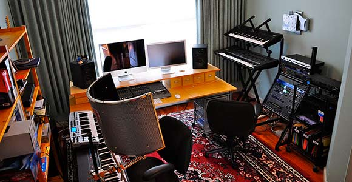

Sou constantemente indagado por músicos e iniciantes no mundo do áudio em busca de conselhos sobre a melhor forma de montar um setup de gravação, ou “Home Studio” em suas casas. Não resta dúvida que é um desafio. E, a maior barreira para a realização desse sonho é dispor dos recursos financeiros necessários para correta execução do projeto.

A única regra que deve ser obedecida aqui é:

###### faça pelo mínimo, mas não faça mal feito.

**Como podemos otimizar os recursos para montar um “Home Studio” tendo a melhor relação de custo beneficio?**

Gostaria de deixar claro que não tenho interesse em direcionar os leitores para qualquer tipo de equipamento ou mesmo estabelecer procedimentos, mas vou citar marcas, modelos e metodologias para que o assunto fique mais racional ou de fácil compreensão. Friso também que todos os comentários são baseados exclusivamente nas minhas experiências adquiridas ao longo dos 20 anos que exerço essa profissão.  
 Então, vamos ao primeiro passo.

### A escolha e a adaptação do local

O primeiro passo é definir a área que dispomos para montar o equipamento e fazer as gravações. Claro que sabemos que o ideal seria dispor de um profissional para realizar um projeto acústico para esta sala, mas como isso não é uma realidade na maioria dos casos, podemos amenizar os problemas/restrições de acústica do ambiente tomando algumas medidas bem simples.

Vamos supor que você tenha uma sala de 12m2, medindo 3mx4m e que essa sala seja o seu quarto.

Você deve montar o equipamento no extremo que lhe permita ganhar a máxima profundidade da sala. Assim, você mantém a monitoração de audio o mais distante possível da parede aonde ele vai se refletir. Nessa parede, você pode tentar fazer um dispersor sonoro retirando o paralelismo com a parede frontal. Uma boa sugestão para isso é usar seu guarda roupas como dispersor acústico, você pode manter as portas abertas ou ate mesmo retirar as portas fazendo com que a irregularidade natural do interior do guarda-roupa com suas prateleiras, roupas penduradas, sapatos e tantas outras coisas funcione como esse dispersor sonoro.

Como todos têm uma cama dentro do quarto, podemos usa-la como uma armadilha de graves colocando mais um ou dois colchões em baixo da cama.

Se o piso for de cerâmica, tente conseguir um tapete alto para diminuir a reflexão e no teto você pode fazer um painel com cubos de isopor de diferentes tamanhos. Já na janela, uma cortina longa de um tecido mais pesado vai ajudar a amenizar a reflexão do som nos vidros.

Tente isolar a porta e a janela com fitas de borracha autocolante, vendidas em lojas de material de construção, para diminuir a interferência de ruídos externos na sua gravação e procure colocar um ar-condicionado silencioso como um Split de 7.000Btus que será suficiente para essa área.

Todas as dicas que dou a cima são muito simples e usando materiais que dispomos no nosso dia a dia. Com um pouco de estudo sobre tratamento acústico você pode encontrar muitas outra soluções como essas que se apliquem ao seu caso específico. Claro que seu quarto não vai ficar nada bonito e muito menos com a acústica perfeita de um estúdio profissional, mas, com certeza, vai lhe dar uma resposta mais aproximada do ideal a respeito da sua monitoração de som.

**Use a criatividade pois no começo é assim mesmo, temos que ralar.**

No próximo ‘post’ vou falar sobre o sistema de gravação propriamente dito.  
 Abraços e ate lá.

[[anexo ausente]](http://pinterest.com/pin/create/button/?url=http%3A%2F%2Fwww.audioreporter.com.br%2Fdicas%2Fmontando-o-seu-home-studio-1-escolhendo-e-adaptando-o-local%2F&media=http%3A%2F%2Fwww.audioreporter.com.br%2Fwp-content%2Fuploads%2F2014%2F09%2Ftips-for-home-studio.jpg&description=Montando+o+seu+Home+Studio+%231+-++Escolhendo+e+adaptando+o+local.)

Paulista, radicado na Bahia, gravou e mixou grandes artistas, como Ivete Sangalo, Carlinhos Brown, Claudia Leite, Netinho, Gilberto Gil, Caetano Veloso, Gal Costa, Rumpilezz, Timbalada, Harmonia do Samba, Bebel Gilberto, Banda Eva, Tony Garrido e muitos outros. Atualmente comanda o PA da banda Asa de Águia e é sócio do estúdio Base e da Unidade Móvel Mix2go.
