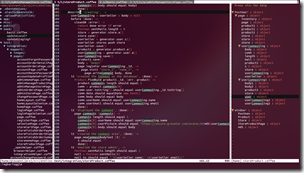

Eu programo com o [VIM](http://www.vim.org/) faz alguns anos. Não muitos. Pra quem não conhece, o VIM é um editor de textos baseado em terminal/console. Ele funciona em modo texto, sendo muito usado no mundo Linux/Unix, mas também possível de ser usado com Windows no cmd ou Powershell (se você tem git na máquina provavelmente também tem o VIM).

O VIM é um editor que nasceu quase 40 anos atrás, com o nome de VI. Uns 20 anos atrás ele foi melhorado e virou VIM (VI IMproved). Ele é de uma época em que o programador precisava programar para um computador remoto, com uma banda mínima. Para ter alguma produtividade o VIM foi desenvolvido de forma que a pessoa consiga em alguns toques no teclado mandar uma série de comandos, porque a comunicação com o computador era extremamente lenta (usava-se terminais e com uma banda baixíssima, veja mais [numa entrevista com o Bill Joy](http://www.linux-mag.com/id/349/), criador do VI, em 1999). A pessoa enviava os comandos, o computador processava e retornava o que foi alterado no terminal, geralmente conectado via Telnet ou algo parecido. Por esse motivo o VIM é extremamente produtivo, você consegue fazer muita coisa com pouquíssimo esforço, com pouca digitação. Só que ele é difícil. Escrever um texto no VIM, mesmo um texto simples, que não é código, é como se você estivesse programando. Pra começar o VIM tem diversos modos, e no modo mais comum dele, que é chamado não por outro motivo de modo normal, você não pode entrar texto. Nele você edita texto: substitui palavras ou letras, recorta, copia, cola, apaga palavras, parágrafos, e navega no texto. Para incluir texto você tem que apertar a letra “I”, o que te coloca no modo de inserção, e aí você pode entrar o texto. Quando terminar de entrar o texto você digita ESC e volta pro modo normal. Todo o trabalho é feito dessa forma. E não existe mouse (lembre-se, era a década de 70).

Você deve ter passado batido por uma das coisas que eu disse que deve ser feita no modo normal: navegar no texto. O VIM é de uma época em que não existiam as setas no teclado, e portanto não havia como navegar. Para isso, no VIM, você utiliza o modo normal, e digita H, J, K e L para navegar (para a esquerda, para baixo, para cima e para a direita, respectivamente). Uns anos depois computadores com teclados que possuiam setas ficaram populares e então foi possível navegar também no modo de inserção, utilizando as tais setinhas que tanto amamos. Até então, a única maneira de fazer isso era via essas 4 teclas: “I” pra inserir, insere o texto, ESC, movimenta com HJKL, “I” de novo, e por aí vai. Ou utilizando diversos outros comandos (gg vai pro começo do texto, G vai pro final, ^ vai pro começo da linha, $ vai pro final, b pula palavras pra trás, w pula palavras pra frente, entre muitos outros).

Ufa!, você deve ter pensado. Ainda bem que inventaram as setas, porque deve ser muito chato ter que usar HJKL pra navegar.

Só que não.

Todo mundo que utiliza o VIM a muito tempo diz pra você nunca usar as tais setas. Dizem que atrapalha sua produtividade. A ideia é a seguinte: quando você está digitando, suas mãos estão no que eles chamam de “home row”, ou seja, seus dedos da mão esquerda sobre as teclas ASDF, e os da mão direita sobre JKL e ”;” (essa última varia com o teclado). Se você colocar sua mão direita nas setas vai demorar a voltar para a posição original, seus dedos vão ter que se achar, e você pode acabar cometendo erros. Você fica menos produtivo.

Além disso, você pode ceder à tentação e querer ficar editando o texto em modo de inserção, e deixa de usar os atalhos do modo normal. E isso vai te deixar ainda menos produtivo.

“Mas HJKL não é intuitivo, é muito difícil lembrar qual tecla faz o que. Eu já sei usar as setas.” Todas essas afirmações são verdadeiras. VIM não é intuitivo. VIM é produtivo. E às vezes você tem que escolher entre um ou o outro.

Intuitivo significa que alguém consegue usar a coisa sem precisar ser ensinado. A pessoa consegue aprender sozinha, a funcionalidade é auto-explicativa. É intuitivo girar o volante de um carro pra esquerda e ele se movimentar pra esquerda. Não seria intuitivo se ele fosse pra direita.

Às vezes algo pode ser intuitivo e produtivo ao mesmo tempo (como o voltante de um carro). Às vezes não.

Há um investimento em aprender a usar o VIM corretamente. Há uma curva de aprendizado. Demora. Exige dedicação. Só que se você fizer direito vai voar. Olhar um programador experiente no VIM é ficar totalmente perdido, dificilmente você vai entender o que ele está fazendo, de tão rápido que as coisas acontecem. Isso é produtividade.

Quantos anos você vai programar? 20? 30? 40? Mais que isso? Porque você deveria limitar sua produtividade usando uma ferramenta intuitiva que não é produtiva? Não faz mais sentido investir um pouco mais nos primeiros meses ou anos para colher mais tarde?

Só que somos imediatistas. Nossa cultura é do aprendizado rápido e idealmente sem esforço. Então não investimos mais, temos que aprender tudo agora, em pouco tempo, ou não serve. E com isso ficamos eternamente pouco produtivos, somos eternos aprendizes aos olhos dos que dedicaram um pouco mais de esforço naqueles primeiros anos. Além disso, esses que costumam dedicar mais nos primeiros anos também dedicam mais nos anos do meio, e nos anos do final. Eles dedicam mais, ponto final. Eles olham pros que não fazem isso como se assistissem crianças trabalhando. E muitos não se dão ao trabalho de explicar, já desistiram. Pra que tentar convencer quem quer tudo fácil?

Meu convite pra você, amigo leitor, não é que você large seu Eclipse, Visual Studio, Textmate, Sublime Text, Word, ou o seja lá qual for seu editor favorito, e comece a usar VIM. É que você dedique mais tempo ao seu futuro, a ser mais produtivo ano que vem do que você é hoje. Por exemplo: você conhece bem os atalhos de teclado da sua IDE ou editor de texto? Quanto você pega no mouse e quanto tempo perde com isso? Você digita com os 10 dedos? Você aprendeu a usar as funcionalidades avançadas disponíveis pra você no seu ambiente de desenvolvimento? Quanto tempo perde debugando?

Não seja um eterno aprendiz, se aprofunde no que faz, seja melhor ano que vem do que você é esse ano. Não permita que quem entrou no mercado há dois anos seja tão bom quanto você é com quinze, seja 13 anos melhor que ele.

Essa lição vale pra tudo na vida. Não se acomode. E tenha orgulho do que é capaz de fazer com todo esse esforço acumulado, porque acredite, é um grande motivo de orgulho.

[[anexo ausente]](http://feeds.giggio.net/~ff/DotNetUnplugged?a=mxMn7r5QrOA:bSaUqO3LZ5w:yIl2AUoC8zA)

[[anexo ausente]](http://feeds.giggio.net/~ff/DotNetUnplugged?a=mxMn7r5QrOA:bSaUqO3LZ5w:F7zBnMyn0Lo)
[[anexo ausente]](http://feeds.giggio.net/~ff/DotNetUnplugged?a=mxMn7r5QrOA:bSaUqO3LZ5w:V_sGLiPBpWU)
[[anexo ausente]](http://feeds.giggio.net/~ff/DotNetUnplugged?a=mxMn7r5QrOA:bSaUqO3LZ5w:I9og5sOYxJI)

[anexo ausente]
