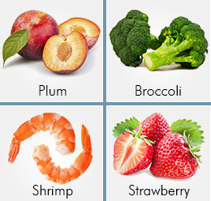

# Foods That Burn More Calories Than They Contain

There are certain food items that help you burn more calories than they contain! Got your attention, haven't I?

Advertisement

Some foods use more calories to get digested than the amount of calories they provide. Such foods come under the category of *Catabolic* foods. Catabolism is the process by which complex molecules are broken down to simpler ones to release energy. This category is recommended for those who aspire to burn calories and lose weight and consist of certain food items that require the body to burn more calories to get digested as well as negative calorie foods. This is the reverse of *Anabolism*, in which simple substances are combined to form complex materials of living tissue. *Anabolic* foods are those which use lesser calories to get digested than the amount they provide. This category is recommended to bodybuilders and those who wish to gain weight.  
  
Some Foods that Burn More Calories than they Contain  
  
This can be sub-categorized into foods that take more calories to digest, reverse caloric foods and thermogenic foods. The foods in this category can be further classified into fruits, vegetables and meat.

- *Fruits* such as blueberries, blackberries, grapefruit, lime, oranges, lemon, pineapple, plums, pears, strawberries and watermelons are high-grade catabolic fruits.
- *Vegetables* such as broccoli, celery, asparagus, carrots, Brussels sprouts, eggplant, leeks, spinach, lettuce, tomato, sweet potato, celery, pepper and parsley leaves rank high as calorie burning foods.
- *Meat* sources include seafood such as crabs, lobsters, mussels, shrimp, clamps and fish like tuna, cod and flounders. Other low-fat white meat also falls under this category of non-vegetarian catabolic foods.

***Foods That Take More Calories to Digest***  
This category consists of those foods which may not necessarily possess any specific chemical structure to burn more calories, but these are those foods which take up more time to get digested due to their sheer bulk and fibrosity. High fiber foods such as leafy green vegetables, lean white meat, etc. sit in the stomach for a longer time. This gives us a feeling of being "full" for longer, therefore, holding off the requirement and desire to eat for a longer time.  
  
***Negative Calorie Foods***  
This is also a sub category of foods which burn more calories to digest than what they contain. These are those foods whose water and fiber content are the highest and they stimulate more enzymes than other foods. Prominent among these are papaya, watermelon, asparagus, beetroot, zero calorie foods and beverages like onions and water. Despite zero calories, water does require calories to get absorbed in the body. The stomach is not like blotting paper which absorbs water in a swoosh! Calories are burnt even on account of digesting water, and cold water requires more calories to digest than normal room-temperature or warm water.  
  
***Thermogenic Foods***  
Foods which give warmth and increase the body temperature come under this category. The heat generated by these thermogenic foods accelerate metabolism and helps break down complex food compounds faster, preventing excess fats and carbohydrates to be stored unnecessarily. This category includes egg whites, chicken and turkey breasts, ginger, garlic, chilies, peppers, green tea, etc.  
  
How Catabolic Food Works  
  
Foods that burn calories during digestion, the so-called reverse caloric foods, act the way they do due to their *thermic effect* being greater than their calorie content. Thermic effect refers to the *increase in energy expenditure* due to the cost of processing food (for storage and use) over the amount of energy spent while at inertia in a neutrally temperate surrounding. To put it in simpler words, calorie burning food are those which make the body spend more energy to break them down than the energy which they provides to the body. These include foods which rev up our metabolism, as well as those foods which simply occupy stomach space for a longer time, which might, otherwise be emptied to accommodate high calorie foods. Let us take a look at some powerful foods that actually burn more fat and calories than they introduce into the body and see how they work to flush out those extra pounds.  
  
On a general note, calorie-burning foods rich in fiber, water, foods with vitamin C, protein and calcium are great foods for inclusion in weight loss diets. Dairy calcium from yogurt, milk and cheese help increase fat breakdown and is especially beneficial for losing stubborn abdominal fat. Proteins require more calories to digest than fat, hence protein rich foods such as bean, whole grains, fish oils and lean meat go a long way into accelerating fat loss. Vitamin C stimulates the *carnitine amino acid*, which speeds up the body's fat burning process. Also, vitamin C dilutes fat, and helps the body to expel it. Constipation is a significant factor behind weight gain. In trying to process fiber, the stomach body uses up a lot of calories and the bulk created by the high fiber diet ensures regular and comfortable bowel movement, thereby, ruling out constipation.  
  
Now that you know about these miraculous, but easily available, foods that compel your body to burn calories in its attempt to digest them, all you need to do is consciously include as much of these in your daily diet as you can; in fact, you might already be using most of these in your everyday meals! So eat healthy, quit skipping meals and eat frequent but small meals. Burning calories without exercising is possible and simple. Even if you lose out on workout time, eating the right foods can get you into that flattering outfit in due course of time!
