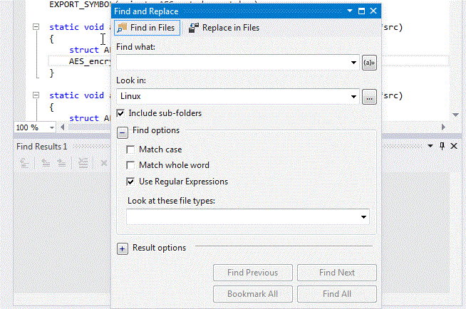
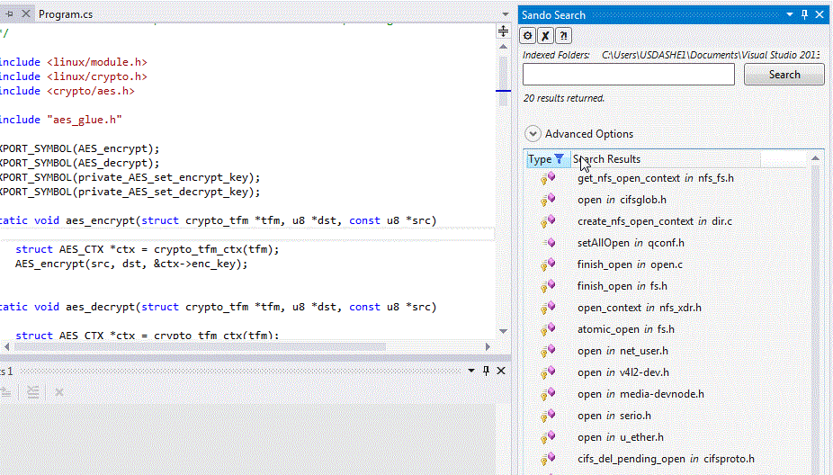

So there we are, in the middle of a big Solution and we need to quickly search for something, something beyond a simple term. We need to do a web search like search. A search where a full text index would be perfect...

We could write our own, since most/all of use have heard of [Lucene.NET](http://lucenenet.apache.org/) or like full text indexers. But we're kind of in a hurry. What if there was an open source Visual Studio Extension that used Lucene.NET?

What? You seem to remember we've covered something like that before? Man, you guys are good, you're right! [F3 is so yesterday... The Sando Visual Studio Extension provides real code indexing, search and more](http://channel9.msdn.com/coding4fun/blog/F3-is-so-yesterday-The-Sando-Visual-Studio-Extension-provides-real-code-indexing-search-and-more)

The great news is that the team behind Sando have not stood still, instead powering through a number of issues and have recently released the best version yet of Sando!

And to show it off, [David Shepherd](http://davidshepherd.weebly.com/) shows just how well it works on very large "real world" projects. Like how long it takes the Sando Code Search Visual Studio extension to search the Linux source tree... (Yes, searching the Linux source in Visual Studio.. ;)

## [Searching the Linux Source Tree in 0.5 Seconds](http://davidshepherd.weebly.com/blog/searching-the-linux-source-tree-in-05-seconds)

> Our recent work on the [Sando Code Search](http://visualstudiogallery.msdn.microsoft.com/06f39a31-20ce-408c-afee-8a02b484db1c) extension, a tool which leverages Lucene to search code, has been focused on making it more scalable and robust. To demonstrate our progress I'll provide demos of both Sando and FindInFiles (i.e., a grep-like feature in Visual Studio) searching the entire [Linux kernel](https://github.com/torvalds/linux/tree/59ca9ee42838d0f597137cf811e47eaf42fdcb69). As you'll see, there's a fundamental difference between Lucene-based search tools and regular expression based search tools.  
> Before we begin, let's first briefly examine the Linux source tree. At the time of our demo it contained 47,528 files which occupied 1.71 GB on disk. Most of these files were C code, yet there was also a fair amount of documentation and configuration files. Sando and FindInFiles both search all text files
>
> #### Searching the Linux Source Tree with FindInFiles
>
> To use FindInFiles I configured it to search the directory containing the Linux code, entered my search, and selected Find All. In this running example the user is searching for encryption algorithms, specifically those related to AES, and thus they use the regular expression query "encrypt\*aes". Executing this search caused FindInFiles to run its regular expression matching algorithm against every line of every file in that directory, recursively. As you can see in "Starting the Search", this utilized about 50% of the CPU on an eight core machine for a considerable amount of time.
>
> 
>
> Starting the Search: Notice when the FindInFiles search begins the CPU utilization becomes 50% on a 8-core machine.
>
> After about one minute and forty seconds the search completed, having searched 47,407 files. Unfortunately
>
> After about one minute and forty seconds the search completed, having searched 47,407 files. Unfortunately, no lines matched this particular search (see "Finishing the Search"). As often happens with a regular expression based search, the word ordering in the query did not match the word ordering in the code. In this situation the user would likely have to run another search with re-ordered search terms (e.g., "aes\*encrypt") to find relevant code
>
> ...
>
> #### Searching the Linux Source Tree with Sando
>
> Next we searched the same Linux source tree using Sando. Unlike FindInFiles, which is based on regular expression matching, Sando is built upon information retrieval technology (think *Google*). It leverages [Lucene.NET](http://lucenenet.apache.org/) to pre-index source code and provide ranked results almost instantly. Typing in the same query as before minus the regular expression syntax (i.e., "encrypt aes") you can see below that results are returned almost instantly. Just as importantly, the most relevant results are returned first with less relevant results toward the bottom. Additionally, in Sando's UI, selecting a result in the list provides a preview of the program element with matching terms in bold.
>
> 
>
> Searching with Lucene: The same search returns almost instantly when using Lucene-based searchers.
>
> Of course, there is a cost to pre-indexing. For the Linux source tree that cost is about 50 minutes of low CPU background processing. Fortunately, this only happens once  after which incremental updates and switching branches trigger at most a few seconds of indexing. Additionally, for most medium-sized projects initial indexing completes in a matter of seconds. For instance, Sando can index its own source code in less than ten seconds.
>
> #### Try It For Yourself: Online, in Eclipse, or in Visual Studio
>
> ... [[Click through for the rest of the post]](http://Searching%20the%20Linux%20Source%20Tree%20with%20Sando)

In a very cool touch, David includes links to other code search tools.

How do you get it? The fastest way is via the Visual Studio Gallery;

## [Sando Code Search Tool](http://visualstudiogallery.msdn.microsoft.com/06f39a31-20ce-408c-afee-8a02b484db1c)

> Search your C, C++, C#, and XAML code instantly. Form a better query with identifier-based and phrase-based auto-complete. Explore project terms with the word cloud.
>
> **Features**
>
> - Searches source code (C#, C++, C, and xaml) using information retrieval technology
> - Pre-indexes source code to provide near-instant searches
> - Indexes source code once, refreshing only changed files, to avoid unnecessary CPU burden
> - Supports literal searches (e.g., "File f = new File();"), symbol searches (e.g., "\_fileDialogTab"), and google-style searches (e.g., "open file")
> - Provides extensive preview of search results with highlighted search terms
> - Highlights search terms in code editor
> - Auto-completion suggests likely query additions (e.g., "open" -> "open file")
> - Auto-corrects spelling (e.g., "solutoin" -> "solution")
> - Auto-recommendation suggests similar words if search term doesn't exist in the source code base (e.g., "fire event" -> "raise event")
> - Provides word cloud of existing terms in source code to help users form a query
>
> **Supported Languages:** C#, C++, C, xaml
>
> ...

The Coding4Fun way? Feel the source...

## [Sando: Instant Project Search Built on Lucene](https://sando.codeplex.com/)

> ##### Sando's Mission:
>
> To completely eliminate the use of grep-like searches, replacing them with faster, easier-to-use indexed searches.
>
> ---
>
> **Problem:** Code search sucks. There's no auto-correct or suggestions, regex-based searches [fail most of the time](http://www.cs.cmu.edu/~marmalade/papers/Ko2006SeekRelateCollect.pdf), searching for two terms is nearly impossible, and the returned results are unranked.
>
> **Solution:** Sando is built on top of [Lucene](http://lucene.apache.org/) so it provides ranked results, multi-term search, and near instant results. It leverages [natural language processing](http://dl.acm.org/citation.cfm?id=2190116) to provide code-appropriate auto-complete and uses [software-specific synonyms](http://dl.acm.org/citation.cfm?id=2487155) to provide suggestions.
>
> *Technical Details: Sando is a Visual Studio Extension, searches C, C++, C#, and XAML, and works in VS2010-2013. It is written in C# and XAML and leverages the Lucene.NET library.*
>
> *...*

They are also very open to the community, looking for your help, big or small...

> ###### **Developers:**
>
> Sando is now becoming relatively stable. We have about [5000 downloads](http://visualstudiogallery.msdn.microsoft.com/06f39a31-20ce-408c-afee-8a02b484db1c) on Visual Studio Gallery and over 300 users uploading anonymous usage data. We are seeking developers to help (1) improve the quality of the code base via refactoring, (2) fix high priority bugs, and (3) become technical evangelists.
>
> Interested? Check out the [Documentation](https://sando.codeplex.com/documentation?referringTitle=Home).

Grep search no more...

[Follow @davidcshepherd](https://twitter.com/davidcshepherd)

[Follow @CH9](https://twitter.com/ch9)   
[Follow @Coding4Fun](https://twitter.com/coding4fun)   
[Follow @gduncan411](https://twitter.com/gduncan411)

