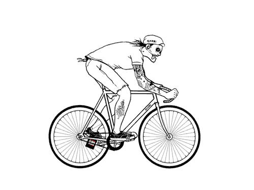
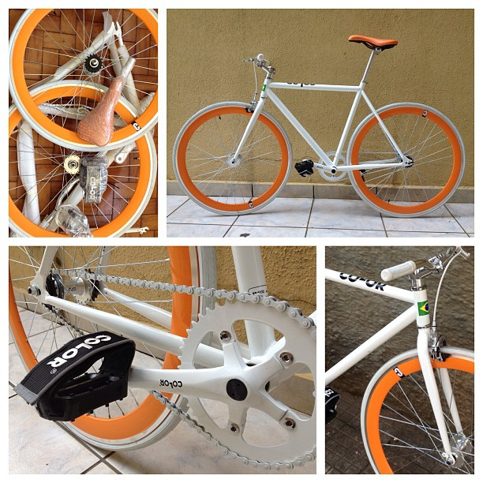
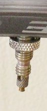
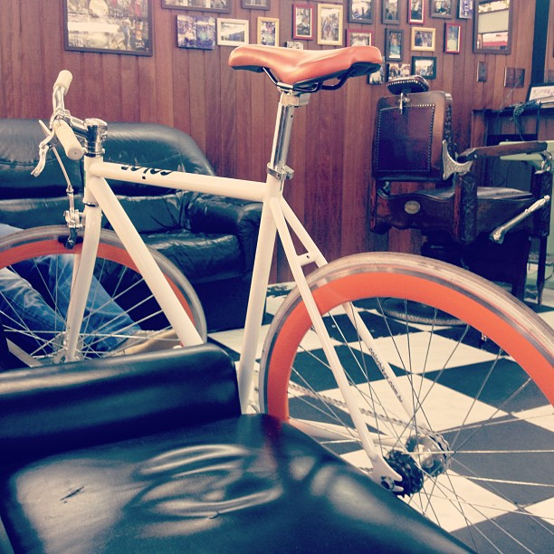

# Minha experiência com uma bicicleta fixa da ColorBikes no trânsito de SP

Publicado em 2013-08-25

|  |
| --- |
| [Share](#) |

A pedalada em uma bike fixa

Comprei uma bicicleta fixa da loja [ColorBikes](http://www.colorbikes.com.br/). Na bike fixa os pedais giram sempre que a roda está em movimento, o que proporciona mais controle e unidade entre o condutor e a bicicleta, melhor aproveitamento de energia da pedalada e uma nova experiência de ciclismo. O produto da loja brasileira me parece muito bom, mas a entrega teve problemas.

### Antes, vamos entender o que é uma bike fixa?

#### De onde veio a bike fixa?

*[Link para o vídeo no YouTube.](http://www.youtube.com/watch?v=OkZMJYDuNI4)*

Muito comum em São Francisco, Nova York e Berlim, a bike fixa não tem câmbio e marchas, muitas vezes nem freios e é a mais minimalista nas bicicletas. Este modelo vem ganhando adeptos em São Paulo e outras cidades brasileiras.

Na bike fixa os pedais giram sempre que a roda estiver em movimento, não existe “parar de pedalar” ou “ficar na banguela”, se o ciclista parar de pedalar, a roda traseira trava. Parar de pedalar inclusive é um dos jeitos de frear a bike fixa, manobra conhecida como skid.

Por ter menos partes móveis e mecanismos, [a bicicleta de roda fixa tem o melhor aproveitamento da energia do ciclista, de 96% a 99% nas bikes fixas bem reguladas, contra 85% a 97% nas bikes com marchas](http://pt.wikipedia.org/wiki/Bicicleta_de_marcha_%C3%BAnica), é por isso que as bicicletas olímpicas de velódromo (circuito oval) sempre foram fixas.

Além do aproveitamento de energia, aspecto técnico importante mas não muito relevante para ciclistas não profissionais, a bike fixa tem várias outras vantagens muito mais relevantes para o dia-a-dia, segue o que mais chamou minha atenção:

#### Maior unidade da bike e do ciclista

Na bike de roda fixa, me senti muito mais no controle do equipamento. Cada micromovimento seu se reflete na bicicleta, e cada variação no asfalto ou mudança de velocidade é transmitida da bike para você. Pode parecer clichê, mas na bike fixa você e a bicicleta se tornam “um”.

#### Silêncio

Como tem muito menos peças móveis, catracas e penduricalhos, a bike de roda fixa é incrivelmente silenciosa. Quando comentei isso no Twitter, alguns me perguntaram se faz diferença em uma cidade barulhenta como São Paulo, e faz. Mesmo em um tráfego barulhento e caótico, o silêncio da bicicleta se reflete no seu jeito de guiar, você passa a pensar muito mais sobre seus movimentos e onde vai passar com a bike, para evitar fazer barulho e, consequentemente, desgastar o equipamento.

#### Menos manutenção

É tipo meu velho Fiat Uno 2002: como não tem muitas peças para quebrar, quase não precisa de manutenção. Você não vai precisar levá-la na bicicletaria a cada 6 meses para lubrificar e regular, basta jogar um pouco de parafina líquida na corrente e manter os pneus calibrados.

#### Agilidade

A bike fixa normalmente ocupa bem menos espaço que uma bike com marchas, o guidão é menor, as rodas mais finas e o quadro mais simples, com isso você consegue passar em locais menores (entre postes e grades por exemplo) e também tem uma bike mais leve, permitindo movimentos mais agressivos quando necessário.

### Análise/review da bike fixa vendida pela ColorBikes

Em poucos caracteres: A [bicicleta da ColorBikes](http://www.colorbikes.com.br/) me parece boa para o preço que custa, com apenas 11 kg, montada no Rio de Janeiro, custou R$: 1400 e é muito bonita. A logística foi complicada, enviaram minha bike para Salvador (moro em SP), deu um trabalhão recebê-la corretamente. Da compra até a bike estar na minha casa se passaram 7 dias, até que é pouco tempo para um produto tão grande e com frete grátis. Apesar da confusão na entrega eu recomendo a loja.

Minha bike desmontada e como ficou após ser montada por mim

#### Montagem

A bike veio parcialmente desmontada em uma caixa de papelão. Digo “parcialmente” pois não precisei lidar com montagem de partes pequenas e complexas, como instalar pedivela, cabos de freio, ou eixos e cubo, tudo isso veio pronto. Precisei colocar as rodas, selim e canote, guidão, pedais. Eu mesmo montei a bike em 2 horas e foi uma experiência muito divertida, recomendo para todos que comprarem o produto. Eu me senti muito mais “dono” da bicicleta e tive aquela sensação boa de estar construindo algo. Recomendo reapertar todos os parafusos e porcas, pois alguns vieram frouxos, como os da coroa e do pedivela.

Consegui fazer tudo com uma dessas [chaves multiuso especiais para montagem de bicicleta](http://img.alibaba.com/photo/270067310/As_seen_on_TV_Bicycle_wrench.jpg) que eu já tinha aqui em casa mais as chaves allen que eles mandam no pacote, necessárias para instalação de guidão, canote, regulagem de freios. Mas a chave multiuso não foi o suficiente para dar aperto suficiente nos pedais e roda traseira, então eu fiz o mínimo necessário e já no primeiro rolê fui até a bicicletaria mais próxima para usar ferramentas mais apropriadas e finalizar definitivamente a montagem.

Além disso, as partes que vieram montadas – como mesa do guidão e parafusos allen da coroa – não estavam bem apertados, o que fez com que eles ficassem bem folgados após os primeiros dias de uso. Recomendo que você monte a bike em casa e leve até uma biciletaria para que revisem e apertem todos os parafusos e encaixes.

#### Peças

Eu não sou um profundo conhecedor de marcas de peças de bicicletas, mas a composição das peças da ColorBikes é ok pelo preço que se paga, todas são de marcas como Promax, KMC, Neco, Shimano. A bike não faz ruídos estranhos e o acabamento me parece bom.

#### Punhos

Os punhos são a peça da bike que aparentam ter pior qualidade, o acabamento não é bom e parecem frágeis. Pretendo trocá-los em breve.

#### Selim/banco

O selim está levemente desconfortável, não sei se por falta de costume ou se realmente são de baixa qualidade. Vou aguardar mais alguns dias e ver se melhoram, do contrário, vou trocá-los.

#### Rodas e pneus

Válvula Presta

Os pneus vieram com pouca calibragem, as válvulas/pitos/bicos onde você enche o pneu são do tipo Presta e o pneu precisa ser calibrado com 100 libras, ou seja, você não vai conseguir calibrar em um posto de combustível comum, o melhor é ir em uma bicicletaria ou comprar uma bomba manual p/ calibrar em casa, eu comprei uma bomba por R$: 120.

As rodas e pneus são lindos, finos, leves e muito bem montados, os cubos são super silenciosos e bastante robustos. A roda traseira é do tipo flip-flop, o que significa que ela tem 2 configurações possíveis: de um lado, pinhão fixo, para você montar uma bike fixa como a minha, do outro lado, catraca comum, para você montar uma bike de roda livre, mais fácil de usar para iniciantes.

#### Quadro

O quadro e garfo da bike ColorBikes são de aço Hi-Ten, o que dá uma excelente relação peso/absorção de impacto. Quadros de alumínio, por exemplo, são muito duros, causam desconforto pois você sente todas as variações do asfalto. Outra boa opção de material p/ quadro seria Cromoly, mais leve que o Hi-Tan, mas um pouco mais duro.

Para os demais aspectos técnicos da bicicleta, veja diretamente o site da empresa. Avalie muito bem sua compra pois há o risco deles enviarem sua bike para 2 mil km de da sua casa como fizeram com a minha, mas de qualquer forma eu recomendo a loja, gostei do produto que recebi 7 dias após a compra.

E temos aqui um combo hipster: uma #bikefixa em uma #barbershop

### Minha opinião após 7 dias e 99,57 km com uma bike fixa no trânsito de São Paulo

Eu queria muito uma bike fixa, então, estou muito feliz com o novo brinquedo. Ela é leve, muito rápida, me dá agilidade e segurança no trânsito. A simplicidade do produto me conquistou imediatamente, assim como a maior sensação de controle da bicicleta e o silêncio durante o passeio.

Pilotar uma fixa requer uma muita adaptação, estou reaprendendo a andar de bike e me desprendendo dos antigos vícios e padrões de condução, principalmente por causa da diferença de frenagem e impossibilidade de parar de pedalar para passar em cantos de meio-fio por exemplo.

Para curiosos que já tenham experiência com bike de roda livre ou com marchas, eu recomendo um teste, talvez em bicicleta emprestada ou até mesmo visita a uma loja de bikes que tenha um modelo de pinhão fixo. Até agora a mudança tem me deixado muito feliz.

### Textos relacionados:
