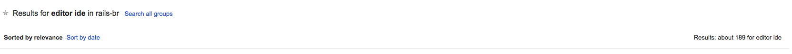
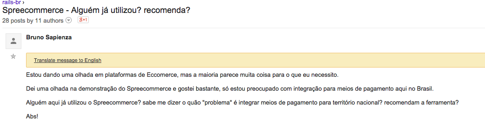
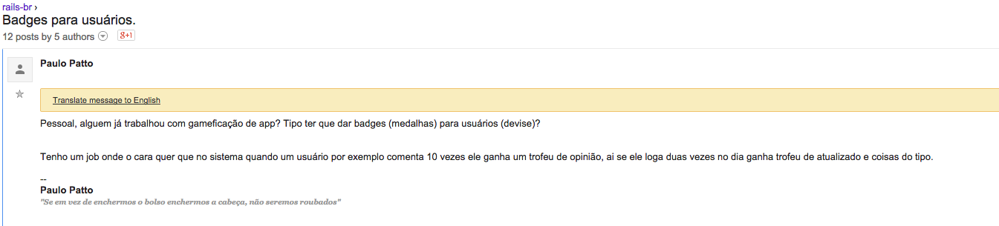
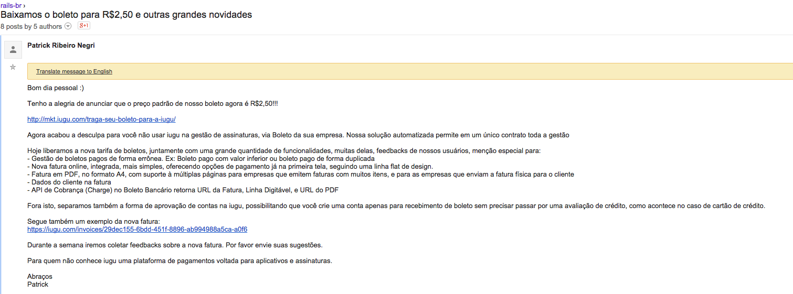
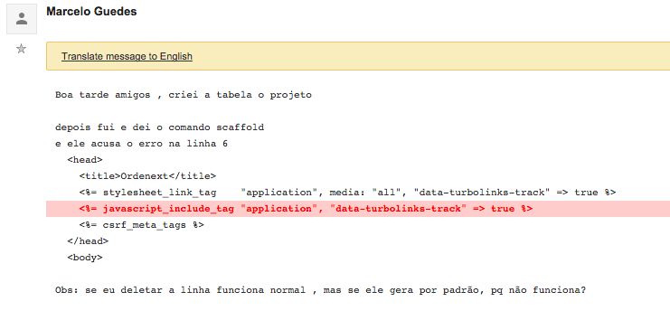

# Porque eu saí de praticamente todas as listas de desenvolvimento?

Por muitos anos eu fui bastante ativo em várias listas de discussões mas aproximadamente dois anos atrás eu me desliguei de praticamente todas elas.

Essa foi uma decisão que foi meio complicada de tomar. Por ter participado bastante e ter aprendido muito nessas listas eu estava bastante apegado e demorei um certo tempo para entender as razões pelas quais eu já não suportava mais fazer parte delas e porque várias pessoas que eu respeitava muito já tinham pulado fora.

De algumas foi até fácil sair mas tiveram algumas que eu relutei muito e tentei de todas as formas influenciar para mudar o rumo delas, porém sem sucesso.

Recentemente alguém me adicionou no grupo [Ruby On Rails Brasil](https://www.facebook.com/groups/rubyonrailsbrasil/) e eu resolvi ficar por um tempo lá, bem quieto apenas observando para ver se seria diferente do que era a [rails-br](https://groups.google.com/forum/#!forum/rails-br). Infelizmente esse grupo tem as mesmas postagens que me fizeram desistir das listas.

Seria bem fácil chegar aqui e sair apenas criticando, muitos iam concordar, outros iriam me odiar e nada iria mudar. Uma coisa que eu aprendi com o meu amigo [Henrique Bastos](https://twitter.com/henriquebastos) é que isso não ajuda em nada e que não devemos criticar ou falar que as pessoas estão fazendo as coisas de uma forma "errada" (isso é bem subjetivo) sem apresentar sugestões melhores.

O intuito desse post é justamente TENTAR fazer isso, não sei se vou ser capaz de transmitir o que eu penso mas vou tentar fazer esse exercício. Para me ajudar nesse exercício eu vou pegar alguns exemplos de posts da [rails-br](https://groups.google.com/forum/#!forum/rails-br) e do [Ruby On Rails Brasil](https://www.facebook.com/groups/rubyonrailsbrasil/) e tentar explicar o que me incomoda.

## DISCLAIMER

Como essas duas fontes são públicas eu não vou esconder o nome das pessoas, minha intenção não é ofender ninguém.

Tudo que eu falei é a **minha opinião e não significa que está certo.** Se você foi citado aqui aproveite essa oportunidade para refletir e analisar se essa opinião faz ou não sentido para você.

**Editor vs IDE**

Essa era uma das postagens mais recorrentes na [rails-br](https://groups.google.com/forum/#!forum/rails-br) e uma das que mais me incomodava.

Uma simples busca por "editor IDE" na rails-br retorna 190 discussões sobre isso. Claro que você vai pensar que muitas mensagens não estavam discutindo sobre isso e de fato, algumas apenas continham essas palavras. Entretanto ainda tem uma infinidade de discussões do tipo "emacs vs vim", "textmate vs vim".

Mas porque isso me incomoda tanto?

A primeira coisa que me vem a cabeça é que isso foge do escopo da lista, as pessoas estão alí para discutir sobre Ruby/Rails.

**Nenhum** editor ou IDE vai te fazer um melhor desenvolvedor Ruby/Rails, no máximo você será mais produtivo (outro conceito subjetivo) com um do que com o outro. Trata-se de uma escolha pessoal, cada se sente mais confortável com um.

Convenhamos, receber [57 postagens](https://groups.google.com/d/topic/rails-br/QEai-bZJXM0/discussion) (em uma única thread) com opiniões pessoais sobre algo que não está diretamente ligado ao tema da lista incomoda bastante.

Minha sugestão é: Não inicie nenhuma discussão que fuja do tema do grupo, principalmente se essa envolver opiniões pessoais.

Se você quer saber mais sobre um assunto que não faz parte do objetivo do grupo procure no google pois [certamente alguém ja escreveu sobre o assunto](http://www.akitaonrails.com/2014/07/31/small-bites-ides-e-editores-como-escolher#.VCSiVpNdXdt).

**Alguém já trabalhou/fez X?**

Essa entra numa categoria de perguntas que a relevância para o grupo está diretamente ligada a como você faz a pergunta. A maioria das vezes que esse tipo de pergunta aparecia ela tinha pouca ou nenhuma relevância para o grupo. Vejamos alguns exemplos:

Nessa mensagem não existe nenhuma dúvida real ligada ao Ruby/Rails, mesmo o Spree sendo feito em Rails não existe um questionamento que envolva o Rails. É o tipo de dúvida que poderia ser resolvida fora da lista, seja [buscando no google](https://www.google.com.br/?gfe_rd=cr&ei=gagkVP6VAYGC8Qee7oDICA#q=spree+pagamento+brasil) ou perguntando num [grupo específico para o spree](https://groups.google.com/forum/#!forum/spree-user).

Essa é outra mensagem que da forma como foi formulada não tem nenhuma dúvida real ligada ao Ruby/Rails. Eu acredito que o Paulo queria sugestões de gems ou de formas de implementar porém isso não fica claro na mensagem.

Seria mais relevante se ele tivesse feito o dever de casa e vindo com pelo menos uma idea de implementação, perguntando opiniões e que ferramental (gems?) poderia ajudar ele e tal.

**Propagandas**

Na minha opinião lista de desenvolvimento é lugar para tirar dúvida, não é lugar para propagandas, mesmo que seja de um produto voltado para desenvolvedores. Existem outros canais para propaganda!

**Dúvidas sem detalhes**

Você tem que me ajudar a te ajudar! Não adianta você enviar uma dúvida com poucos detalhes e esperar que todo mundo adivinhe o seu problema. Um exemplo:

Nessa mensagem o Marcelo explicou que tem um problema, diz a linha porém ele não dá mais nenhum detalhe sobre o erro. Torna-se quase impossível ajudar. Se ele tivesse colocado o log de erro seria muito mais fácil ajudar.

**Me mostra que você tentou e eu não estou sendo o seu Google**

Acredito que esse é o tipo de mensagem que mais incomoda aos autodidatas. Me incomoda muito quando parece que a pessoa não correu atrás antes de recorrer a lista, fica o sentimento de que eu estou fazendo o trabalho dela.

Eu acredito que o autor dessa dúvida tenha tentado alguma coisa sem sucesso, porém sem ele me mostrar isso eu não tenho como ter certeza que ele não está apenas buscando o caminho mais rápido. Seria bem mais interessante se ele tivesse colocado QUALQUER código que ele tenha tentado fazer e não tenha funcionado e a gente poderia apontar onde ele errou, seja no código ou seja conceitualmente.

**Tem muito mais…**

Existem vários outros tipos de mensagens que eu julgo inadequadas para uma lista de discussão porém resolvi apenas me ater a um pequeno conjunto que eu já considero bastante significativo.

**Então existem regras de devem ser seguidas?**

Eu não diria que existem regras rígidas que devem ser seguidas, realmente acredito que a única regra real é o **bom senso**.

Na minha opinião as listas seriam bem melhores se as pessoas evitassem esses tipos de "erros". Reduziria em muito o número de mensagens e com isso as pessoas conseguiriam dar mais atenção as outras.

**Reflexão**

Antes de me atirar pedras tente responder:

Porque será que os desenvolvedores mais experientes saíram das listas? Porque esses mesmos desenvolvedores estão bem ativos no [stackoverflow](http://stackoverflow.com/)?

Hoje em dia é bem mais fácil encontrar uma resposta para uma dúvida no [stackoverflow](http://stackoverflow.com/) do que nas listas.
