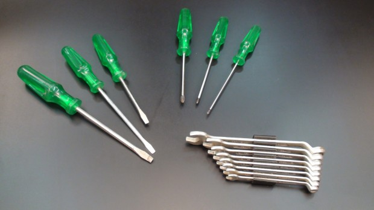
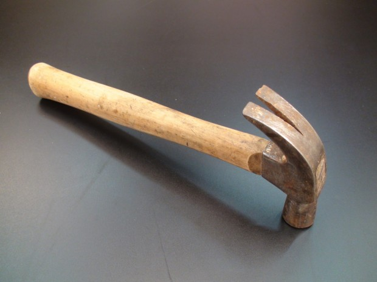
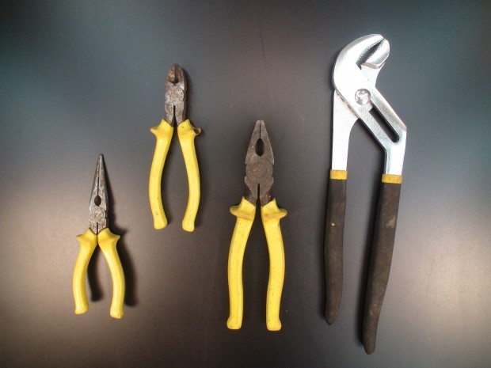
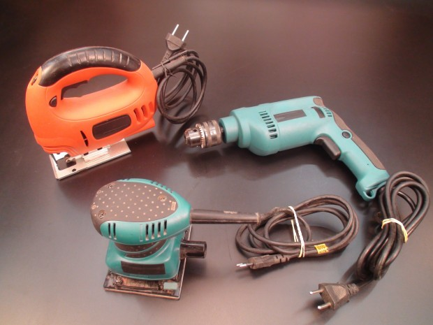
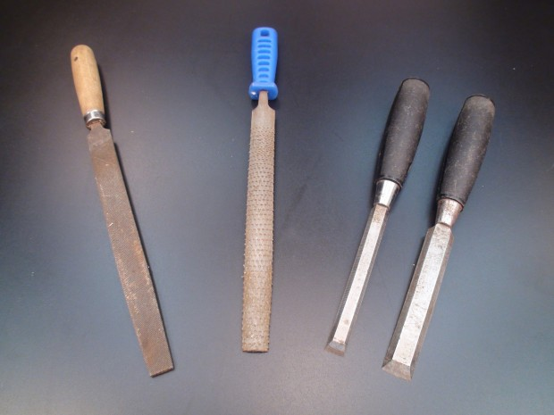
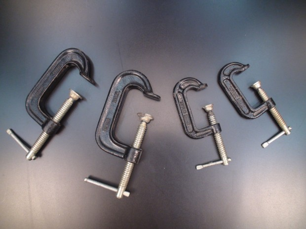
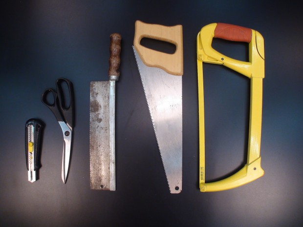
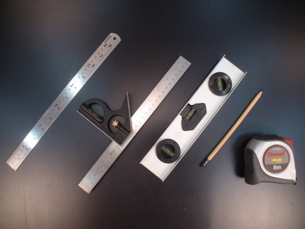
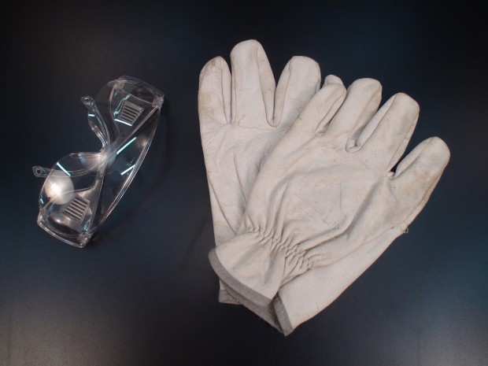
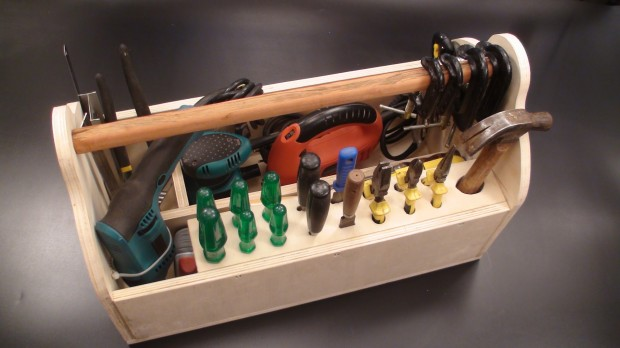

# Como fazer sua própria caixa de ferramentas

Antes de meter a mão na massa e começar a cortar, serrar, furar, planejar, consertar e resolver problemas, você vai precisar de ferramentas. Esse é o marco zero da independência funcional.

Como qualquer coisa na vida, a escolha das suas ferramentas não pode ser feita de qualquer jeito e, se você aplica carinho e dedicação a essa tarefa, com certeza vai conseguir chegar a um resultado bastante otimizado.

Aqui você vai aprender quais são as ferramentas que você precisa e, ao final, vamos ensinar a fazer a sua própria caixa de ferramentas.

### Chaves

Itens totalmente indispensáveis. Se há algo que você precisa antes de qualquer coisa, são as chaves. Velhas conhecidas, nem precisam de muita explicação. Você as utiliza para apertar e desenroscar parafusos diversos.

Os tipos mais comuns de chave são as de fenda, philips e de boca.

Você vai encontrar um infinidade de situações diferentes. Por isso, seria interessante ter um jogo de cada tipo de chave.

- Chaves de fenda
- Chaves Philips
- Chaves de boca

### Martelo

Para o nível um pouco mais avançado, a gente costuma ter um martelo de borracha que serve para ajustar materiais sensíveis como a cerâmica. Ele bate mas amortece o impacto ao mesmo tempo. Há também o martelo de madeira, mais conhecido como malho. Além disso, temos o martelo comum de carpinteiro (também conhecido como martelo unha).

Para o nível básico, em geral, você não vai precisar de muitos tipos diferentes de martelo. Se você tiver um bom martelo de carpinteiro, já serve. Minha sugestão seria ter um tamanho 23mm, para começar.

### Alicates

*[Link Youtube](http://youtu.be/D9cNtIw60II)*

Os alicates são ferramentas articuladas que têm a função de segurar peças com firmeza, prender, travar e cortar. Por exemplo, descascar fios, apertar porcas, apertar uma conexão hidráulica ou segurar peças delicadas ou quentes.

Para começar, seria bom contar com pelo menos estes itens:

- Alicate de bico
- Alicate de cortar fios
- Alicate universal
- Alicate de encanador ou Grifo

### Ferramentas elétricas

A primeira ferramenta que as pessoas compram na vida é uma furadeira. Por que a primeira necessidade costuma ser pendurar alguma coisa na parede, seja para colocar um quadro, pendurar uma prateleira ou instalar um armário.

Em seguida, a pessoa compra uma lixadeira, para dar acabamento nos objetos que tenha em casa, seja lixar um móvel para pintar ou dar aquele trato, para fazer seus móveis ficarem como novos.

Para usar a serra, isso já necessita de um pouco mais de iniciativa. Não é todo mundo que tem uma dessas em casa, pois isso demanda que a pessoa compre uma peça de madeira para poder manipulá-la.

Essas ferramentas têm bastante especificações. Cada uma delas têm aplicações e caracteristicas que podem não servir para o seu caso. Então é importante se informar bem antes de ir para a loja e comprar um desses itens.

- Furadeira
- Serra tico tico
- Lixadeira orbital

### Ferramentas de desgaste

Se a lingueta da sua porta, por exemplo, não se encaixa direito no batente, você vai precisar de uma lima para desgastar a chapa testa. Em todos os casos nos quais você precisa desgastar, ou seja, lixar, entalhar, desgastar, limar, vai precisar destas ferramentas.

A lima serve para desgaste de metal, a grosa serve para desgaste de madeira e os formões servem para entalhes em madeira.

- Grosa
- Formões

### Ferramentas de fixação

Eventualmente você vai precisar manter duas peças presas juntas. Por exemplo, fixar numa bancada uma peça para trabalhar em cima e manter a firmeza sem ter de se preocupar com ela naquele momento. Para isso, você vai precisar de grampos e sargentos, que matam bem a tarefa.

### Ferramentas de corte manuais

Essas são ferramentas para cortar materiais diversos. Normalmente, cada material e necessidade vai precisar de um tipo de serra/serrote específico. Você não vai cortar metal com serrote para madeira, por exemplo.

No caso dos serrotes, você vai ter o serrote comum, que serve para fazer cortes normais em madeira e o serrote de costa para cortes mais precisos, também em madeira. O arco de serra serve para cortar metal.

Tesoura e estilete dispensa comentários. Você vai usar para a mesma coisa que usava na escola.

- Serrote de costa
- Serrote
- Arco de serra
- Tesoura
- Estilete

### Acessórios de medição

Você não vai sair por aí fazendo as coisas de qualquer jeito. Vai precisar medir, marcar, nivelar, esquadrejar etc. Tudo para manter a precisão e beleza do seu trabalho.

O kit mínimo é esse:

- Régua
- Esquadro
- Nível
- Trena
- Lápis

### Itens de proteção

Segurança é essencial quando se vai fazer algum trabalho. É muito comum você manipular peças e acabar se machucando pelo simples desleixo com a segurança. Portanto, não deixe de ter, pelo menos, luvas, protetores auriculares e óculos de proteção. E isso seria o básico do básico.

É importante manter um cuidado especial com isso e adquirir EPI (Equipamento de Proteção Individual) adequada à atividade que vai realizar.

- Luvas
- Óculos de proteção
- Protetor auricular

### Faça sua própria caixa de ferramentas

*[Link Youtube](http://youtu.be/-fLA6VIRlr8)*

Que tal fazer sua própria caixa de ferramentas, de madeira, ao invés de comprar aquelas de plástico ou metal que são vendidas no mercado?

Este é um projeto extremamente fácil de ser feito e o resultado é muito simpático. Nesta caixa você terá as ferramentas arrumadas conforme desejar, além de ser uma peça que acabará enfeitando o local onde, no futuro, pensar em montar sua oficina.

Sem contar o apelo estético que, certamente, vai chamar a atenção dos seus amigos.

Você precisará de alguns pedaços de compensado, um sarrafo roliço para o cabo, cola e parafusos. E o melhor de tudo, poderá personalizá-la da maneira que preferir.

E aí, quem arrisca tentar?

Não dá um orgulho de ver ela assim, pronta e arrumada?
