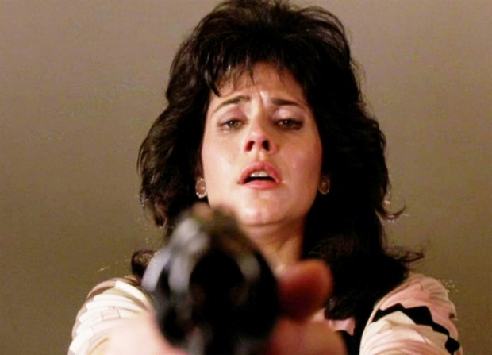
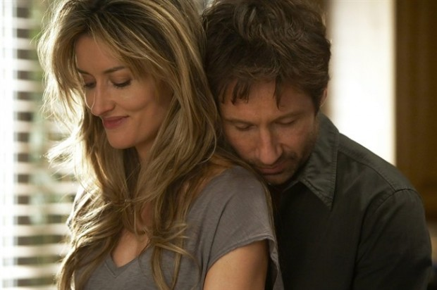

# Por que os homens desaparecem? A “Síndrome de Mestre dos Magos” | ID #30

> **Pergunta:** Olá, Fred!
>
> Gosto muito de seus textos, claro, pelas reflexões que eles trazem, mas muito mais pelas discussões que suscitam, pelos efeitos que eles provocam nos leitores, que se manifestam nos comentários de uma forma muito sincera (é até bonito de ler), e o pelo interessantíssimo conjunto que texto e comentários criam. É por isso que essa coluna constitui o espaço onde eu melhor poderia tentar compreender uma questão nada trivial que me provoca uma curiosidade tremenda: **por que cargas d’água os homens têm o péssimo hábito de, do nada, desaparecer?**
>
> Duas ressalvas:
>
> Tenho plena convicção de que essa queixa não é exclusiva de uma parcela da mulherada pejorativamente chamada “mulherzinha”. Todas nós, em nossas relações afetivas e sexuais casuais, já cruzamos nosso caminho com um portador dessa, que a bem da verdade vem se tornando quase que uma epidemia, “síndrome de mestre dos magos”.
>
> **Sou a primeira a refutar a afirmação de que “homem é tudo igual”**, mas percebo uma regularidade assustadora no que diz respeito a esse comportamento, e por parte de homens dos mais diferentes tipos, até mesmo dos que se dizem solidários às causas feministas, mas se mostram incapazes de olhar de fato para a mulher que têm à sua frente.
>
> É no mínimo curioso você estar se relacionando com uma pessoa com quem você se encontra mais ou menos regularmente, com quem troca mensagens mais ou menos regularmente, a quem você dedica certa atenção e energia (como acontece em qualquer relação), sem esperar nada demais (mesmo!!!), além de que a recíproca seja verdadeira (nem precisa ser simétrica) e que exista o mínimo de respeito e honestidade entre vocês; mas, do nada, a criatura some (só que, o que é pior, deixando muitos rastros, porque em tempos de google e redes sociais ninguém é tão foda que consegue desaparecer completamente).
>
> Ora, em pleno século 21, já não seria tempo de os homens saberem que mulheres também podem não querer compromisso, que mulheres fazem sexo porque têm desejo e porque é bom, sem precisar ser amaciada com conversa pra boi dormir, e, principalmente, que temos o mínimo de equilíbrio, discernimento e maturidade pra lidar com um “não rola mais”, “acho que já deu”, enfim, com um rompimento honesto? Precisa sair de fininho como quem fez algo errado e não quer ser descoberto? Não querer dar prosseguimento a uma relação, ainda mais relação casual, não seria a coisa mais natural do universo?
>
> Nós somos pessoas, porra! Nossa primeira reação é preocupação, claro. Pensamos que alguma coisa ruim aconteceu com o desaparecido, e quando descobrimos que ele está muito bem, obrigado, nos sentimos muito mal por termos nos importado com alguém que acaba de demonstrar não ter qualquer consideração por nós. É foda… Nos sentimos desrespeitadas e diminuídas não somente como mulheres, mas como seres humanos que sentem e pensam.
>
> Antes isso afetava muito minha relação comigo mesma, mas hoje eu já tenho alguma clareza para perceber que o problema não é comigo, mesmo porque não vejo o que pode justificar uma atitude como essa.
>
> Por gentileza, ajude-me a entender a origem desse comportamento, até mesmo pra que eu possa (re)avaliar minha atitude diante dele. Eu quero muito acreditar que esses caras não são completos imbecis que no fundo estão me fazendo é um belo favor ao se afastarem de mim dessa forma, porque se eu me relacionei com eles em algum momento é porque eles mostraram ser pessoas bacanas, como eu acredito que de fato são…
>
> Em tempo: sou do tipo de mulher que busca assumir honestamente para si mesma e para o outro se está interessada por ele ou não. Nunca deixei de responder a um cara que me procurou, juro! E acho feio quando as mulheres ignoram os caras que as procuram também.
>
> Obrigada. Um abraço, Melinda.

Olá Melinda.

Não vou dizer que você “é tão sensível, tão emocional, tão defensiva. Você está exagerando. Calma. Relaxe. Pare de surtar! Você é louca! Eu estava só brincando, você não tem senso de humor? Você é tão dramática. Deixa pra lá de uma vez!”e [gaslaitear](http://papodehomem.com.br/porque-as-mulheres-nao-estao-loucas/) você. Há, de fato, alguma coisa bem estranha que permeia a maneira contemporânea de criar, manter ou romper vínculos com maturidade e honestidade.

Realmente os homens agem como empresas que fazem inúmeras entrevistas de emprego e nunca dão o *follow up* para os candidatos não escolhidos seguirem suas vidas.

### Contexto e cultura

O cenário proposto tem como pano de fundo **uma cultura que privilegia o homem em detrimento da mulher em níveis mais aparentes e nos mais sutis**. As mulheres culturalmente estimuladas a demonstrar sua emoções em oposição aos homens que são educados a reprimi-las são vistas como fracas, instáveis e vulneráveis.

Karen Hill, de “Os Bons Companheiros”

Diante de uma verdade do tipo “não quero nada mais sério com você, mas seria ótimo transar de vez em quando com a condição que não se apaixone ou me cobre constância ou coerência” acabam considerando-a muito dura e inconfessável. Se elas não suportam a verdade, logo o homem se imagina impelido a desaparecer ou deixar o clima esfriar até poder retomar o assédio.

Por outro lado, os homens não são estimulados a captar em si e nos outros emoções mais sutis que saiam do espectro medo-raiva como consternação, contentamento ou constrangimento. Como são treinados em percepções binárias, acabam tendo dificuldade em detectar e administrar contextos ambíguos ou com duplo sentido.

Por outro lado, as mulheres são educadas a expressarem indiretamente seus desejos e sentimentos para não afrontarem o ego masculino. Quando elas se manifestam sem dizer exatamente o que pensam ou querem, os homens se perdem e as acusam de serem obscuras, loucas ou imprevisíveis.

**As bolhas emocionais que os gêneros se trancafiaram criou essas distâncias funcionais**, na hora de dizer adeus ou até logo, isso nunca pode ser claro, seja de um lado ou de outro.

### O comportamento masculino enigmático

Quero só fazer uma nota importante sobre o enigma do comportamento masculino, que não é tão misterioso quanto possa parecer.

Quando ele quer algo ele faz, quando não quer não faz. Qualquer comportamento que não seja claramente o de querer e estiver cheio de hesitações, mudanças súbitas, inconstâncias e certo desprezo pode ser categorizado no tópico “não quero para valer”. Normalmente, quando ele resolve se vincular, isso fica claro por demonstrações de assiduidade, constância, ganho de intimidade, socialização da parceira, presença de qualidade e generosidade nas tomadas de decisão. Falo bastante disso no meu livro [*Como se libertar do ex*](http://www.livrariasaraiva.com.br/produto/7116733?PAC_ID=125054).

Se há alguma dúvida, é porque alguma barra está sendo forçada ou porque o cara está relutante em ceder. De qualquer forma, ele não está realmente dentro da barca naquele momento. De fato é muito frustrante ter que lidar com pessoas que não possuem clareza sobre sua condição pessoal e emocional.

Não deveria ser assim, mas é como acontece na realidade.

### Personalidade

Sei que a personalidade humana é multi-facetada, mas, para ser didático, é válido reduzir esses desaparecimentos em dois perfis típicos de personalidade (com suas pequenas variações) que podem ser ocasionais ou crônicos.

Ambos provocam mal-estar e prejuízo, mas possuem motivações distintas que nascem de uma auto-imagem muito particular.

### **1.** O negligente-utilitarista

Alfie

Esse é o cara que se imagina fluindo na vida, pronto para se divertir, e vê os relacionamentos como meios para sentir prazer e obter benefícios pessoais. Até aqui, nada de monstruoso, a não ser quando essa película de auto-confiança, sociabilidade, intensidade e carisma desconsideram as outras pessoas com suas singularidades. Como ele se imagina um prêmio para o mundo, então acha que os encontros casuais que tem não deveriam ser tão superestimados, afinal ele avisa “que é só curtição”.

O seu discurso e presença são muito sedutores, afinal, o cotidiano das pessoas é um pouco monótono, monotemático e apático. Quando uma pessoa surge com tanta vida transbordando, parece ser a resposta para todos os males, principalmente os sexuais. Seu despojamento que mascara sua falta de empatia genuína é responsável por uma performance sexual cheia de invencionices e malabarismos.

Seu problema não é com o primeiro encontro, que é garantidamente incrível, mas com o transcorrer do tempo e da intimidade. Ele tem ótimos, mas poucos truques na manga para navegar no relacionamento humano de longa duração.

Quando descarta uma mulher, é porque sua agenda já está girando **e como sofre de ejaculação emocional precoce,** não consegue esperar muito para ter seu prazer garantido. Diante da demora de uma, ele aciona todas as mulheres possíveis e vai rodando na medida do seu tesão e disponibilidade delas.

Quem responder o whatsapp primeiro, ganha o prêmio. E se houver empate, vence a mais gostosa.

Para as demais, ele desaparece porque nunca esteve realmente presente.

### **2.** Covarde-inábil

Hank Moody, “Californication”

Esse perfil é um pouco mais contido que o anterior e até relativamente consciencioso, mas costuma negar para si seu perfeccionismo e confusão decorrente de tentar fazer a escolha perfeita. É o cara que se considera de bom coração, ponderado e querido, até entende a “alma feminina” e, por isso, parece tão confiável.

Ao mesmo tempo que não sabe dar uma negativa, também não sabe afirmar e por isso causa muita confusão na mente dos outros.

Como acredita que sabe o que se passa na cabeça de uma mulher (idealização entre especial e frágil), tem dificuldade de cortar relações quando se desinteressa. Ele prefere manter uma porta entre-aberta para que sua insegurança oculta no bom mocismo não perca nenhuma carta na manga.

Internamente, ele se justifica alegando ver problemas na menina, mas esconde de si que é insaciável no seu perfeccionismo. Ele não faz escolhas por nunca conseguir abrir mão de todas as outras disponíveis.

### A fobia de intimidade masculina

Existe ainda uma faceta pouco abordada quando o assunto é intimidade masculina: muitos homens são possuídos de certa fobia social de intimidade.

Na prática, por serem pouco habilidosos em lidar com fra(n)queza e sentimentos ambíguos, eles desenvolvem uma superficialidade funcional que os distancia de qualquer possibilidade de avançar a um estágio do relacionamento em que se sentirão dissecados em carne viva. Para eles, uma mulher ávida por companheirismo e fusão emocional parece ser um convite a sofrer *bullying*, como se alguém tivesse abaixando sua calça na frente do colégio.

Existe uma parte da personalidade que é perceptível para a própria pessoa que pode ser falseada e manipulada para favorecer uma auto-imagem idealizada. A outra é a  que decorre de suas ações reais.

O homem, quando evita um relacionamento, pode se convencer que age poupando uma mulher quando na verdade projeta nela um problema pessoal. Ele quer se proteger de ser confrontado no cotidiano em se constatar uma pessoa fria-desconectada ou utilitarista-sem empatia ou ainda simplesmente um cara confuso-insatisfeito crônico.

O discurso que adota é “vida louca na balada”, mas na profundidade paira uma obsessividade por método, espaço próprio, racionalidade, garantia, segurança, não risco e medo de fixação que o blinda de qualquer tipo de desconforto, inadequação emocional ou despotencialização. O relacionamento para esse tipo de homem representa conscientemente uma perda de liberdade, mas inconscientemente um risco para seu senso de segurança e vulnerabilidade emocional.

Portanto, Melinda, o mestre dos magos é uma bela metáfora para um tipo de comportamento que cria uma sensação de impotência em quem ficou esperando uma resposta. O mestre dos magos era sempre aquele que tinha poder exatamente por parecer indisponível.

O solteiro (quase) convicto

Infelizmente, o truque ainda funciona e muitas mulheres sofrem recaídas quando solicitadas após o desaparecimento, cortejando o Don Juan com mais empenho. **Isso é o que realimenta o ciclo predatório que abocanha o rabo de quem foi prejudicado no golpe**. Como sempre digo, a maior prevenção para isso é estar com sua própria vida em dia, afinal gente feliz não cai em golpe.

### Encontros com o Frederico Mattos

O Fred Mattos realizará um encontro de fim de semana em São Paulo para tratar sobre as emoções e construção de maturidade. Se você quiser conhecer o trabalho dele, [é só se inscrever em seu site, o Sobre A Vida](http://www.sobreavida.com.br/workshop-construindo-sua-maturidade-emocional/).

***Nota:** A coluna ID não é terapia (que deve ser buscada em situações mais delicadas), mas um apoio, um incentivo, um caminho, uma provocação, um aconselhamento, uma proposta. Não espere precisão cirúrgica e não me condene por generalizações. Sua vida não pode ser resumida em algumas linhas, e minha resposta não abrangerá tudo.*

*A ideia é que possamos nos comunicar a partir de uma dimensão livre, de ferocidade saudável. Não enrole ou justifique desnecessariamente, apenas relate sua questão da forma mais honesta possível.*

*Antes de enviar sua pergunta olhe as outras respostas da coluna ID e veja se sua questão é parecida com a de outra pessoa e se mesmo assim achar que ela beneficiará outras pessoas envie para [id@papodehomem.com.br](http://papodehomem.com.br/minha-namorada-e-linda-mas-perdi-o-tesao-id-29/id@papodehomem.com.br).*
