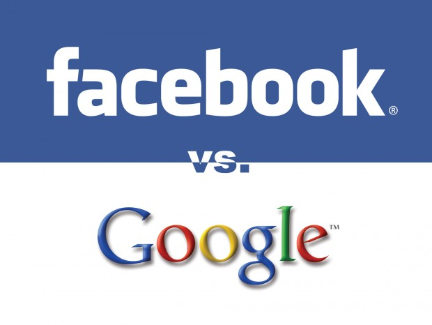
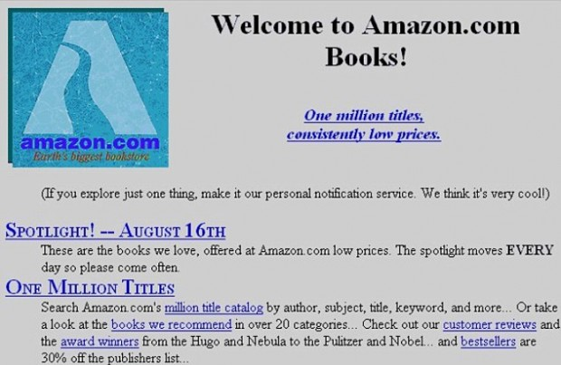
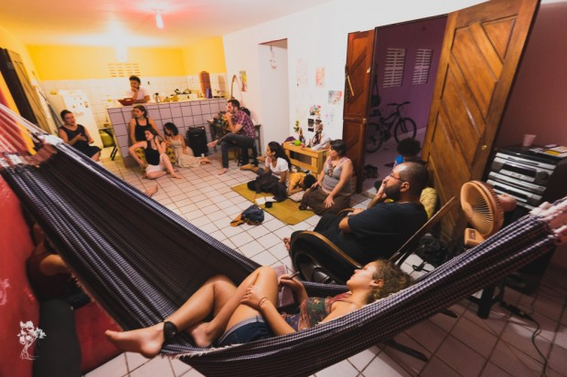

Nos primórdios da internet, as newsletters eram a melhor maneira de entrar em contato com as pessoas leitoras. Hoje, vinte anos anos depois, também.

\* \* \*

Era uma vez, há muito tempo, uma terra feliz onde todas as pessoas usavam o Google Reader para acompanhar seus sites preferidos e intergir com os amigos.

Um dia, entretanto, o Rei Google pirou na batatinha, decidiu dar um tiro no próprio pé e acabou com o Google Reader.

E, por toda a terra, houve choro e ranger de dentes.

O Rei Facebook, entretanto, aproveitou a situação para amealhar todos os órfãos do googereader: do dia para noite, milhões e milhões de pessoas migraram para o seu reino.

E, por toda a terra, houve regojizo e felicidade, e as pessoas foram muito felizes, curtindo as páginas dos seus sites preferidos e acompanhando novos posts e textos pelo facebook, e ainda curtindo, compartilhando, interagindo com seus amigos.

Um dia, entretanto, o Rei Facebook foi tomado por um acesso infernal de ganância e avareza, e também deu um tiro em seu próprio pé:

Começou a mostrar as postagens para menos de 5% dos curtidores de uma página. Se a página quisesse atingir todos os seus próprios curtidores (ou seja, aquelas pessoas que curtiram a página porque queriam ver seus posts!), teria que pagar!

E, por toda a terra, houve choro e ranger de dentes.

As pessoas administradores de páginas ficaram desesperadas, sem ter como atingir seu próprio público, a não ser pagando altas somas!

As pessoas curtidoras ficaram desorientadas, sem entender porque de repente não viam mais tantas postagens de seus sites e páginas favoritos.

Então, em resposta à busca por novas maneiras de conectar produtores e consumidores de conteúdo, renasceram as newsletters.

### Definindo as novas-velhas newsletters

Há muitos e muitos anos, ainda antes da históra acima, a internet era um meio txt, de [fóruns](http://pt.wikipedia.org/wiki/Grupo_de_not%C3%ADcias), grupos de discussão e emails, mas quase nenhum site e pouquíssimas imagens.

Nessa época do byte lascado, as newsletters eram praticamente o único jeito de produtores de conteúdo entrarem em contato com um grande número de pessoas.

Página inicial da Amazon em 1994.

Aos poucos, a velocidade de transmissão foi aumentando e os [navegadores](http://pt.wikipedia.org/wiki/Navegador_(inform%C3%A1tica)) ([Netscape](http://pt.wikipedia.org/wiki/Netscape), Explorer, etc) se popularizando. Muitos dos primeiros sites nasceram literalmente como repositório estático do arquivo de textos das newsletters mais populares.

Foram essas mesmas condições tecnológicas que, ao mesmo tempo em que possibilitaram o [boom das startups de internet](http://pt.wikipedia.org/wiki/Bolha_da_Internet) entre 1998 e 2000, também começaram a matar as newsletters, abrindo caminho para o reinado supremo dos websites…

Até agora.

*(Eu, por exemplo, fiz meu primeiro email @ax.apc.org e entrei na internet em 1994; instalei o navegador Netscape e comecei a acessar sites, em 1996; criei e manti uma lista de distribuição de tirinhas de quadrinhos de jornal no eGroups a partir de 1997; comecei a trabalhar com internet, para a [StarMedia](http://en.wikipedia.org/wiki/Starmedia), no começo do boom, em 1998; levantei dinheiro com investidores e fundei minha própria startup em 2000; e quebrei em 2002, esquece, esquece!)*

### Definindo as novas-velhas newsletters

Quando falo de newsletter, não estou falando desses sites que enviam por email os links ou textos completos de seus últimos posts.

Se todo o “conteúdo” da newsletter já está disponível publicamente em um site aberto, então a newsletter é redundante.

Ela é apenas uma ferramenta de divulgação do site. Não adiciona nada. Não comunica nada de novo. Não se aproveita desse aspecto mais íntimo que o email fornece.

O novo formato de newsletter que está (re)ssurgindo é ao mesmo tempo inovador e tradicional. São textos personalíssimos, mais humanos e mais exclusivos. Que permitem que criadores de conteúdo se relacionem com seus públicos de maneiras mais profundas, mais bonitas, mais instigantes.

Uma boa newsletter, como aquelas lá dos primórdios, é aquela que se mantém por si só, independente de sites, como se ainda não existisse a web: apenas uma mensagem direta, humana e original, enviada de pessoa para pessoa.

Abaixo, algumas sugestões de newsletters que vêm tentando fazer justamente isso.

\* \* \*

### As minhas newsletters preferidas

[Juliana Cunha](http://julianacunha.com/blog/) é baiana, foi pra São Paulo, escreve pra Folha, Trip e Piauí, e já ganhou por duas vezes o prêmio Zelda Fitzgerald de maturidade emocional. Ela escreve especialmente sobre literatura e estilo, e consegue transformar os temas mais simples em textos interessantes.

[Olivia Maia](http://oliviamaia.net/newsletter/) é uma escritora paulistana que fugiu de São Paulo e está há um ano mochilando pela América Latina e compartilhando vivências incríveis.

Alessandro Martins, com Claudia Regina, em foto de Rodolpho Pajuaba

[Alessandro Martins](http://alessandromartins.me/newsletter) é uma das pessoas mais lindas e humanas que já conheci. Em um dos encontros “[As Prisões](http://alexcastro.com.br/encontros)”, ele se definiu assim: *“meu trabalho é ter uma vida interessante para poder escrever coisas interessantes.”* O Ale é muito bom no seu trabalho.

[Aline Valek](http://www.alinevalek.com.br/blog/assine) escreve sobre feminismo para a Carta Capital e possui um talento incrível para explicar o feminismo didaticamente para quem ainda não entendeu.

[Paula Abreu](http://www.escolhasuavida.com.br) chutou o balde de uma carreira corporativo e decidiu ser mãe, escritora, coach, mestra. O seu tema principal é: podemos escolher nossa vida.

Por fim, se você gosta do que eu, Alex Castro, escrevo, [assine a minha newsletter](http://alexcastro.com.br/assine/), com as atualizações do meu site e mais textos inéditos e exclusivos só para assinantes.

\* \* \*

### Uma experiência pessoal com newsletters

Para mim, como produtor de conteúdo, poucas coisas têm me dado tanto prazer quanto [o meu newsletter](http://alexcastro.com.br/assine/).

Ao contrário das caixas de comentários *(que estimulam a agressividade e onde muitas vezes os comentaristas ficam se mostrando uns aos outros tentando “ganhar” a discussão)*, as newsletters promovem um contato ao mesmo tempo mais próximo e mais generoso, especialmente em relação ao feedback.

Ao responder à newsletter e entrar em contato comigo, a privacidade do email permite que as pessoas leitoras estabeleçam um contato mais pessoal e mais aberto, com mais troca e mais compartilhamento.

Ou seja, exatamente o tipo de comunicação íntima e refletida que seria impensável em uma caixa de comentários, entre o Bolão234 xingando o autor do texto e a MariaAracaju2 divulgando links do seu site de ecologia.

Em um email, ninguém nunca está querendo aparecer para a plateia.

Prisões, Natal, 30ago2014. Foto: Claudia Regina.

Agora, ao longo do ano de 2014, estou viajando o Brasil com o encontro “[As Prisões](http://alexcastro.com.br/encontros)”, dando a versão final aos textos que vão formar o futuro *Livro das Prisões* e publicando-os [um por mês aqui no PapodeHomem](http://papodehomem.com.br/secoes/series/prisoes/).

Sempre que acabo uma nova Prisão, envio uma prévia para as pessoas assinantes, recebendo em troca dezenas, às vezes centenas, de emails inteligentes e afiados, com críticas, feedback e sugestões que já modificaram e melhoraram os textos de forma significativa.

Dá pra contar nos dedos de uma mão os xingamentos, ofensas e trollagens que já recebi por email.

Muito, muito obrigada a todas as pessoas assinantes.

*(Para assinar meu newsletter, [clique aqui](http://alexcastro.com.br/assine/).)*

\* \* \*

### Sugestões da equipe do PapodeHomem

[Manual do Usuário](http://www.manualdousuario.net/assine): oferece conteúdo relevante sobre tecnologia. Foco zero em caça de cliques, só o que realmente importa sobre o tema entra aqui.

[Brain Pickings](http://www.brainpickings.org/index.php/newsletter): uma coleção de citações de escritores com comentários da Maria Popova. É excelente pra quem gosta de estudar sobre como ser mais criativo e produtivo.

[Nieman Journalism Lab](http://www.niemanlab.org/subscribe): uma newsletter dedicada a discutir o futuro do jornalismo.

[The School of Life](http://www.theschooloflife.com): eles se descrevem como uma empresa de cultura oferecendo boas ideias para a vida cotidiana. Já disponibilizamos conteúdo relacionado a eles por meio dos textos do [Alain de Botton](http://papodehomem.com.br/author/alain-de-botton/).

[Oene](http://www.oene.com.br/assine-newsletter-tenha-algo-legal-ler-semana/): uma espécie de janela antirruído na internet, com reportagens mais profundas, pontos de vista originais e uma curadoria cuidadosa. Já publicamos algumas coisas deles, por meio de textos do [Pedro Burgos](http://papodehomem.com.br/author/pedro-burgos/).

\* \* \*

### Nossas newsletters

[o lugar](http://olugar.us4.list-manage.com/subscribe?u=f5109699daeac593b73783cb6&id=3e776594c5): para interessados no trabalho sujo da transformação.

[PapodeHomem](http://papodehomem.us8.list-manage.com/subscribe?u=08e615d7d4cb79139599ab99c&id=c8bc8d830c): toda terça com o melhor do nosso conteúdo.

  
 por Alex Castro  
  
  [[anexo ausente]](http://pubads.g.doubleclick.net/gampad/jump?iu=1051165/PdH_Feed_superbanner/leaderboard&sz=728x90&c=1799173647) [anexo ausente]  
  
  
[[anexo ausente]](http://da.feedsportal.com/r/204367396973/u/49/f/530922/c/32911/s/3e3a01eb/sc/19/rc/1/rc.htm)  
[[anexo ausente]](http://da.feedsportal.com/r/204367396973/u/49/f/530922/c/32911/s/3e3a01eb/sc/19/rc/2/rc.htm)  
[[anexo ausente]](http://da.feedsportal.com/r/204367396973/u/49/f/530922/c/32911/s/3e3a01eb/sc/19/rc/3/rc.htm)  
  
[[anexo ausente]](http://da.feedsportal.com/r/204367396973/u/49/f/530922/c/32911/s/3e3a01eb/sc/19/a2.htm)[anexo ausente]

[[anexo ausente]](http://feeds.feedburner.com/~ff/PapodehomemLifestyleMagazine?a=M2n5JocbW14:Py3chLK9xzg:yIl2AUoC8zA)  [[anexo ausente]](http://feeds.feedburner.com/~ff/PapodehomemLifestyleMagazine?a=M2n5JocbW14:Py3chLK9xzg:qj6IDK7rITs) [[anexo ausente]](http://feeds.feedburner.com/~ff/PapodehomemLifestyleMagazine?a=M2n5JocbW14:Py3chLK9xzg:-BTjWOF_DHI)

[anexo ausente]
