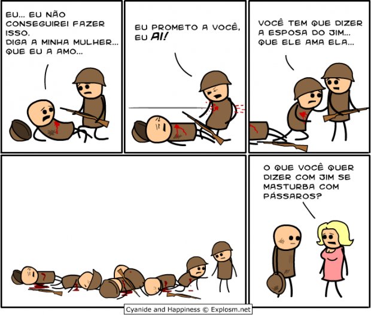
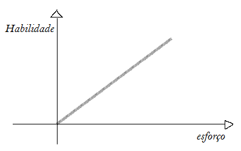
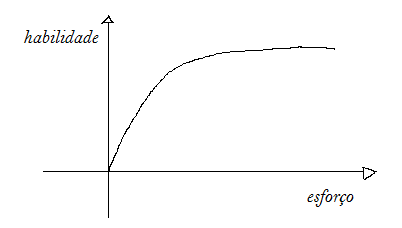

Quanto tempo você diria que uma pessoa leva para ficar boa em algo? 10.000 horas é o que dizem.

Mesmo se você não leu o livro [Outliers](http://www.livrariacultura.com.br/scripts/resenha/resenha.asp?nitem=2653185), do [Malcolm Gladwell](http://en.wikipedia.org/wiki/Malcolm_Gladwell), com certeza já ouviu esse número: você precisa colocar pelo menos 10 mil horas de esforço – ou ainda, 8 horas por dia, todos os dias por 4 anos – para ficar bom em alguma coisa.

Um volume intimidante de esforço, sem dúvida, que só vem a acrescentar à **nossa tendência habitual de não querer tentar coisas novas**.

Pare e pense: imagine que mundo sombrio seria, se as pessoas não tentassem coisas novas, não buscassem hobbies nem descobrissem paixões, por considerar que precisariam de 4 anos de esforço ininterrupto até ficar bom naquilo?

Felizmente, nem todo mundo levou essa “lei” a sério e agora entendemos melhor algumas partes do processo de aprendizado

### Tudo não passou de  uma brincadeira

Lembra dos tempos de criança, de uma brincadeira chamada telefone sem fio? Sua professora organizava a sala em um círculo e contava uma frase no ouvido do aluno mais próximo dela. Esse aluno contava para o próximo, que contava para o próximo, daí em diante.

Até a mensagem original chegar aos ouvidos da professora novamente, com um conteúdo quase sempre completamente diferente do recado original.

Todo mundo que ouviu a história contou ela um pouco diferente e, no final, o recado estava bem distinto do conteúdo original. Foi justamente isso que aconteceu com a pesquisa original sobre aprendizado, na qual Gladwell fundamentou o livro Outliers.

[No artigo original](http://projects.ict.usc.edu/itw/gel/EricssonDeliberatePracticePR93.pdf), o Dr. [Anders Ericsson](http://en.wikipedia.org/wiki/K._Anders_Ericsson), da Universidade Estadual de Flórida, concluiu que performance em um nível *expert*, em campos bem restritos do conhecimento, precisa em média de dez mil horas de prática para ser alcançada. O fraseamento original foi esse: performance em nível *expert*, dez mil horas em média de prática.

A pesquisa foi realizada com pessoas em campos restritos e ultracompetitivos do conhecimento, como violinistas de nível mundial e aviadores. Lentamente, ao cair no conhecimento da mídia (e de pessoas sem capacidade de interpretar artigos científicos em geral), a transformação aconteceu.

O que era “Os experts em nível mundial tem 10 mil horas de prática” se transformou em “você precisa de 10 mil horas para se tornar um expert”, em “é necessário 10 mil horas para ficar bom em algo” até o fatídico “é preciso 10 mil horas para aprender qualquer coisa”. E assim nasceu mais um mito.

Essa confusão não é exclusiva da pesquisa do Dr Ericsson e do livro do Gladwell.

Outro exemplo de mito interessante na área do aprendizado: crianças aprendem língua estrangeira melhor que adultos – o que leva escolas de línguas a lucrar mais dando aula a crianças desde os 3 ou 4 anos.

A pesquisa original, na realidade, aponta que [crianças tem uma vantagem na aquisição de sotaque nativo](http://jurnallingua.com/edisi-2006/4-vol-1-no-1/29-are-children-better-at-learning-languages-than-adults.html) de uma segunda língua graças às cordas vocais e aos músculos responsáveis pela fala serem maleáveis, por não estarem completamente formados. E a forma a qual são expostas à nova língua, num ambiente descontraído e com brincadeiras, também ajuda.

Entretanto, dizer que as crianças possivelmente têm uma vantagem na aquisição de sotaque nativo – que não é necessariamente a mesma coisa que facilidade para aprender a língua – não implica que ela sejam melhores em aprender qualquer coisa.

[Tim Ferris](http://en.wikipedia.org/wiki/Timothy_Ferriss), quando perguntado sobre isso, até brinca:

> “você tem conversado com crianças de 5 anos de idade ultimamente?”

A parte mais curiosa de todo esse culto por volta das “dez mil horas” é que nós não nos importamos quanto tempo vai levar para aprender. Seja sincero, você não se importa depois de quantos dias de prática vai chegar no nível de Anderson Silva ou se você vai aprender a tocar violão como um músico profissional: você só quer ser melhor do que era ontem.

Nós nos sentimos bem quando enxergamos evolução, não necessariamente quando alcançamos nível mundial. É por isso, por exemplo, que artes marciais trazem a ideia da evolução das faixas.

> “Para pegar a faixa preta vai levar cinco anos? Ok, contanto que eu continue evoluindo visivelmente até chegar lá.”

O grande desafio, portanto, é aprender de modo a encarar os desafios observando a própria evolução e chegando a níveis pessoais de performance que agradem a você – e não necessariamente aos juízes de um campeonato mundial.

A boa notícia é que isso leva muito menos tempo do que dez mil horas.

### A Curva do Aprendizado

Vamos colocar em um gráfico, para ficar mais fácil de enxergar.

No eixo vertical, medimos o quão bom você é em algo; na horizontal, a quantidade de esforço investido.

Essa é a ideia geral que temos do aprendizado. Faz até sentido, certo? Quanto mais esforço você coloca, mais resultados você obtém. É o comportamento esperado, se nossos cérebros fossem armários repletos de prateleiras esperando por informações – uma analogia comum para explicar nosso intelecto.

Embora não haja uma compreensão definitiva na área, cientistas têm feito um trabalho muito bom nas últimas décadas, de modo que temos uma boa noção de como aprendemos. O aprendizado de coisas novas é baseado em [schemas](http://changingminds.org/explanations/theories/schema.htm), que são pequenos mapas da realidade.

Você tem schemas para representar um celular, outro para um automóvel, outro para uma fruta. Conforme as ideias ficam complexas, novos schemas são criados baseados nos esquemas anteriores, utilizando estes como pilares.

É por isso que a curva do aprendizado não é linear como normalmente se pensa. Nosso cérebro não é um balde vazio onde você vai jogando dados. Se fosse, quanto mais dados você colocasse, proporcionalmente mais você saberia – como no gráfico acima.

O cérebro se assemelha mais a um organismo complexo, no qual as informações inseridas são processadas e conectadas aos pedaços já existentes. Quanto maior o número de conexões – e não de informações inseridas – maior o conhecimento.

Como o número de conexões cresce fatorialmente com a adição de novas informações – contanto que sejam conectadas– o crescimento inicial, ou seja, o retorno inicial de aprendizado em termos de esforço, é muito grande.

Se forem feitas de modo esperto, as primeiras horas de aprendizado vão trazer o maior retorno possível; você vai do zero até moderado muito rápido. O retorno vai diminuindo com o tempo, até estabilizar em um platô (para ir de muito bom para excelente, o esforço é enorme).

Ou seja, o verdadeiro gráfico de aprendizado seria algo assim:

Esse conhecimento nos traz algumas ideias interessantíssimas sobre o que fazer para acelerar o aprendizado.

### Como aprender qualquer coisa… rápido!

Mantendo a analogia anterior, nem todo pedaço de informação jogado no cérebro é armazenado da mesma maneira. Depende principalmente do quão bem ele é relacionado ao conhecimento já presente e, principalmente, do esforço aplicado para conectá-lo. É desse esforço, consciente e aplicado, que nasce a aceleração do aprendizado.

Oras, se nem todo pedaço de informação é igual, o próximo passo é descobrir quais são os mais importantes e quais devem entrar primeiro para formar o “quebra-cabeça” do conteúdo na mente.

É aí que entra esse novo campo de estudo: o meta-aprendizado.

“Meta” é um prefixo que significa fazer referência a si mesmo. Meta-aprendizado, por tanto, é o estudo da melhor maneira de aprender.

Há alguns livros bons recém publicados na área, como [The 4-hour Chef, do Tim Ferris](http://estrategistas.com/4-hour-chef-tim-ferris/) e o [The First 20 hours: How to learn anything fast, do Josh Kauffman](http://estrategistas.com/as-primeiras-20-horas-josh-kaufman/), ambos sem tradução para português.

O meta-aprendizado cobre uma vasta área, desde a parte de desconstrução e seleção das informações, até a parte de estudo, como técnicas de memória, métodos e afins.

Recentemente, comecei um site e lancei um livro no tema, o Aprendizado Acelerado, para compilar o conhecimento atual e aplicá-lo no dia a dia. [Você pode acompanhar aqui.](http://aprendizadoacelerado.com/)

### Método para aquisição de habilidades

Vou deixar o método proposto pelo autor mais recente, [Josh Kauffman](http://joshkaufman.net/). Se quiser entender um pouco mais, assista à palestra TEDx abaixo.

*[Link Youtube](http://www.youtube.com/watch?v=5MgBikgcWnY)*

Para quem não quiser ver, segue um pequeno passo a passo.

**1. Desconstrua.** Qualquer habilidade é, na realidade, um amontoado de outras sub-habilidades bastante específicas. Se você quer jogar bem futebol, na realidade, você está falando em ficar bom no toque de bola, saber se posicionar em campo, ter visão de jogo, tranquilidade para armação de jogadas e afins. **Quanto mais eficiente a desconstrução, melhor você poderá praticar deliberadamente cada fator que compõe seu objetivo.** Você poderá também selecionar quais os mais importantes e em qual ordem irá abordá-los.

**2. Aprenda o suficiente para se corrigir.** No caminho de um autodidata, reconhecer o próprio erro é fundamental. Enquanto no modo tradicional de estudo isso só viria muito mais tarde, numa abordagem acelerada, o conhecimento que você reuniu sobre a atividade antes de saber executá-la irá ajudar no processo. Ao saber o jeito certo de fazer – antes mesmo de conseguir executar do modo certo –, você dispensa a necessidade de professor nesse cenário: você sabe onde está errando, só precisa praticar mais até acertar.

**3. Remova as barreiras para a prática.** Toda a formação de hábitos pode ser enxergada como remoção de barreiras. Se quer correr depois que acorda, deixe o material de corrida ao lado da cama. Ao acordar, você não vai ter trabalho – barreira removida – para juntar suas coisas e sair de casa. Do mesmo modo com o aprendizado: reúna todas as ferramentas e conhecimento necessário sobre a atividade antes de iniciá-la, para tornar mais provável que você continue praticando.

**4. Pratique pelo menos 20 horas.** O maior impedimento para o aprendizado não é intelectual, mas emocional. As técnicas do meta-aprendizado permitem que você aprenda as coisas no limite humano, mas você não chegará lá se nem ao menos sair do zero. Ser ruim em algo é desagradável, machuca nosso ego e senso de identidade. Por isso, para romper essa barreira – fase do aprendizado em que você é ruim em algo e sabe – faça o compromisso de praticar pelo menos 20 horas.

Vinte horas é o número que a pesquisa de Josh Kauffman encontrou para a prática necessária até você observar que está ficando bom em algo.

Novamente, não são quaisquer vinte horas; tem que ser prática deliberada, consciente e estruturada; mas só a ideia de poder aprender qualquer coisa em 20 horas é libertadora.

Quantos hobbies você iniciaria? Quantas paixões você descobriria se não tivesse medo das dez mil horas no momento de tentar? [anexo ausente]  
  
  
[[anexo ausente]](http://da.feedsportal.com/r/173608455024/u/49/f/530922/c/32911/s/30a9df9d/sc/27/rc/1/rc.htm)  
[[anexo ausente]](http://da.feedsportal.com/r/173608455024/u/49/f/530922/c/32911/s/30a9df9d/sc/27/rc/2/rc.htm)  
[[anexo ausente]](http://da.feedsportal.com/r/173608455024/u/49/f/530922/c/32911/s/30a9df9d/sc/27/rc/3/rc.htm)  
  
[[anexo ausente]](http://da.feedsportal.com/r/173608455024/u/49/f/530922/c/32911/s/30a9df9d/a2.htm)[anexo ausente]

[[anexo ausente]](http://feeds.feedburner.com/~ff/PapodehomemLifestyleMagazine?a=-7JMOwM5xJA:G-qVzgYS2j0:yIl2AUoC8zA)

[[anexo ausente]](http://feeds.feedburner.com/~ff/PapodehomemLifestyleMagazine?a=-7JMOwM5xJA:G-qVzgYS2j0:qj6IDK7rITs)
[[anexo ausente]](http://feeds.feedburner.com/~ff/PapodehomemLifestyleMagazine?a=-7JMOwM5xJA:G-qVzgYS2j0:-BTjWOF_DHI)

[anexo ausente]
