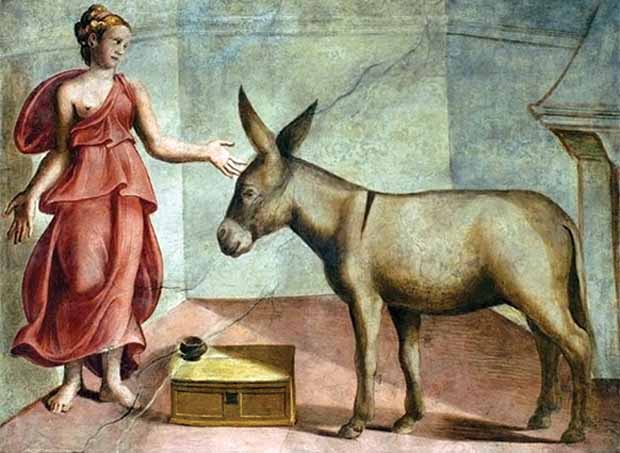

Quando criança, uma vez comprei uma maçã para comer na escola, para só depois reparar que estava bichada. Minha mãe logo me consolou dizendo que esses insetos sabem escolher as maçãs mais doces, portanto, se cortamos aquela parte bichada, o resto da fruta tem uma probabilidade maior de ser melhor.

Não sei se isso é verdade, pode ser só conversa fiada de mãe. Mas ao longo do tempo, me percebi várias vezes envolvido em conflitos estéticos semelhantes, talvez próprios dessa era: jeans e guitarras envelhecidos artificialmente, obsolescência programada, a tensão do tombamento de prédios antigos com as novas construções assépticas, o whisky de 18 anos e o botox.

Em particular, a ficção científica que eu lia na década de oitenta havia sido escrita na década de 50 — e em vez de achar que a ingenuidade, os erros e fantasias próprios dos anos 50 estragavam a leitura, eu achava chique. O nerd atualizado é um hipster, afetado — é uma releitura ultracomercial, de marketing demográfico, da nostalgia zemeckiana-spielberguiana da inadequação social própria de guris leitores de Astounding, nos EUA do início da Era Atômica.

Retrofuturismo

Eu não queria o produto *refurbished*. A coisa original, pelo menos no sentido nostálgico original, é que ficção científica era coisa de sebo, visitar a imaginação de adolescências de décadas passadas — não o blockbuster lançamento, brilhante, com efeitos em CGI plastificado, cheio de merchandising.

É preciso mencionar os dois aspectos fascinantes de algo ser datado. O que é datado é velho, usado, em até certo sentido defeituoso, possuindo como que uma pátina, mas se ao mesmo tempo persiste uma deficiência funcional que não impede o uso, exatamente isso pode se tornar uma característica própria, uma marca a ser prezada, um foco de fetiche particular.

Ou, tal como a maçã bichada, ou a guitarra que em sua época era menosprezada e envelhece para a glória vintage: o que é um defeito sob um aspecto, se revela uma qualidade única.

Explico. No caso da ficção científica datada, as histórias não deixam de ser interessantes porque precisamos ignorar novas descobertas: é precisamente o oposto. São futuros possíveis que nunca virão a existir, e não há nada mais pungente do que isso. Há uma dimensão estética, não prevista na obra original, é claro, que combina ironia com nostalgia pelo que nunca será.

Quando entramos em contato com a estética japonesa, vemos que o budismo deixou as três marcas (ausência de essência, impermanência, insatisfatoriedade) como ensinamentos pincelados na arte, na linguagem e em muitos dos mores japoneses. Recentemente me engajei em conversa com uma jovem e acabamos nos descobrindo admiradores de Japões muito diversos.

O meu é o da simplicidade simultaneamente rústica e refinada do período Edo, dos samurais e do Zen — da cerimônia de chá, do arranjo de flores, das cerejeiras em flor, motivos de arroz, tsunami, tatamis e kimonos, e, no máximo, [o Japão da iconoclástica e marginal nubero bago](http://papodehomem.com.br/o-cinema-da-nova-onda-japonesa/). O Japão da moça é bem outro: aquele do anime [e do Kawaii](http://en.wikipedia.org/wiki/Kawaii). O Japão ultramoderno, onde a colonização e até mesmo subjugação cultural ocidental entra em choque com o passado rico e que continua produzindo uma das culturas mais peculiares do mundo, mesmo em meio à plena globalização.

É o tradicional e local subjugado e misturado num sumô quase sexual com o novo e o estrangeiro. A transformação da humilhação da derrota em uma espécie de vitória que aos poucos tanto se amarga quanto se trivializa.

[O wabi-sabi](http://en.wikipedia.org/wiki/Wabi-sabi) transforma o ensinamento das três marcas em imperfeição, pátina e incompletude. Por exemplo, um bule de metal é considerado mais bonito, na perspectiva wabi-sabi, quando o metal está ligeiramente amassado, ou quando o uso contínuo no fogo marcou o metal com um degradê específico de cores, ou até mesmo quando detalhes decorativos se perderam.

Exemplo de acabamento Wabi-sabi

Da mesma forma que aconteceu com as guitarras ou o jeans, que são deliberadamente envelhecidos, a estética wabi-sabi gerou uma indústria voltada a produzir a simulação do uso contínuo. E da mesma forma que uma guitarra vintage com certificado de autenticidade vale mais, os objetos do wabi-sabi ganham um valor muito grande quando o processo de envelhecimento é considerado, por especialistas, autêntico.

Nossa cultura de obsolescência programada não valoriza a pátina, especialmente em eletrônicos. Esses gozam de um outro tipo de transitoriedade. Lembro de, quando criança, chegarmos a criar ligação emocional com um objeto tal como uma TV ou equipamento de som. Quando ele precisava ser substituído, nos dava dó. Hoje em dia, quem pensa um segundo sobre seu iPhone 5s ao comprar um iPhone 6? Pensa só em por quanto pode revender, ou quando muito, para quem pode dar.

Não há sentimentalismo nenhum.

Não que eu defenda o sentimentalismo, mas meu próprio smartphone já tem “marcas de caráter”, como arranhões no vidro e tinta descascada.

Já passou por um conserto. Ainda assim, algumas vezes me pego examinando as novidades no mercado, quase criando a necessidade artificial de trocar algo que é perfeitamente funcional, mas que já está meio evidentemente surrado. O que fazemos nessa cultura de obsolescência, muitas vezes, é encontrar uma desculpa qualquer para trocar de aparelho.

Dois anos com um aparelho só é uma eternidade!

Um pouco por ambientalismo, um pouco por não querer ser manipulado pela cultura de obsolescência programada, eu uso a desculpa do wabi-sabi: esses arranhões fazem parte de minha história com esse aparelho e, enquanto ele não for perdido, não estragar definitivamente, ou os novos chegarem num nível de funcionalidade significativamente superior, por um preço bem mais baixo, me recuso a comprar outro (além de nunca ter comprado e me comprometer a nunca vir a comprar qualquer coisa da Apple. Mas essa é outra história).

Mas essa reflexão sobre a beleza da imperfeição vai mais longe do que uma mera reflexão sobre fetiche, objetos, arte e consumismo.  
 Da mesma forma que nossa cultura idealiza o novo, o livre de máculas, defeitos e marcas de uso em termos de objetos, o fazemos também com pessoas, tanto no que diz respeito a suas aparências físicas quanto no que diz respeito a suas personalidades.

Quem se importa com a simetria?

A cultura do Photoshop nos faz valorizar um grau de simetria, facial de forma geral, ou de seios, por exemplo, tratando-se de uma mulher, que é absurdo. No mais das vezes, é possível perceber manipulação digital ou cirurgia, mas mesmo quando essas pessoas são naturalmente assim, sua perfeição em si, ainda que atraente, se torna um tanto perturbadora.

Ela é atraente enquanto ideal, mesmo que essa perfeição (física, ou menos comumente, moral) frequentemente nos leve a uma espécie de sentimento alienígena, [não dissimilar ao vale do estranhamento](http://en.wikipedia.org/wiki/Uncanny_valley). Ou, no mínimo, salienta nossa própria imperfeição, o que aumenta nossa insegurança.  
 Em certo sentido, para a maioria de nós de beleza mediana ou mesmo relativamente feios, levar para cama um objeto de ideação leva, muito normalmente, a duas consequências: ou nos tornamos um creep, gozando com a degradação a que submetemos o objeto em que projetamos perfeição, degradação essa que vem por nossa mera associação com ele, ou broxamos de insegurança perante a assimetria que o casal em si representa.

Num sentido moral, essa assimetria também é perturbadora. Apuleio descreve — em seu [*Metamorphosis*](http://pt.wikipedia.org/wiki/O_Asno_de_Ouro) – um homem que vira um asno e, numa cena, se recusa a fazer sexo com uma mulher que havia sido condenada a essa degradação pública (fazer sexo com um animal) por ter matado os filhos e o marido.

“Não te quero”

Os extremos de perfeição e imperfeição, em termos de pessoas, criam sentimentos igualmente extremos. Na moderação, o ideal de prudência, ansiamos um grau mínimo ideal de corrupção, ou como no ditado Zen, “80% é perfeito”. É como o dopar dos vidros ou fogos de artifício, ou cristais artificiais, com pequenas impurezas a fim de obter efeitos e colorações bonitas. A perfeição, em certo sentido, também se torna desinteressante.

Nos romances arturianos, Gawain segue a risca o código da cavalaria — e isso o coloca em tensão com [as regras do amor cortês](http://pt.wikipedia.org/wiki/Amor_cort%C3%AAs). Lancelot, em sua maior humanidade e falibilidade, em sua interpretação mais flexível de ambos os conjuntos de regras, chega mais perto do amor verdadeiro e do Graal.

Uma das doutrinas mais belas da fé cristã é a ideia de que Deus nos ama porque somos pecadores. Qualquer perfeição, já faz parte da deidade.

É na medida em que nos afastamos de Deus que seu amor por nós cresce. Para solucionar o problema de explicar a existência do mal, o cristianismo precisou estipular que Deus criava seres separados e independentes, com livre-arbítrio. E ao fazer isso, e ao louvar Deus como a epítome do amor e do perdão, o cristianismo acaba canonizando o maior pecador, porque ele justamente é quem revela mais intensamente a glória de Deus no mundo.

Historicamente as doutrinas cristãs mais exageradas, talvez fundamentalistas, que enfatizam perfeição moral, são as que normalmente quebram a cara com grandes escândalos. Nas formas mais caridosas da religião os seus praticantes mergulham no sofrimento do mundo, seguindo o exemplo de Jesus, e lidam com párias, prostitutas, ladrões.

Eles não conseguem isso projetando grande superioridade moral, mas exatamente exsudando humanidade, revelando suas imperfeições de forma corajosa.

Da mesma forma, num sentido um pouco inverso, o tapeceiro islâmico inclui pequenas imprecisões na geometria de suas obras, para não ofender Alá, que é o único perfeito.

Quando alguém querido morre, algumas vezes justamente aquilo que nos irritava é lembrado com doçura. Algum hábito peculiar, de que reclamamos tantas vezes, se torna fonte de saudade. Por que isso acontece?

*[Link YouTube](http://youtu.be/OclXg0Xc_yI)*

A perfeição pode não existir, senão como ideal. Ou, num sentido mais profundo, a imperfeição é justamente um adorno da perfeição. Nesse sentido também, 80% é perfeito. Burilar um texto até que todas as ideias se concatenem e produzam um sentido, é algo como pregação religiosa. Podemos simplesmente, em vez disso, deixar espaços na imaginação, e dar saltos lógicos, e até cometer erros, e não saber como encerrar.

E tudo isso se revela uma mandala de sentidos infinitos, sem ninguém convencer ninguém de nada, mas ainda assim cheio de sentido, propósito e amplidão.

Como no jardim Zen, onde o monge varre todas as folhas secas, e então sacode a árvore para que algumas caiam e diz “agora está perfeito”, nossa beleza física e moral está em seu ápice quando não almeja a perfeição, mas um estado não afetado de honestidade e naturalidade. A maçã pode não ser exatamente melhor por ser bichada, mas ela sendo o que é, não falta nada.

***Nota do editor:** a foto de capa foi tirada pelo próprio Pinheiro, “guitarra ‘relicada’ que o autor ganhou de um amigo. Imita uma Fender 1962″.*

  
 por Eduardo Pinheiro
  
  
 [[anexo ausente]](http://pubads.g.doubleclick.net/gampad/jump?iu=1051165/PdH_Feed_superbanner/leaderboard&sz=728x90&c=284191791) 
[anexo ausente]
  
  
  
[[anexo ausente]](http://da.feedsportal.com/r/204367656316/u/49/f/530922/c/32911/s/3e9328b5/sc/26/rc/1/rc.htm)
  
[[anexo ausente]](http://da.feedsportal.com/r/204367656316/u/49/f/530922/c/32911/s/3e9328b5/sc/26/rc/2/rc.htm)
  
[[anexo ausente]](http://da.feedsportal.com/r/204367656316/u/49/f/530922/c/32911/s/3e9328b5/sc/26/rc/3/rc.htm)
  
  
[[anexo ausente]](http://da.feedsportal.com/r/204367656316/u/49/f/530922/c/32911/s/3e9328b5/sc/26/a2.htm)
[anexo ausente]

[[anexo ausente]](http://feeds.feedburner.com/~ff/PapodehomemLifestyleMagazine?a=I1BEoJSJwTk:BVqnsv26aWU:yIl2AUoC8zA)
[[anexo ausente]](http://feeds.feedburner.com/~ff/PapodehomemLifestyleMagazine?a=I1BEoJSJwTk:BVqnsv26aWU:D7DqB2pKExk)
[[anexo ausente]](http://feeds.feedburner.com/~ff/PapodehomemLifestyleMagazine?a=I1BEoJSJwTk:BVqnsv26aWU:qj6IDK7rITs)
[[anexo ausente]](http://feeds.feedburner.com/~ff/PapodehomemLifestyleMagazine?a=I1BEoJSJwTk:BVqnsv26aWU:-BTjWOF_DHI)

[anexo ausente]
