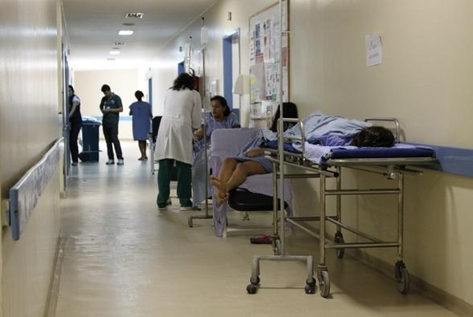
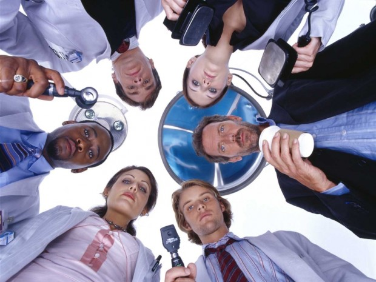
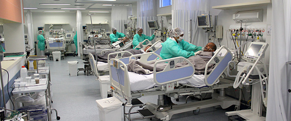

Esse está sendo um ano bem intenso. Teve Copa. Com protestos abafados perto dos estádio caros. Agora, as eleições mais loucas da histórias estão tomando seu rumo, enquanto leitos e [muitos outros recursos insistem em ir embora](http://www1.folha.uol.com.br/fsp/cotidiano/177288-santa-casa-de-sao-paulo-fecha-emergencia.shtml), cubanos, beltranos e ciclanos chegaram e devem continuar a vir.

O debate arrefeceu, como de praxe. O mais próximo que temos chegado de  uma “discussão” resume-se à divulgação acrítica de condutas erradas dos profissionais estrangeiros, ou de notícias sobre suas “fugas”, acompanhadas de frases de efeito algo levianas e infantis. Manifestações assim parecem apenas reforçar estereótipos e congelam ainda mais o diálogo verdadeiro. Por mais que tenhamos visto atrocidades serem cometidas pelos colegas expatriados, reforçar essa cisão não parece produzir mais do que embate cego e estéril. E é exatamente o que vemos, invariavelmente, nas caixas de comentários dessas notícias.

De um lado, médicos brasileiros se assustam, revoltam-se e choram abraçados os erros daqueles. Do outro, opiniões veementes fundamentadas em preconceitos sustentam a empáfia dos que apontam o dedo mais uma vez para a classe surrada dos possuidores de CRM.

Não há dúvidas de que a pauta precisa ser retomada. As intenções duvidosas daqueles que nos “representam” parecem ter seu caminho abonado. A eleição está aí.

### Saúde = Medicina?

É até difícil escolher um ponto de partida, tamanha a quantidade de ingerências e erros de conceito das últimas ações do governo nesta área, mas provavelmente o maior dos equívocos se resume à redução da atenção à saúde ao atendimento médico.

Considerando a imagem que o governo tem pintado (e muita gente comprou) dos médicos – arrogantes, elitistas, preconceituosos e corporativistas – talvez espante alguns leitores minha defesa de que a saúde vai muito além das ações pontuais que terminam com meu carimbo e assinatura.

Sei disso em primeiro pessoa, entretanto, tendo visto de perto. Conheço boa parte dos cenários e realidades do Brasil, não só no que diz respeito à saúde. Cada pequena experiência me ensinou um motivo diferente para que a presença do médico por si só não chegue a fazer grande diferença na vida de ninguém, além de me garantir tranquilidade em afirmar categoricamente que a tão alegada omissão dos usuários de avental branco não figura entre os principais motivos para a situação de guerra em que nos encontramos na atenção à saúde.

Nasci e me criei na Serra Gaúcha, com toda sua rica cultura e seu IDH igual ao da Bélgica. Em meio à polêmica, presenciei amigos de Carlos Barbosa – [o município com maior Índice de Desenvolvimento Socioeconômico do estado](http://pioneiro.clicrbs.com.br/rs/economia/noticia/2014/04/politicas-publicas-e-forte-atividade-economica-garantem-a-carlos-barbosa-o-topo-no-indice-de-desenvolvimento-gaucho-4465168.html) – relatando os problemas que o município enfrenta para contratar médicos. Se o problema não é só com os rincões pobres e longínquos do país, deve haver algo mais a desmotivar os médicos além do “custo-benefício” monetário e do conforto pessoal, como alegam seus detratores.

Estudei medicina na Universidade de São Paulo, o que me colocou em contato com uma infinidade de mundos. Alguns professores da [Casa de Arnaldo](http://pt.wikipedia.org/wiki/Arnaldo_Vieira_de_Carvalho) lecionam também em Harvard e outros centros de referência. Ouvi de um deles, na recepção aos calouros, que boa parte dos nossos alunos do quarto ano desempenharia melhor que os recém-egressos das melhores escolas médicas americanas, por conta, entre outros fatores, de sua desenvoltura relacional e postura humanizada. Não parece, então, que o problema repouse em uma formação deficiente e dependente de tecnologias, ou de “falta de humanidade” dos médicos brasileiros, como já se advogou.

Frequentei desde cedo [o maior complexo hospitalar da América Latina](http://pt.wikipedia.org/wiki/Hospital_das_Cl%C3%ADnicas_da_Faculdade_de_Medicina_da_Universidade_de_São_Paulo), que conta com tecnologias inexistentes na maioria dos hospitais do mundo e sofre com absurdos gerenciais e executivos que espantam os mais calejados; que opera com material humano tão heterogêneo quanto desvalorizado; onde UTIs fecham leitos por falta de utensílios básicos, deixando médicos ociosos e pacientes desassistidos; onde feudos de especialidades dispõem dos materiais e recursos mais esdrúxulos enquanto faltam luvas, cateteres e outros dispositivos prosaicos no vizinho; onde é mais fácil comprar equipamentos bonitos que contratar enfermeiros ou provê-los de condições mínimas de trabalho.

Faz sentido gabar-se de filigranas estapafúrdias quando o básico é insuficiente? Se não faz na saúde, para a política parece uma boa estratégia.

Durante a graduação, estagiei em Brescia, na Itália, junto a estudantes de medicina de vários países – não só europeus. Pude discutir com muitos deles sobre os modelos de atenção à saúde em seus locais de formação e atuação. Absolutamente nenhum deles relatou qualquer movimento em direção à priorização da atividade médica nos seus sistemas de saúde; pelo contrário, a multidisciplinaridade e a interdisciplinaridade já perpetraram há tempos a transição do status de  “tendências” para “o padrão”.

A Austrália, por exemplo, é referência mundial em cuidados a pacientes graves e isso não foi conquistado com batalhões de médicos. Em um artigo de 2007 explicando os resultados surpreendentes do país, em periódico científico de grande impacto, um dos grandes “astros” da Medicina Intensiva – [Prof. Rinaldo Bellomo](http://www.anzicrc.monash.org/rinaldo-bellomo.html) – salientou a atuação de enfermeiros, fisioterapeutas e farmacêuticos entre os fatores principais da excelência do sistema.

Participei – em uma edição como membro-aluno e em duas como diretor – do maior projeto de extensão da USP, a [Bandeira Científica](http://www.bandeiracientifica.com.br), iniciativa nascida na Faculdade de Medicina na década de 50 e que hoje leva centenas de profissionais de vários campos de estudo (não só os diretamente relacionados à saúde) a localidades com carência de recursos e desassistidas. Conheci vários locais no Norte e Nordeste e explorei seus sistemas de atenção à saúde *in loco*, por dentro. Boa parte das ações mais modificadoras e perenes do projeto vieram da atuação das outras unidades da Universidade; a Medicina – que me perdoem os colegas – é coadjuvante.

Servi voluntariamente à Força Aérea Brasileira como Oficial Médico, na Amazônia, entrando em contato com realidades ainda mais diversas – no próprio meio militar e em comunidades “civis” que nem sonham com os direitos a que remete essa nomenclatura “taxonômica” de ser humano. Apesar da experiência enriquecedora (para mim), não pude mudar muito suas vidas.

Em todas essas vivências, estive cercado de mestres não-médicos, que me ensinaram muito. Hoje, [trabalhando em UTI](http://papodehomem.com.br/um-dia-na-uti-mundo-interno-2/), tenho ainda mais certeza de que não faço nada sozinho.

Pra início de conversa, portanto, restringir – ou mesmo concentrar – os esforços em aumentar o número de médicos é ignorar uma parte gigantesca do que chamamos de “saúde”.

### Saúde é só saúde?

Além de ignorar a atuação dos outros profissionais de saúde, nosso governo e boa parte dos que se manifestam a respeito do assunto parecem esquecer-se da infinidade de outros fatores que compõem esse conceito intrincado.

A Organização Mundial da Saúde, em sua Constituição – numa definição  que foi repetida incontáveis vezes ao longo da minha graduação – preconiza algo muito além da mera ausência de doenças. “Saúde”, segundo esta entidade, pode ser definida como *“um estado de completo bem-estar físico, mental e social.”* Ou como *“a medida em que um indivíduo ou grupo é capaz, por um lado, de realizar aspirações e satisfazer necessidades e, por outro, de lidar com o meio ambiente”*, como propõe o Escritório Regional Europeu da OMS.

Isso dificulta um pouco a resposta a uma pergunta feita por um amigo em meio à discussão: *“como se faz nos países em que o sistema de saúde funciona?”*.

O ponto cego dessa questão é que sistemas de saúde que “funcionam” existem em sociedades que “funcionam”. Muito pouco podemos fazer pela saúde em determinadas situações sem modificar toda a estrutura social profundamente.

Suponhamos, por exemplo, que eu ignore [vários preceitos éticos](http://www.portalmedico.org.br/include/codigo_etica/dir_med.htm), feche os olhos às circunstâncias criminosas e aceite ir para qualquer município desassistido nos extremos do nosso país, motivado a levar “saúde” àqueles que dela necessitam.

Sabemos que boa parte dos determinantes da saúde passa por manter hábitos saudáveis. Boa alimentação, atividade física regular, prevenção de vícios como tabagismo e etilismo, vacinação, cultivo da mente, desenvolvimento de habilidades e obtenção de conhecimento, interação social e participação na vida comunitária – e uma infinidade de etc.

Como um médico de formação razoável e intenções das melhores, procuro orientar meus pacientes nesse sentido, obviamente. Procuro tratar as doenças crônicas também, para prevenir complicações e melhorar sua qualidade de vida. Nos poucos casos em que essas complicações são inevitáveis, referencio os pacientes aos centros determinados pela [organização do SUS](http://papodehomem.com.br/sistema-de-saude-modo-de-usar/), para o tratamento devido.

Acontece que o seu Severino – meu primeiro paciente neste hipotético município – está bem longe de poder comprar ou obter de outra forma comida minimamente saudável. Talvez, mesmo que tivesse o dinheiro, não conseguisse obter por aqui algo muito diferente da sua dieta hipoprotéica, baseada em carboidratos de alto índice glicêmico e gordura saturada.

A dona Raimunda, por sua vez, terá alguma dificuldade em exercitar-se diariamente – descalça em terreno irregular, com pouco acesso a água e sob o sol escaldante. Ainda mais tendo nutrientes valiosos roubados pelas verminoses que a pouca água disponível lhe fornece.

O filho deste casal oprimido mudou-se para São Paulo, tentando a sorte num filme que todos já viram muitas vezes. Vive exposto à violência, deslocando-se [longas distâncias em meios de transporte que lhe presenteiam toneladas de poluentes](http://vimeo.com/7835155), sem tempo, recursos ou conhecimento para cuidar da própria saúde. Está cada vez mais deprimido e ansioso e as garrafas de cachaça barata, com níveis tóxicos de metanol, parecem atraentes. Meus colegas que ficaram no Hospital das Clínicas pouco poderão fazer por ele quando chegar ao pronto-socorro cego, com acidose metabólica grave e com disfunção cardíaca por conta disso.

[Link Vimeo](https://vimeo.com/7835155)

Um amigo desse paciente grave anda fumando cada vez mais – mas não consegue comprar o cigarro estiloso que alguns talvez consumam com ares de James Dean nos bares das faculdades. Fuma cigarros paraguaios contrabandeados, comprados no “comércio informal”, com níveis ilegais de nicotina e filtros irregulares (quando presentes), que viciam algumas vezes mais e o matarão um pouco mais rápido – não antes sem que necessite de investigações e cuidados cujos custos suplantam algumas dezenas de vezes o que custariam medidas de educação e fiscalização para barrar o processo no início.

Sua companheira, menor de idade, terá dificuldades para criar o terceiro filho – já a caminho – sem a pequena mas providencial renda dos seus “*freelances”* de auxiliar de obras, feitos sem registro, direitos ou equipamentos de proteção individual. Essa frágil família talvez seja obrigada a voltar para a cidade em que a moça nasceu, muito parecida com aquela em que me estabeleci.

Não precisamos nos estender muito mais. Provavelmente, todos perceberam que minha presença, ou de quantos médicos houvesse no mundo, não deve beneficiar de qualquer forma nenhum desses seres.

### Mais ou Menos Médicos

Finalmente, como exercício mental, suponhamos que nossa prioridade fosse de fato arrebanhar um contingente maior de médicos. E que fosse válido “importa-los” de algum jeito.

Quando visitei a Holanda durante minhas férias, em 2011, tive uma inoportuna sinusite e pude constatar duas coisas. A primeira é que em Amsterdã podem-se comprar tranquilamente, a qualquer hora do dia, uns vinte tipos diferentes de maconha, haxixe, cogumelos alucinógenos e materiais variados para contrabando e consumo de drogas – mas nunca antibióticos ou corticóides sem receita médica. A segunda é que minha Identidade Médica, emitida pelo Conselho Federal de Medicina, não tem valor algum fora da *terra brasilis*.

A discussão sobre entorpecentes fica para uma outra ocasião, mas os outros aspectos do sistema de saúde holandês são absolutamente louváveis. Não me senti discriminado, diminuído ou hostilizado. Não foi pessoal, nem preconceito racial, de classe ou geográfico. São apenas regras, ponderadas para a proteção de todos.

Qualquer médico que se aventure à prática em outros países passa por processos de avaliação de suas competências para ser reconhecido como profissional de saúde habilitado.  O fato de médicos estrangeiros – venham de onde vierem – privarem-se desta obrigação ao submeterem-se às condições daquele conhecido programa do governo brasileiro é apenas um dos contrassensos absurdos das políticas demagógicas desses anos.

No que diz respeito ao processo específico de reconhecimento dessas competências na nossa pátria amada (o famigerado “Revalida”), enormidades de desconhecimento e discursos descartáveis afloraram nas discussões.

Como não gosto de opinar sobre o que não conheço, busquei investigar esse mecanismo e o que se diz sobre ele. A avaliação abrange as áreas básicas do conhecimento médico, aferindo habilidades que se consideram fundamentais ao médico generalista para uma prática aceitável e segura.

Tive acesso à prova teórica objetiva, que é o maior balizador da primeira fase do processo. Trata-se de um exame com 110 questões, que o candidato deve responder em 5 horas. São aprovados aqueles que obtêm um desempenho maior do que 55% de acertos.

Formado há cinco anos e especializando-me em Clínica Médica e Medicina Intensiva, há muito não estudo a fundo diversos assuntos que não dizem respeito à minha área de atuação (como pediatria ou ginecologia, por exemplo). Ainda assim, respondi a prova em 2h30min e acertei 75% das questões, sem nenhuma dificuldade.

Espantoso verificar que em 2012 cerca de 92% dos colegas imigrados foram **reprovados** nesta prova que fiz brincando, privado de sono em um pós-plantão. Muito mais espantoso ainda é ler alguns discursos proclamando que o exame é “feito para reprovar”, com nível de exigência propositadamente muito elevado e questões muito complexas. Difícil saber se a base desses discursos é desinformação inocente ou interesses escusos.

### “Que mal tem”?

Se alguém ainda considera que possa haver algum benefício em trazer supostos médicos a preço de ouro no contexto de caos da nossa saúde, basta lembrar de alguns outros percalços do programa e da prática médica no Brasil, além dos aspectos conceituais que explorei.

Muitos municípios demitiram os médicos que já trabalhavam em suas Unidades Básicas de Saúde para obter o benefício de um profissional cujo “salário” é pago pelo governo federal, ou seja, com a desculpa de que não há médicos, importamos quase-escravos de formação pífia para aloca-los em postos já previamente ocupados.

Isso vem somar-se a inúmeros relatos de médicos que se aventuraram em locais inóspitos e viram a promessa de um trabalho digno e significativo tornar-se um pesadelo de pressões políticas, coação, violência e ausência de recursos para o trabalho ou de remuneração. A presença de um médico é uma arma política utilíssima, independente do trabalho que possa fazer. Transformar esses profissionais em marionetes indefesas nunca foi muito difícil para nossos coronéis, sendo a única saída mais ou menos digna a “deserção” do posto.

Não é de espantar, ainda, que muitos médicos brasileiros, também enganados, tentassem inscrever-se para trabalhar no programa do Governo Federal e não conseguissem de jeito algum. Brincou-se, no meio médico – não sem um tom de tristeza resignada – que, se o candidato preenchesse o campo “CRM” no cadastro, estava automaticamente desclassificado do Mais Médicos.

Não é nada fácil ouvir que a culpa é sua depois disso tudo.

### Médicos e Monstros

O duelo entre médicos e população esvazia-se por completo quando lembramos que queremos a exata mesma coisa: saúde de qualidade acessível de forma equânime.

A estratégia do governo tem sido retratar a classe médica como um grupo de milionários inescrupulosos reunidos em torres altas e escuras, torturando gatinhos, maquinando maldades contra os pacientes e planejando dominar o mundo. Pitoresco e estúpido, mas infelizmente muita gente comprou a ideia.

Não temos interesse em piorar a saúde das pessoas. Estudamos e trabalhamos para fazer o inverso. Ter que escrever isso, com todas as letras, como se não fosse óbvio, é tão ridículo quanto trágico.

E a tragédia, como sempre, se abate sobre aqueles que não podem se defender. Nesse abjeto jogo de forças, cai tudo sobre as mesmas cabeças de sempre. Os pacientes, especialmente os mais pobres, sofrem e são enganados mais uma vez.

Talvez devêssemos ouvir um pouco mais esses seres que dedicam suas vidas a cuidar do outro, já que o assunto é justamente esse. Se perderam a aura do sacerdócio (apesar de ainda serem exigidos nestes termos), devíamos ao menos respeitar o pouco conhecimento que acumulam tão arduamente. A fala dos médicos ecoa há tempos na esperança de frear os interesses sórdidos que têm minado e impedido nosso trabalho. Seu discurso pode não ser a epítome do saber, mas certamente é melhor embasado que opiniões construídas em mesa de bar ou leituras rasas na internet.

Não somos cegos ou hipócritas. Não defendemos nesta guerra interesses egoístas, mesmo porque essa encenação toda praticamente não afeta pessoalmente a grande maioria dos médicos. Não queremos “proteger o mercado”, como foi dito. Não concorreremos com os colegas estrangeiros.

Nossa dor reside na ruína dos valores que prezamos e nos insultos seguidos à nossa ética. Nossa dor reside em ver agora aquele por quem nos dedicamos, mais do que apenas desamparado: iludido. Cai vertiginosamente, com fé cega na rede de proteção que lhe foi anunciada. O impacto é iminente.

Ofensas vazias voam na direção dos médicos sem qualquer critério e não é por esse caminho que avançaremos. Não somos mercenários. Não somos cínicos. Não somos covardes.

Aqui mesmo, já [expliquei e defendi o modelo do SUS](http://papodehomem.com.br/sistema-de-saude-modo-de-usar/), contribuí para a [promoção à saúde](http://papodehomem.com.br/alerta-sedentarismo-faz-tao-mal-quanto-cigarro/), tentei [desfazer enganos](http://papodehomem.com.br/exame-de-prostata-voce-nao-precisa-de-um-toque-retal/) e elogiei boas ações do governo [quando era justo elogiar](http://papodehomem.com.br/remedio-de-graca-e-o-que-a-asma-da-dona-maria-tem-a-ver-com-voce/). Mas isso que aí está, desculpem, não dá pra engolir.

Só quem já viu pacientes morrerem, cercados de médicos, por falta dos recursos mais básicos conhece o desespero que vivo. E sistemas que jogam médicos e pacientes uns contra os outros só podem resultar em mortes, em ambos os “lados”; [a China tem sido prolífica em exemplos](http://www.newyorker.com/magazine/2014/08/25/under-the-knife)e [não andamos muito atrás](http://noticias.uol.com.br/saude/ultimas-noticias/redacao/2013/10/18/posto-de-saude-e-fechado-em-maceio-apos-medica-ser-agredida-por-paciente.htm). Ou repensamos profundamente o rumo que estamos tomando ou nos lembraremos para sempre da calamidade que voluntariamente produzimos.

  
 por Lucas Pedrucci
  
  
 [[anexo ausente]](http://pubads.g.doubleclick.net/gampad/jump?iu=1051165/PdH_Feed_superbanner/leaderboard&sz=728x90&c=606349736) 
[anexo ausente]
  
  
  
[[anexo ausente]](http://da.feedsportal.com/r/206158324892/u/49/f/530922/c/32911/s/3ef55cc8/sc/27/rc/1/rc.htm)
  
[[anexo ausente]](http://da.feedsportal.com/r/206158324892/u/49/f/530922/c/32911/s/3ef55cc8/sc/27/rc/2/rc.htm)
  
[[anexo ausente]](http://da.feedsportal.com/r/206158324892/u/49/f/530922/c/32911/s/3ef55cc8/sc/27/rc/3/rc.htm)
  
  
[[anexo ausente]](http://da.feedsportal.com/r/206158324892/u/49/f/530922/c/32911/s/3ef55cc8/sc/27/a2.htm)
[anexo ausente]

[[anexo ausente]](http://feeds.feedburner.com/~ff/PapodehomemLifestyleMagazine?a=aQotI-NLIxc:gnlzg82pNxY:yIl2AUoC8zA)
[[anexo ausente]](http://feeds.feedburner.com/~ff/PapodehomemLifestyleMagazine?a=aQotI-NLIxc:gnlzg82pNxY:D7DqB2pKExk)
[[anexo ausente]](http://feeds.feedburner.com/~ff/PapodehomemLifestyleMagazine?a=aQotI-NLIxc:gnlzg82pNxY:qj6IDK7rITs)
[[anexo ausente]](http://feeds.feedburner.com/~ff/PapodehomemLifestyleMagazine?a=aQotI-NLIxc:gnlzg82pNxY:-BTjWOF_DHI)

[anexo ausente]
