A bola foi cantada pelo amigo Rafael Nardini: “cara, por que vocês não falam de caras bonitos?”.

É. Por que não?

Não se trata de um desafio, de provar um ponto, mudar cenário. A ideia é ter a conversa mais natural possível sobre homens que achamos bonitos e as razões pelas quais a beleza deles nos atrai de alguma forma. Atores, cantores, amigos e outras figuras masculinas que chamam a atenção.

Abrindo o papo, o amigo Rafael Nardini. Em seguidas, muitos outros:

### Rafael Nardini (d’[OcicerO](http://ocicero.com/)) — Brandon Boyd e Andrea Pirlo

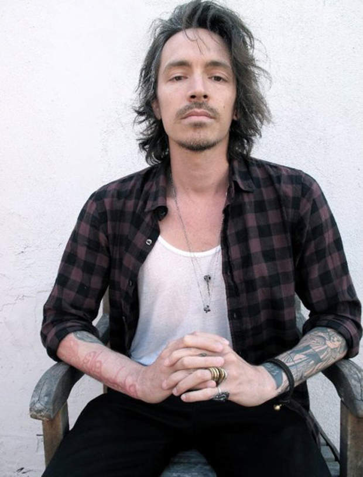

[O Incubus](http://pt.wikipedia.org/wiki/Incubus) é única coisa que presta daquela ondinha bizarra do nu metal. Sabia mesclar uma caralhada de influências e fazia um som maneiro. Um dia desses parei para ouvir o [*A Crow Left Of The Murder*](https://www.youtube.com/watch?v=_xEEqwyv-MU&list=PL737BE2AEB12FA000) com todo o preconceito do mundo e descobri que continuo achando bem massa aquilo tudo. O mesmo aconteceu com o [*Morning View*](https://www.youtube.com/watch?v=bCDoC-ue-F0), outro disco honestíssimo, ponta firme mesmo.

Quem dava as cartas por ali era o Brandon Boyd, o cara que o Nardini versão 2000 achava massa. Ele desenhava genialmente, escrevia bem, cantava para caralho e era alvo da mulherada. Claro, para completar ainda era pintozão e tudo: tatuagens foderosas e aquela aura californiada do maconheiro do surfe que vai de bike encontrar com as minas. Nice!

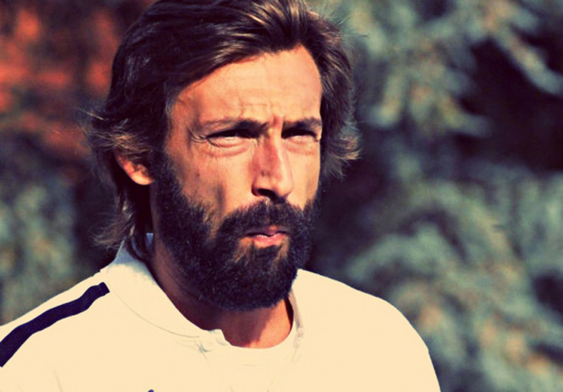

Já o Pirlo tem aquele ar de cafajeste de filme B tosco.

Cedo ou tarde ele vai conquistar a donzelinha e quem mais aparecer pela frente. Ele comanda. É tudo com ele. Acima de tudo, no mundo do futebol, que abriga Cristiano Ronaldo e sua sobrancelha milimetricamente feita como símbolo de beleza, o regista barbudão emprega uma bom porção de elegância real ao calcio.

E isso é foda para caralho.

### Pedro Jansen (do [Noize Fuzz](http://noizefuzz.com.br/)) — James Franco

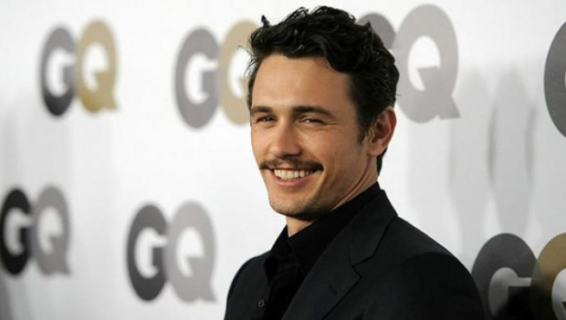

Meu homem bonito é o James Franco.

Fui dar uma olhada no Google Images, pra sacar a formosura do cara e me deparei com ele sendo gatão em diversos momentos diferentes. De cabelo grande e desgrenhado. De cara chupada e cabelo raspado. Como gatão modelo na capa de revista e como maconheiro de filme de comédia.

O cara é bonito de bigode e de cara lavada. Era bonito novinho e foi envelhecendo bonito. Vê a foto grande que eu anexei: o cara é bonito até dormindo. Queixo quadradinho, cara de atrevido, sorriso mega espontâneo, olho de quem olha no olho. Se nada disso explicar, tem esse vídeo aqui:

[*Link YouTube*](http://youtu.be/-J2UZZ45BqU)

### Rafael Campos (do [Correio Braziliense](http://www.correiobraziliense.com.br/)) — Alexandre Nero

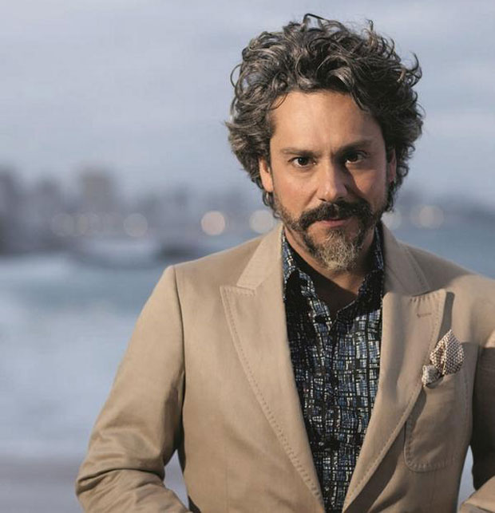

A beleza pode até ser algo relativo, mas acho bem mais complicado definir o bonito que o feio. Como o belo estimula a contemplação, fica mais difícil encontrar racionalidade para definir que aspectos naquela pessoa te fazem desejar levá-la prum passeio no shopping lotado. Ou, pior, complicam as justificativas do porquê você enxerga naquela pessoa alguém bonita o suficiente para querer ser visto em sua companhia no shopping. De mãos dadas.

O ator Alexandre Nero se encontra, para mim, nesse segundo grupo. Sua falta de beleza clássica (há como definir tal termo?) está mais para um padrão de galã dos anos 70. Mas é em 2014 que ele, grisalho, barbudo e com um topete que deixaria o finado Itamar Franco com invenja, causa aquela sensação de “Quero descobrir o que esse cara tem.” E criar essa dúvida na mente de quem você quer conquistar me soa muito mais eficaz que um tanquinho.

Não o acho “estiloso”. Não o acho “presença”. Sua relação com fãs até causa suspiros além dos atributos físicos e é fato que seu talento pode funcionar como afrodisíaco. Porém, basta simplesmente olhar para o moço e pensar: taí um cara que eu pegaria. Ou, se sua heterossexualidade não permite nem mesmo admitir tamanha verdade, pode dizer: “Esse aí eu me orgulharia de ter como cunhado.”

### Jader Pires (editor [do PapodeHomem](http://papodehomem.com.br/author/jader-pires/)) – Domingos Montagner

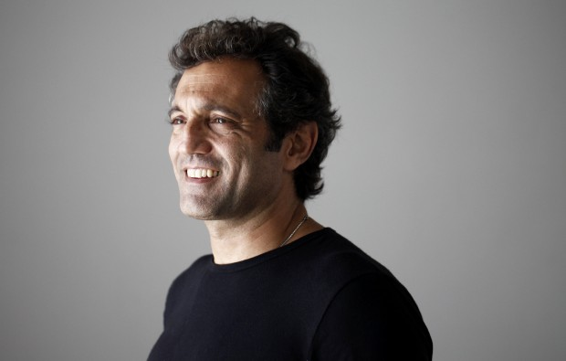

O nariz adunco, a cara sempre áspera, as marcas, os desenhos duros e quadrados. A primeira vez que vi o Domingos acho que foi em alguma novela, deu aquele pulo errado de coração, aquela sensação de impotência. A vontade era de olhar mais.

Cacete, o cara é bonito. O jeitão áspero, truculento, viril até o caroço. Na primeira olhada. Depois descobre-se o sorriso, o acolhimento nos olhos. [Descobre-se que ele é palhaço](http://www.guiadasemana.com.br/celebridades/noticia/domingos-montagner-fala-sobre-o-circo), a sagacidade [de tocar trumpete](http://www.laminima.com.br/projetoteatrodevariedades/wp-content/uploads/2010/10/DSC_6808-600x399.jpg). Uma beleza tão versátil que o colocam, no mesmo ano, como cangaceiro e presidente da república.

E o cara ficou bonito dos dois jeitos.

### Luciano Ribeiro (editor [do PapodeHomem](http://papodehomem.com.br/author/lucianoribeiro/)) — Gary Clark Jr.

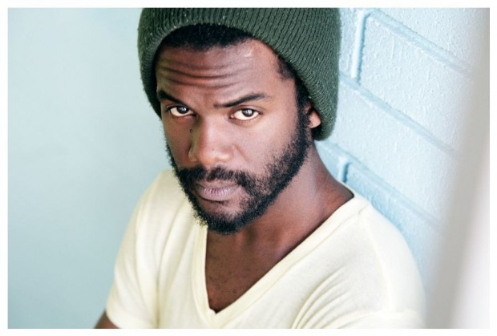

A despeito do fato de que o Gary Clark Jr é um dos guitarristas mais fodas do nosso tempo e um compositor no mínimo inteligente, acho fenomenal o estilo e a beleza do cara.

Assim como sua música, ele me parece ter uma postura de sobriedade, mas sem perder o sorriso, sem prender demais e se tornar chatão. E, se você fala de aparência propriamente dita, ele tem um físico magro, porém em forma e um rosto profundo, um olhar forte, que considero bem bonito. Não é como se ele fosse frágil, mas também não é como se ele fosse esmagar você com um deslize.

Não é dócil, mesmo aparentando ser pequeno, mas também não é truculento. É quase como se tudo no cara fosse uma expressão de precisão e foco.

Bonitão.

### Alberto  Brandão (do [De Cima do Muro](http://decimadomuro.com.br/)) – Tyrese Gibson

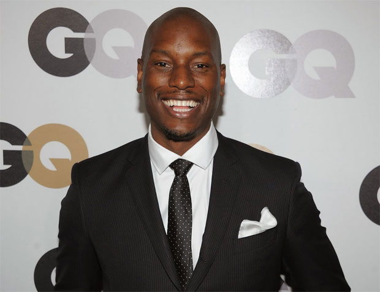

Tyrese Gibson é o cara que te ganha pelo sorriso, amplo e convidativo. Os traços bem definidos, olhos meio puxados e uma boca enorme faz com que sua presença seja notada onde chega, isso sem falar corpo. Braços longos, peitoral desenvolvido e com definição na medida certa, um pouco além da média dos caras fortes, mas antes de se tornar grande ou seco demais.

Apesar de normalmente fazer o papel do cara mal, fica nítido em poucos segundos que ele é aquele cara gente boa, que faz a galera rir e se sentir em casa. Que você chega com um problema e recebe aquele sorrisão, com aqueles belos dentes e esquece dos problemas.

### Diego Bubard (do [Brasília Rugby](http://www.brasiliarugby.com.br/)) – Jensen Ackles

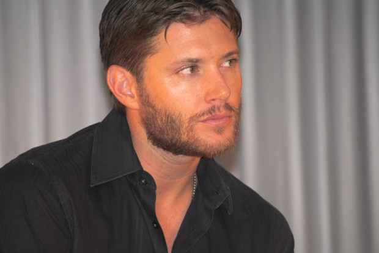

Conhecido por representar Dean Winschester no seriado *Supernatural*, Jensen Ackles, já foi eleito um dos homens mais sexy do mundo pela TV Guide em 2006 e o Caçador-de-Fantasmas mais sexy do mundo pela revista, People, certamente esse é um título que eu invejo bastante.

O texano de 36 anos estreou na televisão em 1996, mas seu primeiro papel de destaque veio em 2007 como Eric Brady, na eterna soap-opera americana *Days of our lives*.

Em dez anos de Supernatural, Jensen passou de um jovem de 26 anos para um homem de 36, acho que é isso que importa aqui. Ele é um homem adulto bonito que parece um homem adulto, não um cara que parece um jovenzinho para sempre.

Jensen tem um rosto clássico, de caúboi intrépido, um cara durão, mas que tem um puta sorriso.

### Eduaro Amuri (aquele [do Pó Mágico](http://olugar.org/po-magico-eduardo-amuri/)) — Daniel Pinto

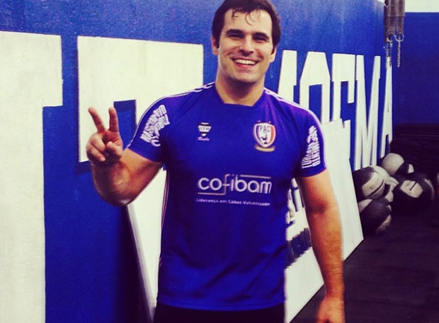

O Daniel é um cara do interior adaptado a vida da grande metrópole. Possuidor das maiores costas de toda a zona sul de São Paulo, é extremamente masculino, mas sem ser chucro. Além de charmoso, ostenta o perfil bonachão-brutamonte.

Parte do que me faz achá-lo um cara atraente provavelmente vem do sorriso largo que casa bem com os olhos expressivos. Dá a impressão que está sempre confortável no próprio corpo, mesmo tendo fases mais parrudas (“bem criado”, como ele mesmo diz, em referência as vacas que ele ordenhava quando era menino, em Avaré) e fases mais atléticas.

Tem uma mania irritante de cumprimentar as pessoas violentamente (soco no baço), mas é tudo milimetricamente calculado para ser parte de uma persona que não bateria em ninguém. Recentemente complementou o personagem que já era cativante com a pequena Manu, carinhosamente chamada de ursinha:

### Rodrigo Cambiaghi (atendimento do [PapodeHomem](http://papodehomem.com.br/author/cambiaghi/)) – Alexandre Jordani

O que me chama atenção no Alê é o contraste, O rosto bem masculino, traços fortes, barba grossa, olhar firme e 1,90 de altura, mas com jeitão de moleque, boné, pulseiras, as roupas e o humor afiadíssimo: qualquer situação é plausível para virar piada na mão dele.

Você pega todas essas características e soma o fato de [ele ser vocalista da banda Old Iscool](https://www.youtube.com/watch?v=ARyEUoE2PUI&index=3&list=UUpqhcZHqA_JoHwXz_Oxg5LQ) e cantar de olhos fechados. Qualquer ser humano que saiba cantar bem ou manejar um instrumento musical com destreza, fica automaticamente mais bonito.

Ele mandou dizer que está solteiro.

### Pedro Turambar (d’[O Crepúsculo](http://ocrepusculo.com/)) — Russel Crowe

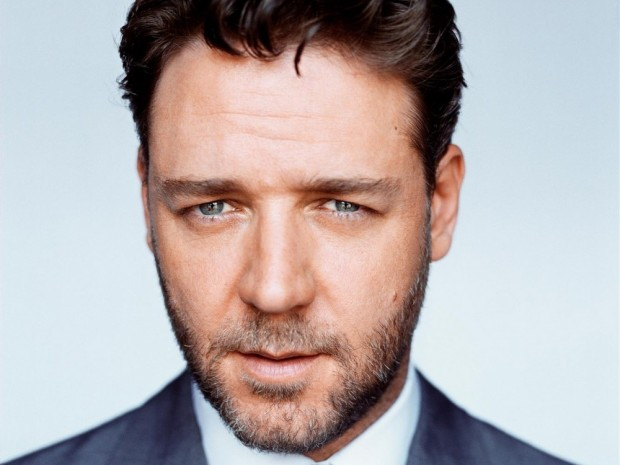

Achar homem bonito é, para um hétero, considerado o maior crime contra a masculinidade pela Associação de Homens das Cavernas. Você pode dar para um homem, beijar um homem, mas jamais, em qualquer circunstância, pode achar um homem bonito. Nós, hominhos, fomos criados para admirar grandes homens, honrar grandes homens, falar de grandes homens, gritar para homens e chorar por eles.

O futebol ta aí que não me deixa mentir. Isso torna a conversa sobre esses homens algo extremamente engraçado.

Desde a tenra idade, usamos todo e qualquer artifício linguístico para não qualificar um ser masculino como ‘bonito’. O inventor do termo “boa pinta” deve ter ganho uma placa e deve ter virado nome de prêmio. Até mesmo “bonitão” passou a ser aceito. Bonitão é uma palavra de macho mesmo. Bonito nunca. Bonitinho então…

Eu quebrei esse paradigma um dia, ao dizer que achava o Beckham bonito. Não bonitão, não boa pinta nem nenhuma fuga dessas. O cara era foda, e bonito. Não dava para não dizer. Me senti feliz por não ter que trocar palavras para dizer o que eu queria, e percebi que, achar alguém bonito (qualquer alguém), não quer dizer necessariamente que eu a desejo sexualmente. Acredite, isso é uma mudança de paradigma gigantesca na cabeça de um ‘hominho’.

Tudo isso, em suma, quer dizer que eu acho Russell Crowe um dos homens mais belos de toda humanidade. Tudo começou em *Gladiador*, meu filme preferido de todos os tempos, todos meus heróis, tudo que eu queria ser, era Maximus. Todos os aspectos.

Depois disso, passei a consumir tudo que esse neozelandês de 50 anos fazia. Um baita homem. Um modelo a seguido, um cara genial no que faz. Acho que o fato de achar Crowe um símbolo também me faz sentir o mesmo em relação a Eddie Vedder que, de cabelo curto, tem os cornos do Maximus. Enfim, se eu pudesse escolher meus atributos físicos no photoshop da vida, eu seria Russell Crowe e iria me achar o homem mais bonito do mundo.

### Leonardo Filomeno (do [Manual do Homem Moderno](http://manualdohomemmoderno.com.br/)) — George Clooney

Você até pode se esquivar dizendo que só acha seu pai ou irmão presença, mas tem que reconhecer que admira e respeita George Clooney.

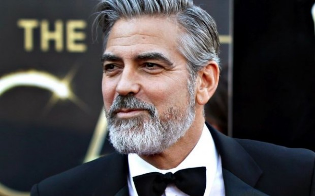

O primeiro motivo é por ser um ícone da moda masculino. Dono de um estilo clássico, apresenta-se sempre de maneira elegante, sem inventividade e ditando a tendência do homem. Sabe transitar entre o smoking e a camiseta com jeans, sempre de uma maneira interessante.

Sem o culto ao metrossexualismo e a dependência estética, gosta de cuidar da sua aparência da maneira mais natural possível. Não escondeu seus cabelos grisalhos, já teve seus momentos sem barba e outros ostentando vasto pelos faciais. Mandou bem nas duas ocasiões.

Os 53 anos de idade trouxe maturidade de saber deixar de lado as coisas menos importantes e correr atrás do que quer. Apesar de transitar por vários relacionamentos, não faz disso um mérito, mas consequência do valor que dá a sua liberdade.

> “Acredito que sou romântico e carinhoso com mulheres. Eu amo mulheres. Mas também amo minha liberdade e isso provavelmente é um fato que contribui para os fins de meus relacionamentos”.

### Victor Lisboa (do [Ano Zero](http://ano-zero.com/)) – Jon Hamm

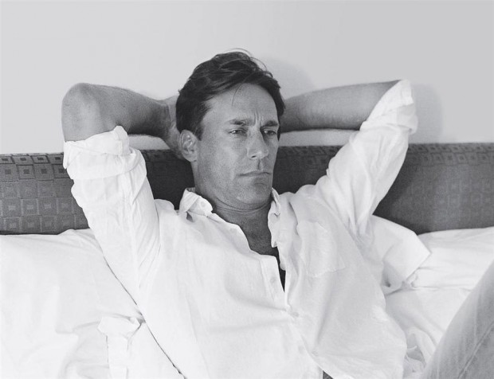

Jon Hamm é gato, convivamos com isso.

O cara possui um rosto clássico, com as qualidades da beleza tipicamente masculina, diferente de outros tantos atores que são considerados bonitos por possuírem traços quase femininos. A marca principal de seu rosto é o queixo quadrado, transmitindo força e equilíbrio num rosto bem simétrico, o que ele explora eficientemente deixando quase sempre a barba rala.

### Jonas Sakamoto (do [Entenda Os Homens](http://www.entendaoshomens.com.br/)) — Christian Bale

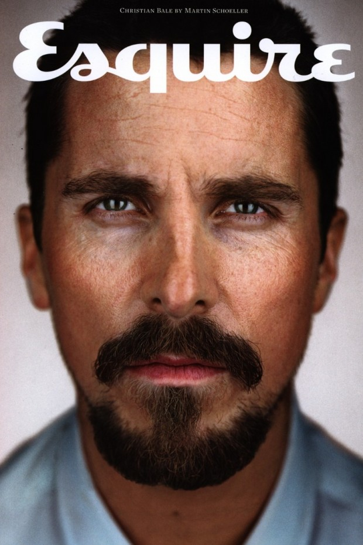

Christian Bale é um homem bonito. Ele é dono de um porte físico compatível com sua estatura de cerca de 1,80, barba responsa, cabelos lisos e olha matador. Mas deixa eu explicar uma coisa.

Bale possui uma beleza que vai além do físico e ele faz questão de deixar isso claro, principalmente, nos papéis que compõem sua carreira na sétima arte.

Ele possui uma personalidade que é muito bem reflexo de seus papéis versáteis em sua carreira no cinema, e isso é perceptível desde muito novo quando estreou no cinema no clássico *O Império do Sol,* do aclamado diretor Steven Spielberg, e nos suscetíveis personagens que encarnou como o homem com graves problemas psicológicos no papel que fez com que perdesse cerca de 30 kg em *O Operário*, o louco de *Psicopata Americano*, o conflito em uma sociedade opressora em *Equilibrium*, o Bruce Wayne realista da trilogia *O Cavaleiro das Trevas* e o personagem com sérios problemas com drogas que lhe rendeu no longa *O Vencedor*.

Fora de sua carreira, Bale, juntamente com sua esposa, ajudam várias instituições de caridades, é viciado no jogo do Mario, pais de duas filhas e dono de um cão e dois gatos. O que faz dele não apenas um homem bonito, mas um homem que sabe muito bem seu papel e o tornam bonito de um jeito peculiar e sensato.

### Filipe Larêdo (da [Editora Empíero](http://editoraempireo.com.br/)) — Sylvertes Stallone

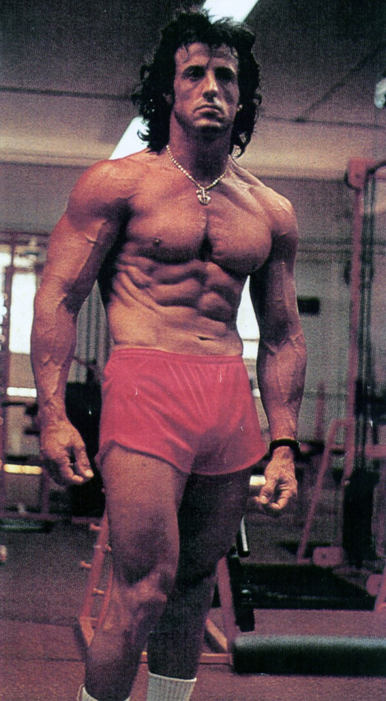

Os anos 1980 tiveram alguns ícones da beleza masculina. E grande parte deles tinha músculos saltados até na testa. A tríade Arnold Schwarzenegger, Hulk Hogan e Sylvester Stallone influenciaram os conceitos de beleza masculina de diversas gerações até hoje, incluindo a da sua própria, indicando aos homens que, para serem belos, precisavam ter um corpo modelado com baixas taxas de gordura e uma musculatura enrijecida.

Com eles, as academias de musculação ficaram populares, e com elas veio toda uma indústria de suplementação alimentar para ajudar os meros mortais a conseguirem efeitos que, em sua grande maioria, não ficam nem próximos daqueles aos quais se espelham.

Uma boa fonte para avaliarmos o poder desses ícones é um documentário chamado [*Bigger, stronger and faster*](https://www.youtube.com/watch?v=h8ADP6C7rKM). Nele, vemos o quanto os comportamentos masculinos sofreram influência de práticas até então nada convencionais. Ou vocês acham que repetir movimentos com aparelhos nas academias era algo normal há cinquenta anos? Nada disso! Foram essas figuras que definiram o que hoje se considera fisicamente saudável: alimentação regular, bastante líquido, exercícios específicos etc.

E considerando o poder icônico da década de 1980, um modelo de beleza masculina, inegavelmente, é Sylvester Stallone.

Já contando com 68 anos, ele permanece sendo um modelo de tonificação muscular. Basta ver o seu último filme, *Os* *Mercenários 3*, no qual aparece com veias saltadas e definição corporal absurdamente bem construída. Mas para aqueles fãs com mais de trinta anos, ele é um velho conhecido, como os clássicos *Rambo* e *Rocky*, apenas para ficarmos num breve resumo da filmografia do sujeito.

Essas duas franquias até hoje rendem frutos ao velho ator que não cansa de se renovar.

### Rob Gordon ([aquele Rob Gordon](http://papodehomem.com.br/author/robgordon/)) — Jon Hamm

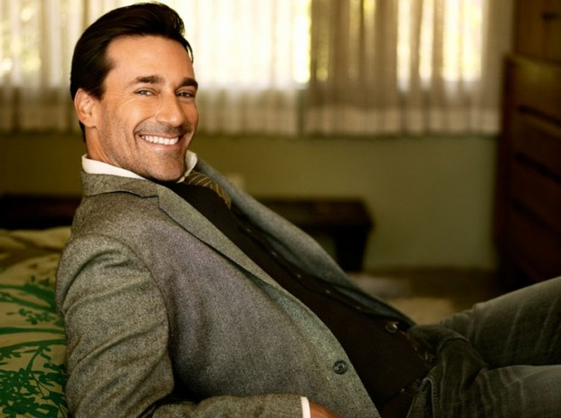

– Faz um texto sobre um homem que você ache bonito?

– Beleza. Já sei até sobre quem vou fazer.

– Mas tem que ser bonito, não pode ser charme.

– Ah, é? Ia fazer sobre o Al Pacino. Mas sendo assim eu acho outro.

– Tem que ser beleza física. Não é carisma.

– Bom, isso descarta o Brando. Fica difícil assim. Mas eu dou um jeito.

– E não é inteligência nem talento.

– Então, já estava começando a escrever sobre o De Niro aqui. Mas, beleza, já apaguei.

– Isso. Beleza física. O cara precisa ser bonito e ponto.

– Hum… Acho que já sei.

– Sensibilidade não conta também.

– Bom, eu estava escrevendo sobre o Chico Buarque. Mas posso desencanar do parágrafo das músicas. Vou falar só dos olhos.

– Não. O cara tem que ser bonito, não ter algo bonito.

– Tipo o Draper.

– Oi?

– Cara, o Don Draper, sabe? O Jon Hamm. Se você tirar o charme, o carisma e a inteligência do Jon Hamm, sobra só o cara.

– E daí?

– E mesmo assim ele ainda é bonito demais. Não dá para competir.

– É isso aí.

– E o cara ainda é inteligente, carismático, charmoso.

– Sim, mas…

– Relaxa, eu nem vou falar sobre isso. Só vou falar que ele é bonito.

– Isso.

– Porque o cara já é bonito demais. Começar a falar que ele é inteligente, carismático, talentoso… Aí é covardia já.

– Beleza.

– Pô, abri umas fotos para pensar no texto, o cara é bonito para caralho.

– Eu sei.

– Você já reparou? Abre umas fotos aí.

– Eu conheço o cara.

– Sim, mas você já reparou o quanto ele é bonito? Porra.

– Manda o texto.

– Pô, você já prestou atenção no sorriso do cara?

### Qual cara você acha bonito?

Um repositório honesto de caras bonitos. Você também pode colocar aqui embaixo, nos comentários, qual cara você acha bonito e porque. Não “estiloso”, não “aquele cara é presença”, mas bonito mesmo, o cara que mexe contigo no quesito beleza. Disso, claro que a beleza pode (e é) amplificada pelo estilo ou características qualitativas do cara.

Mandem bala.

Homem bonito é  que não falta.

  
 por Jader Pires  
  
  [[anexo ausente]](http://pubads.g.doubleclick.net/gampad/jump?iu=1051165/PdH_Feed_superbanner/leaderboard&sz=728x90&c=486557371) [anexo ausente]  
  
  
[[anexo ausente]](http://da.feedsportal.com/r/204367375763/u/49/f/530922/c/32911/s/3e3ce7a7/sc/19/rc/1/rc.htm)  
[[anexo ausente]](http://da.feedsportal.com/r/204367375763/u/49/f/530922/c/32911/s/3e3ce7a7/sc/19/rc/2/rc.htm)  
[[anexo ausente]](http://da.feedsportal.com/r/204367375763/u/49/f/530922/c/32911/s/3e3ce7a7/sc/19/rc/3/rc.htm)  
  
[[anexo ausente]](http://da.feedsportal.com/r/204367375763/u/49/f/530922/c/32911/s/3e3ce7a7/sc/19/a2.htm)[anexo ausente]

[[anexo ausente]](http://feeds.feedburner.com/~ff/PapodehomemLifestyleMagazine?a=-CAdhMKZJZM:lOoaFyHfjEA:yIl2AUoC8zA)  [[anexo ausente]](http://feeds.feedburner.com/~ff/PapodehomemLifestyleMagazine?a=-CAdhMKZJZM:lOoaFyHfjEA:qj6IDK7rITs) [[anexo ausente]](http://feeds.feedburner.com/~ff/PapodehomemLifestyleMagazine?a=-CAdhMKZJZM:lOoaFyHfjEA:-BTjWOF_DHI)

[anexo ausente]
