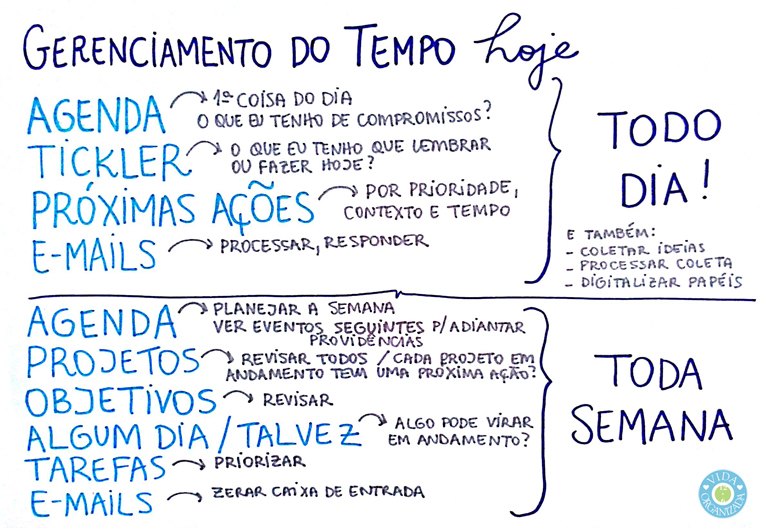

Eu costumo postar aqui no blog regularmente um texto explicando como estou me organizando atualmente, para mostrar para vocês e quem sabe servir como referência. Atualmente, tenho organizado todo o meu sistema dentro do Evernote e apenas a agenda no Google Calendar, pois compartilho com meu marido e ele já está acostumado com essa plataforma (eu também prefiro ter a minha agenda lá). Para quem está chegando no blog agora e não me conhece, eu utilizo um método chamado [GTD](http://vidaorganizada.com/categoria/produtividade/gtd/) para me organizar.

Muitas pessoas ficam um pouco confusas sobre a ordem de hierarquia de execução no GTD, diária e semanalmente, então fiz um desenho para postar aqui, porque achei mais simpático que fazer inteiro digital:

### Todo dia

A ideia é a seguinte: diariamente, eu olho as seguintes coisas, na seguinte ordem:

1. **Minha agenda no Google**, para ter ideia dos meus compromissos e afazeres que demandam mais tempo. Sim, eu também coloco tarefas na agenda, desde que elas demorem mais de uma hora para serem feitas. Eu penso que, se uma tarefa demora de 10 a 30 minutos, eu posso deixá-la fora da agenda, pois vou encontrando tempo no meu dia a dia para encaixá-la. Agora, se ela demora mais tempo, se eu não colocar na agenda, vai ser muito difícil eu encontrar uma brecha ao longo da semana para executá-la. Por isso, quando monto meu planejamento semanal, já faço essa priorização. A ordem de execução é a seguinte, então: começar pelo que está na minha agenda.
2. **O tickler**. Se você não sabe o que é um tickler, por favor, veja [aqui](http://vidaorganizada.com/produtividade/gtd/guia-definitivo-do-vida-organizada-para-usar-o-gtd-no-evernote-parte-3-acoes/ "Guia definitivo do Vida Organizada para usar o GTD no Evernote – Parte 3 – Ações") e [aqui](http://vidaorganizada.com/produtividade/gtd/o-que-e-o-tickler-e-como-funciona/ "O que é o tickler e como funciona?"). Depois de executar o que eu tinha programado para o meu dia na agenda, passo para o tickler. Vale lembrar que algo só deve estar na agenda ou no tickler se for extremamente essencial estar ali. Não é uma lista de desejos, mas prazos reais. Por fim, mesmo que eu consiga terminar tudo o que tinha na agenda e no tickler para o dia em questão, se sobrar um tempinho, antes de ir para as próximas ações, eu tento adiantar algo dos outros dias. Isso é bom porque, se uma tarefa tinha como prazo amanhã, hoje já consigo adiantar e deixo meu tempo amanhã livre para outras atividades (a seguir).
3. **Minhas listas de próximas ações**, que organizo por prioridade, contexto e tempo disponível. Eu costumo olhar primeiro as de prioridade alta, que são as ações que eu tenho que concluir ainda esta semana. Dentro delas, filtro pelo contextos em que estou e pelo tempo disponível para trabalhar naquele contexto. Se eu já fiz as tarefas do dia, adiantei algumas da semana e ainda consigo executar algumas aqui, considero meu dia muito produtivo.
4. **Minhas caixas de e-mails**. Tenho três. Nunca acesso e-mails quando começo a trabalhar, pois isso mata a minha produtividade (a chance de ficar só respondendo e-mails e não “trabalhar de verdade” é enorme). Portanto, gosto de trabalhar em algumas tarefas do dia antes de abrir meus e-mails. Geralmente, das 8h30 às 11h eu consigo resolver MUITA coisa, para só então ver e-mails. Claro que, se você precisa ver seus e-mails com uma frequência maior, você deve fazê-lo. Estou apenas contando como funciona para mim. Por fim, abro meus e-mails pela primeira vez no dia (então tem mais e-mails do que terá à tarde, por exemplo), e levo cerca de uma hora para processar as três caixas de entrada. Lembrando que processar significa: deletar o que é lixo, arquivar o que é referência, jogar para listas o que for ação e responder o que demandar menos de dois minutos. Por fim, uso o período de checagem da tarde para responder e-mails maiores e mais demorados.

Ao longo do dia, eu fico coletando ideias que me vêm à mente, envio coisas para a caixa de entrada do Evernote, os e-mails continuam entrando na caixa de entrada. Também processo toda essa “stuff” que chega, em espacinhos ao longo do dia. E também gosto de pelo menos uma vez por dia digitalizar os papéis que chegam, pois a experiência de deixar acumular para digitalizar uma vez por semana não funciona para mim (fico com preguiça de investir um tempão apenas para essa atividade).

### Toda semana

O GTD tem um processo chamado Revisão semanal, quando montamos nosso planejamento para a semana em questão (se for segunda) ou para a semana seguinte (se for sexta ou outro dia). Uma vez por semana, eu faço o seguinte:

1. **Analiso a minha agenda** e já verifico os compromissos agendados. Muitas vezes, preciso tomar algumas providências. Faço o mesmo com a semana seguinte e o espaço de um mês, pois posso ter eventos que demandem minha atenção desde já (por exemplo, uma viagem internacional daqui a três semanas). Ao planejar a minha agenda, vejo as do meu filho e do meu marido também (que estão compartilhadas comigo) para me programar. Gosto de deixar um respiro de duas horas durante o horário comercial, para atender imprevistos, e também insiro os tempos de deslocamento, almoço e outros, pois eles me ajudam a ter uma noção melhor de quanto tempo tenho para realizar minhas atividades.
2. **Analiso minha lista de projetos** em andamento, para garantir que todos estejam com uma próxima ação definida. Já verifico se há ações relacionadas que demandem mais tempo, de forma que possa ir inserindo na minha agenda, se necessário. Percebam que a agenda vai se preenchendo sozinha, praticamente, só com as demandas da semana mesmo.
3. **Dou uma olhada na minha lista de objetivos para 1 a 2 anos**, para garantir que meus projetos estejam caminhando em direção a eles. Pode ser que algum projeto tenha que ser adiado e outro, priorizado. Este é o momento de fazer essa reflexão.
4. **Vejo minha lista de Algum dia / Talvez**, que são todos os projetos ou tarefas que quero fazer, mas não eram prioridade até semana passada. O que acontece com essa lista: à medida que a gente vai executando outros projetos e alcançando objetivos, começamos a abrir espaço na nossa vida para atividades que não eram prioritárias, mas queríamos muito fazer (por exemplo, um curso de italiano). É assim que a gente vai inserindo novos projetos, especialmente ligados a hobbies, na nossa vida. Mas também pode acontecer de eu ter tantos projetos que passo mais de uma semana sem adicionar nada do que está aqui. Tudo bem, pois não é o meu foco atual. O importante é revisitá-la semanalmente para garantir que tudo esteja sob controle.
5. **Analiso a minha lista de tarefas avulsas** para verificar se alguma delas mudou de prioridade e deve ser feita esta semana. Mais uma vez, se alguma que demandar bastante tempo tiver que virar prioridade, eu a coloco na minha agenda.
6. **Zero a minha caixa de entrada**. Isso significa que eu resolvo todos os meus e-mails pendentes até o final daquela semana (se eles tinham essa prioridade). O importante é deixar a caixa de entrada vazia, ou seja: o que tinha para resolver esta semana, eu resolvi. O que demanda ação para depois, processei nas minhas listas. O que tinha que ser arquivado, foi arquivado. E por aí vai.

Gosto de fazer minha revisão semanal na sexta-feira de manhã, pois aproveito o período da tarde para zerar minhas tarefas para aquela semana e também as minhas caixas de entrada de e-mails.

Para checar o que preciso fazer todos os dias, gasto um minuto ao ligar o computador para bater os olhos no meu dia e ver o que está planejado para ele e vou executando com a agenda aberta. Não uso alertas, pois me atrapalham. Com a agenda aberta, consigo controlar bem. Ao final do dia, dou uma olhada no meu dia seguinte para ver se preciso antecipar algo ainda de noite (separar uma roupa porque vou ter uma reunião externa logo cedo, por exemplo).

Na revisão semanal, costumo levar de uma hora a uma hora e meia, mas porque eu tenho muitos projetos. No geral, leva-se de meia hora a uma hora no máximo para fazer esse planejamento. Se estiver demorando mais, a não ser que você tenha muitos projetos (mais de 60), deve ser porque você está executando coisas em vez de planejar.

E é assim que eu tenho me organizado atualmente. Tem sido muito bom e produtivo.

### Textos relacionados:

- [Considerações a respeito do GTD, Evernote e Toodledo](http://vidaorganizada.com/produtividade/gtd/consideracoes-respeito-gtd-evernote-e-toodledo/)
- [Como eu estou me organizando atualmente – versão fevereiro 2014](http://vidaorganizada.com/minha-vida/como-eu-me-organizo/como-eu-estou-organizando-atualmente-versao-fevereiro-2014/)
- [Organização atual: agenda + Evernote](http://vidaorganizada.com/produtividade/evernote/organizacao-atual-agenda-de-papel-evernote/)
- [Organizando a festinha de 4 anos do filhote](http://vidaorganizada.com/lazer/festas/aniversarios/organizando-festinha-de-4-anos-filhote/)
- [Receitas do IFTTT para o Toodledo](http://vidaorganizada.com/produtividade/toodledo/receitas-ifttt-para-o-toodledo/)
