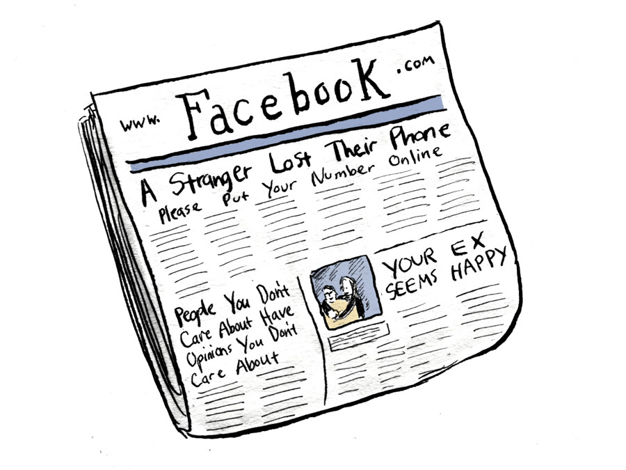

Segundo uma reportagem do **New York Times**, o Facebook está interessado em não apenas ser um veículo de mídia, mas também uma ‘hospedagem’ para conteúdo inédito.

A rede social estaria interessada em convencer as publicações – sejam revistas, jornais ou sites online – a postarem diretamente no Facebook, exibindo o conteúdo de uma determinada seção, por exemplo, dentro da própria rede social, ao invés do site do jornal. Assim, o Facebook se encarregaria dessa ‘hospedagem’ do conteúdo, bem como da sua apresentação para dispositivos móveis, que pode ter uma experiência mais agradável que muitos sites de jornais ou revistas.

A contrapartida para as publicações seria não precisar se preocupar com picos de acesso, e dividir a renda dos anúncios da página com o Facebook. Para [David Carr](http://www.nytimes.com/2014/10/27/business/media/facebook-offers-life-raft-but-publishers-are-wary.html?_r=0), isso traz um sério problema:

“Se o app mobile do Facebook hospedar as páginas das publicações e intermediar a relação com os consumidores, boa parte dos dados sobre o que eles [os consumidores] fizeram e a sua experiência de leitura seriam propriedade da plataforma.

> As empresas de mídia se transformariam basicamente em vassalos em um reino que o Facebook domina”, alerta ele.

No entanto, ele também pondera que, para quem trabalha com produção de informação, o Facebook ainda é a maior fonte de acessos hoje em dia, e não pode ser desprezado.

“Temos um papel cada vez mais importante em como as pessoas encontram as notícias que elas leem todos os dias, e nos sentimos responsáveis para trabalhar com as publicações para chegar a uma experiência que seja a melhor possível para os consumidores. E queremos e precisamos que essa seja uma boa experiência também para as publicações”, esclarece Chris Cox, diretor de produto do Facebook.

David Bradley, proprietário e diretor da Atantic Media Company, pondera que a discussão talvez seja outra. “Será que a disputa entre plataformas e empresas de mídia, que acontecerá em breve, é uma real ameaça para o jornalismo? Pelo menos no Vale do Silício, a resposta que mais ouvi é que ‘sim’”, provoca ele.

Vale a pena ler a matéria na íntegra no [NYT](http://www.nytimes.com/2014/10/27/business/media/facebook-offers-life-raft-but-publishers-are-wary.html?_r=0).

Post originalmente publicado no [Brainstorm #9](http://www.brainstorm9.com.br)  
 [Twitter](http://www.twitter.com/brains9) | [Facebook](http://www.facebook.com/brainstorm9) | [Contato](http://www.brainstorm9.com.br/contato/) | [Anuncie](http://www.brainstorm9.com.br/anuncie)

###### 

[[anexo ausente]](http://feeds.feedburner.com/~ff/brainstorm9?a=7tX2UDKQ8w4:QnEOnZA_j5M:yIl2AUoC8zA)
[[anexo ausente]](http://feeds.feedburner.com/~ff/brainstorm9?a=7tX2UDKQ8w4:QnEOnZA_j5M:7Q72WNTAKBA)

[[anexo ausente]](http://feeds.feedburner.com/~ff/brainstorm9?a=7tX2UDKQ8w4:QnEOnZA_j5M:V_sGLiPBpWU)
[[anexo ausente]](http://feeds.feedburner.com/~ff/brainstorm9?a=7tX2UDKQ8w4:QnEOnZA_j5M:I9og5sOYxJI)
[[anexo ausente]](http://feeds.feedburner.com/~ff/brainstorm9?a=7tX2UDKQ8w4:QnEOnZA_j5M:qj6IDK7rITs)

[anexo ausente]
