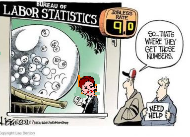

Não tenho, é claro, a menor ilusão que a presidente da República leia minhas colunas. Aliás, considerados seus maus-tratos à língua, não tenho a menor ilusão que leia qualquer coisa. Ainda assim continua a ser surpreendente (ou seria “estarrecedor”?) sua insistência em temas há muito demonstrados equivocados, em particular a suposta oposição entre inflação e desemprego, como explorado 
[neste espaço](http://maovisivel.blogspot.com.br/2014/05/o-avesso-do-avesso.html)
 em meados do ano.

À época ela alegou que a fixação da meta de inflação em 3% levaria o desemprego “
[lá pelos 8,5%, 9%, 10%, 11%, 12%. Por aí](http://www.valor.com.br/brasil/3539104/inflacao-esta-completamente-sob-controle-reforca-dilma#ixzz3GgmwS7nS)
”. Como se depreende da afirmação acima, precisão não parece ser exatamente o forte da presidente, mas, mais recentemente, voltou à carga, agora 
[argumentando que o desemprego chegaria a 15%](http://veja.abril.com.br/noticia/brasil/no-penultimo-debate-dilma-e-aecio-na-retranca)
, aumentando assim o intervalo de confiança de suas “projeções” de 3,5 para inimagináveis 6,5 pontos percentuais, uma margem de erro de fazer corar qualquer pesquisa eleitoral.

As implicações da peculiar matemática presidencial podem não ter ficado claras à primeira vista, mas são contundentes.

Como o IPCA deve fechar o ano na casa de 6,5%, buscar uma meta de 3% corresponderia a uma redução de 3,5 pontos percentuais da inflação. Por outro lado, dado que o desemprego se encontra na faixa de 5%, sua elevação para 8,5% corresponderia também a 3,5 pontos percentuais, ou seja, na “estimativa” mais otimista, *cada ponto percentual a menos de inflação “custaria” um ponto percentual a mais de desemprego*.

Já no caso mais pessimista, a elevação do desemprego atingiria 10 pontos percentuais (de 5% para 15%) para a mesma redução (de 6,5% para 3%) da inflação, ou seja, *cada ponto percentual a menos de inflação “custaria” 2,9 pontos percentuais a mais de desemprego*!

Em outras palavras, o coeficiente que captura a presumida troca entre inflação e desemprego implícita na ***curva de Rousseff*** varia de 1 a 2,9, uma diferença abissal (alguns diriam “estarrecedora”).

À parte o erro conceitual primário (não há troca persistente entre inflação e desemprego, conforme estabelecido por mais de 40 anos de pesquisa na área), as afirmações presidenciais transparecem um descaso desumano (“estarrecedor”, talvez) com os números.

Fosse eu um diplomata, diria que as estimativas poderiam ser melhoradas; como não sou, posso afirmar: trata-se de números chutados (isto mesmo, c-h-u-t-a-d-o-s!), sem a menor preocupação com qualquer referência à realidade, sem base estatística e, portanto, desprovidos da mínima relevância.

Mesmo com o devido desconto que se dá à verdade no período eleitoral (coisa triste de se dizer), esta postura é reveladora. A atual administração demonstra o mais profundo desprezo para com os números. Estatísticas só valem se corroborarem a visão pré-existente, jamais como forma de testá-la e assim permitir, caso necessário, correção dos rumos.

Insistimos há anos que o atual arranjo de política econômica (a tal “nova matriz macroeconômica”, algo sumida de retórica governamental recente) redundaria apenas em menos crescimento, inflação mais alta e desequilíbrios externos crescentes. As evidências a este respeito eram visíveis desde 2012, ao menos, expressas no então “pibinho” de 1% (que hoje seria motivo de comemoração) e na inflação que já então teimava em não retornar à meta. Mesmo assim, foram ignoradas.

Dados ruins das contas fiscais têm sido escamoteados e agora até mesmo os números de distribuição de renda se tornaram sujeitos a interesses políticos de curto prazo, culminando com a postergação da divulgação de pesquisas do Ipea sob o ridículo argumento que violariam as leis eleitorais.

  

O resultado é que, cada vez mais, temos que navegar sem instrumentos, enquanto se nega à população a possibilidade de avaliar os rumos do país. Neste sentido, as “estimativas” dos parâmetros da “curva de Rousseff” não são a exceção, mas a regra no modelo de condução desastrada de política econômica no Brasil.

(Publicada 22/Out/2014)
