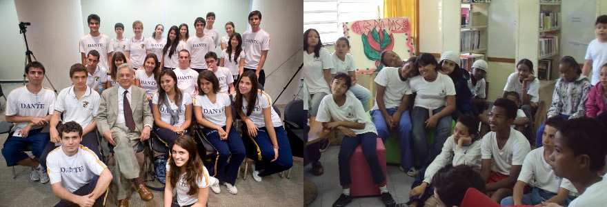

Há quem defenda que a meritocracia já existe em nossa sociedade, mas eu discordo, considero que ela não existe pois não saímos todos das mesmas linhas de partida. O menino rico branco que estuda no colégio particular Dante Alighieri tem muito mais oportunidades e acesso ao sucesso que uma menina pobre e preta que estudou na escola pública Theo Dutra.

“"Temos as mesmas capacidades, mas não as mesmas oportunidades"“, gostei desta frase que a candidata [Marina Silva disse em visita a Paraisópolis](http://marinasilva.org.br/temos-mesmas-capacidades-mas-nao-mesmas-oportunidades-afirma-marina-em-paraisopolis/), comunidade pobre encravada no meio de um bairro rico de São Paulo.

Compare a diversidade de cores de pele nas turmas da escola particular Dante Alighieri e da escola pública Morro Grande, ambas em São Paulo, SP.

A meritocracia é um ideal a ser perseguido, e em minha opinião um dos objetivos do Estado deve ser prover a todos os cidadãos igualdade de oportunidades e facilidade de acesso. Não que eu considere possível cumprir esta “igualdade de oportunidades” literalmente (não acredito que seja), mas, de novo, acredito que é um ideal a ser perseguido.

The post [“Temos as mesmas capacidades, mas não as mesmas oportunidades”](http://marcogomes.com/blog/2014/temos-as-mesmas-capacidades-mas-nao-as-mesmas-oportunidades/) appeared first on [Marco Gomes](http://marcogomes.com/blog).

[[anexo ausente]](http://feeds.feedburner.com/~ff/marcogomes?a=egm-sENkiQM:iCd43fr7WPM:D7DqB2pKExk)
[[anexo ausente]](http://feeds.feedburner.com/~ff/marcogomes?a=egm-sENkiQM:iCd43fr7WPM:yIl2AUoC8zA)
[[anexo ausente]](http://feeds.feedburner.com/~ff/marcogomes?a=egm-sENkiQM:iCd43fr7WPM:F7zBnMyn0Lo)

[anexo ausente]
