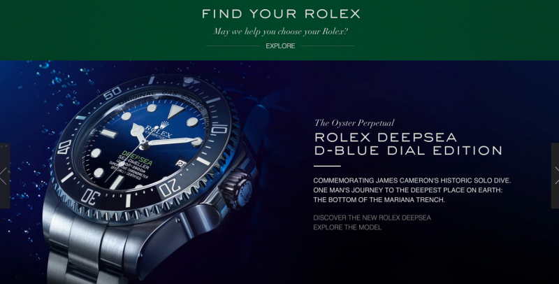
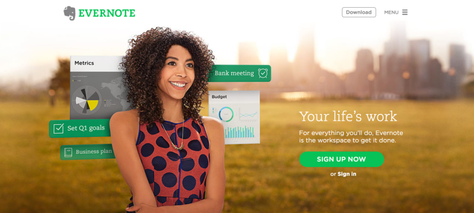
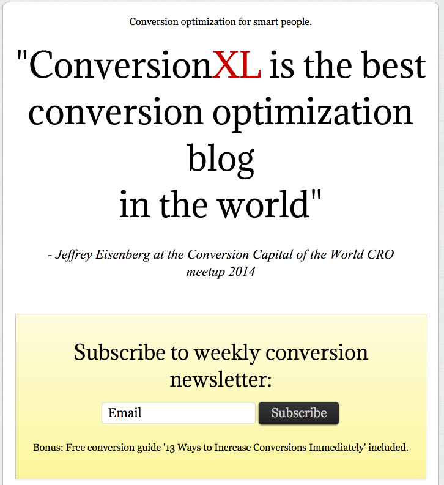
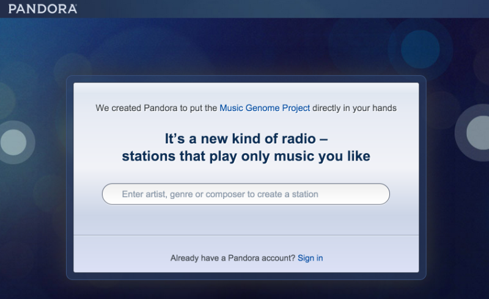
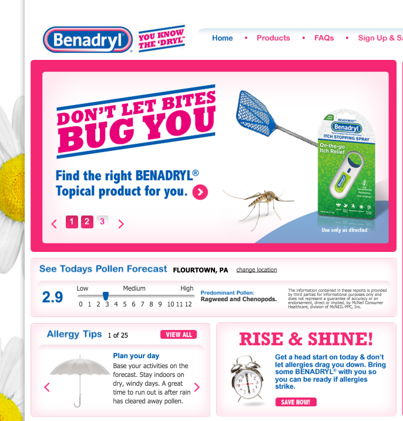
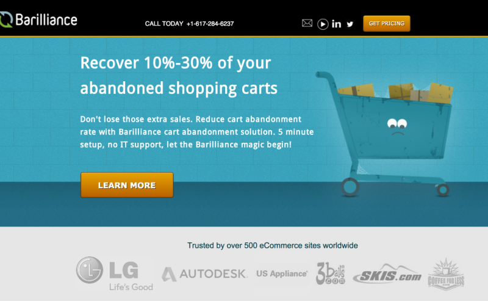

[Analytics & Conversion](http://marketingland.com/library/channel/analytics)

# Three Psychological Features Of A Landing Page That Make People Click

## What's the secret to an effective landing page? It's not the color of the button, says contributor Neil Patel.

[Neil Patel](http://marketingland.com/author/neil-patel "Posts by Neil Patel") on October 24, 2014 at 9:07 am

- 159
- **
- **
- **
- **
- **
- **
- **
- **

Why is it that some landing pages have terrible conversion rates while others are killing it with conversion rates in the double digits?

There are numerous landing page variations that impact conversion rate. It’s amazing how something as simple as a color change or a different font can result in an avalanche of new conversions.

There are at least three basic features that killer landing pages all have in common. These features have less to do with button size or color, and more to do with the underlying reasons about why people, think, click, act and decide. Conversion optimization is really about how people think. It’s psychology.

And that’s what each of these features is built upon: buyer psychology. Here are the three features of a landing page that compel people to click.

## 1. The Landing Page Should Be Obvious

The number one feature of a compelling landing page is this: everything must be very clear to the user.

To win with your landing page, you don’t try to make it cute, clever or cool. You make it as obvious as you possibly can.

Every purchase and every click starts with knowledge. A user clicks only because he or she has some knowledge about what has come before, and a sense of anticipation (or curiosity) about what will come next. No one goes onto a landing page blindly clicking around unless they know something about the product or service.

Your task is clear: make everything obvious.

What needs to be obvious?

- **They Know What The Page Is About.** Tell the user what the product or service is.
- **They Know What The Product Or Service Does.** Explain the benefits and features of the product or service.
- **They Know What They Are Supposed To Do.** Create a call-to-action.

Here are a few tactical things that you can do in order to make the landing page outstandingly obvious.

**Use A Big Headline.**The shape and appearance of the headline must be big. I’m talking about size and position. The user should see and comprehend the headline before anything else.

**Use A Headline With Strong, Clear Language**. Although a headline should work to grab a user’s attention, it also needs to be clear enough to inform them of what they are seeing and potentially purchasing.

**Supplement The Headline With A Subheading That Helps To Explain It.**Headlines should be short and to the point. The subheadline gives you a little more room to explain things.

**Use Images That Help To Explain Or Help Users *F**eel T*he Significance Of The Product Or Service.**Use images with purpose. Don’t just use images because they look good, or because they grab the user’s attention. Every image should serve to reinforce the product or service. Obviously, you’re not going to be able to picture something like, say, a cloud-based storage service. In this case, you can use images that suggest how a user might feel or respond to that service.

Rolex’s homepage uses large imagery that makes it very clear what the page is about. Additionally, their headline and subheading use clear and concise language to describe the intent of the page.

Evernote’s landing page is also very clear. The headline sums up the idea of the software: “Your life’s work.” Evernote doesn’t show pictures of a physical product, but it can show screenshots and the way a user feels when she uses the product.

Users want to have things clearly spelled out to them. They don’t want to have to guess at the product or service. The clearer you can be, the more likely the right users will click and convert.

## 2. The Landing Page Should Create A Sense Of Curiosity

Curiosity is one of the hugely overlooked areas of conversion optimization. Too few CROs are thinking about it, and far less are actually working to implement it.

What is curiosity? A *strong desire to know or learn something.*

**Strong Desire.** Isn’t that what a landing page is supposed to stir up? Nobody clicks on a call-to-action (CTA) unless they have a strong desire. A landing page is built on the promise of delivering something, knowledge about something. Desire compels clicks and creates action.

This holds true regardless of what you’re selling.

- You’re selling watches. Your CTA is “Find Your Rolex.” The user must feel a sense of curiosity about which Rolex will be right for him.
- You’re selling organizational or note-taking software? Your CTA is “Sign Up Now.” The user must want to know how Evernote will help her organize her office and get everything done.

This is where conversion optimization melts into its art form. How do you stir up curiosity? You let the user know that there are some things they can only get if they click the CTA.

Every landing page boils down to the CTA. What lies beyond that big button? What is the user going to get?

It’s your responsibility to address this question with two strategies:

- You must **give** them enough information so they understand what they’re going to receive when the click the CTA. They should know the *nature* of what’s going to happen.
- You must **withhold** enough information so they sustain a strong curiosity that compels them to click.

ConversionXL does this with its blog. Instead of allowing you to read the articles, it uses a landing-page style entry. The headline is a testimonial from well-known conversion expert Jeffrey Eisenberg who wrote, “ConversionXL is the best conversion optimization blog in the world.”

That headline inspires curiosity. This makes it very likely that a user will want to subscribe to the best conversion optimization blog in the world. They have a *strong desire to know or learn* the best conversion optimization advice in the world.

Pandora also inspires curiosity. What is this *new* kind of radio? What are the stations that will play only music that *I* like? Users are curious, so they input their favorite artist, genre, or composer to find out, thus completing the CTA.

Don’t underestimate the power of curiosity. It can compel clicks like few other things can.

## 3. The Landing Page Should Cause The User To Feel Some Pain

Pain is one of the most powerful motivators in the universe.

The ancient Greek philosopher Epicurus, renowned for his philosophy of pleasure, had some thoughts about pain as well.

> *“The magnitude of pleasure reaches its limit in the removal of all pain. When such pleasure is present, so long as it is uninterrupted, there is no pain either of body or of mind or of both together.”*
>
> — Epicurus

In other words, he’s saying that you can’t reach complete pleasure unless all pain is gone.

But here’s the thing about pain: in marketing, it’s good because pain produces action. And action is exactly what we want when a user is on our landing page. We want them to click, right?

To click, they need to feel a little bit of pain. We need to remind them of the discomfort or lack of comfort they are experiencing due to the absence of your product or service.

Benadryl, selling insect relief, introduces a little pain to its landing page. It reminds the user that insects are bothersome. Users want relief. Thus, they are more likely to convert on finding the right product.

The landing page below, from Barilliance, introduces a form of pain that is familiar to e-commerce marketers – the pain of shopping cart abandonment. Their landing page reminds users of this pain, and encourages them to “recover 10-30%” of this loss.

When users feel pain, they will do what they can to find relief and recovery. It’s not your role as a marketer to make them wallow in the pain. Instead, your goal is to relieve them of the pain by offering your product or service as the solution their pain.

Your landing page simply needs to *remind* them of the pain in order to be effective. And then,  along with the reminder, the landing page needs to provide an answer to the pain.

## Conclusion

There are a million things that go into an effective landing page. But don’t overlook some of the under-the-surface conversion optimization tips. It’s about psychology.

Obviousness, curiosity, and pain don’t have a lot to do with image placement or the right CTA color. But they do have an impact. And they will make people click.

*How do you make your landing page obvious? Introduce curiosity? Remind the user of their pain?*

---

*Some opinions expressed in this article may be those of a guest author and not necessarily Marketing Land. Staff authors are listed [here](http://marketingland.com/staff).*

---

### Related Articles

[How To Design A Landing Page That Converts](http://marketingland.com/how-to-design-a-landing-page-that-converts-57236)

[6 Neuromarketing Principles For Designing More Persuasive Websites](http://marketingland.com/6-neuromarketing-principles-designing-persuasive-websites-93828)

[5 More Brain Triggers To Drive Conversions On Your Website Or Landing Page](http://marketingland.com/5-brain-triggers-drive-conversions-website-landing-page-95429)

[Fonts & Conversion Optimization: Everything You Need To Know](http://marketingland.com/everything-need-know-fonts-conversion-optimization-100113)

[Channel: Analytics & Conversion](http://marketingland.com/library/channel/analytics "View all posts in Channel: Analytics & Conversion") [Conversion Rate Optimization](http://marketingland.com/library/conversion-rate-optimization "View all posts in Conversion Rate Optimization") [Design, Usability & Conversion Column](http://marketingland.com/library/columns/design-usability-and-conversion-column "View all posts in Design, Usability & Conversion Column")

###### (Some images used under license from [Shutterstock.com](http://www.shutterstock.com/).)

### About The Author

**[Neil Patel](http://marketingland.com/author/neil-patel "Posts by Neil Patel")**

[Neil Patel](http://www.neilpatel.com/) is the co-founder of [Crazy Egg](http://www.crazyegg.com/), Hello Bar, and [KISSmetrics](http://www.kissmetrics.com/). He helps companies like Amazon, NBC, GM, HP and Viacom grow their revenue.

Analytics news and expert advice every Thursday.
