Demorou. Demorou muito mesmo, mas eis que, finalmente, chegou a hora de falarmos sobre a imagem de quem está acima do peso!

Importante ser dito: muitas pessoas me pediam para escrever a respeito, contavam que tinham dificuldade para encontrar roupas e que, principalmente, não sabiam como usá-las adequadamente. Então, assim que eu pedia uma foto para fazermos a seção, elas desapareciam. Quando muito, me enviavam uma mensagem dizendo que se desculpavam, mas que não tinham coragem.

Por que diabos não tinham coragem?

Por que passaram uma vida sendo zoados por estarem acima do peso? Por que eram magros, mas conforme os anos passaram, relaxaram e foram ganhando quilos e perdendo confiança? Por que já levavam com naturalidade a zoação por serem obesos, mas daí a serem obesos que mandavam fotos pra sessões de “look do dia” já era demais?

Pois saibam, este não é um texto para fazer carinho nas suas panças, meus amigos. Não senhor. Graças à Internet, eles já existem aos montes.

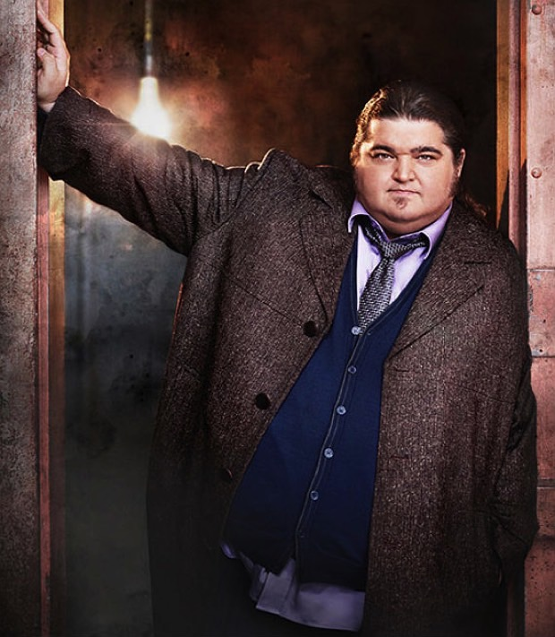

Aliás, quando o assunto é este, não tem erro, as dicas sempre são uma porcaria e as frases que imperam costumam ser coisas como:

“Ah, mas no fim, não encane, a beleza que importa é a do interior.”

“Ser gordo não é opção, ser feliz sim…”

“Você é gordo hoje, mas acreditando em você, amanhã não será.”

Você já pegou o espírito. Tá mal tratando a balança e quer se vestir melhor? Azar o seu, fera,vire budista e busque a felicidade dentro de você.

Meu deus, qual é o problema em apenas dar o raio das dicas de imagem? E se eu apenas for gordo e não conseguir ou não quiser mudar, ou se tiver outras preocupações no momento e a única coisa que estou querendo fazer com esta busca no Google é realmente encontrar a porcaria das dicas de como me vestir melhor no meu estado atual?

Pois é exatamente isso que iremos fazer aqui, senhores. Dar a porcaria das dicas!

Só posso imaginar qual será seu espanto ao começar a ler pela primeira vez um texto sobre o tema que não vá falar que “preto emagrece” ou para que evite listras horizontais.

Vamos pelo começo. Onde existe o problema, existe também a solução. Muito do que é sugerido esteticamente para pessoas acima do peso se trata apenas de disfarçar os quilinhos extras.

Pois proponho uma outra perspectiva. E se, ao invés de esconde-los, nós o exaltarmos?

Explico.

Parte da atração que o homem desperta vem do quanto ele aparenta ter potencial fisicamente protetor. Esteticamente falando, um volume grande de massa corporal é intimidador, contanto que não tenha proporções femininas, você não precisará ter uma porção de músculos aparentes para chamar atenção de pretendentes, muito menos uma barriga chapada. O que você vai precisar é postura e um pouco de reforço visual nos lugares corretos.

Antes, um breve epílogo sobre a indústria brasileira de vestuário masculino e seu impasse com os homens acima do peso:

Você já deve ter notado que não é nada fácil encontrar roupas legais para gordos. Antes de despertar o revolucionário que há em você, saiba que o problema da maioria das marcas não é o preconceito, elas apenas não o enxergam como um grande consumidor de roupas e este é o maior dilema de todos.

Sei que você deve pensar que, se alguma marca brasileira se direcionasse totalmente para gordos iria ficar rica, pois eu não apostaria nisso.

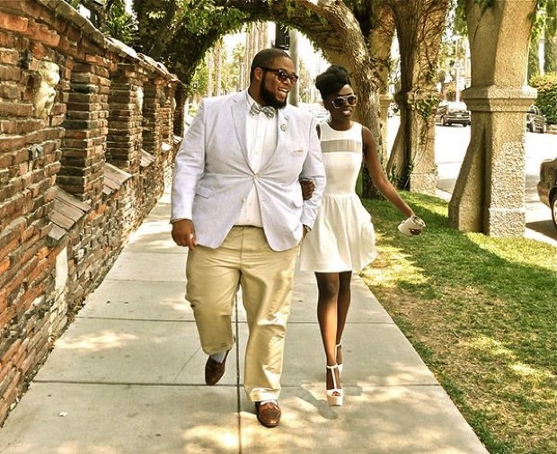

Atualmente, por dois principais motivos:

**1.** Segmentar o público alvo por personalidade, idade e poder aquisitivo já é extremamente restritivo. Adicionar “peso extra” às características só reduz ainda mais o número de clientes.

E se fizer uma modelagem normal e outra bem maior da mesma peça? Ainda assim, só seria possível para uma marca de grande porte. Eu mesmo, na Conto, gostaria de atender esta demanda, mas é impossível criar outra modelagem, mesmo que do mesmo modelo, pois na produção (devido a diferença de modelagem), elas seriam consideradas como peças diferentes e implicariam num aumento de custo, pois não estamos falando de um número extra (ggg) — o que já encarece a produção — mas sim uma nova grade inteira (p, m, g, gg).

***Obs:*** aumentar um número, criando o ggg, não funciona, pois ele iria funcionar apenas em um gigante, não necessariamente em um obeso, esta é a lógica.

**2.** E se criassem uma marca para todos os obesos, a “Obeso´s Modas”? Bem, ai sim você teria ao seu alcance um número grande de potenciais compradores, mas dizer que todos as pessoas acima do peso tem o mesmo estilo, personalidade e desejos, apenas por compartilharem o mesmo peso, isso sim eu chamo de ingenuidade (para ser simpático). Acredito que também não daria certo.

Possível solução:

### Resposta Idiota

Compre como um maníaco. Por que você acha que nos Estados Unidos é possível encontrar roupas bacanas para obesos?

“Aii Bruno, é que é Primeiro Mundo, Bruno!”

Ahan. Tá bom, agora sentá lá, fera.

O verdadeiro motivo de encontrarmos este tipo de produto nos EUA é pelo simples fato que eles consomem muito e, por isso, é possível sustentar modelos de consumo ainda mais segmentados.

Você já notou que consegue encontrar nas lojas de camisas de futebol, tamanhos bem maiores do que em marcas de moda? Uma palavra pra você amigo: demanda.

### Resposta Inteligente que parece idiota

Precisamos de mais estilistas obesos que não tem onde comprar roupas.

Normalmente uma marca de grande porte prefere ampliar sua cartela de produtos para um cliente que ela já domina do que tentar cativar um novo consumidor com um produto semelhante ao que já produz. Talvez a resposta para isso seja que é mais fácil vender algo novo para quem já gosta de você do que para quem ainda não se interessa.

A saída mais viável para este impasse é termos mais estilistas acima do peso, tanto iniciando novas marcas quanto dentro de empresas consagradas. Acredito que este seja o caso de aposta em iniciativas pessoais, no caso das pequenas marcas, seria ainda mais ideal porque todo criador começa criando para si, é um vício que só nos abandona depois de muito tempo de criação.

Em marcas pequenas, é um vício inicial necessário, pois é o criador que conseguirá definir se a peça esta realmente boa por meio de seu uso diário, descobrindo se atenderá realmente os desejos e necessidades de seu público.

Hora de voltarmos a análise estética e demonstrar através dos nossos dois bravos amigos, o que deve ser ressaltado ou deixado de lado quando o assunto na hora de se vestir.

La vamos nós:

### Pedro Turambar

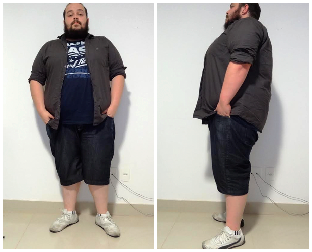

Esta foi a primeira descrição que o Pedro me mandou:

> Uma vez eu fui numa formatura do curso de moda, acompanhando uma amiga. Era algo bem despojado, no Mercado Central de BH. Confesso que fui pelo interesse na amiga e pela bebida, gelada, dourada e liberada. Eu, com toda minha sorte, fui entrevistado — sabe-se lá porque — pela Redeminas, perguntando sobre meu estilo.
>
> Eu olhei para baixo e pela primeira vez — naquele dia — tive noção do que estava vestindo. Com isso na cabeça, respondi simplesmente que eu era um cara que pegava qualquer coisa no guarda-roupa, colocava no corpo e saia. “Sou um cara camisa Hering, calça jeans e All-star. Só isso”.
>
> Ou isso, ou eu respondia o que é uma realidade para todo gordo: “visto o que couber e que não pareça tão ridículo.”

Este tipo de descrição aparece toda vez que eu converso com alguém acima do peso. Nessa lógica, as coisas me parecem mais ou menos assim:

Perguntei pro baixinho, qual seu estilo?

– Eu sou estilo punk!

Perguntei pro altão, qual seu estilo?

– Eu sou estilo clássico.

Perguntei pro magrelo, qual seu estilo?

— Eu sou estilo rock.

E então eu perguntei pro obeso, qual seu estilo?

– Eu sou estilo gordo.

Todos os biotipos chegam para falar comigo com descrições condizentes com suas referencias ideológicas e estéticas, mas quando se trata do cara com sobrepeso, a primeira característica que ouço costuma ser sua composição física.

Por isso, antes de qualquer dica, é necessário dizer aos camaradas gordos que identifiquem seus estilos e percebam que vocês só começarão a colher resultados positivos com a sua imagem se ela estiver clara o suficiente para passar alguma mensagem.

Voltando ao Pedro, depois de ler seu primeiro e-mail, trocamos uma ideia e chegamos a um adendo importante na descrição:

> Sempre fui apaixonado com essa coisa meio grunge, mas sem camisa na cintura. Apenas simples e urbana.

Agora sim temos algo que somado a imagem atual dele poderá nos nortear na análise a seguir.

Vamos começar pelos pés. o calçado claro E com pouco volume se mistura às cores da batata da perna. Como todo o resto da composição é escura, isso faz com que a parte clara “se separe” da imagem (se fundindo ao fundo), dando a impressão de que nosso amigo seja menor do que realmente é.

Substituição simples, trocar o tênis casual esportivo branco por um tênis escuro, com o cano mais alto e menos justo ([como este](http://www.pinterest.com/pin/183381016052540758/)). Desta maneira, os pés voltam a fazer parte do corpo e como aparentam mais volume, equilibram melhor a simetria do todo.

A bermuda é bem bacana, monocromática, sem lavanderia e com corte reto. Funciona em uma quantidade sem fim de composições e encaixa muito bem com o perfil simples e urbano que ele deseja transmitir. Apenas é necessário uma leve alteração de comprimento. Se ela subir de dois a três dedos, o Pedro ganhará de volta suas canelas, que no momento parece curtas demais para o sua imagem.

Na parte do tronco, temos uma boa quantidade de modificações a serem feitas. A primeira delas é trocar a camisa de cor escura por uma de cor clara, mas mantendo a camiseta de cor escura. Isto criará uma área estreita e fina que chamará mais atenção do olhar do que a parte externa.

Esta é uma maneira de afinar a silhueta sem apelar para o recurso óbvio de esconde-la. Veja como realmente funciona:

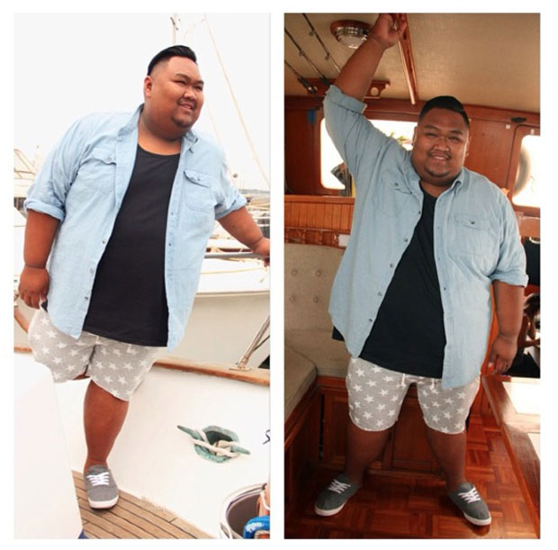

Sobre a camiseta, mantemos o valor (claro/escuro) e podemos manter até a estampa, porém é necessário procurarmos uma peça em que ela esteja melhor localizada. Repare que a estampa está lá em cima, quase como se quisesse esganar nosso querido amigo. Isso sempre vai acontecer com camisetas muito grandes, ninguém sabe muito bem porque e a informação que estou prestes a dar, não só esclarece o fato, como também serve de alerta para todas as marcas do mundo que insistem em ter abismos entre os setores de criação e de produção.

Quando a peça vai ser estampada, ela é encaixada no berço (uma espécie de registro). Acontece que a peça que serve de base para definir o local da arte é, normalmente a M (média) e toda as demais peças, quando vão ser estampadas, são alinhadas pelo topo, de modo que quanto maior o número da peça, mais longe a base da camiseta ficará da estampa.

Isso faz com que a arte da camiseta se concentre proporcionalmente na parte superior da peça, causando esta sensação de que o desenho esta desequilibrada na camiseta. Este é um dos motivos de você, que é gordo, colocar a mesma camiseta que um amigo mais magro e achar que nele fica mais bonita que em você.

E chegamos na cabeça. Antes de tudo, peço que você, leitor, ávido em mandar sua foto, tome um pouco mais de distância na hora de tirá-la. Assim fica mais fácil de sugerir algo, pois não precisarei imaginar sua cabeça, como quase fiz com a do Pedro aqui.

Minha sugestão para o ele é que assuma sua carequice, não pelo fato de gordos ficarem melhores ou piores quando carecas, mas sim pela simples constatação que o meio do caminho costuma ser o pior lugar para se estacionar. Fora que, ao fazer isso, ele iria valorizar ainda mais sua mandíbula e, por conseqüência, ressaltar sua virilidade.

Já a barba, meu acessório pessoal eterno, pode receber umas aparadelas nos fios mais rebeldes, com tesourinha mesmo. Isso lhe dará um aspecto mais volumoso e saudável. Por fim, sinto um pouco de falta de algo em um dos braços. Iria sugerir um relógio, mas lembrei que ele gosta de grunge, o que tornaria a pedida um tanto quanto incoerente.

Lembremos nosso mantra: coerência é beleza.

Matamos então com uma pulseira de couro discreta ou uma correntinha de metal bem fina. Pronto Pedro. Nada de esconder coisa alguma. Se tratou apenas de colocar as coisas certas no lugar certo, afinal, largura é presença!

### Vini Menezes

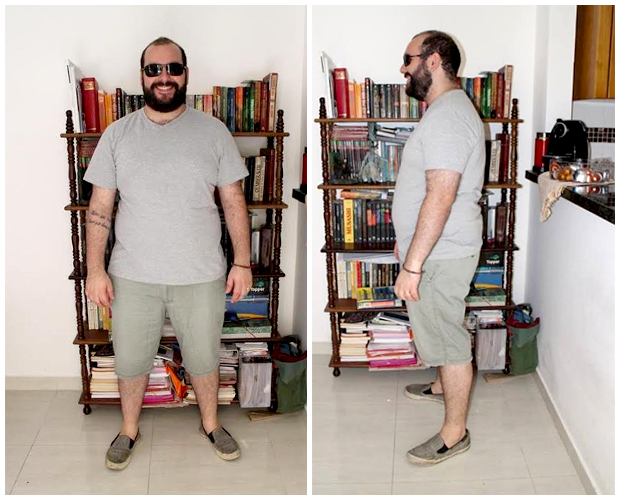

> Paciêcia e calma me definem, embora minha esposa ache que estou mentindo quando, de noite, digo que não estou pensando em nada.
>
> Como sou tímido, acho que Lenine me descreve melhor que eu mesmo: “e quando o tempo acelera e pede pressa, eu me recuso, faço hora, vou na valsa”.

Nossa coluna parece estar se especializando em descrições interessantes. Fico ainda mais feliz em ver que nossos leitores estão ficando apurados em utilizar nossas dicas.

O Vini aqui lembrou bem como harmonizar por meio da semelhança e optou por saturações e valores (claro/escuro) para realizar tal proeza.

Começando de cima, cortando mais as laterais do cabelo, eles não parecerão apenas continuações da barba e ajudarão a demarcar melhor a região do crânio. O óculos está com uma relação boa com a face, terminando logo onde começar as sobrancelhas.

A primeira característica a ser observada para alteração são os pelos fujões. [Não tem problema algum ter pêlos](http://papodehomem.com.br/pelos-onde-te-los-e-como-faze-los/). Porém, é importante que eles não pareçam uma entidade com vida própria. Portanto, mantenha-os dentro de sua camiseta, ainda mais quando ela nem sequer é muito cavada.

Partindo para a camiseta, a escolha cromática é ótima. O cinza ressaltou a saturação da sua pele, deixando-a mais rosada e com aparência saudável. O maior problema que encontramos aqui foi o dilema universal de quem está acima do peso: **modelagem**.

O comprimento da peça está correto, porém as mangas foram projetadas para braços mais largos e, por isso, as pontas abrem em diagonal. Na parte do fim das costelas ocorre o oposto, a modelagem fica menor do que deveria e quase começa a repuxar no corpo.

Eu gostaria muito mais de apenas indicar as alterações e imaginar que tudo vá se resolver na sua próxima ida ao shopping, mas é provável que não ocorra deste modo e que sua maior dificuldade continue sendo a mesma, encontrar algo que lhe caia bem. E aí voltamos ao problema conversado no epílogo sobre a indústria de moda.

Portanto, se quer uma peça que tenha a modelagem que melhor lhe favoreça, no momento, a alternativa é levar para ajustar.

Encontrar uma costureira e fazer alguns ajustes pontuais nas camisetas é o plano mais viável, embora pareça uma tarefa hercúlea, creio ser a opção mais tangível para resolver o problema. Comprar diversas camisetas de uma vez (da mesma marca) e levá-las todas juntas na costureira para sofrerem os mesmos ajustes. Sairá mais barato e não perderá tanto tempo.

Escolha peças grandes que envolvam de maneira confortável sua cintura, então peça que todas as mangas fiquem mais rentes ao seu braço e, se necessário, diminua um pouco o comprimento.

Retornando a análise, a escolha do short foi um golpe de mestre. A harmonia com a composição esta aí e, por ser mais escura que a camiseta, separa de maneira clara estas duas partes do corpo. Quanto mais visível e equilibradas estiverem as divisões do corpo, mais beleza você irá aparentar.

A única observação sobre a bermuda será a mesma que fiz ao Pedro. O ideal seria dois dedos mais curta. Penso que, por ser um problema recorrente, é provável que se tratem de peças que foram concebidas para atender pessoas grandes, não necessariamente, pessoas gordas.

A escolha do calçado fechou com chave de ouro a sensibilidade para cores presente no Vini. Reparem como existe um degrade entre suas peças, começa da maior peça (clara) e segue até a menor peça (escura).

E não para por aí. Note que ele escolheu o braço oposto ao da tatuagem, para colocar o acessório no pulso, mais um ponto positivo pro contraste, perfeito.

Harmônico, conseguiu manter a descrição que tanto valoriza, mas não ficou nem um pouco monótono.

### Mande a sua composição em foto para o “Minha roupa diz”

Realmente, acho que esta coluna não terá vida longa. Metade de vocês é atenta demais aos meus conselhos, enquanto a outra não me envia fotos. Oh, embate cruel.

**Fera, seja um cara legal**. Chegando em casa, hoje, bote uma roupa que acha legal e peça pra alguém fotografá-lo de frente e lado. Na sequencia, envie-as para [minharoupadiz@papodehomem.com.br](mailto:minharoupadiz@papodehomem.com.br).

Por fim, gostaria de agradecer ao Pedro e ao Vini. Admito que, embora esta seja uma coluna séria, é preciso ter autoconfiança para enviar as fotos. E a você, querido leitor que adora a coluna e quer que ela continue a existir, pare de rosca e envie logo as suas. Sobre as dúvidas que você posta nos comentários ou por e-mail. Elas podem ser sanadas junto com mais um monte de outras questões, de maneira bem mais completa do que faço ao responder nos comentários.

Não dói.

E acabando meus agradecimentos ao estilo Show da Xuxa, quero mandar meu abraço especial a todos os gordos desse Brasilzão! E que não escondam nada. Sigam orgulhosos avolumando o mundo, de postura imponente, esbanjando robustez e lembrando sempre o mantra:

Largura é presença!

Como sempre, espero que tenha sido  útil ou, ao menos, divertido!

***Obs. 1:*** nas minhas pesquisas, encontrei este site e achei bem interessante: <http://chubstr.com/>

***Obs. 2:*** segue abaixo algumas propostas interessantes pra quem está acima do peso. Tente racionalizar o porque de ter gostado de cada combinação. Você irá se surpreender como grande parte das suas dúvidas podem ser solucionadas através de um pouco de lógica.

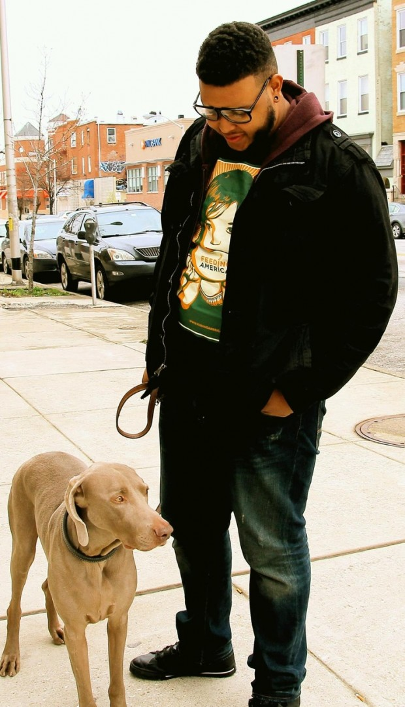

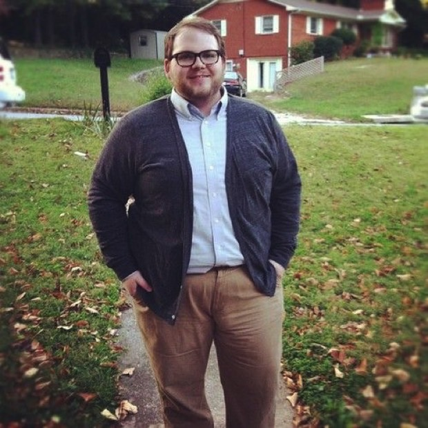

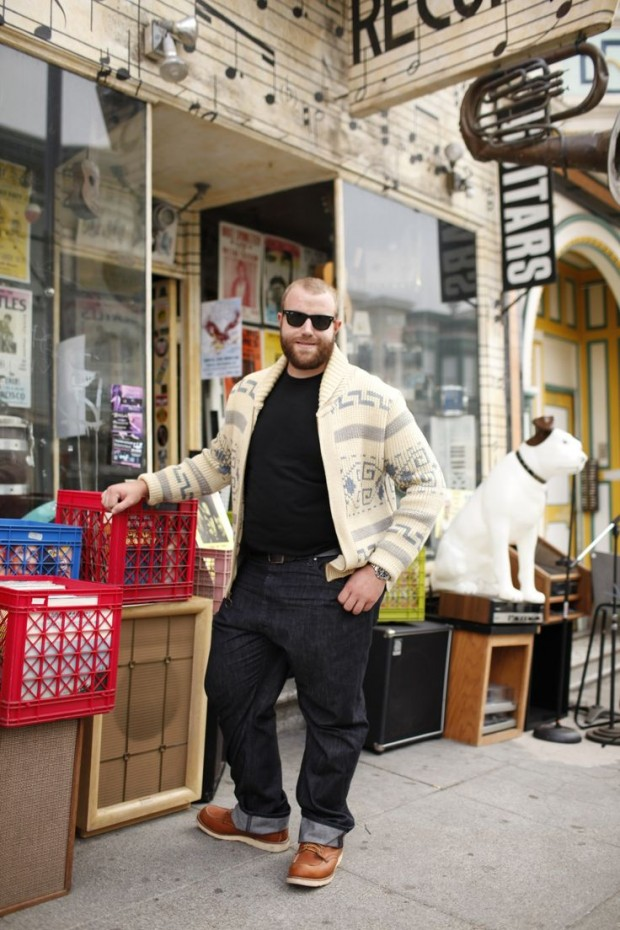

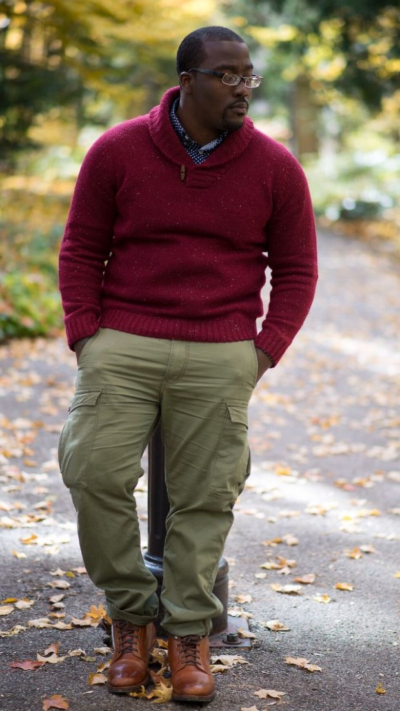

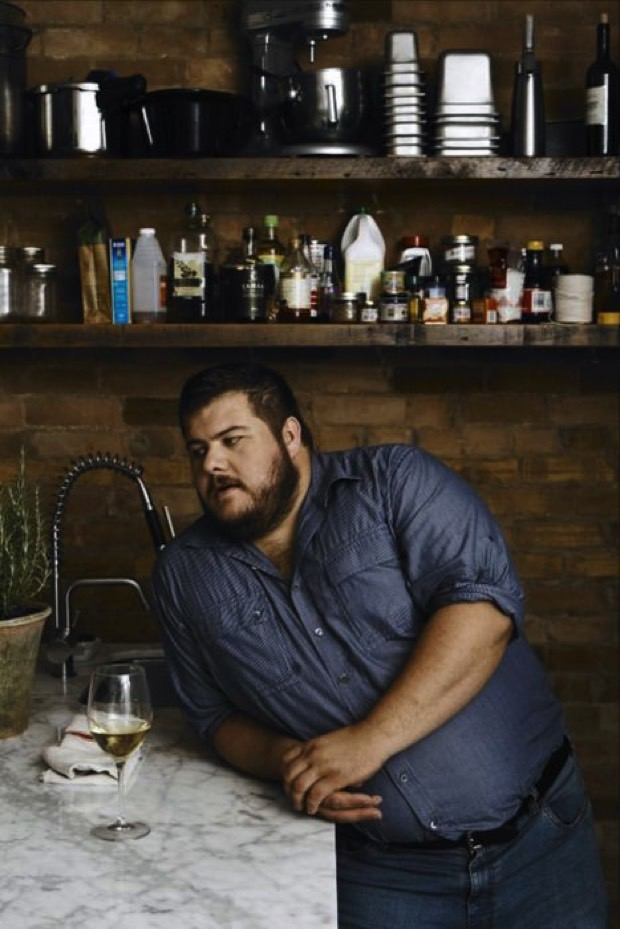

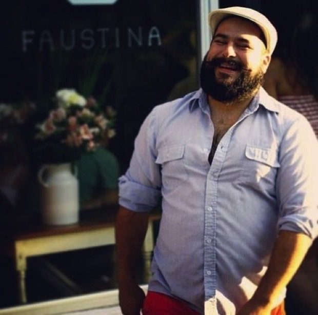

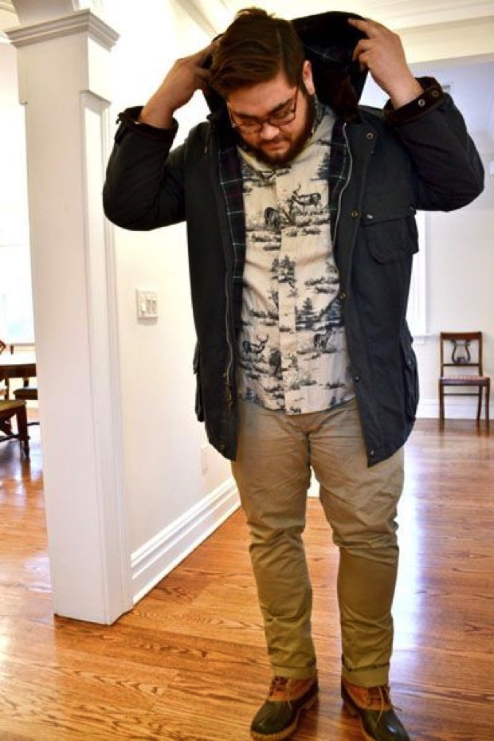

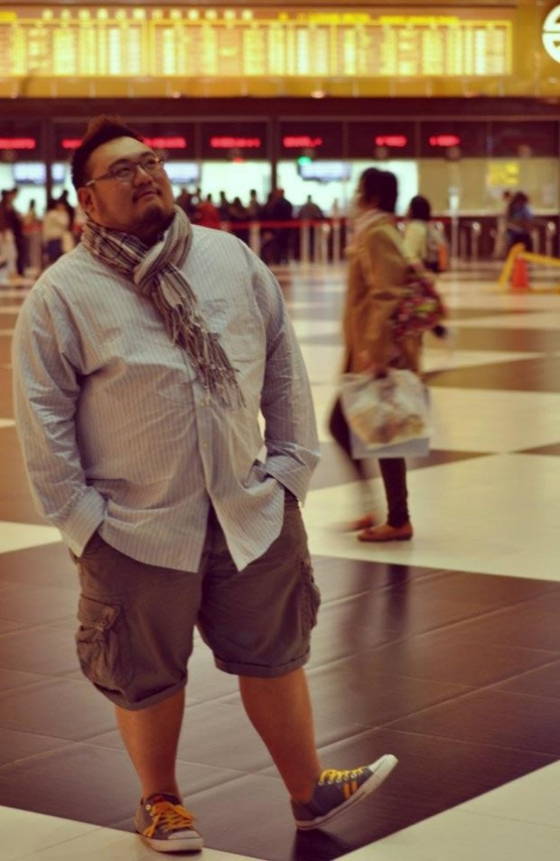

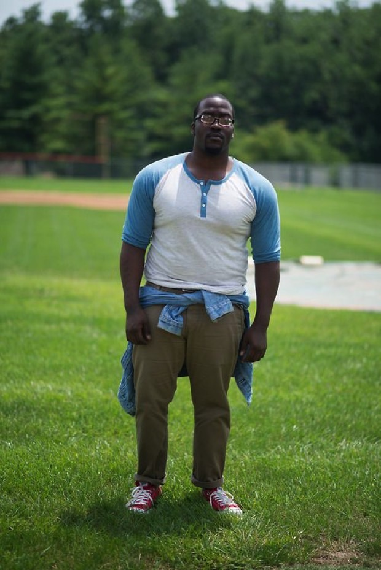

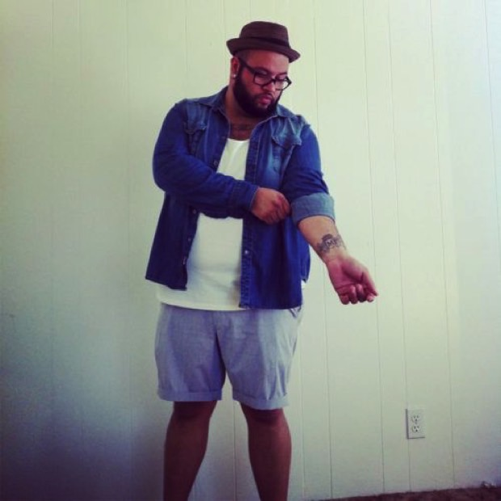

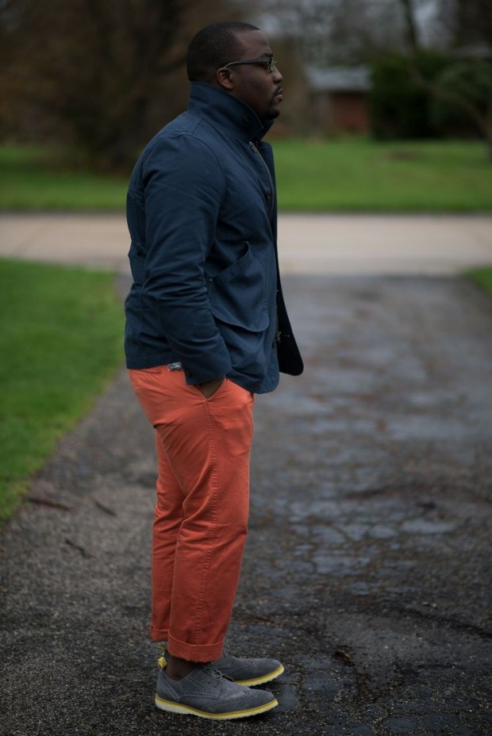

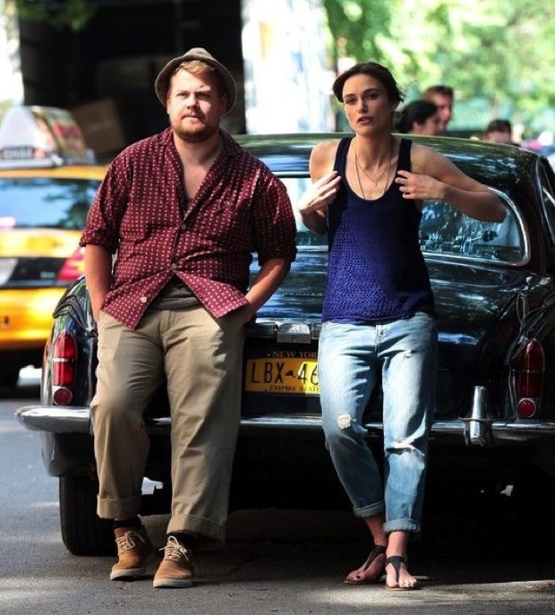

  
 por Bruno Passos
  
  
 [[anexo ausente]](http://pubads.g.doubleclick.net/gampad/jump?iu=1051165/PdH_Feed_superbanner/leaderboard&sz=728x90&c=1897778056) 
[anexo ausente]
  
  
  
[[anexo ausente]](http://da.feedsportal.com/r/211596976175/u/49/f/530922/c/32911/s/3ff17bc9/sc/19/rc/1/rc.htm)
  
[[anexo ausente]](http://da.feedsportal.com/r/211596976175/u/49/f/530922/c/32911/s/3ff17bc9/sc/19/rc/2/rc.htm)
  
[[anexo ausente]](http://da.feedsportal.com/r/211596976175/u/49/f/530922/c/32911/s/3ff17bc9/sc/19/rc/3/rc.htm)
  
  
[[anexo ausente]](http://da.feedsportal.com/r/211596976175/u/49/f/530922/c/32911/s/3ff17bc9/sc/19/a2.htm)
[anexo ausente]

[[anexo ausente]](http://feeds.feedburner.com/~ff/PapodehomemLifestyleMagazine?a=2Yz7Ae-_FQY:fJ6gRl8Oa6E:yIl2AUoC8zA)

[[anexo ausente]](http://feeds.feedburner.com/~ff/PapodehomemLifestyleMagazine?a=2Yz7Ae-_FQY:fJ6gRl8Oa6E:qj6IDK7rITs)
[[anexo ausente]](http://feeds.feedburner.com/~ff/PapodehomemLifestyleMagazine?a=2Yz7Ae-_FQY:fJ6gRl8Oa6E:-BTjWOF_DHI)

[anexo ausente]
