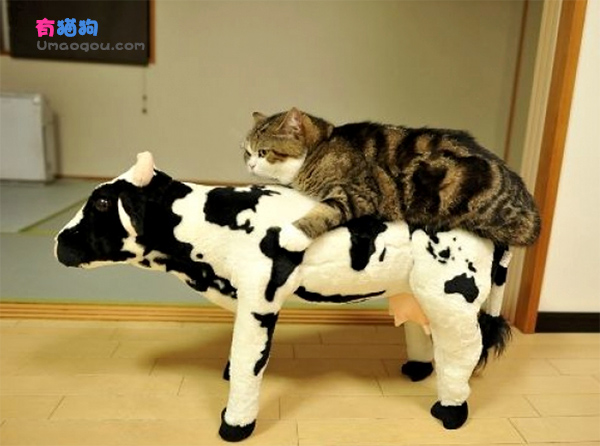

Nós precisamos conversar.

Você não vai gostar.

Aqui está o ponto.

Empregos. Carreiras. Lares. Estabilidade. Saúde. Dinheiro. Democracia. Direitos civis. Um planeta. Liberdade. Significado. Propósito. Felicidade.

FaceTinder. AppsDrones. Ver pessoas jogando videogames. Selfies. LOLcats. Adicionando gente nas redes sociais. Videos em Tubos. Pornô grátis. Reality show sobre loja de penhores. [The Latest](http://latest.is) e Mais Kardashian Kardashian. Implantes de nádegas. Escândalo. Ofensas. Prazeres. Cosmecêuticos. Coisas-feitas-pela-fábrica-escravagista-de-merda-com-menor-custo. #OMG. #WTF? #SQN

Em que você gasta a maior parte de você? Onde mora a maior parte daquilo que te apaixona? Em que você investe a maior parte da sua atenção, energia e idéias?

*Nas coisas da segunda lista.*

Você está trocando as coisas na primeira lista pelas coisas na segunda lista.

#LOL.

### O que é que há de errado com você?

Talvez você não possa mudar o mundo. É verdade. Nem todos nós podemos – e nem todos nós deveríamos tentar. Mas você pode… ser um humano em operação. Eu estou sugerindo que você chame seu deputado, os membros do governo, se revolte nas ruas, se torne um hippie com dreads e organize manifestações que ninguém vai porque você cheira a anos 60? Não. Mas eu estou sugerindo que desperdiçar sua vida em besteiras é… a maior de todas as besteiras.

Se toda a sua vida se resume à busca da Selfie Perfeita, à Maior Pontuação de Todos os Tempos, à Maior Quantidade de Mega Sensacionais Totalmente Falsos Amigos – parabéns! Você é um honorável membro da Geração Idiota.

O mundo está literalmente desmoronando. Nós teremos muita sorte se esta década não terminar em uma enorme catástrofe. Porque a última vez que o mundo ficou preso no trem expresso para lugar nenhum, os passageiros começaram a brigar uns com os outros… **até a morte**.

Vamos encarar. Nós fazemos as coisas da segunda lista porque nós estamos com medo, ansiosos, preocupados. Lá no fundo, nós sabemos que as coisas estão indo profundamente, terrivelmente mau. Socialmente, economicamente, culturalmente… espiritualmente.

Quem não gostaria de se libertar do mundo? Quem não gostaria de fugir para longe, em direção aos braços digitais imaculados do mais belo amante que jamais existiu? Aquele que nunca desafia você, assusta você, machuca você? Aquele que diz que “amor” é qualquer coisa que você quiser que seja – desde que seja um “perfil”, uma “foto”, uma “escolha” dentro da lista de um menu.

É sério isso? Isso é tudo que você é? Um ser feito de… besteiras?

Você está em busca de um deus que se pareça com Vênus. Uma deusa de amor puro. Mas ela é uma ilusão feita de bits e dígitos. E você precisa olhar para trás, não para cima. Porque aí sim você vai se lembrar. Ninguém jamais conquistou sua liberdade olhando para os desdenhosos deuses da salvação, ao invés do seu próprio espírito de libertação.

Isso é exatamente o que coragem significa. Não a ausência do medo. Mas a superação do medo, apesar da certeza da dor. Me condene se quiser, diz o corajoso. Eu estou condenado *de qualquer modo*. Se eu não puder.

Geração Idiota. Eu amo vocês. Mas vocês precisam aprender a amar a vocês mesmos. Não do modo inocente, tolo, sem esperança e cínico que ensinaram vocês. Que amor é meramente a “liberdade” de correr por um parque de diversões gritando pedaços de êxtase digital gourmet enquanto o mundo se desfaz em esquecimento. De um modo que todos os traços do verdadeiro você são esquecidos. Amar a si mesmos em um sentido verdadeiro. Aprender que não existe apenas mais da vida além de tudo aquilo – não existe vida em tudo aquilo.

Vocês precisam aprender a amar a vocês mesmos como pessoas que compartilham das mesmas obrigações que todos os seres humanos. A extrair o máximo de vocês mesmos, e a viverem vidas extraordinárias.

Aqui. Agora. Neste exato momento. No lugar onde você está agora. Não dentro da tela, como uma máquina, um programa, uma instrução, um perfil, uma imitação, uma imagem. Uma coisa sem esperança, menos que humana… que é… meramente executada, armazenada, desempenhada… *processada*.

E toda aquela… *merda*? É apenas ruído no sinal. Do quê? Da vida.

Imagine se eu tirar uma foto de mim mesmo, sorrindo levemente – enquanto o mundo queima em chamas atrás de mim. Seria a Selfie Perfeita. Pois eu certamente seria o senhor e mestre de tudo. Todos iriam saber o quão demais eu estava. Olha! Umair não está nem aí! O mundo inteiro *pegando fogo*… e ele tirou uma selfie!! Maldito… esse cara!! Ele é demais!! Quanta coragem!

Mas qual seria o *valor* disso? Até mesmo a mais Perfeita Selfie do mundo seria apenas ruído. No sinal. Da vida.

Não me colocaria nem um pouco mais perto de uma vida extraordinária. Apenas uma vida extraordinariamente *desperdiçada*.

Esse desafio é de cada um de nós. Ter a coragem de ser o sinal. O farol. O fogo. A faísca. O verdadeiro norte. Não meramente reduzir o eu (o eu de cada um – cada um de nós) a ruído. A futilidade, esquecimento, insignificância… falta de sentido… vazio… uma falha no fim do mundo… se acabando em… bzzzt.

Coragem, Geração Idiota. Coragem. Esse é o milagre mais verdadeiro de todos, pois é o único que existe.

O homem é o mais fraco, mais patético, de todas as grandes feras. Ele não tem pelos e é pequeno, sem garras e lento. E ainda assim, o homem é capaz de encarar um leão, em sua própria toca. E conquistá-lo. Por (meio de), primeiro, conquistar *a si mesmo*.

Fugir nunca levará você um passo mais próximo à vida que você estava destinado a viver. Nem um único e doloroso passo. Apenas a coragem pode. Isso é o que sempre foi necessário (preciso) para viver. Pois a vida não é meramente dada, ou tirada. Ela é merecida. Com lágrimas e suor, sofrimento e dor, maravilha e beleza, perseverança e graça. E ainda ela também pode ser *desperdiçada*.

Não desperdice sua vida. Viva uma vida extraordinária. Diga isso comigo.

Me condene se quiser. Eu estou condenado de qualquer modo.

\* \* \*

***Nota:** Este texto foi originalmente publicado no [Medium do autor](https://medium.com/bad-words/generation-stupid-b2bc21dc3ed5) e traduzido sob autorização por Rafael Peron.*

  
 por Umair Haque
  
  
 [[anexo ausente]](http://pubads.g.doubleclick.net/gampad/jump?iu=1051165/PdH_Feed_superbanner/leaderboard&sz=728x90&c=255138514) 
[anexo ausente]
  
  
  
[[anexo ausente]](http://da.feedsportal.com/r/211596840108/u/49/f/530922/c/32911/s/3fd1b7aa/rc/1/rc.htm)
  
[[anexo ausente]](http://da.feedsportal.com/r/211596840108/u/49/f/530922/c/32911/s/3fd1b7aa/rc/2/rc.htm)
  
[[anexo ausente]](http://da.feedsportal.com/r/211596840108/u/49/f/530922/c/32911/s/3fd1b7aa/rc/3/rc.htm)
  
  
[[anexo ausente]](http://da.feedsportal.com/r/211596840108/u/49/f/530922/c/32911/s/3fd1b7aa/a2.htm)
[anexo ausente]

[[anexo ausente]](http://feeds.feedburner.com/~ff/PapodehomemLifestyleMagazine?a=O85ftlRqRV0:Sn68gI-w1Dk:yIl2AUoC8zA)

[[anexo ausente]](http://feeds.feedburner.com/~ff/PapodehomemLifestyleMagazine?a=O85ftlRqRV0:Sn68gI-w1Dk:qj6IDK7rITs)
[[anexo ausente]](http://feeds.feedburner.com/~ff/PapodehomemLifestyleMagazine?a=O85ftlRqRV0:Sn68gI-w1Dk:-BTjWOF_DHI)

[anexo ausente]
