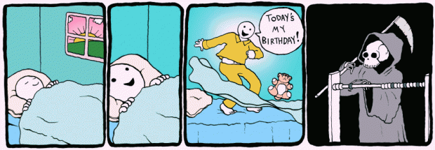

Hoje completo 31 anos de vida.

“Hoje é meu aniversário!”

Nasci em um mesmo dez de outubro, mas em 1983, dois dias antes do feriado de Nossa Senhora Aparecida. Dia das crianças. Época em que todos ganhavam brinquedos junto comigo e que, nas festinhas em casa — regadas a guaraná Antártica e suas garrafas de vidro verde adornadas com penduricalhos plásticos dos *Thundercats* — , muita gente não aparecia por estar viajando na brecha prolongada.

Aprendi cedo a não ter expectativas com a data. Não havia nada de especial em completar um novo ano. O começo de outubro em São paulo é sempre ensolarado mas ainda com um vento frio. Desde que eu apareci por essas bandas da vida terrena, a tal perfeição nunca planou em um décimo dia do décimo mês.

E nunca houve nada de mal nisso. Me empolguei muito mais vendo o Pearl Jam ao vivo em 2005 do que quando completei 18 anos e poderia entrar em qualquer lugar na noite paulistana sem precisar de documentos falsos. Publicar meu primeiro texto na Internet — [uma resenha do primeiro show da Orquestra Imperial](http://calonaorelha.blogspot.com.br/2007/08/samba-que-vocs-querem-l-vai.html) em São Paulo, em 25 de agosto de 2007 — foi uma noite muito mais representativa do que os meus 21 ou 25. Não que houvesse apatia em meus natalícios, mas só a “desimportância” que a data pede, afinal, há de um tudo pra que esse dia nos frustre.

[Há necessidade de se sentir especial](http://papodehomem.com.br/voce-nao-e-importante/), de ater mais olhares. Facilmente essa ânsia se transforma em um precisar de que o trânsito diminua justo nesse dia, que a chuva não molhe os pés, que a programação na televisão seja atrativa do início ao fim do dia. Como o tráfego intenso tá pouco se fodendo pra minha importância, como a chuva não escolhe lugar e como a coluna do Nelson Mota no Jornal da Globo certamente vai me entristecer, é pedir um pouco demais que no meu aniversário as coisas se invertam.

Mas me orgulho, particularmente, das últimas comemorações. Não é todo mundo que chega aos 30. [O amigo Alberto Brandão](http://papodehomem.com.br/author/albertobrandao/) estava preocupado em chegar nessa idade: “tem todo o lance cultural mesmo, saca? 30 anos se passaram, e ai? Você já é bem sucedido? Passou em concurso público? Tem casa própria? Carro do ano? Quando sai o doutorado? E eu aqui, sentado jogando videogame enquanto vendo duas camisetas pelo chat do facebook********.********

Eu passei pela crise dos 20 e poucos. Tive momentos de repensar vida e o que estava fazendo e onde queria ir e derrubei muitos castelos que considerava obsoletos demais para seguir construindo. Chegar aos trinta foi edificante, em vez de assustador. E enquanto o amigo está com receios dessa idade, eu já estou dando adeus a ela agradecendo por não ter feito nada que pensava que iria me orgulhar quando tivesse 30 anos. Quando mais jovem, eu tinha planos que hoje condizem pouco ou quase nada com o que efetivamente sou, eram mais anseios de quem eu pensei ser quando moleque.

Não uso carro em São Paulo e sou feliz demais por isso. Minha carreira acadêmica chegou até a pós-graduação e acho maravilhoso ter desenvolvido minha escrita na marra, no braço. Acertei ao encerrar a carreira no banco tentar viver de escrita, de crônicas e ficções. E ainda tenho um longo caminho pela frente, cheio de encrencas e coisas fodas.

Ademais, hoje eu serei o mesmo Jader de ontem.

Com um dia a menos.

  
 por Jader Pires
  
  
 [[anexo ausente]](http://pubads.g.doubleclick.net/gampad/jump?iu=1051165/PdH_Feed_superbanner/leaderboard&sz=728x90&c=1964993982) 
[anexo ausente]
  
  
  
[[anexo ausente]](http://da.feedsportal.com/r/210474194364/u/49/f/530922/c/32911/s/3f4ebca7/sc/19/rc/1/rc.htm)
  
[[anexo ausente]](http://da.feedsportal.com/r/210474194364/u/49/f/530922/c/32911/s/3f4ebca7/sc/19/rc/2/rc.htm)
  
[[anexo ausente]](http://da.feedsportal.com/r/210474194364/u/49/f/530922/c/32911/s/3f4ebca7/sc/19/rc/3/rc.htm)
  
  
[[anexo ausente]](http://da.feedsportal.com/r/210474194364/u/49/f/530922/c/32911/s/3f4ebca7/sc/19/a2.htm)
[anexo ausente]

[[anexo ausente]](http://feeds.feedburner.com/~ff/PapodehomemLifestyleMagazine?a=OS8GNESvj6g:l8eV1fFEC4w:yIl2AUoC8zA)

[[anexo ausente]](http://feeds.feedburner.com/~ff/PapodehomemLifestyleMagazine?a=OS8GNESvj6g:l8eV1fFEC4w:qj6IDK7rITs)
[[anexo ausente]](http://feeds.feedburner.com/~ff/PapodehomemLifestyleMagazine?a=OS8GNESvj6g:l8eV1fFEC4w:-BTjWOF_DHI)

[anexo ausente]
