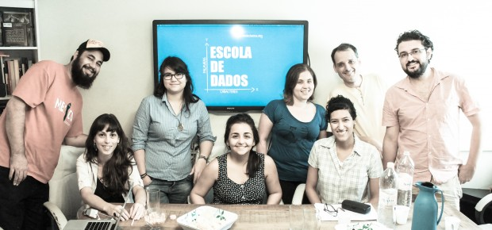

Esses tapumes de madeira que revestem o PapodeHomem vão sumir em breve. Logo mais ganharemos uma nova versão. Novo layout, nova plataforma, novas funcionalidades, foco na experiência de leitura, no conteúdo e na comunidade. Nossa parceira de empreitada é a Engage, empresa incrível, responsável por projetos como o [Catarse](http://www.catarse.me), [nós.vc](http://rss.feedsportal.com/c/32911/f/530922/s/3f25d305/sc/23/l/0Lpapodehomem0N0Bbr0Cos0Eprogramadores0Esao0Eos0Ebruxos0Eda0Eatualidade0C/www.nos.vc), [Meu Rio](http://www.nossascidades.org/), dentre vários [outros](http://engage.is/).

Trabalhei com desenvolvimento de software por quase 8 anos, e essa foi a primeira vez em que me encontro do outro lado do balcão. Estou do lado de quem pede, não mais do lado de quem faz.

Uma parte significativa de mim pensa “meu amigo, que alívio, chega de madrugadas em claro”, outra parte de mim se sente impotente. Vejo um problema na minha frente e não posso resolver. Penso em uma funcionalidade e não consigo fazê-la surgir. Os editores reclamam que o botão não funciona, e tudo que eu posso fazer é dizer que falarei com o (santo) Enzo, nosso desenvolvedor, que tem me aguentado durante o projeto. Que desconforto.

Enquanto era eu quem estava com a mão na massa, me enfiando por entre as linhas de código, eu não percebia que, nos dias de hoje, quem tem o teclado tem o poder. A gente pode ter um projeto incrível, inteligente, revolucionário, mas se não soubermos o que dá para fazer e o que não dá, se não soubermos o que é complexo e o que não é, se não tivermos uma mínima noção técnica de como as coisas funcionam nesse mundo de zeros e uns, temos pouca chance.

Não dá mais pra fugir. É como se todos os nerds desprezados pelas meninas bonitas durante o colegial tivessem se unido, se rebelado, ganhado voz e escapado da prisão do desinteresse. São imprescindíveis. Não importa a área de atuação, são eles que tiram as ideias do mundo das ideias e fazem com que apareçam na tela.

Viramos reféns desses caras inteligentes movidos a café.

### As lacunas que a escola deixou

Raciocínio lógico, conhecimentos básicos em programação deveriam ser matérias obrigatórias na escola, mas não são. Depois de grande é que a gente apanha e se arrepende por não ter se preocupado antes.

Várias iniciativas têm surgido. Nossa antiga sede foi ocupada em fevereiro desse ano pelo pessoal da Escola de Dados, por exemplo. O Marco Túlio contou um pouco sobre o encontro [aqui](http://papodehomem.com.br/a-escola-de-dados-ocupou-o-papodehomem-pra-ensinar-a-programar/):

### Sobre o #eupossoprogramar

O [#eupossoprogramar](https://www.eupossoprogramar.com/) é uma parceria entre a Microsoft e o [code.org](https://www.code.org/), plataforma de ensino de programação. A ideia é oferecer cursos rápidos, lúdicos, sem linguajar técnico amedrontador.

O mais genial, na minha opinião, é a tentativa de despertar o interesse de crianças e pré-adolescentes. Tem curso para crianças a partir de 11 anos. Esse é o vídeo utilizado para convidar a molecada para aprender a programar com os bichinhos do Angry Birds.

*[Link YouTube](https://www.youtube.com/watch?v=bQilo5ecSX4) | O Obama não está aí a toa. Ele sabe a importância que a tecnologia tem no desenvolvimento de um país.*

O projeto convida os participantes a experimentarem um desafio rápido, apelidado de *Hour of code*. Para os que quiserem incentivar os amigos a rabiscarem — e eu recomendo de coração que o façam, é bem difícil explicar algo um pouquinho mais técnico para quem nunca se aventurou em lógica de programação —, basta utilizar a hashtag *#eupossoprogramar*.

Para quem não é mais tão novinho, a plataforma também oferece [várias opções](http://code.org/learn).

Nerds do mundo, uni-vos!

  
 por Eduardo Amuri
  
  
 [[anexo ausente]](http://pubads.g.doubleclick.net/gampad/jump?iu=1051165/PdH_Feed_superbanner/leaderboard&sz=728x90&c=324598453) 
[anexo ausente]
  
  
  
[[anexo ausente]](http://da.feedsportal.com/r/206158523169/u/49/f/530922/c/32911/s/3f25d305/sc/23/rc/1/rc.htm)
  
[[anexo ausente]](http://da.feedsportal.com/r/206158523169/u/49/f/530922/c/32911/s/3f25d305/sc/23/rc/2/rc.htm)
  
[[anexo ausente]](http://da.feedsportal.com/r/206158523169/u/49/f/530922/c/32911/s/3f25d305/sc/23/rc/3/rc.htm)
  
  
[[anexo ausente]](http://da.feedsportal.com/r/206158523169/u/49/f/530922/c/32911/s/3f25d305/sc/23/a2.htm)
[anexo ausente]

[[anexo ausente]](http://feeds.feedburner.com/~ff/PapodehomemLifestyleMagazine?a=7BMCqZ3LRSo:ThWLFlYShkA:yIl2AUoC8zA)

[[anexo ausente]](http://feeds.feedburner.com/~ff/PapodehomemLifestyleMagazine?a=7BMCqZ3LRSo:ThWLFlYShkA:qj6IDK7rITs)
[[anexo ausente]](http://feeds.feedburner.com/~ff/PapodehomemLifestyleMagazine?a=7BMCqZ3LRSo:ThWLFlYShkA:-BTjWOF_DHI)

[anexo ausente]
