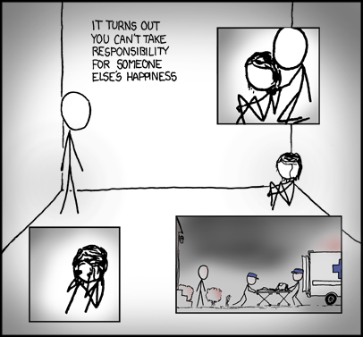
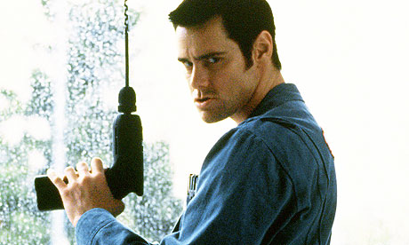

Recentemente conversamos sobre [como podemos quebrar a barreira da vergonha](http://papodehomem.com.br/como-pedir-favores-sem-ser-o-chato-da-galera/), medo ou prepotência, nos mostrando frágeis e pedindo por apoio. Esse passo é muito importante para mover várias engrenagens na vida, já que raramente podemos resolver tudo sozinhos. Infelizmente, o pedido de socorro, por si só pode acabar nos frustrando, se aquele que acreditamos ser o portador da solução não entender como executar seu papel na dinâmica.

Por isso, separei alguns tópicos que podem representar a diferença entre uma ajuda eficiente e outra que pode acabar prejudicando ainda mais aquele que pode precisar do socorro.

### Assumindo uma postura aberta

Um dos pontos mais importantes quando decidimos mudar nossa postura, é nos posicionar como pessoas abertas ao pedido de ajuda. Numa mistura de demonstração de interesse e empatia, podemos fazer pessoas a nossa volta se sentirem confortáveis em nos abordar.

Primeiramente, observando o comportamento e relacionando sobre como a eventual crise pode ser reflexo de um problema maior. Estes eventos não precisam ser acontecimentos grandes, muitas vezes são representados apenas por pequenas oscilações de humor, acessos de irritabilidade, falta de atenção fora do normal e até mesmo perda de interesse em assuntos que antes eram tidos como prioritários.

Ao identificar alguma dessas alterações, mesmo que a pessoa não procure uma ajuda específica e prefira cuidar sozinho de seu problema, podemos nos prontificar e oferecer uma mãozinha. Deixando claro que **existe uma diferença enorme entre se oferecer para ajudar e forçar uma intervenção de forma invasiva.** Não é preciso exagerar, a ajuda só é eficiente se o outro lado ativamente entendê-la como necessária. Entretanto, podemos apenas olhar nos olhos e com honestidade dizer: *“Percebi que está meio estranho, está tudo bem por aí? Se precisar de alguma força, pode contar comigo”.*

“Acontece que não dá pra tomar responsabilidade pela felicidade dos outros.”

Este tipo de atitude feita apenas uma vez pode significar quase nada, mas repetidas vezes, em períodos diferentes, inicia um processo de mudança na forma como as pessoas a sua volta enxergam você. Com pouco tempo, ao invés de apenas se oferecer como prestativo, as pessoas vão buscá-lo por identificá-lo como uma pessoa disposta a ajudar.

### Os limites da ajuda

Toda ajuda em excesso pode caminhar para um grave problema, não sendo difícil encontrar exemplos para demonstrar isso. Quando alguém pede ajuda, normalmente quer uma solução para uma questão específica, de um problema ainda maior, e para a ajuda não atrapalhar, precisamos entender onde começa e termina essa interação.

Para visualizar melhor, imagine que precisa de ajuda para desenvolver um texto. Eu estou lá para ajudar com as ideias, mas começo a ler e apontar falhas gramaticais ao longo do caminho. Em nenhum momento a interação foi apontada para este sentido, mas eu, na vontade de ajudar, achei que apontar os erros seria uma coisa boa. No fim, desconcentrei seu fluxo natural de trabalho, criei distrações que não deveriam ser resolvidas naquele momento, e prejudiquei sua relação com as ideias que estavam fluindo. Ao invés de ajudar, acabei sendo um problema ainda maior.

Quando interferimos muito, tentando ajudar demasiadamente, podemos acabar extrapolando o limite desejado.

Não vá com muita sede ao pote

É importante garantir que nossa disposição não pressione mudanças indesejadas por aquele que recebe o apoio. É bem comum pedir uma ajuda e ouvir: *“Claro, conta comigo! Mas acho que você deveria fazer assim.”*, e com uma resposta negativa, pessoa acabar se irritando  e explodindo: *“Olha, eu estou aqui para ajudar, se não quer fala logo”*. Como se acatar todas as sugestões independente do objetivo pessoal fosse uma obrigação de quem recebe o apoio.

Outro ponto importante para ressaltar, é que não devemos assumir a responsabilidade, nos comprometendo com o problema do outro. Isso pode gerar uma acomodação daquele que recebe o apoio e destruir qualquer incentivo para que ele resolva a questão efetivamente, já que agora quem se importa com isso é você. Por isso é tão importante não executar a ação, mas apontar formas de concretizá-la, principalmente para que na próxima vez a pessoa consiga prosseguir sem auxílio. Em muitos casos, a intervenção ampla acaba criando um verdadeiro refém, não capacitando a pessoa para resolver seus problemas e obrigando a voltar sempre que precisar.

Um exemplo disso é um amigo que está desenvolvendo um site e pede conselhos com frequência. Muitas vezes sei resolver o problema dele em questão de minutos, mas prefiro entregar um tutorial na mão e deixar que ele execute, mesmo que demorando horas, porque ao final do processo, ele não precisará mais da minha ajuda e eu poderei seguir com minha vida.

Em alguns momentos, ao identificar que existe um comodismo, é necessário mudar a postura, forçando que a pessoa assuma novamente o próprio fardo.

### Nenhuma boa ação seguirá impune

Pode parecer uma frase negativa e desestimulante para aqueles que desejam se abrir para ajudar as pessoas, mas na verdade serve como um aviso. Muitas vezes acreditamos que uma é ajuda algo rápido, desconsiderando o lado negativo que pode surgir. O lado positivo da ajuda é a sensação de satisfação que sentimos ao executar o gesto, mas muitas vezes vamos sofrer com o arrependimento de acabar numa situação que não gostaríamos.

Sabe quando você oferece aquela carona, mas a pessoa resolve que precisa passar em outros 4 lugares no meio do caminho, diz até que vai ser rapidinho, mas acaba atrasando todos os seus planos? Ou você se oferece para dar alguns conselhos, mas agora gasta entre 3 e 4 horas diárias trabalhando para a pessoa, que se apoderou da sua rotina?

Por isso ao escolher ajudar precisamos logo de inicio aceitar que efeitos colaterais podem acontecer e em sua maioria são normais. No ano passado um amigo americano pediu que hospedasse o site de sua empresa num servidor meu, até aí tranquilo, mas as demandas dele passaram a ser diárias, sempre pedindo algum ajuste necessário. Quando percebi estava praticamente trabalhando meio período por um favor que resolvi oferecer de bom grado.

Nestes casos é importante saber se impor, declarar o limite e dizer que a partir dali não pode mais fazer nada. No caso do meu amigo, disse que para continuar fazendo este tipo de ajustes precisaria cobrar uma taxa mensal, já que ocupavam horas do meu dia em que eu deveria estar produzindo outras coisas. A situação ficou meio estranha no início, mas o limite serviu muito bem para entender onde termina um favor e começam meus próprios problemas. Hoje entendemos esta relação e tudo flui com normalidade.

Este jogo de cintura é importante, porque pessoas podem se ofender facilmente e isso talvez sensibilize as relações, quando na verdade o objetivo é sempre o oposto.

Ajudar, assim como receber ajuda, faz parte de um processo comum em nossas vidas. Observar como estes mecanismos afetam nossa relação com as pessoas pode ampliar ainda mais os resultados, fortalecer laços e desenvolver ambos os lados, já que desse jeito, se tornam tanto abertos para ajudar, quanto relaxados para receber esta ajuda.

E aí, como posso te ajudar?

  
 por Alberto Brandão
  
  
 [[anexo ausente]](http://pubads.g.doubleclick.net/gampad/jump?iu=1051165/PdH_Feed_superbanner/leaderboard&sz=728x90&c=360643630) 
[anexo ausente]
  
  
  
[[anexo ausente]](http://da.feedsportal.com/r/211596909268/u/49/f/530922/c/32911/s/3fe17097/sc/23/rc/1/rc.htm)
  
[[anexo ausente]](http://da.feedsportal.com/r/211596909268/u/49/f/530922/c/32911/s/3fe17097/sc/23/rc/2/rc.htm)
  
[[anexo ausente]](http://da.feedsportal.com/r/211596909268/u/49/f/530922/c/32911/s/3fe17097/sc/23/rc/3/rc.htm)
  
  
[[anexo ausente]](http://da.feedsportal.com/r/211596909268/u/49/f/530922/c/32911/s/3fe17097/sc/23/a2.htm)
[anexo ausente]

[[anexo ausente]](http://feeds.feedburner.com/~ff/PapodehomemLifestyleMagazine?a=a3qN6_mLg9s:0rrkLWSrPzU:yIl2AUoC8zA)
[[anexo ausente]](http://feeds.feedburner.com/~ff/PapodehomemLifestyleMagazine?a=a3qN6_mLg9s:0rrkLWSrPzU:D7DqB2pKExk)
[[anexo ausente]](http://feeds.feedburner.com/~ff/PapodehomemLifestyleMagazine?a=a3qN6_mLg9s:0rrkLWSrPzU:qj6IDK7rITs)
[[anexo ausente]](http://feeds.feedburner.com/~ff/PapodehomemLifestyleMagazine?a=a3qN6_mLg9s:0rrkLWSrPzU:-BTjWOF_DHI)

[anexo ausente]
