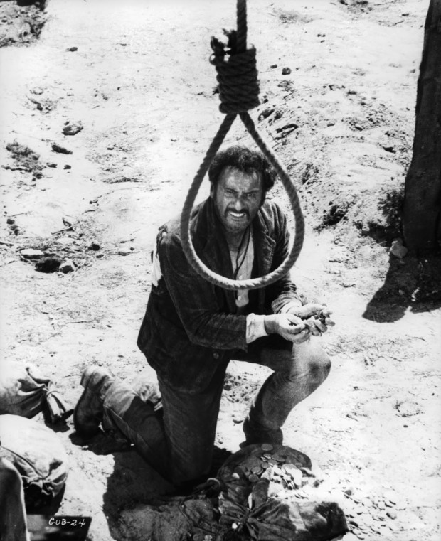

> “Olá,
>
> Já faz um ano e meio que minha conta bancária só fica positiva durante os quatro primeiros dias do mês.
>
> Recebo R$4000 de salário no dia 01, já com a conta 2000 reais negativos, e a maior parte dos 2000 reais que “sobram” duram até dia 05, quando pago meu aluguel, meu cartão e as contas da casa. A coisa segue e no dia 01 do mês seguinte já estou devendo cerca de 2000 reais para o banco de novo. A cada mês parece que chego no dia do meu salário devendo um pouquinho a mais.
>
> Não sei o que fazer para regularizar a situação. Não é nada grave perto das histórias que escuto por aí, não acho que eu precise de um empréstimo, mas sinto que deveria ser mais responsável. A ideia de mostrar meu extrato bancário para alguém (para alugar uma outra casa, por exemplo), me assusta.
>
> Se puder dar um conselho, agradeço.
>
> Rafael”

\* \* \*

Rafael, na verdade a situação não parece tão grave simplesmente porque você compra, todo mês, um dos produtos mais caros que o banco possui: o cheque especial. Não fosse um produto tão disponível (e agressivo), ficaria mais fácil enxergar a situação real.

Faltaria dinheiro até pro supermercado.

### Produtos analgésicos

O banco é uma empresa que conta com um portfólio grande de produtos financeiros e é através da venda desses produtos que ele sobrevive e dá aos seus acionistas lucros enormes.

O cheque especial é um desses produtos. Ele não resolve a situação, mas ameniza a dor. É muito utilizado porque não necessita de contratação. Ele está lá, tinindo, misturado com as linhas do extrato. É o famoso “limite” pré-aprovado.

Prático e popular, ele mantém o jogo rodando, mas cobra caro.

### Nosso medo de encarar a realidade

É comum permanecermos no cheque especial por muito tempo, pagando taxas absurdas, ao invés de pedirmos um empréstimo. Isso acontece por conta de dois motivos principais:

- ao pedir um empréstimo nos colocamos oficialmente na posição de endividado. Não tem mais desculpa, não tem mais “mês que vem eu ajeito”, é fato: temos uma dívida;

- pedir um empréstimo implica em olhar cuidadosamente para a situação. Requer ir ao banco, decidir quanto pedir, decidir em quantas vezes pagar. É um compromisso (bem dolorido) que vai se estender, provavelmente, por alguns anos.

O problema é que essa medida temporária confortável é muito cara. Enquanto o cheque especial cobra taxas de juros de até 10% ao mês, o empréstimo pessoal pode ser obtido por taxas próximas de 3%.

Longe de ser uma pechincha, mas muito mais vantajoso. O cheque especial é um produto de emergência, utilizá-lo regularmente é rasgar dinheiro.

### Como fazer, na prática?

É necessário, primeiro, estimar qual o valor seria necessário para colocar as coisas no eixo. Para isso, uma análise bem simples resolve. Pode ser até mesmo por tentativa e erro: com 7 mil o que aconteceria nos próximos 3 meses? Com 5 mil? Com 3 mil? E assim por diante.

Com o montante determinado, a melhor coisa a fazer é ir ao banco pessoalmente e negociar com o gerente a melhor taxa possível (a maioria oferece contratação através do *internet banking*, mas geralmente é uma péssima opção!). Bons bancos conseguem, dependendo da situação, taxas entre 2 e 3%.

É comum a gente se enganar dizendo que não cabe uma parcela de empréstimo no orçamento, mas a verdade é que essa parcela de empréstimo vai substituir a pancada de juros que estava sendo paga todos os meses por conta do cheque especial. Essa, inclusive, é uma boa maneira de estimar quando poderíamos pagar todo mês, e pode ser utilizada para determinar a quantidade de parcelas que iremos assumir.

### Técnica de guerra

Feito o empréstimo, a melhor coisa a fazer é cortar o limite do cheque especial. Sem dó.

Ser orgulhoso e dizer que não vai cortar porque quer exercitar o auto-controle é igual ser alcoólatra e se recusar a, durante certo período da vida, jogar fora todas as garrafas de casa e evitar as tentações. Ideia bem ruim.

### O perigo do alívio

Como o cheque especial é muito popular, ele não oferece a sensação de fundo de poço e, portanto, nos priva da oportunidade de experimentar o caos. É ruim, mas seria muito útil para evitar uma possível recaída.

Quando o dinheiro do empréstimo chega, somos assolados por uma sensação agradável de recomeço. Nossa auto-confiança retorna, temos vontade de começar direitinho — é igual comprar caderno novo e caprichar na letra nas primeiras folhas.

É a melhor hora para começarmos fazendo diferente. Se não fizermos algo diferente, em poucos meses estaremos na mesma situação desconfortável de antes.

A ideia, claro, não é virar alguém obcecado. Mudanças extremamente drásticas não funcionam, mas dá para aproveitar o respiro para colocar algum direcionamento e um mínimo de planejamento.

Para quem quer dicas de como começar a colocar a casa em ordem, sugiro esse percurso:

- [Um começo para quem não sabe por onde começar](http://papodehomem.com.br/planejamento-financeiro-um-comeco-para-quem-nao-sabe-por-onde-comecar/)
- [O que todo mundo sabe ou pensa que sabe](http://papodehomem.com.br/planejamento-financeiro-o-que-todo-mundo-sabe-ou-pensa-que-sabe/)
- [Quatro atitudes para serem tomadas hoje](http://papodehomem.com.br/planejamento-financeiro-quatro-atitudes-para-serem-tomadas-hoje/)

E, como de costume, deixo o convite para o papo nos comentários.

Para quem já tomou coragem para fazer a transição de “cheque especial constante” para empréstimo, como foi?

Que outras dicas tem para quem ainda está em cima do muro?

  
 por Eduardo Amuri
  
  
 [[anexo ausente]](http://pubads.g.doubleclick.net/gampad/jump?iu=1051165/PdH_Feed_superbanner/leaderboard&sz=728x90&c=840769836) 
[anexo ausente]
  
  
  
[[anexo ausente]](http://da.feedsportal.com/r/206158566123/u/49/f/530922/c/32911/s/3f2f607a/sc/21/rc/1/rc.htm)
  
[[anexo ausente]](http://da.feedsportal.com/r/206158566123/u/49/f/530922/c/32911/s/3f2f607a/sc/21/rc/2/rc.htm)
  
[[anexo ausente]](http://da.feedsportal.com/r/206158566123/u/49/f/530922/c/32911/s/3f2f607a/sc/21/rc/3/rc.htm)
  
  
[[anexo ausente]](http://da.feedsportal.com/r/206158566123/u/49/f/530922/c/32911/s/3f2f607a/sc/21/a2.htm)
[anexo ausente]

[[anexo ausente]](http://feeds.feedburner.com/~ff/PapodehomemLifestyleMagazine?a=MlJPuhGhl7g:8-yLYUW5u6A:yIl2AUoC8zA)

[[anexo ausente]](http://feeds.feedburner.com/~ff/PapodehomemLifestyleMagazine?a=MlJPuhGhl7g:8-yLYUW5u6A:qj6IDK7rITs)
[[anexo ausente]](http://feeds.feedburner.com/~ff/PapodehomemLifestyleMagazine?a=MlJPuhGhl7g:8-yLYUW5u6A:-BTjWOF_DHI)

[anexo ausente]
