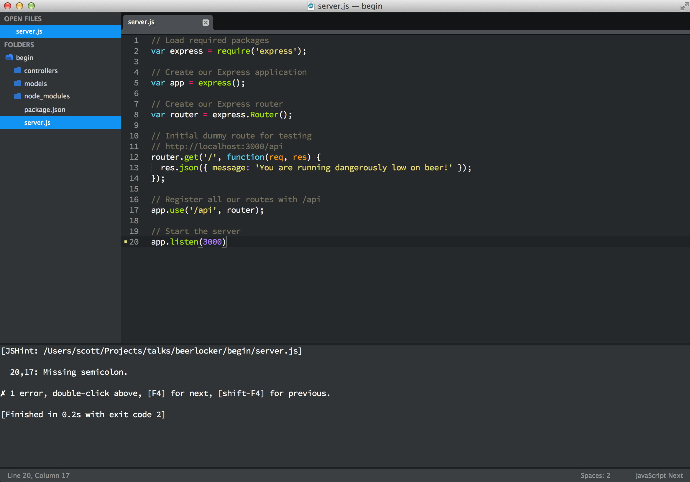
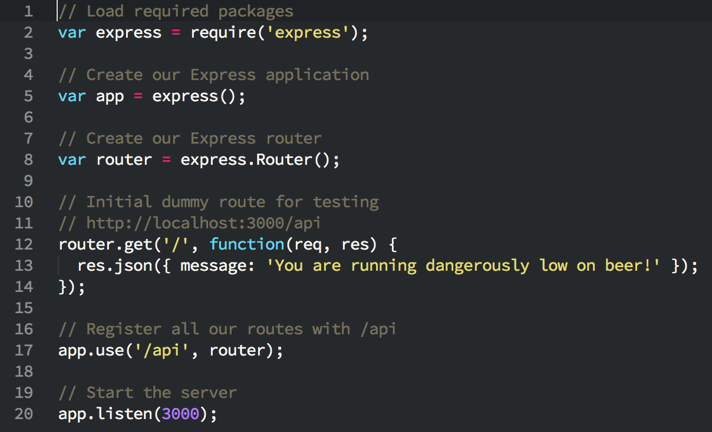
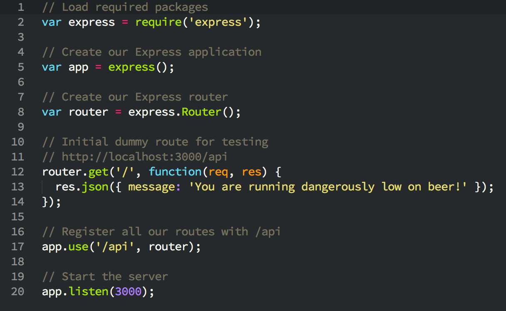

# 3 Essential Sublime Text Plugins for Node & JavaScript Developers

Sep 29, 2014

Check out these 3 great and essential Sublime Text plugins every JavaScript and Node developer should know about and use.

### JsFormat

<https://github.com/jdc0589/JsFormat>

JsFormat is a JavaScript formatting plugin. Behind the scenes, it uses the command line formatter from [jsbeautifier.org](http://jsbeautifier.org/) to format full or portions of JavaScript and JSON files.

**Features**

1. JavaScript formatting
2. JSON formatting
3. Full file formatting
4. Selected text formatting
5. Customizable settings for formatting options
6. Customize per project with .jsbeautifyrc settings file

**Usage**

Either `cmd+alt+f` on OS X or `ctrl+alt+f` on Linux/Windows

### JSHint

<https://github.com/uipoet/sublime-jshint>

“JSHint is a community-driven tool to detect errors and potential problems in JavaScript code and to enforce your team’s coding conventions. It is very flexible so you can easily adjust it to your particular coding guidelines and the environment you expect your code to execute in. JSHint is open source and will always stay this way.” - [JSHint](http://www.jshint.com/about/)

**Usage**

`ctrl+j` on OS X or `alt+j` on Linux/Windows

If you would like to have JSHint run anytime you save a JavaScript file (highly suggest this), you will need to install the [SublimeOnSaveBuild package](https://github.com/alexnj/SublimeOnSaveBuild).

### JavaScriptNext

<https://github.com/Benvie/JavaScriptNext.tmLanguage>

This plugin is a better syntax highlighter for JavaScript. Not only does it improve syntax highlighting for current ES5, it also adds syntax highlighting for new ES6 syntax such as modules, succinct methods, arrow functions, classes, and generators.

Here is the original JavaScript syntax highlighter:

Here is the new JavaScript syntax highlighter:

**Usage**

You can either set individual JavaScript files to use this syntax highlighter by changing it in the “View -> Syntax” menu or you can change it for all JavaScript files in the “View -> Syntax -> Open all with current extension as”.

### Wrap up

These 3 plugins have been very beneficial to me as a JavaScript and Node developer. If you know of other useful plugins, feel free to share them in the comments.

If you found this article or others useful be sure to [subscribe to my RSS feed](http://scottksmith.com/atom.xml) or [follow me on Twitter](https://twitter.com/scottksmith95). Also, if there are certain topics you would like me to write on, feel free to leave comments and let me know.

Posted by Scott Smith Sep 29, 2014 [JavaScript](http://scottksmith.com/blog/categories/javascript/), [Node.js](http://scottksmith.com/blog/categories/node-dot-js/), [Plugins](http://scottksmith.com/blog/categories/plugins/), [Sublime Text](http://scottksmith.com/blog/categories/sublime-text/)

#### Share On:

[« Protect Your Node App's Noggin With Helmet](http://scottksmith.com/blog/2014/09/21/protect-your-node-apps-noggin-with-helmet/ "Previous Post: Protect Your Node App's Noggin With Helmet")
