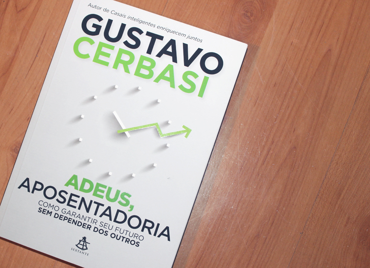

Na última Bienal do Livro de SP, comprei este bem-vindo livro do Gustavo Cerbasi, “Adeus, aposentadoria”, e não via a hora de lê-lo para poder resenhá-lo para o blog.

Para quem não conhece, Gustavo Cerbasi é um consultor financeiro brasileiro muito famoso, autor de grandes best-sellers como “Casais inteligentes enriquecem juntos” e “Dinheiro: os segredos de quem têm”. Desta vez, ele lançou um livro (novamente pela editora Sextante) sobre aposentadoria, propondo que a gente garanta o nosso futuro sem depender dos outros. Mas como assim?

“Nossa sociedade nos ensinou a fazer planos para o trabalho, mas não para viver bem posteriormente. Não importa qual seja sua idade: os planos para o que você fará quando atingir a idade em que a maioria estiver se aposentando deveriam fazer parte de suas reflexões desde o momento em que você escolheu sua profissão.”

Ele começa o livro com um capítulo falando sobre o cenário da aposentadoria no Brasil. Traz o depoimentos de uma pessoa que diz ter seguido as regras desde o início da vida profissional – se preparou, estudou, teve um emprego estável, guardou dinheiro. E que, quando chega na hora de se aposentador, percebe que o que calculou para receber da previdência privada desvalorizou muito, além das diversas deduções que ele não contava na época. Enfim, o que o Gustavo quer nos dizer é que não existe cenário perfeito para a aposentadoria, se a gente não se informar e fazer escolhas erradas.

Uma condição que me chama a atenção já antes de ler o livro dele é sobre as estatísticas demográficas do Brasil. Estamos vivendo um período de muito trabalho dessa geração ativa profissionalmente – dos 20 aos 60 anos. A geração dos 20 aos 40 está tendo cada vez menos filhos. É extremamente comum hoje um casal optar por ter somente um filho ou não ter nenhum, justamente pela evolução de suas carreiras. O resultado disso é que, quando formos idosos, os filhos serão a porcentagem ativa economicamente da população, enquanto nós seremos a maioria. Se a previdência do governo brasileiro hoje já é caótica e insuficiente, imagine como será quando tiver menos pessoas contribuindo?

Some a tudo isso o fato de que a maioria dos brasileiros não tem planos para a aposentadoria. A maioria vai trabalhando, trabalhando, acreditando que, quando se aposentar, ou vai viver com a ajuda dos filhos, ou de uma suposta poupança que nunca engorda muito, ou do próprio INSS. As pessoas em condições melhores pensam em vender algum imóvel da família ou viver da renda da previdência privada. Mas, no geral, o brasileiro não faz mesmo muitos planos para esse momento da vida.

Só que, antigamente, a gente chegava na época da aposentadoria e já morria alguns anos depois. Hoje, estamos cada vez mais aumentando a nossa longevidade e a aposentadoria é somente o começo de uma nova vida que se inicia aos 60 e termina aos 80, 90… como se espera parar de trabalhar aos 60 anos e viver mais 20 ou 30 anos dependendo de terceiros, de uma maneira geral?

Aí ele fala sobre as desculpas mais comuns que nós damos a nos mesmos, como:

“Como vou pensar no futuro se meu dinheiro mal dá para o presente?”

“Queria começar a investir em algo, mas não sei o quê.”

“Eu pelo menos estou trabalhando bastante, mas conheço gente que está pior do que eu.”

Quando eu li o livro do Tim Ferriss, “Trabalhe 4 horas por semana”, deu um estalo na minha mente sobre essa questão da aposentadoria, que é a seguinte:

“Não ver a hora de se aposentar” dá a impressão de que você odeia o que faz atualmente e não vê a hora de parar de fazer. Porém, continua desperdiçando os anos de maior energia da sua vida fazendo isso. Vai deixar de viver de maneira feliz apenas para fazer isso quando for idoso? E se você não chegar até lá? E se chegar, mas em terríveis condições de saúde, que não lhe permitirão aproveitar absolutamente nada do que você imaginava? Você se imagina desperdiçando anos e anos da sua vida em decorrência de um cenário incerto como esse?

Se você ama o que você faz, consegue se imaginar parando de fazer e ficando sem fazer nada daqui a alguns anos?

Essas questões ficaram na minha cabeça durante algum tempo, mas o livro do Cerbasi esclarece todas as dúvidas que possamos ter sobre esse assunto.

No capítulo 2, ele destrincha todas as alternativas atuais para a aposentadoria e fala quais são os prós e os contras de cada uma. São elas: contribuir para o INSS, contribuir com uma quantia maior para o INSS, desaposentação (cancelamento da aposentadoria visando uma alternativa mais vantajosa), guardar mais dinheiro na poupança, poupar por mais tempo, começar mais cedo a poupar, contar com plano de previdência patrocinado ou corporativo, contratar um plano de previdência privada, investir com mais risco, trabalhar para sempre, construir uma carreira paralela, contar com o saldo do FGTS, investir em imóveis, ter um negócio em família, contar com uma suposta herança, passar em um concurso público, contar com crédito para completar o orçamento, reclamar e cobrar do governo, confiar na sorte e que “as coisas darão certo lá na frente” e não tomar nenhuma atitude depois de ler um livro sobre finanças pessoais.

A proposta do Gustavo é garantir renda e liberdade crescentes ao longo da vida, e não esperar pela aposentadoria. A solução dele gira em torno dos conceitos de liberdade, fazer o que nos dá prazer e não nos preocupar com a obtenção de renda. Como chegar lá? É o que o livro nos traz. É excelente, um manual para a vida mesmo, e eu gostaria de tê-lo lido há pelo menos dez anos. Fala sobre empreendedorismo, investimentos e equilíbrio. Como colocar toda a teoria em prática? Ele nos traz o caminho a partir do capítulo 4. A ideia é ter um plano para garantir bem-estar e renda adequada para toda a vida.

Depois de ler alguns livros dele, eu fui atrás do “Dinheiro: os segredos de quem tem”, que tem seus conceitos básicos de ensinamentos sobre finanças pessoais. E lá ele fala sobre a teoria dos baldinhos (eu que chamo assim), que é uma estratégia que adotei para a vida. Trata-se de puro bom-senso mas, como tudo que envolve bom-senso, nem sempre a gente faz, que é o seguinte: eu tenho, todos os meses, três baldinhos para encher com o meu salário. O primeiro baldinho é o das necessidades básicas: contas, comida, necessidades mesmo. Nada de lista de desejos. É esse baldinho que eu encho primeiro quando recebo o meu salário. O segundo baldinho é o baldinho dos investimentos, que envolvem guardar dinheiro na poupança, investir em algo para a aposentadoria e por aí vai. Só depois de colocar meu salário nesses dois baldinhos é que vou para o terceiro, que é o baldinho dos “luxos”: comer fora, comprar roupas que não precisamos, viajar etc.

“Ah Thais, mas com o meu salário eu não consigo nem encher o primeiro baldinho direito.” O que ele sugere? Diminua suas despesas. Você provavelmente está vivendo dentro de um padrão de vida que está fora da sua realidade, pagando um pacote muito caro de tv a cabo, um aluguel em um apartamento muito grande e em região muito valorizada, pagando faxineira, gastando muito com comida etc. Ele bate muito na tecla de levar um padrão de vida adequado aos nossos rendimentos e, se parar para pensar, quem nunca parcelou um iPhone, por exemplo, só “para ter um”? As pessoas fazem isso o tempo todo – querem encher o baldinho de luxo sendo que mal têm dinheiro para os dois primeiros baldinhos, os que devem ser priorizados. Então essa é a ordem que ele dá para encher esses baldes todo mês: necessidades básicas, investimentos e só então os luxos. Achei bem legal porque tem muita gente também que não tem muitos gastos e acaba indo do primeiro para o terceiro, sem investir no próprio futuro. Enfim, adorei a teoria dos baldinhos! Encaixa-se muito bem em toda a proposta dele com este livro sobre aposentadoria.

Por fim, no capítulo 5 ele traz orientações do que deve ser feito em cada faixa etária da vida, dos 20 aos 80 anos. Claro que é um ideal, mas serve como referência.

Uma das minhas partes preferidas do livro é quando ele apresenta o depoimento de um jovem que conseguiu independência financeira por volta dos 30 anos de idade – ele conseguiu juntar uma quantia em dinheiro que lhe rendia mensalmente um valor que pagava suas contas. Ou seja: ele não dependia do dinheiro para tomar decisões envolvendo sua carreira e sua felicidade. Tinha liberdade de escolha. Se quisesse parar de trabalhar, simplesmente poderia, mantendo o mesmo padrão de vida. Mas não queria. Ele queria investir no seu sonho, que era virar consultor financeiro e ajudar as pessoas com as suas finanças. E, antes que vocês me perguntem, sim, esta é a história dele. Um grande cara para a gente acompanhar o trabalho, admirar e aprender muito. Este livro novo é extremamente pertinente e de uma utilidade enorme para todos os brasileiros.

Eu paguei o preço de capa (R$24,90), mas já vi algumas lojas na Internet com ele em promoção. Tem que ficar de olho. O livro está à venda nas principais livrarias.

**Mais alguém já leu o livro? Por favor, poste nos comentários!**

### Textos relacionados:

- [Livro: Sua vida em primeiro lugar](http://vidaorganizada.com/organizacao/livro-sua-vida-em-primeiro-lugar/)
- [3 livros de moda que eu li em julho](http://vidaorganizada.com/organizacao/3-livros-de-moda-que-eu-li-em-julho/)
- [Filme “Amor sem escalas” (Up in the air, 2009)](http://vidaorganizada.com/organizacao/filme-amor-sem-escalas-air/)
- [Os meus filmes preferidos que incentivam a ir atrás dos sonhos](http://vidaorganizada.com/organizacao/os-meus-filmes-preferidos-que-incentivam-a-ir-atras-dos-sonhos/)
- [Filme sobre uma casa muito, muito pequena](http://vidaorganizada.com/casa/filme-sobre-uma-casa-muito-muito-pequena/)
