# [Pusher Blog](http://blog.pusher.com/ "Pusher Blog")

## Enjoy our helpful resources & Industry insights.

*This is a guest post by Charlie Walter. We noticed Charlie was creating an awesome multiplayer game using Pusher and couldn’t resist getting him to share what he’s learnt building it. Enjoy!*

*In his own words…*

> I am a web app developer specialising in JavaScript/Coffeescript and other front end languages and frameworks. I have a strong passion for Web app and Game Development. I spend a lot of time working on personal projects. [Follow me @cjonasw](http://twitter.com/cjonasw).

In this tutorial I will explain how I created a [3D multiplayer game using Pusher](http://charliejwalter.net/tutorials/how-to-build-a-3d-multiplayer-game-with-pusher/) for real time communication. While I was learning how to create this I bumped into some hurdles I needed to learn how to jump over.

I’ve created a demo for you to [try out the game for yourself](http://charliejwalter.net/tutorials/how-to-build-a-3d-multiplayer-game-with-pusher/).

### Event-driven communication

One of the problems I encountered initially while creating a 2D version of the game (a simple proof of concept consisting of squares moving around a canvas) was that performing Pusher calls in the game loop was massively inefficient for such a simple point and click game, causing player movement to become laggy.

---

***What’s the game loop?***

*In a nutshell, this is the function that updates game logic, such as player movement and collision, it then clears and redraws the game to reflect those changes.*

---

Instead, I chose to make the game more event driven (how real time web apps should be) by making calls only when needed. This way, instead of constant laggy player updates, the player movement appears smooth and any lag that may occur will only happen when the events are received. Once a player clicks on the screen, all the other players are then informed of that particular player’s current state, where it is now going and how it will get there, therefore no more information is needed; leaving each player’s client to take care of any visual movement.

### ID named events

Another issue I had was targeting specific clients connected to the game. One way would be setting up private channels per member, however I didn’t feel this was necessary as I only needed one event to happen at this time.

I figured out that ID named events was a way around it which then allowed me to give new members the information of each player existing in the game without disturbing anyone else already in the game.

### Presence Channel types

I began creating the game using only a public channel, however this didn’t offer me the ability to access information about other members of the channel. Presence Channels offer exactly this; as soon as a member connects, they have access to an array of already connected members, it even has events for when members are added and removed.

## Getting started with Pusher

- [Create an account](http://pusher.com/signup)
- Create a new app with client events enabled to allow our client connections to communicate with each other
- Copy the contents of the front end code that you are presented with and change the `test-channel` to something like `my-game-channel`, save it as `index.html` and open this up in a tab; it should be blank but in the console it should have something like this:

```
Pusher: State changed : connecting -> connected
```

- Drag this tab out into another window so you can see it, go back to the Debug console tab on the Pusher website and submit the form like so:

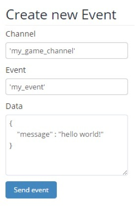

- Your newly created html file should now have an alert matching the `message` property in the Data you just sent (this form sends a server side event to the channel)
- Congrats! Your first Pusher application

## Getting the simple 3D game in place

So for the game we will be using Three.js from [@mrdoob](http://twitter.com/mrdoob) ([Ricardo Cabello](https://twitter.com/mrdoob)). I recommend following [this simple introduction](http://threejs.org/docs/index.html#Manual/Introduction/Creating_a_scene) from Ricardo himself.

We need to create our scene, so at the **bottom** of our document inside `<script>` tags, set up our Three.js scene, camera and renderer. A `<body>` tag also needs to be in the document before this script runs, so an empty body tag between the head and the new script like so:

```
</body

script //cdnjs.cloudflare.com/ajax/libs/three.js/r68/three.min.js</script

script
   scene   THREEScene
   camera   THREEPerspectiveCamera  windowinnerWidth  windowinnerHeight   

   renderer   THREEWebGLRenderer

  renderersetSize windowinnerWidth windowinnerHeight 
    documentbodyappendChild rendererdomElement 

  function render 
    requestAnimationFramerender
    rendererrenderscene camera
  

  render
</script
```

Go refresh that! It should just be a black box!

We have some margin problems around it, we can fix that by putting somewhere in the `<head>`:

```
style
  
    margin 0
  
</style
```

So now lets give some life to it, just before we declare the render function add this:

```
camerapositionz  
camerapositiony
```

This moves the camera back on the z axis by 5 and up on the y axis by 1.5, otherwise we won’t see any objects that are at 0,0,0 as the camera will be inside of it.

```
 plane   THREEMesh
   THREEPlaneGeometry  
   THREEMeshLambertMaterialcolor 'green'

planerotationx  1.57079633 // Radians

sceneplane
```

It then creates a mesh with plane geometry (flat) with a LambertMaterial (A non-shiny/**matte material**) coloured green, this will be our floor, as planes are defaulted to vertically rotated, we need to rotate it on its x axis by 90 degrees (1.57 radians).

```
 ambient   THREEAmbientLight0x000044
sceneambient  

 directional   THREEDirectionalLight0xffffff
directionalposition  normalize

scenedirectional
```

Finally, we need some light so that we can see our meshes.

Go refresh that.


Play around with the colour and the numbers to really understand which parameter does what, try changing the colour to another html colour or hex colour (0xff0000) or the plane rotation or scale.

Now change it all back! :)

We now need to add our box that we will be using as our player.

```
 cube   THREEMesh
   THREEBoxGeometry 
   THREEMeshLambertMaterialcolor 'orange'

cubepositiony  
scenecube
```

This creates a cube mesh and assigns it to a variable called `cube`. It then moves cube up by half of its scale. This is because the mesh’s axis is the geometric centre.

We now have a floor and a player to play with.

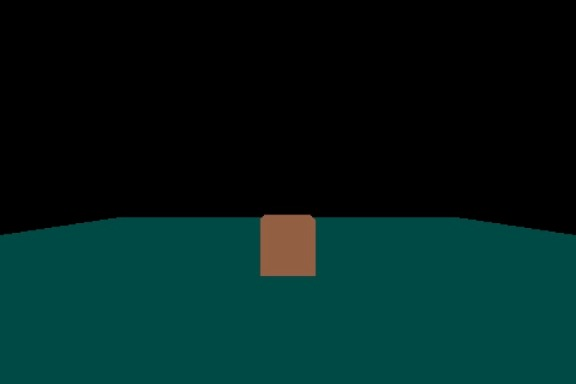

Try adding `cube.rotation.y += 0.01;` to the game loop (render function), it should animate the cube.

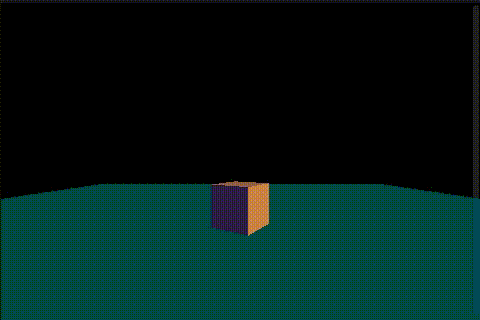

## Player input

A point and click game is what we are intending to create, so we need a way of getting the coordinates of the cursor on the plane. The way we will do this is by using raycasters.

---

***Raycasting?***

*Raycasting is a technique of firing a “ray” in a particular direction and retrieving information about the object it intersects with. Raycasting was invented by John Carmack for the game Wolfenstein 3D in 1992.*

---

```
 projector   THREEProjector

documentonclickfunctionevent
   direction_vector   THREEVector3 
     eventclientX  windowinnerWidth     
        eventclientY  windowinnerHeight     
     
  

  projectorunprojectVector direction_vector camera 

   raycaster   THREERaycaster 
    cameraposition 
    direction_vector cameraposition normalize
  

   intersects  raycasterintersectObjectplane 

   intersectslength   
     intersection  intersectspoint

    cubepositionx  intersectionx
    cubepositionz  intersectionz
```

This moves the cube to where the player clicks, using the camera’s position and the mouse position to determine the position and direction of the raycaster.

It first creates a new Three.js projector object and with this 2D to 3D translation methods are accessible. This is done before the click event as it only needs to be created once.

It then attaches a click event to the document, receiving the event object so the mouse position is accessible and with this data we can create a directional vector that correlates to the mouse position, with x and y ranging between -1 and 1 depending on mouse position.

*e.g. Top left = (-1,-1), bottom right will be (1,1) and the centre will be (0,0)*

This will be used to determine the direction in which to fire the raycaster.

Then, using the camera projection matrix that the scene is currently being viewed through, it unprojects the 2D `directional_vector` into a 3D vector; the `unprojectVector` method translates the vector’s 2D points into the 3D world, returning the result.

With the newly translated 3D directional vector and the camera’s position, it then creates a `THREE.Raycaster`.

It then calls the new raycaster’s `intersectObject` method and stores its result. This method returns an array of all the intersections that occur with the plane. Each intersection is a vector containing x, y and z properties.

If there is an intersection in the array, it then repositions the cube to where the collision occurred.

Refresh that and you should see the cube instantly moving to where you click.

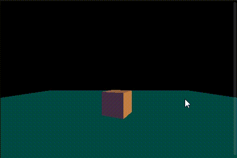

## Multiplayer with Pusher

Now that we have a very simple 3D game in place, it’s time for the multiplayer aspect, i.e. getting another browser tab to act as an additional player.

Before, we were using a public channel type, but for this we will be using a presence channel. [See Pusher’s page on different channel types](https://pusher.com/docs/client_api_guide/client_channels) for more info on the different channel types.

*[Presence channels](https://pusher.com/docs/client_api_guide/client_presence_channels) should have a “presence-” prefix. They let you register user information on subscription, and let other members of the channel know who’s online.*

This is what we need! So, with these types of channels, there is a level of authentication needed; I will be using PHP to perform this. By default, Pusher looks in the `/pusher/auth` directory but I am going to set it to the same directory. Put this line at the top under the Pusher debug:

```
Pusherchannel_auth_endpoint  "pusher_auth.php"
```

Now go create that file in the same directory as your html file and use this code, replacing the app key, secret and ID with yours.

```
include_once 'Pusher.php'

$pusher   Pusher
  'xxxxxxxxxxxxxx' // APP KEY
  'yyyyyyyyyyyyyy' // APP SECRET
  'zzzzzzzzzzzzzz' // APP ID

  

$presence_data  array
    

 $pusherpresence_auth
  $_POST'channel_name' 
  $_POST'socket_id'
  
  $presence_data
```

You will also need to download the `Pusher.php` from [this PHP library](https://github.com/pusher/pusher-php-server).

In a real life situation, instead of having the ID as a timestamp (which would cause conflict when the game gets more traffic), you would do a database lookup to verify that the user has access etc.

Now the final thing to do is to actually turn your Pusher channel into a presence channel, to do this, you must subscribe to a channel with a name prefixed with `presence-`:

```
 channel  pushersubscribe'presence-my_game_channel'
```

You should now be seeing a successful connection in the console. To verify this, go add an event listener which will log the members in the channel when the pusher subscription is successful, after all, this is what presence channels allow you to have access to.

```
channel'pusher:subscription_succeeded' functionmembers 
  consolemembers
```

Now refresh and look in the console, you should now have access to a member count and an ID for each. Open another tab, and then read the console of that tab; it should have a member count of 2. If this is not working and you are seeing a 404 error, make sure the `pusher_auth.php` is accessible and the directory reference is assigned to `Pusher.channel_auth_endpoint` is valid.

## Seeing player two

So, with presence channels we have access to the extra events `pusher:member_added` and `pusher:member_removed`. With these events we can add and remove players accordingly. In order to access all of the players’ associated 3D objects, we need to be able to use what these Pusher events provide us with; which is their ID.

Associative Arrays would be the best option for this.

These are the 4 things we need to do:

1. When a member subscribes to the channel, create a cube for everyone who is already in the channel
2. When a member is added, create a cube for that new member of the channel
3. When a member is removed, remove their specific cube
4. Sync the player positions
   - When a member is added, notify the new member of the me position
   - When a member moves, tell everyone in the channel that this has happened and update the game accordingly

### When a member subscribes to the channel, create a cube for everyone who is already in the channel

```
 players  

channel'pusher:subscription_succeeded' functionmembers 
  membersfunctionmember
    playersmemberid   THREEMesh        
       THREEBoxGeometry 
       THREEMeshLambertMaterialcolor 'orange'
    

    playersmemberidpositiony  

    sceneplayersmemberid
```

Now it will create a new cube for each member including `me`. You can see this by opening up only one tab and moving your cube; there should still be one at the starting position.

This can now be deleted, it is not needed anymore:

```
 cube   THREEMesh 
   THREEBoxGeometry  
   THREEMeshLambertMaterialcolor 'orange' 
 

cubepositiony   

scenecube
```

However, now we need to change every reference of cube to the player in the players array which is `me`. Put this line just under where you declare the empty player array:

```
 me
```

And assign `members.me` to it in `pusher:subscription_succeeded`:

```
me  membersme
```

Now that we can access the me.id outside of the `pusher:subscription_succeeded` event listener, we can change every reference of cube to `players[me.id]`, if you haven’t already, delete this line:

```
cuberotationy
```

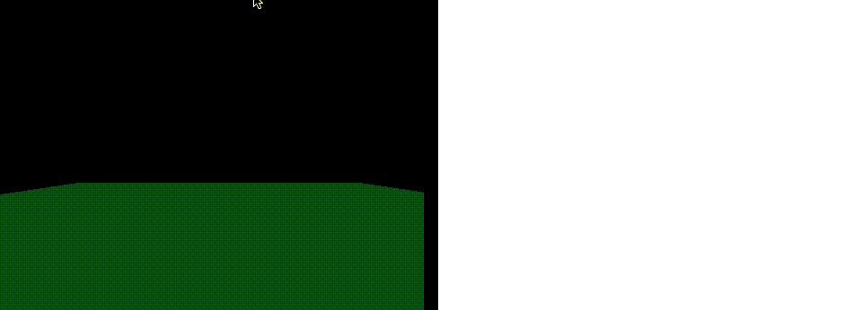

### When a member is added, create a cube for that new member of the channel

```
channel'pusher:member_added' functionmember 
  playersmemberid   THREEMesh
     THREEBoxGeometry 
     THREEMeshLambertMaterialcolor 'orange'
  

  playersmemberidpositiony  

  sceneplayersmemberid
```

This creates an array item using the member ID as the associative name, assigning a new Three.js cube mesh (same as the cube we created earlier on) when a new member is added.

Refresh that, you will now have a cube appear in the middle, you may want to move your player to see the new player entering.

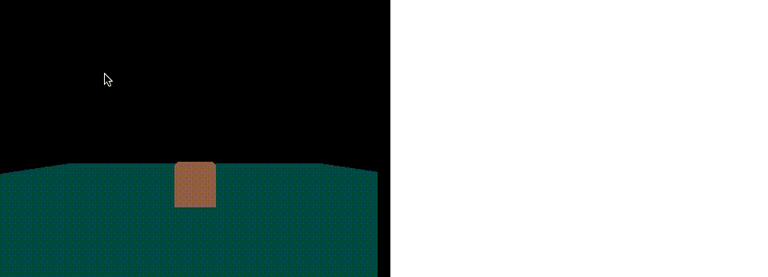

### When a member is removed, remove their specific cube

```
channel'pusher:member_removed' functionmember 
  sceneremoveplayersmemberid
  delete playersmemberid
```

This removes the player’s cube mesh from the scene and then deletes the correlating array item in players. Now you will see that the player is now removed when a tab is closed.

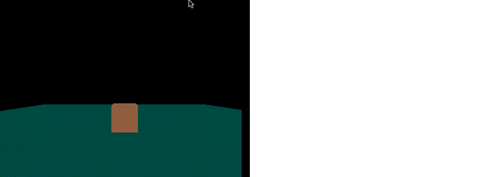

### Sync the player positions

There are two parts to this step, you will see why.

**a) When a member is added, notify the new member of the me position**

When the player joins the already populated channel, each member already in the channel then sends their position specifically to the new player and there are many ways we could do this, for example:

1. Using private channels per members
2. Telling everyone in the channel where you are
3. Giving each member their own event, using each member ID to make the event name unique

I choose 3! In the `pusher:subscription_succeeded` event binding add this:

```
channel'client-'  membersmeid  '_update_player' functionplayer   
  playersplayeridposition
    playerpositionx
    playerpositiony
    playerpositionz
```

This adds an event listener, which is named something like `client-123456789_update_player`, this expects an object which contains the player’s ID and the player’s position. Using this, it then targets the relative player mesh in the players array and sets its position to the new position. Each member now has their own specific event binding.

Add this in the `pusher:member_added` function:

```
channeltrigger'client-'  memberid  '_update_player'  id  meid position  playersmeidposition
```

This then, using the new member’s id, triggers their specific event and sends, using the me object, the existing player’s id and position.

Now open up a new set of tabs, moving the first tab’s cube somewhere else before opening up tab 2. Tab 2 should now know where tab 1 is.


**b) When a member moves, tell everyone in the channel that this has happened and update the game accordingly**

Now we need to tell everyone in the room when me changes position. We can use something very similar. Add this under the `pusher:member_removed` event binding:

```
channel'client-update_player' functionplayer
  playersplayeridposition
    playerpositionx
    playerpositiony
    playerpositionz
```

This creates an event binding that is not specific to this player so that when this event is triggered, all members will listen for it, it does the same thing as the specific event listener. Feel free to tidy this up by putting the duplicate code into a function.

Now we want to trigger this event when the player moves. Add this after the section where we set the new position for the me player:

```
channeltrigger'client-update_player'  id  meid position  playersmeidposition
```

Open up a new set of tabs; all player positions should now be synced up.

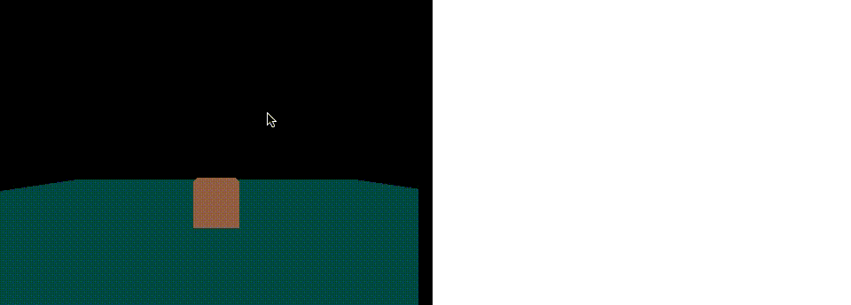

## Smooth movement

Before we start, we need to allow for other properties to be passed around in the player object with the cube mesh being a property on its own, this will not take long. Replace:

```
playersmemberid   THREEMesh        
   THREEBoxGeometry 
   THREEMeshLambertMaterialcolor 'orange'
```

With:

```
playersmemberid  
  mesh   THREEMesh
     THREEBoxGeometry 
     THREEMeshLambertMaterialcolor 'orange'
```

Bear in mind, it is inside both `pusher:subscription_succeeded` and `pusher:member_added`, feel free to clean is up by moving the duplicate code into a function that returns the new THREE mesh.

Now, go and amend all references to players array items to be referencing its mesh property, except for the code we’ve just added.

- `players[player.id]` to `players[me.id].mesh`
- `players[member.id]` to `players[player.id].mesh`
- `players[me.id]` to `players[member.id].mesh`

---

***Why?***

*The reason we need to do this is because we are going to have to store variables about the player’s movement, such as direction and distance. If we were to turn this into a larger game, the player object could also contain other public player information, like the player’s health, level or currently equipped items.*

---

Go and test that the game is still working as before.

### Rotating the cube

When the player clicks, calculate using trigonometry, the angle difference to be applied to the cube’s mesh in order for it to be facing the destination. Then, using this angle, gradually rotate it until it has applied the amount of rotation needed. If the calculated angle is more than 180 degrees or less than -180 degrees, rotate in the opposite direction instead. The direction of the rotation is then stored.

We then need to have a variable to log whether the cube is facing the destination, this will be used to detect when the cube is ready to move forward to the destination.

Remove the position setting:

```
playersmeidpositionx  intersectionx
playersmeidpositionz  intersectionz
```

Replace with:

```
 opp  playersmeidmeshpositionz  intersectionz 
  adj  intersectionx  playersmeidmeshpositionx 
  hyp  Mathoppopp  adjadj

playersmeidangle_diff    Mathopphyp  1.57079633    adj <=        playersmeidmeshrotationy

 Mathplayersmeidangle_diff  6.28318531      
  playersmeidangle_diff  Mathfloorplayersmeidangle_diff  6.28318531  6.28318531

 Mathplayersmeidangle_diff  3.14159265              
  playersmeidangle_diff  6.28318531  playersmeidangle_diff       
          

playersmeiddirection  playersmeidangle_diff      

playersmeidfacing_destination  false
```

This uses the intersection position and the player’s cube mesh position to calculate the opposite, adjacent and hypotenuse. Using these, it then calculates the angle in radians and then subtracts the current mesh rotation value from it, this is to calculate the angle difference.

Three.js allows you to apply angles that are over 360 degrees and due to us rotating the mesh depending on difference, it is possible that the cube’s rotation value could be greater than 360, this would affect our calculated angle difference resulting in the cube rotating multiple times until it stops. We can fix this by checking if the value (disregarding whether it’s negative) is greater than 360, then seeing how many whole divisions of 360 there are in it and subtracting the sum of them, resulting in a sensible value smaller than 360.

It then checks whether the value (disregarding whether it’s negative) is greater than 180 degrees (3.14159265 in radians). It then adds or subtracts 360 degrees (6.28318531 radians) depending on whether the angle is positive or negative, the result of this (disregarding whether it’s negative) will be smaller than the original value and will also be the opposite (in terms of negative and positive) to its original value, making the player rotate the shorter way round.

The direction of the turn is then stored as 1 or -1 and this depends on the angle difference being positive or negative.

Now put this in the game loop render function:

```
 player_id  players
  playersplayer_idangle_diff
    playersplayer_idmeshrotationy  playersplayer_iddirection  

    playersplayer_idangle_diff  playersplayer_iddirection  

     playersplayer_iddirection    playersplayer_idangle_diff    playersplayer_iddirection    playersplayer_idangle_diff   
      playersplayer_idfacing_destination  
      playersplayer_idmeshrotationy  playersplayer_idangle_diff
      playersplayer_idangle_diff  undefined
```

This goes through each player in the players collection. If the player’s `.angle_diff` is set, it applies 0.05 or -0.05 to the player’s mesh rotation. This is then deducted from the `.angle_diff`. It then checks whether the `.angle_diff` has fallen below 0 (if the direction of the turn is positive) or gone above 0 (if the direction of the turn is negative). If so, make the `.facing_destination` true, rotate the mesh in the opposite direction to the amount it has gone over by, as the cube would have turned too much. Then make the `.angle_diff` undefined to stop it from going back into this logic on the next game loop.

Go refresh that!

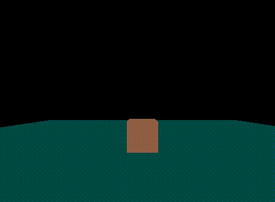

Now when you click, you should be seeing the cube rotating to face the point where you’ve clicked, but it doesn’t move just yet. Let’s fix that by adding this in the click event:

```
playersmeiddistance  hyp
```

Then add this inside the player for loop which is in the game loop render function:

```
playersplayer_idfacing_destination  playersplayer_iddistance             
  playersplayer_idmeshtranslateZ
  playersplayer_iddistance
```

This makes the player move once facing its destination, translating the player cube by -0.1 and deducting this from the player’s .distance.

Go refresh! See what it does.

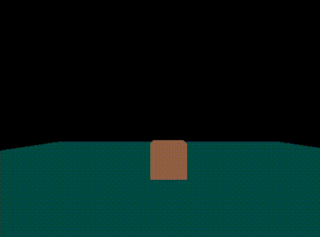

Now, all we need to do to make this work with other players, is send around the new movement variables. Replace the object we send in the **two** trigger calls, `client-update_player` and `client-xxxxxx_update_player`, with this:

```
  id  meid  
  position  playersmeidmeshposition 
  rotation  playersmeidmeshrotationy 
  angle_diff  playersmeidangle_diff 
  direction  playersmeiddirection 
  distance  playersmeiddistance 
  facing_destination  playersmeidfacing_destination
```

In the two event bindings, `client-update_player` and `client-xxxxxx_update_player`, add this:

```
playersplayeridmeshposition 
  playerpositionx 
  playerpositiony 
  playerpositionz 

playersplayeridmeshrotationy  playerrotation

playersplayeridangle_diff  playerangle_diff
playersplayeriddirection  playerdirection 
playersplayeriddistance  playerdistance 

playersplayeridfacing_destination  playerfacing_destination
```

Go open two tabs next to each other and they should be doing the same thing.

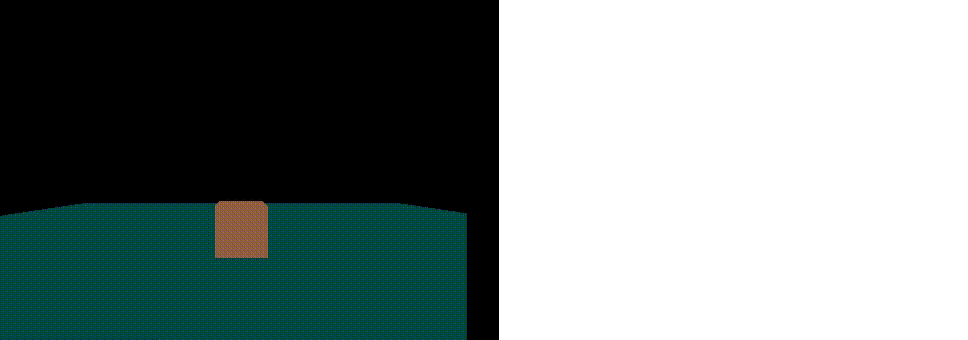

## Summary

In this tutorial, we covered how to build a simple 3D multiplayer game, using Three.js to create and display the 3D graphics and Pusher to create the multiplayer aspect.

[I’d love to hear](http://twitter.com/cjonasw) about what you have created out of it.
