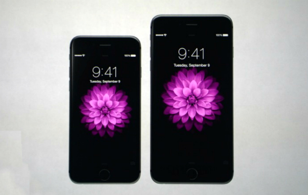

[Apple](http://blogs.estadao.com.br/link/category/apple/ "Ver todos os posts em Apple")

04 de novembro de 2014 17h58

# Apple pode fazer recall do iPhone 6 Plus, diz jornal

*Publicação diz que modelos de 128GB estariam apresentando um defeito incorrigivel; site nega problema em larga escala*

Por Ligia Aguilhar

Problema aconteceria apenas nos modelos 6 Plus com 128 GB. FOTO: Divulgação

SÃO PAULO – A Apple estaria prestes a fazer um recall do novo iPhone 6 Plus, segundo a Business Korea, [uma publicação tradicional da Coreia do Sul](http://www.businesskorea.co.kr/article/7084/huge-potential-recall-technical-defects-iphone-6-raise-questions-about-controller-ic). Segundo a publicação, muitos consumidores ao redor do mundo afirmam que o modelo de 128 GB, especificamente, está travando e reiniciando constantemente sem motivo aparente, especialmente quando o usuário tem uma grande quantidade de aplicativos e dados armazenados no telefone.

A Apple teria tentado ao máximo minimizar o problema, mas não teria sido capaz de corrigi-lo remotamente, o que forçaria a convocação de um recall do smartphone.

O jornal diz ainda que especialistas apontam que a falha poderia ser causada por um defeito na memória do aparelho. O iPhone 6 utilizaria um módulo de memória NAND do tipo TLC (triple-level cell). Embora seja capaz de guardar um número superior de informações, esse tipo de memória seria mais instáveis e suscetível a erros. A Apple teria adotado esse tipo de memória por ser mais barata.

Procurada, a Apple não se manifestou sobre o assunto. O site [9to5Mac](http://9to5mac.com/2014/11/04/debunk-128gb-iphone-6-plus-recall-false-crashing-bug-rare/) foi apurar o assunto e ouviu de fontes próximas à empresa que o problema não é tão grave assim. As fontes dizem que um número pequeno de consumidores foi afetado pelo erro até agora (cerca de 159 usuários) e que todos teriam em comum o fato de ter muitos aplicativos instalados.Segundo o 9to5Mac, a Apple deve se pronunciar em breve sobre o assunto.

[inCompartilhar.](#)3

[A +](http://blogs.estadao.com.br/link/apple-pode-fazer-recall-do-iphone-6-diz-jornal/# "Aumentar fonte")
[A -](http://blogs.estadao.com.br/link/apple-pode-fazer-recall-do-iphone-6-diz-jornal/# "Diminuir fonte")
