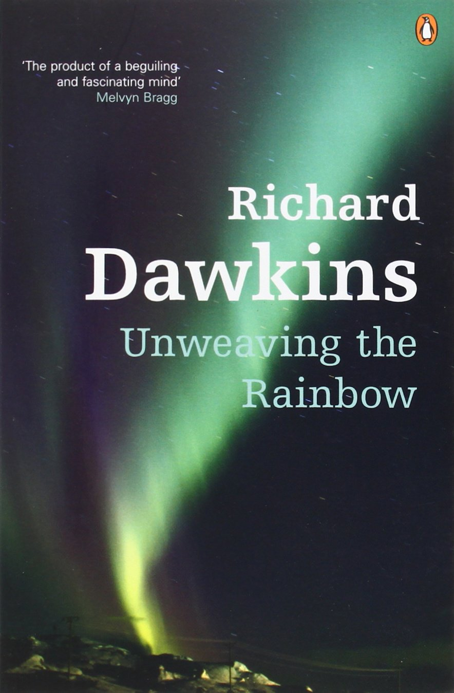
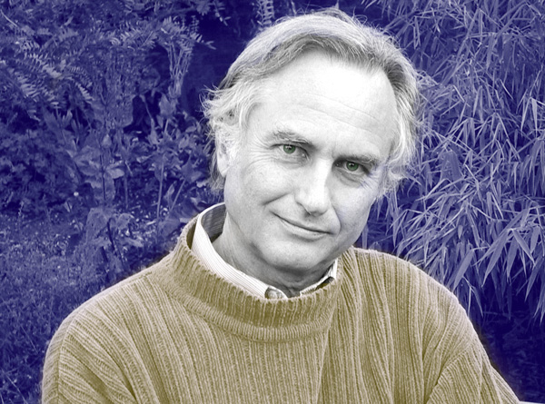
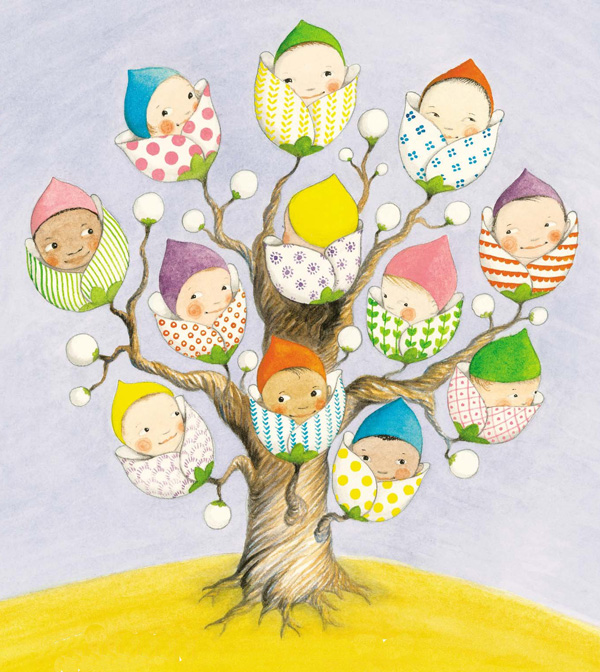
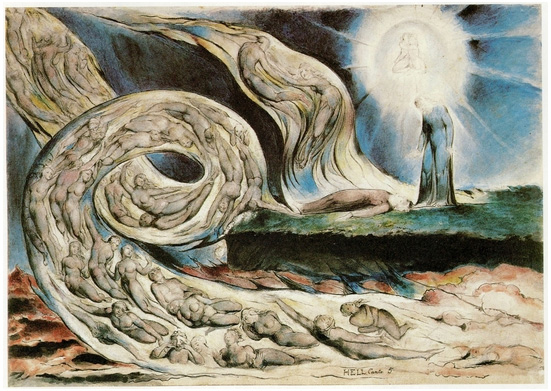

*What Yeats’s epitaph has to do with the infinitesimal odds of winning the DNA lottery.*

*“To lament that we shall not be alive a hundred years hence,”* Montaigne wrote in his fantastic 16th-century meditation on [death and the art of living](http://www.brainpickings.org/2012/12/12/montaigne-on-death-and-the-art-of-living/), *“is the same folly as to be sorry we were not alive a hundred years ago.”* Half a millennium later, **Richard Dawkins** — who [coined the term “meme”](http://www.brainpickings.org/2013/10/02/richard-dawkins-meme-appetite-for-wonder/) — enlists evolutionary biology in substantiating that strangely assuring philosophical idea. In the altogether fantastic [***Unweaving the Rainbow: Science, Delusion and the Appetite for Wonder***](http://www.amazon.com/Unweaving-Rainbow-Science-Delusion-Appetite/dp/0618056734/?tag=braipick-20) ([*public library*](http://www.worldcat.org/title/unweaving-the-rainbow-science-delusion-and-the-appetite-for-wonder/oclc/39922946&referer=brief_results)), Dawkins writes:

> We are going to die, and that makes us the lucky ones. Most people are never going to die because they are never going to be born. The potential people who could have been here in my place but who will in fact never see the light of day outnumber the sand grains of Arabia. Certainly those unborn ghosts include greater poets than Keats, scientists greater than Newton. We know this because the set of possible people allowed by our DNA so massively exceeds the set of actual people. In the teeth of these stupefying odds it is you and I, in our ordinariness, that are here.

Right around the time that DNA was being discovered, the wise Alan Watts intuited the same idea in his [spectacular meditation on the ego and the universe](http://www.brainpickings.org/2014/01/27/alan-watts-taboo/), where he wrote: *“Without birth and death, and without the perpetual transmutation of all the forms of life, the world would be static, rhythm-less, undancing, mummified.”* But, biologically speaking, the existential roulette that landed on you out of the infinite not-you alternatives is set into motion well before your actual birth. Dawkins writes:

> The instant at which a particular spermatozoon penetrated a particular egg was, in your private hindsight, a moment of dizzying singularity. It was then that the odds against your becoming a person dropped from astronomical to single figures.
>
> The lottery starts before we are conceived. Your parents had to meet, and the conception of each was as improbable as your own. And so on back, through your four grandparents and eight great grandparents, back to where it doesn’t bear thinking about.

*Illustration from 'The Baby Tree' by Sophie Blackall. Click image for more.*

In fact, that lottery extends beyond your lineage and stretches back in time into the origin of the universe itself:

> This is another respect in which we are lucky. The universe is older than a hundred million centuries. Within a comparable time the sun will swell to a red giant and engulf the earth. Every century of hundreds of millions has been in its time, or will be when its time comes, ‘the present century’. Interestingly, some physicists don’t like the idea of a ‘moving present’, regarding it as a subjective phenomenon for which they find no house room in their equations. But it is a subjective argument I am making. How it feels to me, and I guess to you as well, is that the present moves from the past to the future, like a tiny spotlight, inching its way along a gigantic ruler of time. Everything behind the spotlight is in darkness, the darkness of the dead past. Everything ahead of the spotlight is in the darkness of the unknown future. The odds of your century being the one in the spotlight are the same as the odds that a penny, tossed down at random, will land on a particular ant crawling somewhere along the road from New York to San Francisco. In other words, it is overwhelmingly probable that you are dead.
>
> In spite of these odds, you will notice that you are, as a matter of fact, alive. People whom the spotlight has already passed over, and people whom the spotlight has not reached, are in no position to read a book… What I see as I write is that I am lucky to be alive and so are you.

*Painting by William Blake for Dante's 'Divine Comedy.' Click image for more.*

Dawkins later explores this interplay of life and death from another angle as he turns to his favorite poet, Yeats. (The irony of the choice, given Yeats’s dismissal of science as “the opium of the suburbs” — a play on Marx’s dismissal of religion as [“the opium of the masses”](http://www.brainpickings.org/2014/10/06/marx-nobrow-maier-simon/) — doesn’t evade Dawkins as he writes: *“I am almost reluctant to admit that my favorite of all poets is that confused Irish mystic William Butler Yeats.”*) Yeats’s epitaph, Dawkins points out, “would make fine last words for a scientist”:

> Cast a cold eye  
>  On life, on death.  
>  Horsemen, pass by!

Extracting from those seemingly morbid notions a wonderfully vitalizing perspective, Dawkins echoes Alexander Flexner’s 1939 masterpiece on [the usefulness of useless knowledge](http://www.brainpickings.org/2012/07/27/the-usefulness-of-useless-knowledge/) and offers “the best answer to those petty-minded scrooges who are always asking what is the use of science”:

> In one of those mythic remarks of uncertain authorship, Michael Faraday is alleged to have been asked what was the use of science. ‘Sir,’ Faraday replied. ‘Of what use is a new-born child?’ The obvious thing for Faraday (or Benjamin Franklin, or whoever it was) to have meant was that a baby might be no use for anything at present, but it has great potential for the future. I now like to think that he meant something else, too: What is the use of bringing a baby into the world if the only thing it does with its life is just work to go on living? If everything is judged by how ‘useful’ it is — useful for staying alive, that is — we are left facing a futile circularity. There must be some added value. At least a part of life should be devoted to *living* that life, not just working to stop it ending. This is how we rightly justify spending taxpayers’ money on the arts. It is one of the justifications properly offered for conserving rare species and beautiful buildings. It is how we answer those barbarians who think that wild elephants and historic houses should be preserved only if they ‘pay their way.’ And science is the same. Of course science pays its way; of course it is useful. But that is not *all* it is.

Complement [***Unweaving the Rainbow***](http://www.amazon.com/Unweaving-Rainbow-Science-Delusion-Appetite/dp/0618056734/?tag=braipick-20), which is magnificent in its entirety, with Alan Lightman on why [the fact that we are a cosmic accident is cause for celebration](http://www.brainpickings.org/index.php/2014/05/22/alan-lightman-accidental-universe-impermanence/), then revisit Dawkins’s [children’s book about the wonders of science](http://www.brainpickings.org/index.php/2011/10/06/the-magic-of-reality-richard-dawkins/) and his letter to his own young daughter about [the importance of evidence in science, love, and life](http://www.brainpickings.org/index.php/2012/12/28/richard-dawkins-letter-to-daughter/).

**Donating = Loving**

Bringing you (ad-free) Brain Pickings takes hundreds of hours each month. If you find any joy and stimulation here, please consider becoming a Supporting Member with a recurring monthly [donation](http://www.brainpickings.org/index.php/donate/) of your choosing, between a cup of tea and a good dinner.

You can also become a one-time patron with a single donation in any amount.

[[anexo ausente]](http://www.brainpickings.org/index.php/newsletter/)Brain Pickings has a free weekly newsletter. It comes out on Sundays and offers the week’s best articles. Here’s [what to expect](http://us2.campaign-archive1.com/?u=13eb080d8a315477042e0d5b1&id=d580cfe501). Like? [Sign up.](http://www.brainpickings.org/index.php/newsletter/)

***Brain Pickings takes 450+ hours a month to curate and edit across the different platforms, and remains banner-free. If it brings you any joy and inspiration, please consider a modest [donation](http://www.brainpickings.org/index.php/donate/) – it lets me know I'm doing something right.**    [anexo ausente]*
